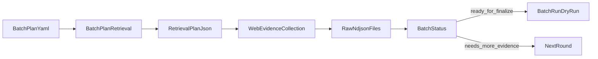

## 目标

`/crawl-topic` 负责处理单个 `batch_plan` 的一轮或多轮循环。它的输入是：

- `quwoquan_data/batch_plans/{batch_id}.yaml`
- `raw/{batch_id}/retrieval_plan.json`
- `raw/{batch_id}/loop_state.json`

输出是：

- 更新后的 `raw/{batch_id}` 证据文件
- 更新后的 `loop_state.json`
- 如已满足条件，则生成 `publish/{batch_id}` 与 `out/{batch_id}`

## 输入

```text
/crawl-topic --plan=quwoquan_data/batch_plans/west_lake_loop_001.yaml --round=2
```

## 单轮循环



## 本轮必做步骤

1. 执行：

```bash
python3 quwoquan_data/tools/cli.py batch plan-retrieval --plan <plan>
```

2. 读取 `raw/{batch_id}/retrieval_plan.json`
3. 按 `query` 与 `search_queries` 使用 Cursor 的 WebSearch / WebFetch / 浏览器能力采集公开证据
4. 把结果显式写回：
   - `search_results.ndjson`
   - `pages.ndjson`
   - `assets.ndjson`
   - `facts.ndjson`
5. 执行：

```bash
python3 quwoquan_data/tools/cli.py batch status --plan <plan>
```

6. 若状态为 `ready_for_finalize`，执行：

```bash
python3 quwoquan_data/tools/cli.py batch run --plan <plan> --targets alpha,gamma --dry-run
```

## 每轮产物

每轮至少要有这些文件处于可追溯状态：

- `raw/{batch_id}/retrieval_plan.json`
- `raw/{batch_id}/loop_state.json`
- `raw/{batch_id}/search_results.ndjson`
- `raw/{batch_id}/pages.ndjson`
- `raw/{batch_id}/facts.ndjson`

若本轮使用了图片证据，还要补：

- `raw/{batch_id}/assets.ndjson`

## 停止条件

满足任一条件即可停止：

1. `batch status` 为 `completed`
2. `batch status` 为 `ready_for_finalize`，且本轮已完成 `batch run --dry-run`
3. `batch status` 为 `exhausted`

## 输出口径

worker 摘要必须包含：

- 当前批次
- 当前轮次
- 本轮执行的 `search_queries`
- 新增证据条数
- `missing_entity_refs / missing_tag_refs`
- `next_queries_count`
- 是否已 `ready_for_finalize`

## 边界

- 不能恢复旧的 `topics/runs/bundles` 写法
- 不能在未落 `raw/` 证据前直接生成 `facts`
- 不能把外部网页内容直接复制成最终发布正文
- 不能绕过公开网页访问边界
