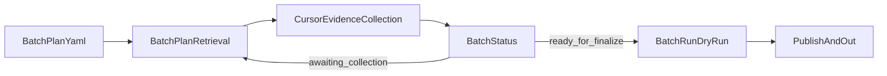

## 目标

`/crawl` 是 `quwoquan_data` 的总控命令，负责围绕 **当前真实数据模型** 执行一批或多批命令式证据采集。

它不直接实现搜索引擎 provider，也不恢复旧的 `topics/runs/bundles` 流程。当前唯一真相源是：

- `quwoquan_data/batch_plans/{batch_id}.yaml`
- `quwoquan_data/raw/{batch_id}/`
- `quwoquan_data/publish/{batch_id}/`
- `quwoquan_data/out/{batch_id}/`

## 总控主线



## 输入

```text
/crawl auto --plans=west_lake_loop_001,west_lake_article_001
```

- `plans`：`quwoquan_data/batch_plans/{batch_id}.yaml` 的批次 ID 列表

## 模式

### auto

职责：

1. 对每个批次执行 `batch plan-retrieval`
2. 读取 `raw/{batch_id}/retrieval_plan.json`
3. 按计划使用 Cursor 的 WebSearch / WebFetch / 浏览器能力采集公开证据
4. 把证据显式写回 `raw/{batch_id}/search_results.ndjson`、`pages.ndjson`、`assets.ndjson`、`facts.ndjson`
5. 执行 `batch status`
6. 若状态是 `ready_for_finalize`，执行 `batch run --dry-run`
7. 若状态仍是 `awaiting_collection` 或 `needs_more_evidence`，继续下一轮，直到：
   - `completed`
   - `ready_for_finalize`
   - `exhausted`

### manual

职责：

1. 为每个批次输出一个 worker 启动块
2. 用户在多个 chat/tab 手工粘贴执行
3. 总控负责汇总这些批次是否已 `completed / ready_for_finalize / exhausted`

建议输出块：

```text
/crawl-topic --plan=quwoquan_data/batch_plans/west_lake_loop_001.yaml --round=2
```

### status

职责：

读取每个批次的：

- `raw/{batch_id}/loop_state.json`
- `raw/{batch_id}/retrieval_plan.json`
- `quwoquan_data/tools/cli.py batch status` 输出

至少汇总：

- 当前轮次
- 当前状态
- 证据条数
- 缺失实体数
- 缺失标签数
- 下一轮 query 数
- 是否可 finalize

## 输出纪律

总控摘要必须包含：

- 当前批次
- 当前轮次
- `search_result_count / page_count / asset_count / fact_count`
- `missing_entity_refs / missing_tag_refs`
- `next_queries_count`
- `ready_for_finalize / completed / exhausted`

## 边界

- 不能引用旧的 `trees/topics/`、`runs/`、`bundles/` 目录
- 不能在命令里假设 Python CLI 会直接访问公网
- 不能绕过登录、验证码、反爬或访问控制
- 外部证据必须先落到 `raw/{batch_id}`，再允许进入 `batch run`
