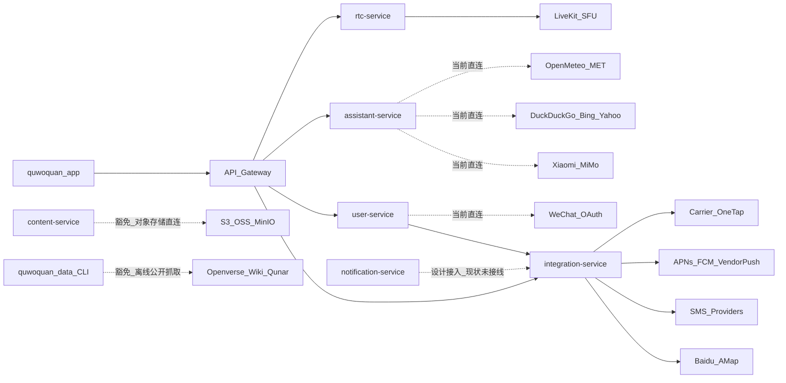

# 外部服务依赖规格与登记表

## 1. 文档目的

本文档用于统一登记 `quwoquan_app`、`quwoquan_service`、`quwoquan_data`、`quwoquan_ops` 对外部服务的依赖，明确：

- 哪些依赖属于必须经 `integration-service` 统一出口的业务 SaaS 能力。
- 哪些依赖属于当前仍然由领域服务直连、需要迁移或显式豁免的现状。
- 哪些依赖属于自托管基础设施、离线公开数据源或客户端平台能力，不适用统一出口，但仍必须登记。

本文档与 `docs/external_service_registry.yaml` 配套：

- `docs/external_service_dependency_registry.md`：人类可读的规格、现状、合规矩阵与整改路线。
- `docs/external_service_registry.yaml`：机读登记表，作为条目级真相源。

特性树归属：

- L1：`runtime`
- L2：`runtime-external-integration`

## 2. 判定口径

### 2.1 计入范围

以下对象一律计入登记表：

1. 端侧、服务侧、数据侧、运维侧会主动发起网络请求的第三方 SaaS、公开 API、公开网页抓取源、云厂商托管 API。
2. 会影响生产行为的自托管基础设施或平台控制面，例如 `LiveKit`、`coturn`、`Elasticsearch`、对象存储、数据库与缓存集群。
3. 客户端通过原生 SDK、原生插件或系统能力接入，但会影响登录、定位、通话、推送等真实业务能力的依赖。

### 2.2 不计入“外部服务依赖”的误报项

以下对象不作为外部服务集成登记，但会在本文档中显式说明，避免误判：

1. 纯测试 URL、示例 URL、fixture URL。
2. 仅出现在 taxonomy、`examplePlatforms`、文档示例中的平台名，但没有实际运行时调用。
3. 仓库内部服务之间的 HTTP / WebSocket 调用，例如 `user-service -> integration-service`、`assistant-service -> content-service`。

例如 `entity-service` 中的若干 `Unsplash` 封面 URL 只是 seeded homepage 示例数据，不代表代码在运行时调用 `Unsplash API`。

## 3. 访问路径规格

### 3.1 强制规则

1. 所有跨业务复用、与厂商 API 或 SaaS 强绑定的能力，必须先登记到 `docs/external_service_registry.yaml`，再通过 `integration-service` 对外访问。
2. 业务服务和 App 不得直接硬编码厂商 endpoint；必须调用网关、内部服务契约 API，或已批准的豁免路径。
3. 新增外部依赖时，至少要同时补齐以下信息：
   - `service_id`
   - `category`
   - `access_layer`
   - `consumers`
   - `metadata_ref`
   - `impl_status`
   - `env_matrix`
   - `secrets`
   - `compliance`
   - `gap`
4. 若暂时无法走 `integration-service`，必须在登记表中标记 `compliance: violation` 或 `compliance: waived`，并说明原因。

### 3.2 合法豁免范围

以下依赖允许不经 `integration-service`，但必须登记并给出豁免理由：

- 对象存储 presign / S3-compatible 上传与元数据查询。
- 自托管实时媒体面，例如 `LiveKit SFU`、`coturn`。
- 数据工程离线公开源抓取，例如 `Openverse`、`Wikipedia`、`去哪儿`。
- 客户端平台能力，例如 `geolocator`、`flutter_callkit_incoming`、原生 `MethodChannel` 占位。

### 3.3 当前总体结论

- 已经基本满足统一出口思路的能力只有地图 POI：App 通过网关访问 `integration-service`，服务端统一调 `Baidu` / `AMap`。
- `SMS OTP`、`push delivery`、`carrier one-tap` 已经在 metadata 和 `integration-service` 路由层面预留，但生产能力仍停留在 `mock`、`planned` 或未接线状态。
- `user-service` 的社交登录和 `assistant-service` 的 LLM / 搜索 / 天气 / 金融查询仍存在领域直连外部厂商的现状，按本规格应视为待迁移或待豁免项。
- `quwoquan_data` 与 `quwoquan_ops` 存在明确的离线公开源、开发工具与发布链路外部依赖，不适用统一网关，但必须登记。

## 4. 当前架构图

## 5. 状态与合规枚举

### 5.1 `impl_status`

| 值 | 含义 |
|---|---|
| `production` | 生产路径已接通，存在真实实现 |
| `mock` | 仅 mock provider 或 mock SDK |
| `sandbox` | 仅沙箱 / allowlist / 半真实路径 |
| `planned` | metadata 或接口存在，但真实实现未落地 |
| `registered_only` | 只在注册表或目录中声明，未发现运行时调用 |
| `none` | 代码中未发现真实接入实现 |

### 5.2 `compliance`

| 值 | 含义 |
|---|---|
| `compliant` | 已登记，且访问路径符合本规格 |
| `violation` | 已发现绕过统一出口或关键校验缺失 |
| `waived` | 不适用统一出口，但已显式登记并说明理由 |

## 6. 登记表字段

完整字段定义以 `docs/external_service_registry.yaml` 为准，本文使用同一组字段：

| 字段 | 含义 |
|---|---|
| `service_id` | 稳定 ID，例如 `ext.map.baidu` |
| `display_name` | 服务显示名 |
| `category` | 能力分类 |
| `vendor` | 厂商或协议名 |
| `endpoint` | 厂商 endpoint、站点域名或 SDK / 通道名 |
| `access_layer` | `integration-service` / `domain-direct` / `data-pipeline` / `self-hosted` / `client-os` / `dev-tool` |
| `consumers` | 直接使用方 |
| `metadata_ref` | metadata 真相源路径；没有则填 `无` |
| `impl_status` | 当前实现状态 |
| `env_matrix` | alpha / beta / gamma / prod 行为 |
| `secrets` | 关键环境变量或 Secret 来源 |
| `compliance` | 合规状态 |
| `gap` | 当前主要缺口 |

## 7. 外部服务注册登记表

### 7.1 统一经 `integration-service` 的业务外部能力

| service_id | display_name | category | endpoint | access_layer | consumers | metadata_ref | impl_status | env_matrix | secrets | compliance | gap |
|---|---|---|---|---|---|---|---|---|---|---|---|
| `ext.map.baidu` | 百度地图 Web API | `map` | `https://api.map.baidu.com` | `integration-service` | `app`, `content-service`, `circle-service`, `platform-ops` | `quwoquan_service/contracts/metadata/integration/location/service.yaml` | `production` | `alpha/beta/gamma/prod=enabled` | `INTEGRATION_LOCATION_BAIDU_AK` | `compliant` | 生产 secret 与独立部署需要继续固化 |
| `ext.map.amap` | 高德地图 Web API | `map` | `https://restapi.amap.com` | `integration-service` | `app`, `content-service`, `circle-service`, `platform-ops` | `quwoquan_service/contracts/metadata/integration/location/service.yaml` | `production` | `alpha/beta/gamma/prod=enabled` | `INTEGRATION_LOCATION_AMAP_KEY` | `compliant` | 当前主要作为 backup provider |
| `ext.sms.mock` | Mock SMS Provider | `sms` | `mock_sms` | `integration-service` | `user-service`, `platform-ops` | `quwoquan_service/contracts/metadata/integration/external_interaction/{service,fields}.yaml` | `mock` | `alpha/beta/gamma/prod=mock_path_exists` | `无` | `compliant` | 仅 mock，未接真实短信厂商 |
| `ext.sms.aliyun` | 阿里云短信 | `sms` | `未落地` | `integration-service` | `user-service`, `platform-ops` | `quwoquan_service/contracts/metadata/integration/external_interaction/fields.yaml` | `planned` | `all=not_implemented` | `待定义` | `compliant` | metadata 已登记 provider，未实现 adapter |
| `ext.sms.tencent` | 腾讯云短信 | `sms` | `未落地` | `integration-service` | `user-service`, `platform-ops` | `quwoquan_service/contracts/metadata/integration/external_interaction/fields.yaml` | `planned` | `all=not_implemented` | `待定义` | `compliant` | metadata 已登记 provider，未实现 adapter |
| `ext.push.mock` | Mock Push Provider | `push` | `mock_push` | `integration-service` | `notification-service`, `platform-ops` | `quwoquan_service/contracts/metadata/integration/external_interaction/{service,fields}.yaml` | `mock` | `alpha/beta/gamma/prod=mock_path_exists` | `无` | `compliant` | 只有 mock_push，未接真实推送厂商 |
| `ext.push.apns` | Apple Push Notification Service | `push` | `未落地` | `integration-service` | `notification-service`, `platform-ops` | `quwoquan_service/contracts/metadata/integration/{push_delivery/service.yaml,external_interaction/fields.yaml}` | `planned` | `all=not_implemented` | `待定义` | `compliant` | metadata 已有契约，`notification-service` 未接线 |
| `ext.push.fcm` | Firebase Cloud Messaging | `push` | `未落地` | `integration-service` | `notification-service`, `platform-ops` | `quwoquan_service/contracts/metadata/integration/{push_delivery/service.yaml,external_interaction/fields.yaml}` | `planned` | `all=not_implemented` | `待定义` | `compliant` | metadata 已有契约，App 侧也未接 `firebase_messaging` |
| `ext.push.vendor` | 厂商推送聚合 | `push` | `未落地` | `integration-service` | `notification-service`, `platform-ops` | `quwoquan_service/contracts/metadata/integration/{push_delivery/service.yaml,external_interaction/fields.yaml}` | `planned` | `all=not_implemented` | `待定义` | `compliant` | 仅 provider 枚举存在，无实现 |
| `ext.auth.carrier_one_tap` | 运营商一键登录置换 | `auth_carrier` | `未落地` | `integration-service` | `user-service`, `app`, `platform-ops` | `quwoquan_service/contracts/metadata/integration/external_interaction/{service,fields}.yaml` | `planned` | `alpha/beta=stub`, `gamma=sandbox_or_stub`, `prod=resolver=carrier_but_unavailable` | `待定义` | `compliant` | App 原生通道与服务端 carrier resolver 都未真正落地 |
| `ext.webhook.deliver` | 外部 webhook 投递 | `webhook` | `callbackUrl` | `integration-service` | `notification-service`, `platform-ops` | `quwoquan_service/contracts/metadata/integration/external_interaction/{service,fields}.yaml` | `planned` | `all=not_implemented` | `待定义` | `compliant` | 路由和 provider 枚举预留，未发现真实投递实现 |

### 7.2 当前由领域服务直连或关键校验缺失的依赖

| service_id | display_name | category | endpoint | access_layer | consumers | metadata_ref | impl_status | env_matrix | secrets | compliance | gap |
|---|---|---|---|---|---|---|---|---|---|---|---|
| `ext.auth.wechat` | 微信 OAuth | `auth_oauth` | `https://api.weixin.qq.com` | `domain-direct` | `user-service`, `app` | `quwoquan_service/contracts/metadata/user/user_profile/service.yaml` | `production` | `alpha/beta=mock`, `gamma=sandbox+fallback`, `prod=real_path_expected` | `integration.social.providers.wechat.*` | `violation` | 当前在 `user-service` 直连厂商，未纳入 `integration-service` |
| `ext.auth.alipay` | 支付宝 OAuth 登录 | `auth_oauth` | `未落地` | `domain-direct` | `user-service`, `app` | `quwoquan_service/contracts/metadata/user/user_profile/service.yaml` | `none` | `alpha/beta=mock`, `gamma=sandbox+fallback`, `prod=unavailable` | `integration.social.providers.alipay.*` | `violation` | 路由已定义，真实置换未实现 |
| `ext.auth.qq` | QQ OAuth 登录 | `auth_oauth` | `未落地` | `domain-direct` | `user-service`, `app` | `quwoquan_service/contracts/metadata/user/user_profile/service.yaml` | `none` | `alpha/beta=mock`, `gamma=sandbox+fallback`, `prod=unavailable` | `integration.social.providers.qq.*` | `violation` | 路由已定义，真实置换未实现 |
| `ext.auth.apple` | Apple ID Token 登录 | `auth_oauth` | `未发现 Apple 官方验签调用` | `domain-direct` | `user-service`, `app` | `quwoquan_service/contracts/metadata/user/user_profile/service.yaml` | `none` | `all=route_exists_but_no_vendor_verification` | `待定义` | `violation` | 未发现 Apple 公钥/JWKS 验签链路 |
| `ext.llm.xiaomi_mimo` | Xiaomi MiMo OpenAI-compatible API | `llm` | `https://api.xiaomimimo.com` | `domain-direct` | `assistant-service` | `无` | `production` | `alpha=deterministic`, `beta/gamma/prod=real_or_configured` | `PERSONAL_ASSISTANT_MIMO_API_KEY` | `violation` | 助手模型未纳入统一外部依赖网关 |
| `ext.search.duckduckgo_html` | DuckDuckGo HTML Search | `search` | `https://duckduckgo.com/html/` | `domain-direct` | `assistant-service` | `无` | `production` | `alpha=fake`, `beta/gamma/prod=real_or_configured` | `无` | `violation` | 依赖 HTML 抓取，稳定性和审计性不足 |
| `ext.search.bing_rss` | Bing RSS Search Fallback | `search` | `https://www.bing.com/search?format=rss` | `domain-direct` | `assistant-service` | `无` | `production` | `alpha=fake`, `beta/gamma/prod=real_or_fallback` | `无` | `violation` | 回退搜索未纳入统一 attempt ledger |
| `ext.finance.yahoo_chart` | Yahoo Finance Chart API | `finance` | `https://query1.finance.yahoo.com` | `domain-direct` | `assistant-service` | `无` | `production` | `alpha=fake`, `beta/gamma/prod=real_when_invoked` | `无` | `violation` | 金融外链同样绕过统一外部依赖治理 |
| `ext.weather.open_meteo_geocoding` | Open-Meteo Geocoding API | `weather` | `https://geocoding-api.open-meteo.com` | `domain-direct` | `assistant-service` | `无` | `production` | `alpha=fake`, `beta/gamma/prod=real_when_invoked` | `无` | `violation` | 天气 geocoding 直连 |
| `ext.weather.open_meteo_forecast` | Open-Meteo Forecast API | `weather` | `https://api.open-meteo.com` | `domain-direct` | `assistant-service` | `无` | `production` | `alpha=fake`, `beta/gamma/prod=real_when_invoked` | `无` | `violation` | 天气 forecast 直连 |
| `ext.weather.met_no_forecast` | MET Norway Weather API | `weather` | `https://api.met.no/weatherapi/locationforecast/2.0/compact` | `domain-direct` | `assistant-service` | `无` | `production` | `alpha=fake`, `beta/gamma/prod=real_when_invoked` | `无` | `violation` | 天气 fallback 直连 |
| `ext.embed.openai_compatible` | Embedding API（OpenAI-compatible） | `embedding` | `可配置 endpoint` | `domain-direct` | `content-service` | `contracts/metadata/_vectors/content_embedding.yaml` | `planned` | `all=disabled_by_default` | `CONTENT_EMBEDDING_API_KEY` | `violation` | 若启用则为领域直连外部模型接口 |
| `ext.storage.s3_oss_media` | S3-compatible 对象存储 / OSS | `media_storage` | `S3-compatible endpoint` | `domain-direct` | `content-service`, `app`, `rec-model-service` | `无` | `production` | `alpha/local=stub_or_minio`, `beta/gamma/prod=s3_or_oss` | `CONTENT_OSS_*`, `MODEL_ARTIFACT_*` | `waived` | presign / HeadObject / CopyObject 为领域基础设施直连，暂不走 `integration-service` |

### 7.3 自托管或云托管基础设施

| service_id | display_name | category | endpoint | access_layer | consumers | metadata_ref | impl_status | env_matrix | secrets | compliance | gap |
|---|---|---|---|---|---|---|---|---|---|---|---|
| `infra.livekit_sfu` | LiveKit SFU | `rtc` | `LIVEKIT_URL` | `self-hosted` | `rtc-service`, `quwoquan_app` | `无` | `production` | `alpha/beta/gamma/prod=enabled_by_env` | `LIVEKIT_API_KEY`, `LIVEKIT_API_SECRET` | `waived` | 自托管媒体面，不适用 `integration-service` |
| `infra.coturn` | coturn / TURN-STUN | `rtc` | `TURN/STUN endpoint` | `self-hosted` | `rtc-service`, `quwoquan_app` | `无` | `production` | `gamma/prod=enabled_by_topology` | `TURN_SECRET` 等 | `waived` | 自托管网络穿透基础设施 |
| `infra.elasticsearch` | Elasticsearch | `infra` | `SEARCH_ES_ENDPOINTS` | `self-hosted` | `search-service`, `user-service`, `content-service`, `platform-ops` | `无` | `production` | `beta/gamma/prod=enabled`, `local=compose` | `SEARCH_ES_*` | `waived` | 为内部基础设施，不属于 SaaS 网关能力 |
| `infra.mongodb` | MongoDB | `infra` | `MONGO_URI` / `mongodb.uri` | `self-hosted` | 多个服务、数据导入 | `无` | `production` | `all=enabled_by_env` | `MONGO_URI` 等 | `waived` | 内部数据面基础设施 |
| `infra.postgres` | PostgreSQL | `infra` | `postgres.dsn` | `self-hosted` | `user-service` | `无` | `production` | `all=enabled_by_env` | `POSTGRES_*` | `waived` | 内部数据面基础设施 |
| `infra.redis` | Redis / Tair / VeCache | `infra` | `redis.*` | `self-hosted` | 多个服务 | `无` | `production` | `all=enabled_by_env` | `REDIS_*` | `waived` | 内部缓存与任务基础设施 |
| `infra.minio_local` | MinIO（本地 / gamma-local） | `infra` | `S3-compatible local endpoint` | `self-hosted` | `content-service`, `local-gamma` | `无` | `production` | `local/gamma-local=enabled` | `MINIO_*` | `waived` | 仅本地和镜像环境对象存储 |

### 7.4 数据工程公开源、公开 API 与工具链

| service_id | display_name | category | endpoint | access_layer | consumers | metadata_ref | impl_status | env_matrix | secrets | compliance | gap |
|---|---|---|---|---|---|---|---|---|---|---|---|
| `data.openverse_api` | Openverse Images API | `data_source` | `https://api.openverse.org/v1/images/` | `data-pipeline` | `quwoquan_data` | `quwoquan_data/templates/_registry/catalogs/source_catalog.yaml` | `production` | `data_pipeline=enabled` | `无` | `waived` | 离线公开源抓取，不适用业务统一网关 |
| `data.wikidata_api` | Wikidata API | `data_source` | `https://www.wikidata.org/w/api.php` | `data-pipeline` | `quwoquan_data` | `quwoquan_data/templates/_registry/catalogs/source_catalog.yaml` | `production` | `data_pipeline=enabled` | `无` | `waived` | 用于别名、claims、Commons 分类发现 |
| `data.wikipedia_api` | Wikipedia API | `data_source` | `https://*.wikipedia.org/w/api.php` | `data-pipeline` | `quwoquan_data` | `quwoquan_data/templates/_registry/catalogs/source_catalog.yaml` | `production` | `data_pipeline=enabled` | `无` | `waived` | 公开百科抓取 |
| `data.wikivoyage_api` | Wikivoyage / MediaWiki API | `data_source` | `https://*.wikivoyage.org/w/api.php` | `data-pipeline` | `quwoquan_data` | `quwoquan_data/templates/_registry/catalogs/source_catalog.yaml` | `production` | `data_pipeline=enabled` | `无` | `waived` | 公开目的地指南抓取 |
| `data.wikimedia_commons` | Wikimedia Commons | `data_source` | `https://commons.wikimedia.org` | `data-pipeline` | `quwoquan_data` | `quwoquan_data/templates/_registry/catalogs/content_source_registry.yaml` | `production` | `data_pipeline=enabled` | `无` | `waived` | 用于开放版权图片候选 |
| `data.qunar_touch_search` | 去哪儿 touch 搜索 JSON | `data_source` | `https://touch.travel.qunar.com/search` | `data-pipeline` | `quwoquan_data` | `quwoquan_data/templates/_registry/catalogs/source_catalog.yaml` | `production` | `data_pipeline=enabled` | `无` | `waived` | 公开站点发现接口 |
| `data.qunar_html` | 去哪儿攻略/游记 HTML | `data_source` | `https://touch.travel.qunar.com/youji/*` | `data-pipeline` | `quwoquan_data` | `quwoquan_data/templates/_registry/catalogs/source_catalog.yaml` | `production` | `data_pipeline=enabled` | `无` | `waived` | 用于正文抓取与抽取 |
| `data.baidu_baike_html` | 百度百科 HTML | `data_source` | `动态 source URL` | `data-pipeline` | `quwoquan_data` | `quwoquan_data/templates/_registry/catalogs/source_catalog.yaml` | `production` | `data_pipeline=enabled_when_source_selected` | `无` | `waived` | 通过 extractor 支持，但不是自动发现主源 |
| `data.sogou_baike_html` | 搜狗百科 HTML | `data_source` | `动态 source URL` | `data-pipeline` | `quwoquan_data` | `quwoquan_data/templates/_registry/catalogs/source_catalog.yaml` | `production` | `data_pipeline=enabled_when_source_selected` | `无` | `waived` | 通过 extractor 支持，但不是自动发现主源 |
| `data.ems517_api` | EMS517 景区内容 API / 壳站点 | `data_source` | `*.ems517.com` | `data-pipeline` | `quwoquan_data` | `quwoquan_data/templates/_registry/catalogs/source_catalog.yaml` | `production` | `data_pipeline=enabled_when_source_selected` | `无` | `waived` | 通过 extractor 识别 JSON 与壳站点 |
| `data.unsplash_registry` | Unsplash（目录登记） | `registry_only_source` | `未发现 API 客户端` | `data-pipeline` | `quwoquan_data` | `quwoquan_data/templates/_registry/catalogs/{source_catalog,content_source_registry}.yaml` | `registered_only` | `data_pipeline=registry_only` | `无` | `waived` | 仅目录登记，未发现 `api.unsplash.com` 调用 |
| `data.pexels_registry` | Pexels（目录登记） | `registry_only_source` | `未发现 API 客户端` | `data-pipeline` | `quwoquan_data` | `quwoquan_data/templates/_registry/catalogs/{source_catalog,content_source_registry}.yaml` | `registered_only` | `data_pipeline=registry_only` | `无` | `waived` | 仅目录登记 |
| `data.pixabay_registry` | Pixabay（目录登记） | `registry_only_source` | `未发现 API 客户端` | `data-pipeline` | `quwoquan_data` | `quwoquan_data/templates/_registry/catalogs/{source_catalog,content_source_registry}.yaml` | `registered_only` | `data_pipeline=registry_only` | `无` | `waived` | 仅目录登记 |
| `data.flickr_registry` | Flickr（目录登记） | `registry_only_source` | `未发现 API 客户端` | `data-pipeline` | `quwoquan_data` | `quwoquan_data/templates/_registry/catalogs/{source_catalog,content_source_registry}.yaml` | `registered_only` | `data_pipeline=registry_only` | `无` | `waived` | 仅目录登记 |
| `data.getty_registry` | Getty Images（目录登记） | `registry_only_source` | `未发现 API 客户端` | `data-pipeline` | `quwoquan_data` | `quwoquan_data/templates/_registry/catalogs/content_source_registry.yaml` | `registered_only` | `data_pipeline=registry_only` | `无` | `waived` | 仅目录登记 |
| `data.shutterstock_registry` | Shutterstock（目录登记） | `registry_only_source` | `未发现 API 客户端` | `data-pipeline` | `quwoquan_data` | `quwoquan_data/templates/_registry/catalogs/content_source_registry.yaml` | `registered_only` | `data_pipeline=registry_only` | `无` | `waived` | 仅目录登记 |
| `dev.cursor_sdk_api` | Cursor SDK / Cursor Cloud API | `dev_tool` | `https://api2.cursor.sh/` | `dev-tool` | `quwoquan_data`, `quwoquan_ops` | `无` | `production` | `dev_and_ci=enabled` | `CURSOR_API_KEY` | `waived` | 仅开发/托管工作流/CI 使用，不属于业务运行时网关 |

### 7.5 客户端平台能力与占位接线

| service_id | display_name | category | endpoint | access_layer | consumers | metadata_ref | impl_status | env_matrix | secrets | compliance | gap |
|---|---|---|---|---|---|---|---|---|---|---|---|
| `cap.os.geolocator` | geolocator / OS 定位服务 | `client_capability` | `geolocator` | `client-os` | `quwoquan_app` | `无` | `production` | `mobile=enabled_by_permission` | `无` | `waived` | 系统定位能力，不经 `integration-service` |
| `cap.rtc.livekit_client` | livekit_client + flutter_webrtc | `client_capability` | `livekit_client` | `client-os` | `quwoquan_app` | `无` | `production` | `mobile/web=enabled_when_rtc_used` | `无` | `waived` | 连接自建 `LiveKit SFU`，非第三方 SaaS SDK |
| `cap.os.callkit_incoming` | flutter_callkit_incoming | `client_capability` | `flutter_callkit_incoming` | `client-os` | `quwoquan_app` | `无` | `production` | `mobile=enabled` | `无` | `waived` | 仅来电 UI，离线唤醒仍依赖后端推送能力 |
| `cap.auth.one_tap_method_channel` | 一键登录原生通道占位 | `client_capability` | `quwoquan/auth/one_tap` | `client-os` | `quwoquan_app` | `quwoquan_service/contracts/metadata/user/user_profile/service.yaml` | `planned` | `android/ios=isAvailable_false` | `待定义` | `waived` | Android/iOS 当前都返回 `one_tap_sdk_not_configured` |
| `cap.auth.native_bridge_social` | 社交登录原生桥抽象 | `client_capability` | `quwoquan/auth/native_bridge` | `client-os` | `quwoquan_app` | `quwoquan_service/contracts/metadata/user/user_profile/service.yaml` | `planned` | `alpha/beta/gamma=sandbox_or_stub`, `prod=native_bridge_not_fully_wired` | `待定义` | `waived` | Dart 侧有抽象，未发现完整厂商 SDK 接线 |

## 8. 明确未发现的能力

经本轮全仓排查，以下能力**未发现真实集成实现**：

| 能力 | 结论 |
|---|---|
| 支付 SDK（微信支付 / 支付宝支付 / IAP） | 未发现真实支付 SDK 或支付网关调用 |
| 独立崩溃 SDK（Sentry / Bugly / Firebase Crashlytics） | 未发现；当前异常遥测走自研 `ops/events` |
| 邮件 / SMTP / SendGrid / Mailgun | 未发现 |
| 内容安全第三方（数美 / 易盾 / 阿里绿网等） | 未发现 |
| CAPTCHA / 风控厂商 | 未发现 |

## 9. 误报排除与边界说明

1. `quwoquan_service/services/entity-service/internal/application/homepage_service.go` 中的 `Unsplash` 图片 URL 仅为 seeded homepage 示例数据，不构成 `Unsplash API` 依赖。
2. `quwoquan_app/test/**`、`quwoquan_service/tests/**`、`quwoquan_data/tests/**` 中的 `example.com`、`localhost`、`cdn.example` 等 URL 不计入登记表。
3. `source_catalog.yaml` 与 `content_source_registry.yaml` 中的 `examplePlatforms` 仅用于目录分类；只有在脚本中发现实际 HTTP 调用或 extractor 行为时，才计入运行时依赖。

## 10. 现状缺口与整改优先级

### P0

1. `SMS`、`push`、`carrier one-tap` 生产能力未真正打通，当前只有 metadata 契约或 mock provider。
2. `notification-service` 仍使用 `NoopDeliveryAdapter`，未接 `integration-service` 的 `push_delivery` 链路。
3. 社交登录仍存在 `user-service` 直连厂商或未实现的问题，`Apple` 路径缺少官方验签。

### P1

1. `assistant-service` 的 `MiMo`、`DuckDuckGo`、`Bing RSS`、`Yahoo Finance`、`Open-Meteo`、`MET Norway` 应统一纳入外部依赖治理，可扩展 `integration-service` 或建立同等治理出口。
2. `integration-service` 当前生产接线偏向 location + mock external interaction，建议补独立部署、secret 矩阵、provider attempt 审计闭环。
3. 为登记表增加自动校验：扫描新增厂商域名、SDK 和配置项，若未登记则在 gate 中告警或阻断。

### P2

1. `OCR`、`webhook`、`支付` 等后续能力应先补 metadata 与注册登记，再考虑实现。
2. 客户端推送、一键登录、社交 SDK 应建立“原生接线登记 + 云侧能力登记”双表联动，不允许只补 Dart 抽象或只补服务端路由。

## 11. 新增外部依赖的准入流程

1. 在 `docs/external_service_registry.yaml` 新增条目。
2. 若能力属于跨业务复用或厂商 API 集成，先在 `quwoquan_service/contracts/metadata/integration/**` 建 metadata 契约。
3. 通过 `integration-service` 实现 provider adapter、错误码、可观测、审计和回调治理。
4. 在 App / 业务服务中只调用网关或内部契约 API，不得直写厂商 URL。
5. 补充相应的 `local_contract`、`api_integration` 和必要的 `user_acceptance` 证据。

## 12. 关联真相源

- `specs/feature-tree/runtime/runtime-external-integration/spec.md`
- `specs/feature-tree/runtime/runtime-external-integration/design.md`
- `quwoquan_service/contracts/metadata/integration/`
- `quwoquan_service/contracts/metadata/integration/location/service.yaml`
- `quwoquan_service/contracts/metadata/integration/push_delivery/service.yaml`
- `quwoquan_service/contracts/metadata/integration/external_interaction/service.yaml`
- `quwoquan_service/contracts/metadata/user/user_profile/service.yaml`
- `quwoquan_data/templates/_registry/catalogs/source_catalog.yaml`
- `quwoquan_data/templates/_registry/catalogs/content_source_registry.yaml`
- `docs/external_service_registry.yaml`
