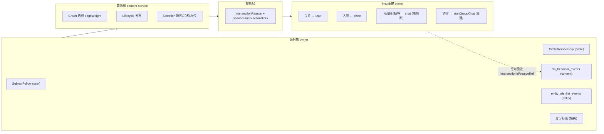
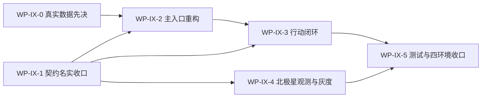

# 交集配对商用成熟度规划

> 版本：2026-07-20（M10 专项全链路排查冻结）
> 范围：`docs/functional_module_commercial_maturity_matrix.md` §19 M10「交集与同趣配对」——从页面到端云服务、测试、观测、环境的商用成熟度规划；本文是 M10 的唯一施工真相源。
> 树绑定：Journey `intersection-action-to-companionship`；L2 `object-homepage-network/intersection-unified-experience`；Scenario `intersection-action-deepening-on-object`、`companionship-and-nearby-connection`、`contact-label-driven-connection`。
> 定义真相源：`specs/product/intersection-definition-and-application.md`（本文不复制其定义，只引用）；风险唯一真相源：`docs/outstanding_risks_backlog.md`。
> 审查主线：`业务目标 → 核心业务对象 → 对象关系 → 对象生命周期 → 用户旅程 → 功能能力 → 页面承载 → 交集差异化 → 运营指标 → 测试验证`。

## 0. 排查方法与证据口径

- 本轮以端（Flutter 页面/组件/数据链）、云（content/entity/circle 服务与 metadata）、测试（三层证据与四环境）、运维运营（SLO/指标/大盘/告警/灰度）四路独立排查后交叉汇总，证据截点 2026-07-20。
- 现有页面、路由、接口、领域对象一律按「待验证现状」处理，不默认其划分合理。
- 结论分三级：**已证实**（可定位代码/测试/环境证据）、**待专项核验**（静态证据不足，须真机/真实环境补证）、**GATE_BLOCK**（阻断商用）。
- 页面成熟度 P0～P5 与横向质量维 P1～P9 是两套口径，不互替（见 maturity matrix §0.1）。

## 1. 总体结论

「交集配对」当前是**倒金字塔**：越靠近底层工程越完整，越靠近用户价值越空。

| 层 | 成熟度 | 证据 |
|---|---|---|
| 云侧引擎 | 中等成熟（真算） | 4 个 operation 全链路（metadata→codegen 路由→handler→service→source）；9 个 kind 请求期 Mongo 边表真求交；`rm_viewer_object_intersection` 读模型预物化 + Graph 边权/Lifecycle 五态状态机；`rec:icool`/`rec:ineg`/`ix:watermark` 三套冷却水位 + Mongo 耐久兜底；feed 70/20/10 mixer 真调用；entity bundle 跨服务预附着 |
| 端侧组件 | 工程完整 | `components/object_page/` 25 文件约 4500 行统一渲染链；四主页/首页 chip/视频书全部真实接入；「无云侧 `primaryText` 不渲染」G2 红线全链遵守；production 装配 Remote |
| 观测底座 | 部分就位 | SLO + 7 组 Prometheus 业务指标 + 6 条告警三源互引；行为契约六字段归因贯穿曝光→点击→展开→负反馈→三类转化 |
| 产品闭环 | **三处硬断裂** | 主入口空壳（P1）、行动 CTA 无响应（message/connect→unsupported）、真实数据未闭环（viewer 身份 + prod 边缘） |
| 验证与运营 | **结构性空洞** | SIT1~5 全 partial；user_acceptance 交集专项测试 0 个；北极星「关系形成数」零指标；漏斗大盘缺失；灰度 kill-switch 不存在 |

### 1.1 「完全不可用」的五个根因（全部已证实）

| # | 根因 | 定位 | 商用阻断等级 |
|---|---|---|---|
| 1 | **主入口 P1 空壳**：交集配对 launcher 是纯静态导流页，无任何真实数据；「找相关圈子 / 找想去的地方 / 按兴趣搜索」三个入口全部跳同一个不带参数的 `/search` 泛搜索页 | `quwoquan_app/lib/ui/interest_match/pages/interest_match_page.dart`（474 行，`_openSearch` 三处复用）；`InterestMatchOpportunity` 无 canonical 对象（R-PLAZA-001） | GATE_BLOCK |
| 2 | **行动闭环断裂**：`message`/`connect` 类行动 pill 在导航器中分发到 `unsupported`，点击无响应；「打动的人」的「查看全部」只弹一句文案的 action sheet，无列表页 | `intersection_target_navigator.dart:260-264`；`object_impact_preview_card.dart:71-83` | GATE_BLOCK |
| 3 | **真实数据未闭环**：gamma seed 仅 1 viewer 受控规模且 seed 管道引用已改名模块（2026-07-20 已修复引用并跑通）；beta 只有 manifest 声明无执行证据；prod-hosted 边缘 0/2 healthy（SSL record layer failure）。viewer 凭证初判修正：production provider 装配已接登录态（Bearer + activeSubAccountId），残留为构造级 dart-define 回退语义债 + smoke 基建无 token（详见 §11.2，R-IX08 已收窄） | `content_recommendation_social_graph.gamma_seed.json`；`start_local_gamma_mirror.sh` seed 函数；R-IX05/R-IX08 | GATE_BLOCK |
| 4 | **契约名实不符**：kind 注册表 27 个 active 中 **18 个无任何数据源产出实现**（只有消费侧查表与 Explain 文案分支），对应页面区块永远为空 | `intersection_kind_registry.yaml`（32 kind）对照 `intersection_source.go`（产出侧仅 9 kind） | GATE_BLOCK |
| 5 | **北极星无法计算**：「关系形成数」零指标——`GreetingRequestReplied` 事件 payload 无交集归因字段；无交集漏斗专属大盘（11 个大盘仅 1 个 CTR panel）；SLO 声明的三层回滚依赖的 feature flag 实际不存在（只能参数调零） | `user/greeting_request/events.yaml`；`quwoquan_ops/observability/monitoring/dashboards/`；`runtime/recpolicy/policy.go` | GATE_BLOCK |

### 1.2 规格声称 vs 实际（诚实差）

规格记录的工作包 A（冻结）/B（审计）/M0（契约底座）/C（四主页行动）/D（视频书归因）完成**属实**——契约、组件、四主页接线确实存在且有测试锁定。但：

- C0「共同想去→约伴」只有「actionHint → 跳建群页」的最薄接线，无机会对象、无双向同意流程、无成行状态机；
- F「推荐与交集配对差异化」只落了负反馈冷却，launcher 侧零差异化；
- E「端云真实数据」止步 gamma-local（2026-07-06 全绿），beta/prod 未闭环。

**「已完成」的是交集解释系统；「未完成」的恰是配对与行动系统——而后者才是「交集配对」这个入口名对用户的承诺。**

## 2. 业务对象全景表（交付物 1）

### 2.1 读模型投影（recommendation 域，11 个，全部已定义且端云 codegen 对齐）

| 对象/投影 | 用户价值 | 上下游 | 聚合/上下文 | 生命周期 | 页面承载 | API/服务 | 存储/事件 | 当前问题 |
|---|---|---|---|---|---|---|---|---|
| `IntersectionReason` | 一句可证结论句（唯一用户可见通道） | 上游 source/hydration，下游全部触点 | recommendation 读模型（无写聚合） | `computedAt/freshAt/expiresAt` + lifecycle 五态 | 七触点全部 | 4 个 content operation + feed 内嵌 + bundle | `rm_viewer_object_intersection`（Mongo JSON blob） | 18 个 active kind 无产出（§2.3） |
| `IntersectionPoint` | 证据组（count/样本/label） | reason 子结构 | 同上 | 随 reason | 证据下钻 | 同上 | 同上 | — |
| `IntersectionActorEvidence` | 人数 N 逐人下钻 | reason 子结构 | 同上 | 快照 `pointSummarySnapshotId` | 证据列表 | 同上 | 同上 | — |
| `IntersectionDimensionTally` | 收件箱维度简报 | summary 子结构 | 同上 | 水位驱动 newCount | 我的交集摘要卡 | `GetMyIntersectionSummary` | 同上 | — |
| `IntersectionInboxSummary` | 我的主页聚合入口 | tally 聚合 | 同上 | 同上 | 我的主页/launcher | 同上 | 同上 | launcher 未消费（§5） |
| `IntersectionTarget` / `IntersectionTextSpan` / `IntersectionVisual` / `IntersectionRepresentativeActor` / `IntersectionActionHint` / `IntersectionPropagationPath` | 可交互投影（点击/头像/行动/传播） | reason/impact 旁挂 | 同上 | 随宿主 | 全触点 | 同上 | 同上 | actionHint 的 message/connect 端侧无承接（§5） |

### 2.2 状态与源对象

| 对象 | 用户价值 | 归属 | 生命周期 | 页面承载 | API/存储 | 当前问题 |
|---|---|---|---|---|---|---|
| `IntersectionVisitState` | 已读水位（红点清零） | `content/intersection_visit_state/**`（entity/fields/events/storage 契约齐备） | open→seen（watermark 单调推进） | 收件箱打开即清零 | `MarkIntersectionsVisited`；`ix:watermark`(Redis hash, TTL 90d) + `rm_intersection_watermark`(Mongo `$max` 耐久兜底) | 已证实可用（gamma remote smoke 清零链路 2/2 绿） |
| `SubjectFollow` / `PersonaRelationship` | 关注/互关/拉黑事实边 | user 域（M12 owner） | 关注→互关→取关/拉黑 | 交集不可改写权限门 | content 侧读投影 `persona_follow_projection` | 交集只读消费，边界正确 |
| `CircleMembership` | 圈子归属事实边 | circle 域（M8 owner） | join→active→leave | 行动 join_circle 写回 circle | `circle_members` | 边界正确 |
| 行为边 | comment/visit/view 等行为事实 | content 域 | append-only | — | `rm_behavior_events`（行为写侧唯一真相源） | 边界正确 |
| 想去意图 | 对象级未来意图 | entity 域 | 标记→有效→过期 | 实体主页想去；C0 信号 | `entity_wishlist_events` | 已 active/R2（2026-07-02 从 deferred 解锁） |
| 身份标签（同校/同司） | identity 维度事实源 | user/tag 域 | — | 同校类交集恒空 | **无任何数据源/seed** | **GATE_BLOCK：8 个 identity kind 全部无源**（§2.3） |
| `AuthorImpact` / `CircleImpact` | 打动的人（影响事实） | content/circle 域 | 行为驱动 `$inc` 聚合 | 四主页 impact 卡 + 收件箱 impact tab | `rm_author_impact` + `rm_author_impact_evidence`（cursor 分页） | 「查看全部」端侧无列表页（§5） |
| `InterestMatchOpportunity` / trip / meetup | 配对机会/结伴/线下局 | **无 canonical object packet** | — | launcher 无对象支撑 | — | **GATE_BLOCK：R-PLAZA-001，主入口无对象** |

### 2.3 kind 注册表名实核对（32 kind = 真算 9 + 无源 active 18 + deferred 5）

机读真相源 `quwoquan_service/contracts/metadata/recommendation/rec_model/intersection_kind_registry.yaml`（1106 行）对照产出侧 `intersection_source.go` 逐个核对：

**真算 9 个（请求期 Mongo 边表求交或真实通道，已证实）**：

| kind | 数据源 | 实现位置 |
|---|---|---|
| `sharedFollowees` | `persona_follow_projection` 双方 followee 集求交（上限 200） | `intersection_source.go:384` |
| `sharedCircle` | `circle_members` 双方圈子集求交 | `:399` |
| `coCommented` | `rm_behavior_events`(comment) contentId 求交（上限 300） | `:416` |
| `coVisitedEntity` | `rm_behavior_events`(entity_page_view) entityRefs 求交 | `:434` |
| `coWishlistedEntity` | `entity_wishlist_events` 有效 wishlist 求交 | `:480-537` |
| `followeeVisited` | viewer followees × 对象到访（桥接，回填真实访客资料，无资料丢弃不猜名） | `:612,634` |
| `sharedTagSample` | `rm_entity_tags` / circle tags | `:51,125` |
| `followeeViewing` | 实时在看集合（feed 通道） | `:197` |
| `followeeDiscussedThis` | 收件箱/feed 通道经 social provider | `:64` |

**无源 active 18 个（GATE_BLOCK：登记 active 但云侧永远不产出，仅存在于 codegen 查表与 Explain 文案分支）**：

`commonFollower`、`commonContact`、`sameSchool`、`sameDepartment`、`sameMajor`、`sameCohort`、`alumni`、`sameCompany`、`sameTeam`、`sameIndustry`（identity 全族 8 个无身份标签数据源）、`sharedDiscussion`、`coMemberCircle`、`coSharedContent`、`coLiked`（T4，按 §21.7 本就要求预投影后才可产出）、`sharedEntityAttention`、`followeeInObject`、`alumniHere`、`colleagueHere`。

**deferred 5 个（诚实占位，禁止产出，正确）**：`coCreatedContent`、`coPresentHere`、`nearbyAffinity`、`coPlannedTrip`、`wantToMeetSameInterest`。

**actionKey 侧**：22 个 actionKey 中 7 个 `targetAvailability=deferred`（join_trip/join_meetup/meet_nearby/start_voice_room + commerce 3 个，正确诚实）；`start_companion` 已 available（dispatch=companion，requiredGates=[login,realName,minorMode,blocked,rateLimit]）；**但 `message_person`/`connect` 类端侧无真实承接（§5）**。

### 2.4 spec 口径漂移（需回写定义文档，不是代码缺陷）

- `cache:viewer_intersections`（TTL 900s Redis 聚合缓存，spec §21.7）**从未按 spec 落地**，已被语义更强的 Mongo 读模型 `rm_viewer_object_intersection`（policy 分维度保鲜 TTL）取代；`redis_keyspace.yaml` D1 修复注释已说明。spec §21.7 口径过时。
- 独立 spotlight endpoint `GET /content/feed/intersections` 不在当前路由表；交集经 `GetFeed` 响应内嵌 `IntersectionReasons` 下发。spec §20.6 会话 E 删除已实际完成。
- 关注边集合名：spec 写 `follow_edges`（user 域上游存储），content 侧实际消费 user-service 投影产物 `persona_follow_projection`。

## 3. 对象关系与聚合边界（交付物 2）

### 3.1 裁决：维持「无 Intersection 写聚合」

canonical object map 无 `Intersection` 聚合根。本轮复核**维持该裁决为正确设计**：

- 交集是多源事实的**物化读模型**（`采集 → 算法 → 投影` 管线，spec §21），不拥有独立写命令；
- 行动写入归源对象 owner：关注→`SubjectFollow`(user)、加入→`CircleMembership`(circle)、讨论/私信→`Conversation`(chat)、想去→wishlist(entity)；
- 唯一交集自有写面是 `IntersectionVisitState`（已读水位）与曝光/负反馈冷却（Redis + 行为事件），均已实现。

**推论（红线）**：任何「UI 直接修改交集」「把 projection 当写真相」「新增第二套 kind 枚举/reason mapper/action 表」均 GATE_BLOCK。

### 3.2 关系图（viewer×object 边的四层属性）



### 3.3 已识别的关系问题

| 问题 | 类别 | 证据 | 处置 |
|---|---|---|---|
| 18 个 active kind 无产出 | 对象有定义无数据 | §2.3 | WP-IX-1 逐个裁决：补源或降 deferred |
| `GreetingRequestReplied` 无交集归因字段 | 关联对象生命周期不同步（关系形成无法归因到交集） | `user/greeting_request/events.yaml` payload 仅 id/双方/conversationId | WP-IX-1 metadata-first 补归因 |
| `InterestMatchOpportunity`/trip/meetup 无对象 | 页面存在但无对象支撑 | launcher 仅导流；R-PLAZA-001 | WP-IX-2 metadata-first 建模 |
| affinity 概率分为启发式（圈子热看/关注在看 + 确定性图权），非模型分 | 读模型语义近似 | R-IX01（读路径零同步打分不变量已契约锁定，安全） | 维持并入深排轨 R-IX03，不阻塞商用 |
| per-candidate 关系交集用 viewer 级聚合近似 | 读模型语义近似 | R-IX02 | 归数据工程预计算轨，不阻塞商用 |
| 端侧 Mock 层硬编码中文结论句模板 | Mock 模拟云侧 Explain（豁免区但暴露依赖） | `intersection_repository.dart:255-312` | 与 alpha seed 同源维护，WP-IX-5 校验 Mock↔Remote 行为一致 |

## 4. 核心对象生命周期（交付物 3）

### 4.1 交集边生命周期（已实现五态 + 注册表七态映射缺口）

```text
new → strengthened → stable → weakened → reactivated   （云侧已真算：graph materializer 增量比对上次快照）
archived / expired                                      （registry lifecycleStates 闭集已含、端侧文案已备；云侧未产出——待 WP-IX-1 裁决）
```

逐状态核对（谁触发/页面/操作/反馈/事件/存储/指标/测试）：

| 状态 | 触发 | 页面承载 | 可执行操作 | 存储/指标 | 测试 | 缺口 |
|---|---|---|---|---|---|---|
| `new` | `computedAt > watermark` | 收件箱红点/「新」弱标；我的主页 tally newCount | 打开即清零（visit） | `ix:watermark` + `rm_intersection_watermark`；`intersection_inbox_visit_total{dimension}` | Go 28 测 + App inbox 测试 + gamma smoke 清零 2/2 | 无 |
| `strengthened`/`reactivated` | strengthDelta 增量比对 | 弱标「增强/重新活跃」 | 同上 | graph materializer 物化 | `intersection_graph_materializer` 7 测 | 无 |
| `stable`/`weakened` | 平稳/衰减 | 无标/降排 | — | 同上 | 同上 | 无 |
| `archived`/`expired` | 保鲜过期归档 | 端侧 `filterDefaultInboxLifecycle` 已过滤 expired | 历史筛选（未实现） | 云侧不产出这两态 | 无 | 待裁决：产出或从闭集移除端侧文案 |
| 曝光冷却 | feed 曝光未转化 | feed 内 `RankState=seen` 降权 | — | `rec:icool` ZSET 14d | 冷却测试全绿 | 无 |
| 负反馈冷却 | 长按不感兴趣 | 收件箱 action sheet | `trackIntersectionFeedback` | `rec:ineg` 30d 过滤 | `intersection_feedback_cooldown` 端到端 | 无 |

### 4.2 `IntersectionVisitState` 水位（已闭环）

`open → seen`：打开收件箱 → `MarkIntersectionsVisited` → Redis hash 加速 + Mongo `$max` 单调耐久 → summary newCount 清零。gamma-local 远端已证实（`intersection_remote_smoke__api_integration_test.dart` 2/2）。

### 4.3 约伴机会对象目标状态机（WP-IX-2/3 新增，当前不存在）

```text
创建(共同想去信号触发/用户主动发起)
  → 待响应(邀约发出，双向同意门)
    → 已成行(对方接受 → 建群/会话承接 → 关系形成事实)
    → 已婉拒/已过期(安全终态，冷却不再推)
  → 已沉淀(成行后回写关系资产与行为回流)
```

逐状态必须冻结：触发者（仅实名+非青少年+未被拉黑+限流内）、页面（launcher 机会区/对象页约伴入口/消息承接）、反馈（发起成功/被拒无骚扰回执）、事件（`CompanionInviteCreated/Accepted/Declined/Expired`，payload 携带 intersectionId/sourceRef 归因）、存储（circle 或 user 域新 object packet，WP-IX-2 metadata-first 裁决归属）、指标（发起率/接受率/成行率/骚扰举报率）、测试（状态机 contract + 安全门负例 + UAT-9）。

**红线**：该对象未建模前，launcher 不得渲染任何「配对候选/机会列表」伪能力（现状守住了这条线，代价是主入口空壳——解法是建对象，不是造假数据）。

## 5. 对象—功能—页面双向矩阵（交付物 4）

### 5.1 用户旅程主线与七触点

```text
发现（首页 chip / 视频书句 / 搜索交集 Tab / 交集配对 launcher）
  → 理解（对象页交集卡证据下钻 / 收件箱 timeline / 逐人证据）
    → 行动（关注 / 入圈 / 讨论 / 打招呼 / 约伴）
      → 沉淀（关系形成 / 打动回流 / 交集变强可见）
        → 回流（收件箱新增 → 复访）
```

### 5.2 从对象查页面（对象 → 承载完整性）

| 对象/能力 | 在哪看到 | 创建/管理 | 关联/解除 | 异常/空态 | 深链返回 | 结论 |
|---|---|---|---|---|---|---|
| IntersectionReason（9 个真算 kind） | 七触点全部 | 云侧物化（用户不直接创建） | 负反馈冷却（长按） | 空态引导/整卡收起/无 primaryText 隐藏，均已实现 | count span 下钻收件箱、对象 span 进对象页 | **完整** |
| IntersectionReason（18 个无源 kind） | 任何页面都看不到（云侧不产出） | — | — | 恒空 | — | **GATE_BLOCK：对象有定义无页面数据** |
| InboxSummary/Tally | 我的主页预览卡（≤3 条 + 查看全部） | — | 打开清零 | 有 | — | 完整 |
| VisitState 水位 | 红点/「新」弱标 | 打开即推进 | — | 失败不阻断列表（结构化遥测） | — | 完整 |
| ActorEvidence 逐人证据 | 证据下钻 sheet | — | — | 隐私过滤降级 | 进代表人主页 | 完整 |
| AuthorImpact/CircleImpact | 四主页 impact 卡 + 收件箱 impact tab | 行为驱动（用户不直接创建） | — | 有 | **「查看全部」只弹一句文案 sheet；云侧 `ListAuthorImpactEvidence` 分页 API 已就绪但端侧无列表页** | **P0 缺页面** |
| actionHint：navigate 类（关注/入圈/进讨论/看共同来源） | 交集卡行动 pill | 承接页复用既有 gate + AuthContinuation | — | login 门续接（§15 无死循环） | — | 完整（2026-07-02 返工后） |
| actionHint：`message_person` | **不显示/点击无响应**（dispatch=message 端侧 unsupported） | 真实承接在 userProfile 页私信（mutualConsent 门） | — | — | — | **GATE_BLOCK：行动断链** |
| actionHint：`start_companion` | 首页「有人同行」徽标 + 行动 pill | dispatch=companion → 跳 `startGroupChat`（最薄） | 无双向同意/成行状态机 | safetyGate 契约有、真实拦截 UX 未证 | — | **半成品（C0 最薄接线）** |
| actionHint：deferred 7 个（trip/meetup/nearby/voice/commerce） | 诚实不显示 | — | — | — | — | 正确 |
| InterestMatchOpportunity | **无对象** | — | — | — | — | **GATE_BLOCK：launcher 无对象支撑** |

### 5.3 从页面反查对象（页面 → 对象/功能正确性）

| 页面/触点 | 用户目标 | 主对象 | 字段来源 | 操作对应 command | 上游入口 | 下游去向 | 完整性结论 |
|---|---|---|---|---|---|---|---|
| 交集配对 launcher `/interest-match` | 找同趣的人/圈/地并行动 | **无**（纯静态文案） | 常量文件（合规但静态） | 无（仅导航） | 底栏 `+` 面板、Web 侧栏 | 3 入口跳同一 `/search`（不带参数）+ `/search/network` + `/profile/intersections` | **GATE_BLOCK：视觉存在、业务无对象无数据；入口价值断裂** |
| 我的交集收件箱 `/profile/intersections` | 看新增交集并下钻行动 | IntersectionReason + VisitState + AuthorImpact | 4 个 operation 真实消费 | visit 清零、负反馈、span 下钻 | 我的主页卡/launcher/各触点 count span | 对象页/维度下钻 | 功能完整（数据密度依赖 WP-IX-0） |
| 全部交集下钻 `/profile/intersections/object` | 对象维度全量证据 | IntersectionReason | `GetObjectIntersections` | 同上 | 四主页「查看全部」 | 对象页 | 完整 |
| 四主页 `ObjectIntersectionSection` | 你们的交集 + 打动的人 | reason + impact | bundle 预附着（entity）/ object API | navigate 行动 + 展开埋点 | 主页进入 | 证据下钻/行动承接页 | 完整（渲染链单源） |
| 首页 chip / 视频书句 | 内容卡上的交集解释 | reason（host_implicit） | feed 内嵌 `intersectionReasons` | span 点击全归因 | feed | 对象页/收件箱 | 完整 |
| 搜索交集 Tab（`search_network_results_page`） | 找同趣的人结果 | `connectionState` + `intersectionReason` 子集 | 云侧 hit 只读（R-003 已收口零拼装） | 关注等 | launcher「找同趣的人」/搜索 | 用户页 | 基本可用；作为「配对结果面」体验不足（§6） |
| impact「查看全部」 | 打动的人全量明细 | AuthorImpactEvidence | **API 已备、页面缺失** | — | impact 卡 | — | **P0 缺失** |
| 约伴承接 | 共同想去→约伴成行 | **无机会对象**，复用建群页 | — | start_companion → startGroupChat | 首页徽标/行动 pill | 群聊 | **半成品** |

### 5.4 GATE_BLOCK 格汇总（按用户旅程排序）

1. 主入口 launcher 无对象、无数据、导流断裂（发现层断）。
2. 18 个无源 kind → 多个页面区块恒空（理解层空转）。
3. `message_person` 无承接、impact 无列表页（行动层断）。
4. 约伴无机会对象与状态机（沉淀层断）。
5. 关系形成事件无交集归因（回流层断——北极星无法计算，见 §9）。

## 6. 页面成熟度评级与重构决策（交付物 5+6+9）

> 评级依据：对象映射正确性、功能/规则完整、旅程无断点、状态齐全、IA 清晰、主操作突出、iOS 交互、深浅色、token 统一、无障碍、业界水平、交集差异化（§4.2 分级依据全项核对）。视觉列 2026-07-20 经真实字体截图探针核验（§11.1），评级无升降。

| 页面/触点 | 现评级 | 视觉 | 决策 | 主要问题 | 目标 |
|---|---|---|---|---|---|
| `lib/ui/interest_match/pages/interest_match_page.dart` | **P1**（原型/空壳） | 已核验（双亮度） | **完全重构** | 静态导流壳、无对象、3 入口同跳泛搜索、无登录差异、无数据区；截图证实视觉工程合格但整页无一个真实数据位 | P5：商用主入口（§10 WP-IX-2 规格） |
| `lib/ui/user/pages/my_intersection_inbox_page.dart` | **P3** | 已核验（双亮度） | 适度精修 | 功能齐（双 tab/筛选/时间桶/负反馈/清零），差在数据密度与「今日窗口」次级说明、impact tab 下钻断点；真实链路另暴露 V2 计数不一致（云侧缺陷，§11.3） | P5 |
| `lib/ui/intersection/pages/object_intersection_list_page.dart` | **P3** | 已核验（双亮度） | 适度精修 | 三态齐全、主谓宾句 + 行动 pill 形态达标；缺事实/推断分层视觉 | P5 |
| 四主页 `ObjectIntersectionSection`/`ObjectIntersectionCard` | **P3** | 已核验（空态） | 统一精修 | 渲染链单源正确；**V1：alpha/Mock 下恒空态（Mock 未复刻云侧 host_plain 转换，§11.3）**，丰富态截图待 V1 修复后补 | P5 |
| 首页 chip（`home_multi_form_feed_post_cards.dart`） | **P3** | 未核验（feed seed 空） | 轻量精修 | 单句 + companion 徽标已达形态；affinity「推荐」标注展示待真实数据态核验 | P4 |
| 视频书底部句（`immersive_intersection_statement.dart`） | **P3** | 已核验（暗底） | 保留/轻量精修 | 单行省略 + span 可点已达形态 | P4 |
| 搜索交集 Tab（`search_network_results_page.dart` 族） | **P2** | 未核验（依赖搜索栈数据） | 适度重构 | 零拼装已收口；但作为「找同趣的人」结果面缺交集强度排序、维度筛选、破冰行动区 | P4 |
| impact 证据列表页 | **P0**（缺失） | — | **新增** | 云侧 `ListAuthorImpactEvidence` cursor 分页 API 已就绪，端侧只有一句文案 sheet | P4 |
| 约伴承接面 | **P0**（缺失） | — | **新增（C0）** | 机会对象+双向同意+成行状态机全缺，现复用建群页 | P4（首发最薄） |

**决策汇总**：完全重构 1（launcher）；新增 2（impact 列表、约伴承接）；适度重构 1（搜索交集 Tab）；适度/轻量精修 5；删除 0（无冗余页；旧 plaza/connection 原型 2026-06-30 已删干净）；合并 0。

### 6.1 缺失/简陋/跑偏页面清单（交付物 9）

- **缺失（P0）**：impact 证据列表页；约伴承接面（机会详情/双向同意）。
- **简陋（P1）**：交集配对 launcher——视觉工程合格（token/双色/文案常量全合规、无 TODO）但产品空壳；「简陋」的本质是**无业务对象支撑**，不是样式问题，禁止只做视觉美化。
- **对象跑偏**：无页面把错误对象当真相源（G2 红线全链遵守，零端拼句）；唯一语义漂移是 launcher 页名「交集配对」承诺配对能力而实际只是导流器——按 §10 WP-IX-2 以补对象方式收口，而非改名降级。

## 7. 业界标杆对比（交付物 7）

> 检索日期 2026-07-20；来源为当前可验证的公开资料（36 氪/人人都是产品经理对小红书找搭子的产品分析、LinkedIn 官方 Help 与产品博客、豆瓣同城官方帮助）。只提炼原则，不做像素级抄袭，不复制品牌资产；最终方案服从趣我圈业务对象、用户旅程与交集定位。

| 标杆 | 对标页面/旅程 | 功能完整性 | 信息架构 | 关键交互 | 异常/安全 | 可借鉴原则 | 不适合照搬 |
|---|---|---|---|---|---|---|---|
| 小红书「找搭子」 | 交集配对 launcher / 约伴 C0 | 搭子需求对象化为「搭子卡片」（单人搭子/建群找搭子两类），发布即笔记、沟通走私信/群聊，平台只做撮合不承载重沟通 | 入口在消息页（轻嵌入主产品）；卡片=搭子类型+一句话描述 | 发布卡片→私信/进群；按年龄与浏览行为推荐搭子 | 2026 年已对搭子邀约做真实性治理与出游安全提示；靠内容审核而非结构化风控 | **把配对需求「对象化」为可发布/可加入的轻量卡片**；撮合完成即导流到既有沟通设施（群聊/私信），不建第二套会话；主题先行（游戏/旅行/学习搭子分类） | 纯 UGC 自述卡片缺可证事实（趣我圈的差异化恰是「你们都去过/都想去」的事实证据）；入口藏在消息页过深 |
| LinkedIn mutual connections | 对象页交集卡 / 证据下钻 | 「X mutual connections」常驻资料页头部，点击进完整共同联系人列表（头像+姓名+职位+可搜索）；「How You're Connected」按关系强度（同校 vs 近期共事）选最佳引荐路径 | 共同关系是资料页第一屏事实锚点，不是折叠附件 | 数字即入口；列表逐人可点进主页 | 即使对方隐藏全量联系人列表，双方共同部分仍可见（隐私与价值的精确平衡）；不通知被查看方 | **数字必可下钻到逐人证据**（趣我圈 ActorEvidence 契约已对齐此原则）；**按关系强度排序证据**帮用户选行动对象；隐私遮蔽粒度做到「隐藏全量但保留交集」 | 1st/2nd/3rd degree 连接度体系（趣我圈关系语言只有关注/互关）；联系人通讯录扩张 |
| 豆瓣同城/小组 | 约伴承接 / 线下局（deferred 边界参考） | 活动=正式对象（标题/时间/地点/类型/报名表），发布经审核（可操作性/单次性/非广告），报名表由发起人定制、系统保证名单完整 | 城市→分类→活动详情→报名的稳定漏斗；活动与小组/友邻推荐联动 | 「我要参加」单主行动；感兴趣/评论/分享为轻行动 | 审核制过滤模糊活动（时间太宽泛/主题不明确不予通过）——**活动必须可操作** | **重行动对象必须有正式生命周期与审核门**（映射到趣我圈约伴对象的 safetyGate+双向同意）；「必须可操作」原则=趣我圈 actionHint 无真实目标不下发 | 中心化人工审核不适合约伴私聊场景（趣我圈用双向同意+实名+风控配额替代）；文艺调性弱运营不适合北极星驱动 |

**综合结论**：三个标杆分别验证了本规划三个关键裁决的业界通行性——①配对需求要对象化（小红书搭子卡片 → `InterestMatchOpportunity`）；②事实证据要可下钻且按强度排序（LinkedIn → ActorEvidence + evidenceRank，契约已备）；③重行动要有正式对象与准入门（豆瓣活动审核 → 约伴状态机 + safetyGate）。趣我圈的差异化空间在于三者都不具备的组合：**用可证交集事实（你们都去过/都想去）为陌生配对提供信任背书**——小红书搭子无事实证据、LinkedIn 无行动场景、豆瓣无个体配对。

## 8. 交集差异化规划矩阵（交付物 8）

> 表达公式（spec §6.1）：`代表用户/关系主体 + 数量或强度 + 行为/关系 + 对象 + 可理解证据 + 下一步行动`。冷启动降级链（全触点统一）：`具名样本+头像 → 纯计数 → 维度母表达 → 隐藏整块`（禁占位假交集）。

| 页面/场景 | 主对象 | 是否需要交集 | 交集证据 | 用户价值 | 表达方式 | 用户行动 | 冷启动方案 | 指标 |
|---|---|---|---|---|---|---|---|---|
| 交集配对 launcher | InboxSummary + Opportunity（新） | **核心承载**（页面主价值） | 我的交集摘要（真实 tally）+ 共同想去机会（coWishlistedEntity） | 发现：今天有谁/什么值得行动 | 摘要卡（N 维度新增）+ 机会卡（主谓宾单句） | 下钻收件箱 / 发起约伴 / 带参搜索 | 无交集→引导关注/入圈/标记想去的行动位（非空壳文案） | launcher→行动转化率 |
| 我的交集收件箱 | IntersectionReason + VisitState | 核心承载 | 9 个真算 kind 全量 | 回流：新增可行动交集 | 时间桶 timeline 单句/行 | 下钻/行动/负反馈/清零 | 空态引导（已实现） | 清零率、回访率 |
| 四主页交集卡 | reason（对象维度） | 核心承载 | 你们的交集证据组 ≤5 | 决策：是否关注/加入/联系 | 证据组 + 行动 pill | navigate 行动 + 证据展开 | 整卡收起（已实现） | 展开率、行动率 |
| 首页内容卡 chip | reason（host_implicit） | 场景增强 | 单句（1 条上限） | 解释：为什么看到 | 紧凑单句 + lifecycle 仅「新」 | 点击进对象 | 无 primaryText 隐藏 | chip CTR |
| 视频书底部句 | reason（host_implicit） | 场景增强 | 单句 | 解释 + 发现 | 单行省略可点 | span 进对象/详情 sheet | 隐藏 | 句点击率 |
| 搜索交集 Tab | connectionState + reason 子集 | 核心承载 | 已连接/未连接/交集线索分组 | 发现 + 决策：找同趣的人 | 分组列表 + 每卡单句 | 关注/打招呼（补） | 发现区 affinity 标「推荐」 | Tab→关注转化 |
| impact 证据列表页（新增） | AuthorImpactEvidence | 核心承载 | 逐人「因为你」明细 | 沉淀：创作者价值可见 | cursor 分页列表 | 进对方主页/回内容 | 匿名降级（契约已备） | 明细打开率 |
| 约伴承接（新增） | Opportunity（新） | 核心承载 | 共同想去 + 交集证据引用 | 行动：兴趣→真实同行 | 机会详情 + 双向同意状态 | 接受/婉拒/进群 | 无信号不产出（诚实） | 发起→成行率、骚扰举报率 |
| 通话页/设置/协议类 | — | **无需承载** | — | — | 不塞交集模块 | — | — | — |

**禁止事项复核（全部已守住，列为回归红线）**：不生成不存在的共同关系（G2）；不把推荐冒充事实（affinity 分通道）；不显示模糊「与你相关」（主谓宾单句强制）；不暴露无权查看的关系（privacyScope + 匿名降级）；不在所有页面机械加交集（通话/设置不承载）；不为差异化破坏主任务（紧凑面 1 句上限）。

## 9. D1～D6 六维度：当前 / 目标 / 任务 / 验收

### D1 功能与旅程

- **当前**：解释链（发现→理解）完整；行动链断三处（message 无承接、impact 无列表页、约伴无状态机）；沉淀与回流链未建（关系形成不可归因、交集变强不可见于关系资产）。重行动 deferred 边界诚实（无伪候选）。
- **目标**：`证据→理解→合法行动→关系沉淀→回流` 五段无断点；每个核心对象生命周期状态（§4）都有页面、合法操作、反馈与恢复。
- **任务**：WP-IX-2（主入口）、WP-IX-3（行动闭环）、WP-IX-1（归因事件）。
- **验收**：无交集/有交集/行动成功/行动被拒/权限拦截五态 UAT；关闭登录门不死循环（§15 规则）；行动完成必有结果反馈与回流。

### D2 DDD 与 metadata

- **当前**：投影契约齐备且端云 codegen 对齐（11 projection + kind 元数据下发端零硬编码，§23 去桥接已完成）；无 Intersection 写聚合裁决正确；**18 个 active kind 名实不符；`InterestMatchOpportunity` 无对象；`GreetingRequestReplied` 无归因字段；spec §21.7/§20.6 两处口径过时**。
- **目标**：registry `status=active` ⇔ 云侧有产出实现（名实一致成为门禁语义）；机会对象 packet 齐备（entity/fields/events/errors/storage/service）；关系形成事件可归因。
- **任务**：WP-IX-1（名实收口 + 归因）、WP-IX-2（对象建模）、spec 口径回写（§2.4 两处）。
- **验收**：`verify_intersection_kind_registry.py` 扩展「active 必须声明产出实现位置」校验；event→projection→UI→command 全链 E2E；`make verify-metadata` 绿。

### D3 UX 与页面

- **当前**：§6 评级——1 个 P1（launcher）、2 个 P0（缺页）、1 个 P2、5 个 P3；渲染链单源、token/双色/文案常量合规（工程面不简陋，产品面空壳）。
- **目标**：核心页 ≥P4；launcher、收件箱、四主页交集卡、约伴承接 =P5（交集主战场）。
- **任务**：WP-IX-2/3 重构与新增；真机视觉核验（§11）；§10 逐页规格。
- **验收**：真机/截图审查 + 横向质量门禁（`make verify-app-page-horizontal-quality`）+ 重构前后旅程回归；双色/断点/iOS 语义/无障碍逐项过。

### D4 非功能

- **当前**：读路径零同步打分有契约测试锁定；读模型预物化 + 分维度保鲜 TTL + 冷却 O(logN)；SLO p95 300ms 已声明。**重构页的性能预算未随规格冻结。**
- **目标**：launcher/收件箱/约伴页首屏 P95 预算、分页 cursor、弱网恢复、幂等（visit/invite 均幂等）、灰度回滚随 WP 规格同步冻结，不后补。
- **任务**：各 WP 规格内嵌性能预算段；WP-IX-4 补 kill-switch。
- **验收**：大候选窗、低互动冷启动、重放三类压测场景；`intersection_api_latency` P95 ≤300ms 在 gamma 采样成立。

### D5 可观测与运营（黄金指标围绕对象生命周期）

- **当前**：SLO/7 组指标/6 条告警三源互引已就位；行为契约六字段归因贯穿曝光→点击→展开→负反馈→三类转化；**北极星零落地、漏斗后两级（行动完成/关系形成）无事件、无专属大盘、`intersection_expand` 无云侧计数、转化在 Prometheus 只汇入不分动作的 interaction 态**。
- **目标（3 个黄金指标，二级可下钻到页面/对象状态/operation/错误码）**：
  1. **可解释交集覆盖率**：活跃 viewer 中拥有 ≥1 条可展示 fact 交集的比例（对象有效创建率的交集形态；分母是 WP-IX-0 数据密度的直接度量）。
  2. **展示到可行动 P95**：交集曝光 → 首个可执行 actionHint 可点击的延迟（生命周期关键状态完成率的性能形态）。
  3. **解释后有效行动率**：交集点击后 7 日内 follow/join/greet/companion 完成的比例（对象关联成功率 + 北极星分子）。
- **任务**：WP-IX-4 全部（指标、事件、recording rule、大盘、护栏反指标、kill-switch）。
- **验收**：真实采集→传输→Prometheus→dashboard/alert 全链可回放；北极星分子分母可在线计算且按 dimension/sourceRef/页面切分。

### D6 测试

- **当前**：local_contract 厚实（App 25 交集专项 + Go 55 测试函数，多轮绿）；api_integration 破冰（Go 4 个真实 Mongo 契约 + App gamma smoke 2/2）；**user_acceptance 交集专项 0 个；SIT5 planned 4 文件缺失；beta 零执行证据；SIT1~5 全 partial；CR-20260715-105（SVO breaking，rollout_impact high）recorded 全空**。
- **目标**：状态机/关系/权限/生命周期/页面-对象一致性/交集事实真实性/隐私边界/重构回归三层齐备；四环境证据绑定 acceptance。
- **任务**：WP-IX-5 全部。
- **验收**：无伪事实负例（fixture 不含的 kind 不得出现在响应）、无越权负例（拉黑/隐私遮蔽）、同一 seed 可重放；SIT1~5 按证据推进状态；UAT-1~9 真实 UA 测试落盘。

## 10. 逐重构页目标规格（交付物 10）

### 10.1 交集配对 launcher（完全重构，P1→P5）——WP-IX-2

**目标定位**：交集驱动的发现与配对主入口——「今天有谁、有什么值得你行动」，而非静态目录页。

**功能规格**：

1. **我的交集摘要区**（消费既有 `GetMyIntersectionSummary`）：N 维度新增计数 + 红点 + 最多 3 条 tally 简报行（`briefSpans` 可点）；登录门与收件箱同源（未登录显示登录引导态，不弹门）。
2. **配对机会区**（消费 `coWishlistedEntity` 等真算 kind 派生的 Opportunity）：主谓宾单句机会卡（「你和林清越都想去洱海」+ 发起约伴主 CTA）；**无真实信号显示行动引导空态**（引导关注/入圈/标记想去），禁止伪候选。
3. **发现方式区**（修复导流断裂）：找同趣的人 → `/search/network`（保留）；找相关圈子 → `/search` 带 circle tab 参数；找想去的地方 → `/search` 带 place/entity tab 参数；按兴趣搜索 → `/search` 聚焦输入。路由参数经 metadata route 声明，禁止 UI 硬编码 path。
4. **安全提示区**：保留现有 safetyNote。

**UX 规格**：iOS grouped 列表语义（现有 token 体系保留）；摘要区=一张卡、机会区 ≤3 卡、发现区 4 行；深浅色/断点/无障碍按 §D3 验收；曝光+区块级点击埋点（现仅有页面曝光）。

**验收**：登录/未登录双态 UAT；有信号/无信号双态；机会卡点击→约伴承接→双向同意链路（依赖 WP-IX-3）；`interest_match_page__local_contract_test.dart` 扩展零伪候选断言保留。

### 10.2 impact 证据列表页（新增，P0→P4）——WP-IX-3

- 消费既有 `ListAuthorImpactEvidence`（cursor 分页、隐私/幂等/空态契约测试已绿）；从 `object_impact_preview_card` 与收件箱 impact tab「查看全部」进入。
- 列表行=单句 + 代表人锚点 + 时间；匿名降级行（「一位联系人」）不可点；三态齐全。
- 路由/surface 先登记 metadata（`ui_surfaces.yaml` + `app_routes.yaml`）→ codegen → 页面。
- 验收：分页/空态/匿名降级/进对方主页归因埋点。

### 10.3 约伴承接（新增最薄，P0→P4）——WP-IX-2/3

- 机会详情态（引用交集证据 + 双方想去对象）→ 发起（safetyGate 五门真实拦截 UX：未实名/青少年/被拉黑/限流分别有结构化错误提示与恢复动作）→ 对方接受/婉拒 → 成行进群（复用建群/会话，不新建第二套会话）。
- 状态机见 §4.3；事件携带交集归因（WP-IX-1）。
- 验收：双向同意负例（未同意不可开聊）、骚扰配额负例、UAT-9。

### 10.4 搜索交集 Tab（适度重构，P2→P4）——WP-IX-3 附属

- 保持零端拼装红线；补交集强度排序透传（云侧 `connectionState` + strength 已有）、维度筛选 chip、卡内破冰行动（关注即时反馈 + greet 入口带 mutualConsent 门）。
- 验收：分组正确性契约测试保留 + 行动归因埋点。

### 10.5 收件箱 / 四主页卡 / 首页 chip / 视频书句（精修，P3→P5/P4）

- 收件箱：impact tab 明细下钻接 10.2 新页；「今日新增/上次登录以来」动态窗口次级文案（云侧 tally 已有 timeBucket）；数据密度依赖 WP-IX-0。
- 四主页卡：真机核验证据组密度/代表人锚点/lifecycle 弱标层次后按需微调 token；不动渲染链。
- 首页 chip/视频书句：affinity「推荐」标注真机核验；不新增功能。

## 11. 视觉核验与端云真实验证记录（2026-07-20 补完，不打折扣）

> 首轮（07-20 上午）因 unmanaged 容器 + providers 重构中间态双阻塞未出图；异常重启后复检：栈已被用户拉起（11/13 healthy，交集依赖服务全 healthy）、providers 重构基本合流（补 2 行 user 仓库 import 后编译恢复，收件箱既有测试 8/8 绿）。本节为补完记录。

### 11.1 视觉核验（真实字体截图探针，NotoSansSC + iPhone 15 逻辑尺寸 393×852 双亮度）

| 截图 | 页面 | 结论 |
|---|---|---|
| launcher 双亮度 | 交集配对 launcher | 证实 §6 P1 评级：token/双色/分组卡视觉工程合格，但整页纯静态目录——无任何数字、头像、机会数据；「查看我的交集」行与三个发现行视觉权重均等，主任务不突出。视觉不是短板，**空壳是**（维持完全重构决策） |
| 收件箱双亮度 | 我的交集收件箱 | 双 tab + 筛选胶囊 + 时间桶（「近 7 天 2条」）+ 单句行 + 蓝色对象 span，深浅色完整；P3 评级证实。缺弱标/头像密度的丰富态样本（seed 只出 2 条可展示） |
| 对象下钻页双亮度 | object_intersection_list | 「联系人林清越等3人来过『洱海环线』」主谓宾句 + 蓝 span + 「进入主页」行动 pill，形态达标；P3 证实 |
| 四主页 section 双亮度 | ObjectIntersectionSection | **空态**——暴露新缺陷 V1（见 11.3）：alpha/Mock 模式下 N3 seed 的 reason 全部被端侧 SVO host 校验淘汰，卡恒显「暂时没有可展示的交集」 |
| 视频书句（暗底） | ImmersiveIntersectionStatement | 单行白字透明底可点形态达标；P3 证实 |

§6 评级与决策**全部维持**（视觉列从「待核验」改「已核验」，评级无升降）；四主页 section 的 P3 附加 V1 缺陷标注。

### 11.2 端云真实链路验证（gamma-local 栈，canonical 鉴权通道）

- **凭证通道修正（R-IX08 收窄）**：当前栈 content-service 强制 verified principal（JWT），header 回退仅限无鉴权中间件的隔离测试。经 canonical `open_local_acceptance_session`（`quwoquan_ops/cli/lib/local_environment_auth.py`，本地 go 签发 acceptance JWT）验证：**4 个 operation 全部 200，visit→summary 清零链路成立**（totalNewCount 4→0）。production provider 装配（`cloudHttpClientProvider` Bearer + `currentUserIdProvider` 登录态优先）**无断点**——初判「viewer 身份生产不可用」不成立，R-IX08 已收窄为「构造级 dart-define 回退语义债 + smoke 基建凭证缺口」（backlog 已同步修正）。
- **seed 管道修复**：`start_local_gamma_mirror.sh` 的交集/精品池两个 seed 函数引用了**不存在的模块** `quwoquan_ops.cli.lib.local_gamma_auth`（应为 `local_environment_auth`，接口更名后 seed 脚本未跟进）——已修复 4 处引用并真实跑通交集 seed（report 落盘 `intersection-seed-report.json`：summaryTotalCount=3，objectPointSources=[sharedCircle, coVisitedEntity, coCommented]）；canonical 社交图 seed（`apply_content_social_graph_seed.py`）与 content 主 seed（`run_local_gamma_t3.py --seed-only` passed）均已应用。
- **smoke 测试现状**：`intersection_remote_smoke__api_integration_test.dart` 在带鉴权栈上恒 401（裸 `CloudHttpClient()` 无 token），历史 2/2 绿依赖当时栈的 header 回退——该测试作为端云证据通道已失效，改造归 WP-IX-0。

### 11.3 端云真实验证暴露的三个新缺陷（本轮新发现，待用户确认后登记 backlog）

| # | 缺陷 | 现场证据 | 影响 |
|---|---|---|---|
| V1 | **alpha/Mock 四主页交集卡恒空**：云侧对象页对含宿主 span 的 reason 做 `host_plain` 转换（宿主 span 降为 plain 后可展示），端侧 Mock 直出 N3 seed（`displayBinding=explicit_link` + 宿主 object span）未复刻该转换 → 端侧 SVO 校验（object span == 宿主即拒）全部淘汰 → 卡恒空态 | 截图 07/08/10 全空；`isDisplayableIntersectionReason` 与 `plainHostObjectSpan` 行为不对称 | alpha 包四主页「你们的交集」不可见（用户「什么都没有」感知的 alpha 侧根因）；违反 R12 Mock↔Remote 行为一致 |
| V2 | **收件箱下发 hidden reason + 红点计数与可见内容不一致**：真实链路 List 返回的 reason `primaryText=''`/`spans=0`（Explain 证据不足被 `hideDisplayStatement` 清空后**未在云侧淘汰**，与代码注释「必须在云侧淘汰」矛盾）；summary `totalCount=3/newCount=3` 但可展示条目 0 | canonical token probe：list 1 条 primary 空、display-ready 0；summary 计数含不可展示项 | 真实环境用户看到「3 条新交集」红点，点进收件箱是空列表——商用级信任破坏；SVO 收紧（CR-20260715-105 recorded 全空）后 inbox hydrate 未生成 spans 的回归实证 |
| V3 | **Explain 回退句语义错误**：对象页 sharedCircle 句产出「同圈成员交集约伴体验号都加入了『交集约伴体验号』」——person displayName 被塞进圈子对象位（seed 缺 circles 档案时回退链错位） | canonical token probe 对象页响应 | 具名句事实错误（把人名当圈名），违反 G2「可证可解释」 |

三者共同根因：**SVO displayBinding 收紧改了云侧展示合同，但 inbox spans 生成、Mock host 转换、Explain 回退链、seed 档案完整性四个配套面未同步**——正是 CR-20260715-105（breaking、rollout_impact high、recorded=[]）风险的现场化。修复归 WP-IX-0（seed 档案）+ WP-IX-5（Mock↔Remote 一致性契约）+ 新增 Explain/inbox 修复项（建议并入 WP-IX-1 云侧收口）。

### 11.4 剩余未核验面

首页 chip 与搜索交集 Tab 的真实数据态截图（依赖 feed seed 的 post 级 reason 附着，本轮 feed items 为空未出图）；真机 patrol 巡检仍归设备矩阵 CI。

## 12. 整改工作包冻结（WP-IX-0～5）

> 执行方式：逐包 `/plan-next` 下发独立会话；每包按 metadata → verify/codegen → 业务逻辑 → 三层测试闭环；禁止半成品合入（无消费者的死特征/死页面按 R24/R26 阻断）。

### 依赖顺序



### WP-IX-0 真实数据先决（最高优先，其余包的分母）

| 任务 | 细节 | 验收 |
|---|---|---|
| viewer 身份从登录态注入 | `RemoteIntersectionRepository.currentUserId` 弃编译期 `String.fromEnvironment('APP_CURRENT_USER_ID')` 回退，改消费统一登录态 provider（与其他 Remote 仓库同源）；排查同模式的其他仓库 | 真实登录账号（非 dart-define 注入）在 beta/gamma 真机看到非空「我的交集」；匿名仍结构化「需要登录」 |
| beta seed 执行证据 | `app_beta_seed_manifest.json` 已声明 `intersection_core`，补真实执行与 verifiedEndpoints 记录 | beta 环境 `/content/intersections/summary` populated 冒烟留档 |
| gamma seed 密度 | `content_recommendation_social_graph.gamma_seed.json` 从 1 viewer 扩到验收级（≥3 viewer × 9 个真算 kind 全触发） | `run_local_gamma_t3.py` strict 断言扩展后全绿 |
| prod-hosted TLS | edge 0/2 healthy（SSL record layer failure）修复，属环境轨（与 R-IX05 剩余边界合并推进） | `stackctl health --target prod-hosted --scope edge` 2/2 healthy |

### WP-IX-1 契约名实收口（metadata-first）

| 任务 | 细节 | 验收 |
|---|---|---|
| 18 个无源 active kind 逐个裁决 | 每个 kind 三选一：①补数据源产出（identity 族 8 个依赖身份标签数据源建设，大概率降级）；②降 `status=deferred` 带 deferredReason；③确认由 bundle/其他通道产出并补实现位置登记。禁止保留名实分离 | registry 每个 active kind 可指出产出实现文件:行；`verify_intersection_kind_registry.py` 增产出位置存在性校验 |
| `GreetingRequestReplied` 归因 | payload 增可选 `intersectionId/intersectionSourceRef/intersectionDimension`（发起自交集触点时携带）；metadata events.yaml 先行 | 事件契约测试 + 端到端归因用例 |
| greet/companion 完成事件 | `behaviors.yaml` 登记 `greet_completed`/`companion_formed`（或经 GreetingRequest/Opportunity 事件投影，二选一裁决，避免双写） | 行为回流可按 intersectionSourceRef 切分 |
| spec 口径回写 | §2.4 两处（viewer_intersections 缓存、spotlight endpoint）回写 `intersection-definition-and-application.md` | 文档与实现一致 |

### WP-IX-2 交集配对主入口完全重构（P1→P5）

| 任务 | 细节 | 验收 |
|---|---|---|
| `InterestMatchOpportunity` 对象建模 | metadata-first：object packet（entity/fields/events/errors/storage/service）；归属裁决（circle 域 companionship 或独立 packet）；状态机 §4.3；R-PLAZA-001 收口起点 | `make verify-metadata` 绿；object map 登记 |
| launcher 页重构 | §10.1 全规格（摘要区/机会区/发现区/安全区） | §10.1 验收全项 + 页面矩阵/清单同步 |
| 导流参数化 | 圈子/地点/兴趣三入口带参直达；route 参数 metadata 声明 | 三入口落点各不相同且过滤生效 |

### WP-IX-3 行动闭环补全

| 任务 | 细节 | 验收 |
|---|---|---|
| message dispatch 承接 | 交集卡 message 行动导航到 userProfile 私信承接（复用 `openOrCreateDirectConversation` + mutualConsent/blocked/rateLimit 门），不在交集组件重造门 | 点击有响应；未互关走 greet 流程；负例（拉黑/限流）结构化拦截 |
| impact 证据列表页 | §10.2 全规格 | 三态 + 分页 + 匿名降级 + 归因 |
| 约伴最薄状态机 | §10.3：发起→双向同意→成行/婉拒/过期→沉淀；safetyGate 五门真实拦截 UX | 状态机 contract + 安全门负例 + UAT-9 |
| 搜索交集 Tab 强化 | §10.4 | 排序/筛选/行动归因 |

### WP-IX-4 北极星观测与灰度

| 任务 | 细节 | 验收 |
|---|---|---|
| 北极星指标落地 | `connection-formed-via-intersection`：事件（WP-IX-1）→投影→recording rule→大盘；「可行动交集完成数」按动作类型拆分（follow/join/greet/companion 不再混入无差别 interaction 态） | 分子分母在线可算、按 dimension/sourceRef/页面切分 |
| 漏斗六级专属大盘 | 曝光→证据展开→行动点击→行动完成→关系形成→回流；补 `intersection_expand` 云侧计数 | dashboard 全链可回放 |
| 护栏反指标 | 打招呼骚扰率/拒绝率/举报率/未成年拦截率 | 告警阈值与 SLO 对齐 |
| 显式 kill-switch | `IntersectionConfig` 增 enabled 三层开关（affinity 通道/feed rail/premium 联动），对齐 SLO rollback_layers 声明 | 关开关生效的契约测试 + 回滚演练记录 |
| 三个黄金指标 | §D5 定义的覆盖率/可行动 P95/有效行动率 | recording rule + 大盘 |

### WP-IX-5 三层测试与四环境收口

| 任务 | 细节 | 验收 |
|---|---|---|
| SIT5 planned 4 文件落盘 | `intersection_v3_actionable_instance_test.dart`、`companion_wishlist_slice_test.dart`、`companion_wishlist_readpath__api_integration_test.go`、`companion_slice__user_acceptance_test.dart` | 磁盘存在且绿 |
| UAT-1~9 真实 UA 测试 | user_acceptance 层交集专项从 0 补齐（当前仅 local_contract 降级代偿 2 项） | 按 CR-20260701-083 UAT 定义逐条绑定 |
| Mock↔Remote 行为一致 | api_integration 验证的字段/错误码在 local_contract Mock 有对应断言（R12 一体性） | 抽查矩阵留档 |
| beta 执行证据 | 承接 WP-IX-0 | acceptance 记录 |
| prod gray canary | 承接 WP-IX-0 TLS；`make gate-release ENV=prod` 灰度冒烟 | rollout_stage=gray_initial 证据 |
| CR-20260715-105 证据回填 | SVO displayBinding beta/gamma 逐条校验（rollout_impact high 不可再空转） | recorded 非空 |
| acceptance 状态推进 | SIT1~5 按证据升级；不达标保持 partial 诚实 | `verify_acceptance_standard` 绿 |

## 13. 最终回答（交付物必答八问）

1. **领域模型是否真正围绕业务对象建立？** 读模型侧是——投影契约、无写聚合裁决、行动写回源 owner 都正确；但「配对」这个用户目标没有对象（`InterestMatchOpportunity` 缺位），且 18 个 kind 名实分离，模型完整性打了对折。
2. **对象关系和生命周期是否合理？** 交集边五态生命周期已真算且有测试锁定，水位/冷却闭环合理；不合理处：关系形成事件与交集断开（无归因）、archived/expired 两态闭集有名无实、机会对象生命周期整体缺失。
3. **页面是否完整承载对象和用户旅程？** 解释链（发现→理解）承载完整；行动链断三处、沉淀回流链未建。旅程五段只通前两段。
4. **哪些页面只是空壳或功能简陋？** 交集配对 launcher（P1 空壳，唯一）；impact 查看全部与约伴承接是 P0 缺页而非简陋页。
5. **哪些页面虽然美观但业务对象已经跑偏？** 无对象跑偏页（G2 红线全链遵守）；launcher 是「名字承诺跑偏」——页名承诺配对、实际只是导流，收口方式是补对象而非改名。
6. **哪些页面应适度优化，哪些必须完全重构？** 完全重构：launcher。新增：impact 列表、约伴承接。适度重构：搜索交集 Tab。适度/轻量精修：收件箱、下钻页、四主页卡、首页 chip、视频书句。删除：无。
7. **相比业界标杆还缺少什么？** 缺小红书式「配对需求对象化」（机会卡片）、缺 LinkedIn 式「证据强度排序引导行动对象选择」的落地（契约已备未消费）、缺豆瓣式「重行动正式对象与准入门」（约伴状态机）；观测上缺三家都有的核心业务大盘。
8. **趣我圈如何通过交集形成无法被普通内容社区简单复制的差异化价值？** 唯一性组合=「可证交集事实 × 安全约伴行动 × 关系资产沉淀」：内容社区（小红书）有搭子无事实证据、职业网络（LinkedIn）有证据无行动场景、活动平台（豆瓣）有行动无个体事实配对。护城河依赖三件事同时成立：9 个真算 kind 的数据密度（WP-IX-0）、约伴安全门与双向同意（WP-IX-3）、关系形成可归因可见（WP-IX-1/4）——这正是六个工作包的主轴。

## 14. Exit Review 与剩余风险

- **规格达成**：本文完成 M10 专项十项交付物与 D1~D6；`docs/functional_module_commercial_maturity_matrix.md` §19 已回填引用；视觉核验与端云真实验证已于 2026-07-20 补完（§11），评级定稿。
- **测试证据（2026-07-20 验证轮）**：收件箱 local_contract 8/8 绿（providers import 修复后）；canonical 鉴权探针证明 4 个交集 operation 在带鉴权 gamma-local 栈 200 + visit 清零链路成立；交集 seed 函数修复后真实跑通（report 落盘）；smoke dart 测试在带鉴权栈失效的事实已记录（R-IX08）。interest_match/section 测试因用户并行 chat 域 codegen 中间态（`ChatGroupSettingsDto` 缺字段）编译失败，非本轮改动所致，待其合流后复跑。
- **本轮代码/脚本改动**（验证驱动的最小修复，非规划外扩权）：① `app_providers.dart` 补 2 行 user 仓库 import（用户 providers 重构遗漏，恢复编译）；② `start_local_gamma_mirror.sh` 修复 4 处已改名鉴权模块引用（`local_gamma_auth`→`local_environment_auth`，交集/精品池 seed 从不可运行恢复为可运行）。均已验证（lints 0、bash -n 过、seed 真实跑通、收件箱测试绿）。
- **E2E**：gamma-local 侧本轮实测推进到「带鉴权栈 4 operation 全通 + 清零链路」；同时暴露 V1/V2/V3 三个新缺陷（§11.3）——inbox 空态回归属商用级阻断，已纳入工作包。beta/prod 断点维持 WP-IX-0/5。
- **剩余风险（与 backlog 同步）**：R-IX08（2026-07-20 已收窄修正：生产装配无断点，剩构造回退语义债 + smoke 凭证基建）、R-IX09（kind 名实不符）、R-IX10（北极星缺位）已登记；**V1（Mock 缺 host_plain 转换致 alpha 四主页卡恒空）、V2（inbox 下发 hidden reason + 计数与可见内容不一致）、V3（Explain 回退句语义错误）为本轮新发现，待用户确认后登记正式 backlog**；既有 R-PLAZA-001、R-IX01~05 维持并由对应 WP 承接。
