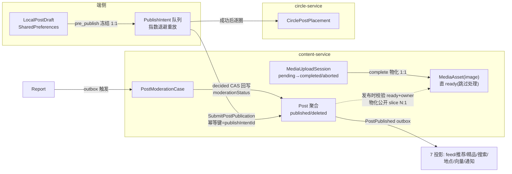

# 发布照片（发图）商用成熟度全面排查与规划

> 版本：2026-07-20（M4 发布照片专项会话产出；会话异常重启后由恢复会话收口）
> 审查主线：`业务目标 → 核心业务对象 → 对象关系 → 对象生命周期 → 用户旅程 → 功能能力 → 页面承载 → 交集差异化 → 运营指标 → 测试验证`
> 承接：`docs/functional_module_commercial_maturity_matrix.md` §13（M4）、`specs/feature-tree/discovery-content/publish-comment-reaction/post-create-update/**`、`docs/outstanding_risks_backlog.md`（R-OBJ-002/R-OBJ-007/R-CR04/R-OPS-ACCEPTANCE-PHANTOM/R-TELEMETRY-001）。
> 树绑定：Journey **缺失（本文档 GATE-P1）**；L1 `discovery-content`；L2 `publish-comment-reaction` + `content-type-framework` + `media-processing-helper-read`；L3 `post-create-update`（GWT1~GWT3 为发图主验收）。
>
> **并行去重边界**：①「发布文字」专项（同日并行，交付 `docs/text-post-commercial-maturity-plan.md`）承载发布底座共享缺口（发布成功回流、漏斗遥测 metadata-first 登记、机审方向裁定、PostStatus 契约漂移、创作 Journey 登记）的主批次定义，本文档对共享项只登记图片链路特定验收，批次合并以先合入者编号为准；②「图片编辑器」内部工具成熟度归 `图片编辑商用化排查规划`（2026-07-20 已产出，M0~M3 批次），本文档不重复规划编辑器工具；③「发布视频」专项见 `docs/video-post-commercial-maturity-plan.md`；④ 消费侧 feed/沉浸浏览归 M3。

---

## 0. 结论速览（必须回答的八个问题）

| # | 问题 | 结论 |
|---|---|---|
| 1 | 领域模型是否真正围绕业务对象建立 | **是（云侧样板级）**。Post/MediaAsset/MediaUploadSession/PostModerationCase 四聚合根 + `business_object_map.yaml` 登记完整；单一 `SubmitPostPublication` 原子命令 + PublishIntent 幂等 + receipt/outbox 事务是仓库内最成熟的对象化实现之一。 |
| 2 | 对象关系和生命周期是否合理 | **主链合理，三处漂移**：`ModerationStatus` metadata `DEFAULT_PENDING` vs 实现「发布即 approved」语义相悖；`PostModerationCaseStatus` 枚举缺 `reviewed`（metadata 与 domain 状态机不一致）；`MediaAssetScope` 枚举已声明未接线，孤儿资产无生命周期收口。 |
| 3 | 页面是否完整承载对象和用户旅程 | 选图→拍摄→编辑→表单→确认→发布链完整且有草稿/断网恢复；**但生命周期尾部断承载**：发布成功无结果回流（toast 即终点）、审核中/被拒状态无作者侧页面表达、上传中无进度表达。 |
| 4 | 哪些页面只是空壳或功能简陋 | 无空壳页。简陋点：发布确认页 4 处硬编码中文 + 推荐圈子位空缺（`recommendedCircles: const []`）；上传阶段仅按钮 spinner。 |
| 5 | 哪些页面美观但对象已跑偏 | 无跑偏页。**跑偏的是证据链**：App 端唯一发图 api_integration 是假绿包装器（引用不存在的 Go 函数 `TestSubmitPostPublicationWithMediaContract`，`go test -run` 匹配不到仍 exit 0，永绿零验证，2026-07-20 复核仍在）。 |
| 6 | 哪些页面适度优化、哪些必须重构 | 见 §5：create 家族适度重构（P2→P4），确认页/圈子选择精修，选点/草稿/相机/选择器保留；新增 1 个嵌入态（发布结果回流），删除 0 页。 |
| 7 | 相比业界标杆还缺什么 | 后台/分片/可恢复上传与进度表达（Instagram rupload）、发布结果去向与「审核中」可见性（小红书/抖音）、图片压缩与多规格（全行业默认）、发布频控与配额（抖音 75/日、IG `content_publishing_limit`）。见 §6。 |
| 8 | 交集如何形成不可复制的差异化 | M4 定位**场景增强**：发布是交集事实的**生产入口**（标签/实体/地点/圈子关联决定内容进入哪些交集通道）。最大缺口：带位置/实体照片的发布是最强「到访/体验」证据，但 `PostPublished` 的 location/entityRefs 未投影为交集事实，location 维度 kind 只消费 `entity_page_view` 行为。见 §7。 |

**商用总评：云侧发布事务/幂等/媒体绑定 P4，端侧旅程骨架 P3，但漏斗观测断链（事件必 400）、验收诚信断链（假绿 + 幽灵 suite）、生命周期尾部（回流/审核感知/进度）P1。距商用关键阻断 9 项（§8 GATE 表）。**

---

## 1. 业务对象全景表（交付物 1）

| 业务对象 | 用户价值 | 上下游对象 | 聚合/上下文 | 生命周期 | 页面承载 | API/服务 | 存储/事件 | 当前问题 |
|---|---|---|---|---|---|---|---|---|
| `content.Post`（contentType=image） | 发布的图片作品被看见、被互动 | MediaAsset（有序引用）、CirclePostPlacement、Homepage（primaryHomepageId）、semanticMentions→tagRefs/entityRefs（只读投影）、Comment/Reaction | Content BC，聚合根 | `published → deleted`（远端无草稿态；`status` 枚举 5 态实际只用 2 态） | create_page 家族 → feed/沉浸/主页 | `SubmitPostPublication`（ready）等 8 op，content-service | `posts`（17 索引）+ receipts + outbox；`PostPublished` 扇出 7 投影 | 枚举漂移；发布即 approved 与 `DEFAULT_PENDING` 相悖；审核中/被拒无作者侧承载 |
| `LocalPostDraft`（端侧） | 编辑不丢、跨会话续写 | Post（发布时冻结为 intent）、媒体本地路径 | 端侧 UI 层对象 | 创建→自动保存→续编→发布删除/手动删除；损坏 sideline | create_page（自动保存）+ local_draft_page | 无远端 API（by design） | SharedPreferences `create_drafts_v2:*` | 只存本地路径，相册文件被系统清理后引用悬空无守护 |
| `PostPublicationIntent/Receipt` | 一次点击只产生一个 Post，断网/杀进程不丢 | LocalPostDraft（1:1 冻结）、Post | 端侧队列 + 云侧 receipt | intent：pending→accepted/blocked；receipt 永久 | 无独立页（队列静默重试，「已保存……自动发布」toast） | Idempotency-Key=publishIntentId | SharedPreferences 队列 + `post_command_receipts`（TTL） | `unauthorized` 被判可重试（应引导重登）；排队中的意图无任何页面可查看/取消 |
| `content.MediaUploadSession` | 图片字节安全可靠上云 | MediaAsset（complete 物化） | Media BC，聚合根 | `pending → completed/aborted`；15min TTL 过期 | 无进度 UI（仅 spinner） | Init/Complete/Abort/Get（**commercial blocked**，gap `CONTENT_MEDIA_GAMMA_UAT`） | `media_upload_sessions`（objectKey 唯一、TTL）+ receipts + outbox | fileSize 仅 POSITIVE 无上限；无分片/断点续传；`GetMediaUploadSession` 三层齐备但零生产消费者 |
| `content.MediaAsset`（image） | 图片资产可控交付 | MediaUploadSession（source）、Post（绑定后物化公开 slice） | Media BC，聚合根 | `processing→ready/rejected/deleted`；**图片跳过处理直 ready** | 无独立页（合理） | GetMediaAsset 等 8 op（部分 blocked） | `media_assets`（sourceSessionId 唯一、sha256 索引）；CAS objectKey + 公开 slice | 无服务端压缩/多规格（image 无 variant 生成）；`MediaAssetScope` 未接线；孤儿资产（已物化未绑定）无清理任务 |
| `content.PostModerationCase` | 违规内容可治理 | Report（举报触发）、Post（revision+contentDigest 绑定） | TrustSafety BC，聚合根 | `pending→reviewed→approved/rejected→superseded` | Ops Portal 治理页（运营侧）；**作者侧零承载** | Open/Review/Decide/Supersede（operator/internal） | moderation 集合 + outbox；decided→CAS 回写 Post | metadata 枚举缺 `reviewed`；拒绝无作者通知；无机审 |
| `social.CirclePostPlacement` | 图片进入圈子分发 | Post、Circle | Social BC，独立聚合 | 发布成功后逐圈 place；失败留队重试 | publish_circle_select_page（选择）；**失败对用户静默** | PlacePostInCircle 等 4 op（ready） | circle-service 独立存储 + feed 投影 | 圈投放失败仅后台重试，UI 不得宣称「已发布到圈子」的拆分反馈缺失 |
| `Location`（值引用） | 照片携带真实到访地点 | Post.location/locationName、place index | Integration 域外部引用值 | 随 Post 生命周期 | publish_location_selector_page | GetNearbyLocations/SearchLocations | PlaceProjector→位置索引/落地页 | R-CR04 分层债（服务实现仍在 lib/ui）；发布地点未沉淀为交集事实（§7） |

## 2. 对象关系与聚合边界（交付物 2）



边界判定：聚合切分正确——媒体所有权/就绪态在 Media BC，发布事务在 Post 聚合内一次提交，圈子分发独立聚合避免跨 BC 事务。**两处边界弱点**：① 队列成功后逐圈 place 属端侧编排的跨聚合 saga，无云侧对账（端侧 SharedPreferences 丢失 = 圈分发永久丢失）；② 孤儿 MediaAsset（complete 后未被任何 Post 绑定）游离在生命周期外。

## 3. 核心对象生命周期（交付物 3）

**Post（image）状态机——契约 vs 实现：**

```text
契约枚举: draft → pending_review → published → archived → deleted   (PostStatus 5 态)
实际实现: SubmitPostPublication 直接 published + moderationStatus=approved
          举报→case decided(rejected) → 公开读过滤消失(owner 仍可见)
          DeletePost → deleted + tombstone(TTL)
```

逐状态核对（提示词 §2.3 口径）：

| 状态 | 触发者 | 页面承载 | 用户反馈 | 事件/存储 | 缺口 |
|---|---|---|---|---|---|
| 端侧草稿 | 用户编辑 | create_page + local_draft_page | 自动保存/续编/删除确认 | SharedPreferences | 文件引用悬空无守护 |
| 发布中（intent pending） | 点击发布 | 仅按钮 spinner | toast「已保存……自动发布」 | 队列持久化 | **无进度、无排队意图查看/取消入口** |
| published | 服务端 accept | **无结果回流页**（GATE-P2） | toast「发布」+ 关页 | receipt + PostPublished | 用户找不到刚发的内容；feed 不刷新 |
| 审核中/被拒 | 举报→case | **作者侧零承载**（GATE-P6） | 无任何通知，内容"消失" | moderationStatus 回写 | 拒绝无通知事件；无申诉入口 |
| deleted | 作者删除 | 详情页删除入口（M3 承载） | — | tombstone TTL | 正常 |

**MediaUploadSession**：`pending →(15min TTL 过期自动删)/(complete)→ completed /(abort)→ aborted`——TTL 与 abort 收口正确；**MediaAsset（image）**：物化即 ready，`rejected` 分支对图片实际不可达（无机审、无处理管线），生命周期图有名无实。

## 4. 对象—功能—页面双向矩阵（交付物 4）

### 4.1 从页面反查对象

| 页面/路由 | 用户目标 | 主对象 | 关联对象 | 核心功能 | 生命周期状态 | 上游入口 | 下游去向 | 完整性结论 |
|---|---|---|---|---|---|---|---|---|
| `/create-entry` + 动作面板 | 选择创作形态 | — | — | 发图/发视频/写长文分流 | — | 底栏加号（游客可见） | `/create?type=gallery` | ✅ 完整（15-auth 合规） |
| `/create`（create_page 家族） | 编辑图片作品 | LocalPostDraft | Post payload、PublishSettings | 标题/正文/媒体网格/重排/发布 | 草稿→发布中 | 面板/深链/草稿续编 | 确认页→发布 | ⚠️ 发布中无进度；埋点断链（§D5） |
| `create_media_picker_page` | 选图（≤20 张） | 本地媒体 | — | 多选编号/首格拍照/子流互斥 | — | create_page | 编辑器/回填 | ✅ |
| `camera_capture_page`（photo 模式） | 拍摄 | 本地媒体 | — | 高保拍照确认流 | — | 选择器首格 | 编辑器 | ✅ |
| `image_editor_page` | 修图 | 编辑会话（未模型化） | — | 裁剪/滤镜/HSL | — | 选择器/拍摄 | 回填 create_page | 归图片编辑专项（去重边界②） |
| `create_publish_confirm_sheet` | 确认发布设置 | PublishSettings | Circle/Location/Homepage | 可见性/位置/主页/圈子四项 | — | create_page 下一步 | 触发 _publish | ⚠️ 4 处硬编码中文；推荐圈子位空缺 |
| `publish_location_selector_page` | 选到访地点 | LocationPoi | — | 附近 POI/搜索 | — | 确认页 | 回填 settings | ⚠️ R-CR04 分层债 |
| `publish_circle_select_page` | 选分发圈子 | CirclePostPlacement（预备） | Circle | joinedCircles 多选 | — | 确认页 | 回填 settings | ⚠️ 仅公开可选的约束文案硬编码 |
| `/create/drafts`（local_draft_page） | 管理草稿 | LocalPostDraft | — | 列表/续编/删除 | 草稿全态 | 面板「继续草稿」（强登录） | `/create?draftId=` | ✅ |

### 4.2 从对象查页面（缺口方向）

| 对象状态/能力 | 应有承载 | 现状 | 判定 |
|---|---|---|---|
| Post 发布成功结果 | 结果回流（详情跳转/查看作品/feed 刷新） | toast+关页 | **GATE_BLOCK**（矩阵 M4-D 双向初查已标） |
| Post 审核中/被拒（作者视角） | 状态标识 + 通知 + 申诉入口 | 零承载，内容静默消失 | **GATE_BLOCK** |
| 上传进行中（多图逐张） | 进度/剩余数量/可取消 | 按钮 spinner | GATE_BLOCK（大图多图场景不可接受） |
| 排队中的 PublishIntent | 可查看/取消（对齐"发布中"心智） | 静默后台重试 | 缺口（P1 级） |
| CirclePostPlacement 失败 | 拆分反馈「已发布但圈子分发中」 | 静默 | 缺口（P1 级） |
| 孤儿 MediaAsset | 无需页面，需云侧清理任务 | 无清理 | 缺口（云侧） |
| 话题标签创作入口 | 内联打标（creation-tagging-ia） | 6 GWT 全 pending；tag 无创作承载 | 断链（归 M17 联动，本文档只认领 payload 侧） |

## 5. 页面成熟度评级与决策（交付物 5+6+9）

> 本轮为代码级预判，**全部页面「视觉未核验」**（工作树存在并行会话半迁移文件，模拟器/截图 harness 不可用，同 search 规划 §1.1 口径）。下游实施会话须真机双色截图核验后方可宣称 P4/P5。

| 页面 | 预评级 | 主要问题 | 决策 | 目标 |
|---|---|---|---|---|
| create_page 家族（7 文件 ~3176 行） | **P2** | 发布中无进度、成功无回流、埋点断链、payload 弱类型 Map 中介、家族认知复杂度高（R-OBJ-007 关联） | **适度重构** | P4：上传进度+结果回流+漏斗事件契约化；不动信息架构 |
| create_publish_confirm_sheet | **P2** | 4 处硬编码中文；推荐圈子位 `const []`；「已发布到圈子」语义未拆分 | **精修** | P4：token 化+推荐圈子 operation（走 /prd 增量）+拆分反馈 |
| publish_circle_select_page | **P2** | 约束文案硬编码；无圈子搜索 | 精修 | P4 |
| publish_location_selector_page | **P3** | R-CR04 分层债（协调器实现在 lib/ui） | 保留+分层迁移 | P4 |
| create_media_picker_page | **P3** | 深色 iOS 商用流已达标（GWT1 recorded 证据 18 个） | 保留精修 | P4 |
| camera_capture_page（photo） | **P3** | GWT2 completed | 保留 | P4 |
| desktop_image_picker_page | **P3** | 能力位路由正确 | 保留 | P3+（非核心端） |
| local_draft_page | **P3** | 文件引用悬空占位已覆盖但无守护策略 | 保留精修 | P4 |
| image_editor_page | P2 | 归图片编辑专项 | （去重） | — |
| **缺失：发布结果回流态** | **P0** | 页面/嵌入态不存在 | **新增**（嵌入式：成功 sheet 或详情直跳+feed invalidate，方案 §9-A1） | P4 |
| **缺失：作者侧审核状态表达** | **P0** | 无 | **新增**（详情页/主页作品卡状态角标 + 通知，联合 M3/M13） | P4 |

## 6. 业界标杆对比（交付物 7；检索日期 2026-07-20）

| 标杆 | 对标页面/旅程 | 功能完整性 | 关键交互 | 异常恢复 | 可借鉴原则 | 不照搬 |
|---|---|---|---|---|---|---|
| 小红书（App+创作服务平台，官方教程/案例复盘） | 加号→图文→编辑→发布→个人主页回流 | 单图 ≤20MB、9 图上限（云端强制）；发布后直达笔记管理并显示「审核中」 | 标题智能联想、模板降低编辑页流失（官方改版复盘以漏斗埋点驱动） | 发布失败素材校验前置（格式/大小） | ①发布结果必达个人主页/作品管理；②审核状态对作者透明；③**漏斗数据驱动编辑页改版**——先有漏斗才有优化 | 模板/美化工具堆叠（归编辑器专项）；平台级审核前置策略需合规裁定 |
| Instagram（Meta 官方 rupload 协议文档 + 架构解析） | 选图→编辑→发布（后台上传） | resumable/chunked：offset+file_size、chunk 级重试、状态机 `IN_PROGRESS/FINISHED/PUBLISHED/EXPIRED/ERROR` + `bytes_transferred` | 发布即回 feed，上传在后台进行，进度条可暂停恢复 | 本地临时文件持久化（内存→磁盘）保证 app 杀死后可续传；失败自动存草稿 | ①**上传与发布解耦、后台化**；②字节级进度真相（bytes_transferred）；③`content_publishing_limit` 显式配额 API | rupload 专用主机拆分（体量不需要）；24h 容器过期语义 |
| 抖音（开放平台创建视频/分片上传文档，图集同链路） | 发布→审核期间仅自己可见→作品页 | >50MB 建议分片、单片 5–100MB；日发布 75 上限；错误码显式（超时长/标题超长/日上限） | 封面指定帧/自定义；话题审核前置提示 | 分片失败仅重传该片 | ①**发布频控与显式配额错误码**（对照本仓 `rate_limited` 零实现）；②「审核期间仅自己可见」的作者透明语义 | 强审核前置（需合规裁定）；企业号锚点体系 |
| Apple HIG（Photos/Files picker 惯例） | 系统相册选择/权限 | Limited Library 语义、渐进授权 | — | 权限拒绝差异化恢复 | 选择器已对齐（GWT1 证据）；保持 44pt 热区与深色一致性 | — |

## 7. 交集差异化规划矩阵（交付物 8；定位=场景增强）

交集不改变创作主任务，价值在「发布把内容送进正确的交集通道」：

| 页面/场景 | 主对象 | 需要交集 | 交集证据 | 用户价值 | 表达方式 | 用户行动 | 冷启动 | 指标 |
|---|---|---|---|---|---|---|---|---|
| 发布确认页-圈子位 | CirclePostPlacement | 场景增强 | 「你与该圈 N 位成员共同关注 X」（sharedCircle/coMemberCircle 事实） | 帮作者选对分发圈 | 推荐圈子行内一句证据 | 勾选圈子 | 无关系时按兴趣标签推荐 | 圈子关联率、关联后圈内互动率 |
| 发布确认页-位置/实体 | Post.location/entityRefs | 场景增强 | 「N 位朋友也到访过」（coVisitedEntity） | 到访证据激励标注 | 选点列表行内计数 | 选择地点/实体 | 无交集只展示 POI 距离 | 位置标注率 |
| **云侧：发布事实→交集采集**（本矩阵最大缺口） | PostPublished(location/entityRefs) | **核心缺口** | 「你们都在 X 发过作品」——真实发布行为是比页面浏览更强的到访/体验证据 | 交集网络从消费型证据升级为创作型证据 | 交集卡既有 primaryText 通道 | 查看对方作品/打招呼 | 依赖发布量，按 kind registry gate 控制曝光 | 新 kind 曝光后有效行动率 |
| 发布成功回流态 | Post | 场景增强 | 「已进入 X 圈子/X 地点页」 | 发布去向可感知 | 结果 sheet 展示分发目的地 | 查看作品 | 无圈/无位置只显示详情入口 | 回流点击率 |
| 编辑器/选择器 | — | **无需承载**（提示词 §6.3：不得机械加交集） | — | — | — | — | — | — |

红线（§6.3 全部适用）：`coCreatedContent`/`coVisitedEntity` 只能来自 kind registry 已登记的可证实事实；发布位置默认模糊化处理遵守既有 PII mask（`publishLocation` log mask 已有）；新 kind 须走 `intersection_kind_registry.yaml` metadata-first，禁止端侧拼装。

## 8. 六维度分析与 GATE 表（交付物 9 汇总）

### GATE_BLOCK 清单（2026-07-20 全部逐条复核仍在）

| # | 缺口 | 证据 | 维度 |
|---|---|---|---|
| GATE-P1 | 创作/发布 Journey 未登记 AppRoot registry，发图 story 无 Scenario 引用，UAT 绑定断链 | `journey_scenario_registry.yaml` 全文无内容创作条目 | D1/D6（共享底座，主批次归发布文字规划） |
| GATE-P2 | 发布成功无结果回流（toast+`_doClose()` 即终点），feed 不刷新 | `create_page_state_media_helpers.dart` L87-88 | D1（共享底座） |
| GATE-P3 | **App 发图 api_integration 假绿**：包装器引用不存在的 Go 函数，永绿零验证；acceptance 声明的 `photo_publish_upload_bind_roundtrip`（gamma）suite 无同名文件 | `photo_publish_atomic_publication_roundtrip__api_integration_test.dart` L15 | D6（图片特有，**验收诚信**） |
| GATE-P4 | 发布漏斗事件必 400：`create_publish_success/queued/failure` payload 缺 `clientEventId/action/occurredAt`，云侧 `ProcessBatch` 拒绝；且 `create_*` 事件未登记 `behaviors.yaml` 闭集 | `create_page_provider_bridge.dart` L46-51 vs `behavior_service.go` | D5（共享底座） |
| GATE-P5 | 无发布端到端黄金指标与写路径延迟告警（只有 per-op HTTP SLO 与可用性告警） | `quwoquan_alerts.yaml` 延迟告警仅读路径 | D5（共享底座） |
| GATE-P6 | 审核拒绝无作者通知、无作者侧状态承载；无机审；`rate_limited`/`content_too_long` 错误码零实现（无频控/长度校验） | notification 投影无 moderation 事件；云侧无 `rate_limited` 调用点 | D1/治理（共享底座，机审方向需用户裁定） |
| GATE-P7 | 上传硬化缺失：原图全量进内存 + 多图串行 + 无压缩 + 无进度 + fileSize 无上限 + 数量上限仅端侧 20 张（绕过客户端可提交任意数量） | coordinator/`media.go` L298 复核 | D4（图片特有） |
| GATE-P8 | media/moderation 多 operation commercial blocked：`CONTENT_MEDIA_GAMMA_UAT` 缺 gamma 页面证据；beta/gamma seed manifest 无发布写端点 verified；GWT1/GWT3 停留 partial | `media_upload_session/service.yaml` | D6/四环境（图片特有） |
| GATE-P9 | 契约漂移：`PostModerationCaseStatus` 缺 `reviewed`；`moderationStatus DEFAULT_PENDING` 与发布即 approved 相悖；`MediaAssetScope` 死枚举 + 孤儿资产无清理 | `_shared/types.yaml` L32 vs domain 状态机 | D2（共享底座，metadata-first） |

### 六维度现状 → 目标

| 维度 | 现状 | 目标（商用） |
|---|---|---|
| D1 旅程 | 选图→发布→断网恢复强；尾部（回流/审核感知）断 | 全生命周期页面承载：发布→结果→（审核中→恢复/申诉）→消费回读 |
| D2 DDD/元数据 | 云侧对象化样板级；三处枚举/语义漂移；payload 弱类型 Map 中介 | 枚举单轨化（metadata-first→codegen）；typed payload 直达命令；scope 接线或删除死枚举 |
| D3 UX/token | 主链 token 达标；确认页 4 处硬编码；进度/回流表达缺失 | 零字面量；进度/结果/审核三态补齐；真机双色截图核验 |
| D4 非功能 | init/complete SLO 有；端侧无压缩/串行/无上限/无预算文档 | 端侧压缩（尺寸上限+质量参数入 metadata）、并发上传、云侧 fileSize/数量上限、媒体性能预算文档 |
| D5 可观测 | page_open/上传 operation_result 有；发布漏斗断链 | 黄金三指标：**有效发布率、发布→内容可见 P95、失败恢复成功率**；漏斗事件 metadata-first 登记后真实入库；写路径延迟告警 |
| D6 测试 | local_contract 充分（18 文件）；api_integration 假绿；UAT 为 host 侧 fake；gamma 巡检只到入口 | 删除假绿并以真实 roundtrip 替代；gamma-local 完整发图 patrol（选图→上传→发布→feed 回读）；acceptance envs 口径诚实化 |

## 9. 分批商用路线图（交付物 10：每项含目标规格/任务/验收）

> 共享底座批次（A/C/D/E 中标注者）与发布文字/发布视频规划合并执行，验收各自补内容类型分型。

- **批次 A 旅程闭环（端侧，共享底座+图片分型）**
  - A1 发布结果回流：成功后 `invalidate(discoveryFeedMapProvider)` + 结果 sheet（查看作品→详情 referralSource=publishResult / 留在原页）；排队态提供「发布中」可视入口（队列意图列表+取消）。验收：widget 测试断言成功/排队两分支去向；UAT 旅程「发布→详情回读」。
  - A2 上传进度与取消：coordinator 暴露逐张进度流（图片侧按张数粒度即可），确认页/create 顶栏展示 N/M；发布中可取消（abort 会话+intent 出队）。验收：进度回调 local_contract + 取消后无半成品断言。
  - A3 确认页收口：4 处文案入 `UITextConstants`；圈子失败拆分反馈（「已发布，圈子分发中/失败可重试」）。
- **批次 B 验收诚信与三层测试（图片特有，最高优先）**
  - B1 **删除假绿包装器**，以真实 App→gamma-local 的 `photo_publish_upload_bind_roundtrip__api_integration_test.dart`（init→PUT→complete→publish→GetPost 回读 mediaUrls 为公开 slice）替代；acceptance GWT1/GWT3 supporting 声明与磁盘对齐（消 R-OPS-ACCEPTANCE-PHANTOM 本实例）。
  - B2 gamma patrol 新增完整发图旅程 suite（选图→发布→feed 回读），登记 `gamma_validation_suites.json`；beta/gamma seed manifest 补 `POST /content/posts:publish`、media uploads 写端点 verified。
  - B3 host 侧 UAT 的 `envs: gamma_local` 标注诚实化（改 local 或补真实环境证据）；CR-20260622-056 verification 四项回填。
- **批次 C 可观测接线（共享底座）**：漏斗事件 metadata-first（`behaviors.yaml` 或 ops telemetry catalog 二选一，建议 ops `product_action` journey=creation，避免污染推荐信号闭集）→ codegen → 端侧改造 payload（带 clientEventId/occurredAt/errorCode）；黄金三指标 recording rules + `SubmitPostPublication`/upload 写路径 P95 告警；`referralSource` 贯通创作入口归因。
- **批次 D 治理与安全（共享底座，方向需用户裁定）**：机审 vs 先发后审+频控的合规裁定；`rate_limited` 频控实装（对照抖音 75/日、IG 配额 API）；审核拒绝→notification 投影→作者通知+状态承载；`content_too_long` 长度校验。
- **批次 E 契约与性能治理（metadata-first）**：`PostModerationCaseStatus` 补 `reviewed`/`moderationStatus` 默认语义单轨化；`MediaAssetScope` 接线或删除；fileSize 上限 + `media_too_large` 错误码 + mediaAssetIds 数量上限入 metadata；端侧压缩参数（长边/质量）入 metadata 配置下发；孤儿 MediaAsset 清理任务（TTL 对账）；R-CR04 location 分层迁移；payload Map 中介清理（R04 递减）。
- **批次 F 四环境证据**：alpha（mock 补结构化错误码/数量上限行为，R12 一体性）→ beta verify 写端点 → gamma-local B2 套件全绿 → `CONTENT_MEDIA_GAMMA_UAT` 翻牌 → prod gray 发布专项探针。

## 10. Exit Review 与待确认事项

- **规格达成**：十项交付物齐备；八问有结论；共享底座与三个并行会话去重边界显式。
- **测试证据**：本轮为排查规划（非实施），证据=8 断言在当前工作树逐条复核（§8 全部命中）；实施批次的三层测试映射已写入 §9 各批验收。
- **E2E**：现状 E2E 断点已在 GATE 表定位（漏斗 400、假绿、gamma 无发布旅程）；批次 B/C/F 构成闭环路径。
- **产品/UX**：页面决策与标杆原则见 §5/§6；视觉未核验项已显式标记。
- **运营观测**：黄金三指标与告警缺口在 GATE-P4/P5，批次 C 承载。
- **自动化/门禁**：假绿测试删除后须在 CI 以「函数存在性断言」防回潮（`go test -run` 零匹配应视为失败）。
- **剩余风险**：与 backlog 一致（R-OBJ-002/R-OBJ-007/R-CR04/R-OPS-ACCEPTANCE-PHANTOM/R-TELEMETRY-001 未关闭）；本文档不新增 backlog 条目（下列待确认事项经用户确认后登记）。

**用户裁决与实施状态（2026-07-20 当轮）**：
1. ~~假绿包装器登记 backlog~~ → 用户裁决**不登记、立刻修复**。已完成：`photo_publish_atomic_publication_roundtrip__api_integration_test.dart` 改为引用真实存在的 `TestSubmitPostPublicationBindsReadyOwnedMedia` + `TestSubmitPostPublicationCreatesPublishedPost`，并断言 `--- PASS:` 逐用例出现、输出不含 `no tests to run`（`go test -run` 零匹配防回潮）。GATE-P3 关闭。
2. 机审方向 → 按商用目标优先裁决落地，且与「发布文字」会话的**发布准入体系**收敛为单轨（本会话的临时 `PublicationRateLimiter` 双轨实现已删除，避免第二真相源）：`SubmitPostPublication` 在幂等重放检查后经 `admitPostPublication` 准入——`PublicationRateGate`（Redis persona 窗口 + intent 级裁决缓存幂等，策略常量来自 `content/post/publication_policy.yaml` codegen：60s 窗口/5 篇，fail-closed）+ `PublicationSafetyGate`（安全裁决 allow/review/reject，unavailable 降级 pending_review 而不是放行）；`validatePostPublicationLimits` 实装 `content_too_long`（title 80 / body 5000 / articleMarkdown 20k / summary 240 rune + semanticMentions 30 条，同为 codegen 策略常量）。`rate_limited`/`content_too_long` 从「声明零调用点」转为生产实装且真相源单轨（metadata policy → codegen → 校验），GATE-P6 的频控/长度子项关闭；审核拒绝通知与作者侧状态承载归发布文字会话批次 D 继续推进（`pending_review` 状态机已接入）。本会话补齐其装配断链（main.go `postgovernance` import）并登记两个频控 key 到 `_shared/redis_keyspace.yaml`（R11 TTL 声明）。
3. 「发布事实→交集 kind」维持待确认（归交集会话或 M4 后续批次）。
4. 批次优先级按建议执行（B > C > A > D > E > F）；本轮已提前收口 B1（假绿）与 D 的频控/长度子项。
