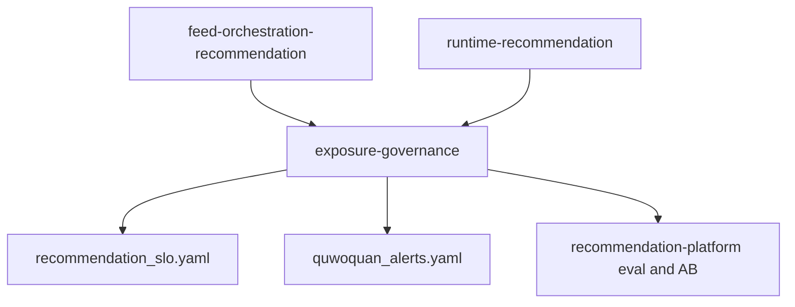

# 推荐系统商用成熟度规划

> 版本：2026-06-25
> 范围：非深排商用成熟度 P0 已进入实现；深排平台仍为 out of scope。
> 承接：`/Users/zhaoyuxi/.cursor/plans/推荐系统全链路自检与规划_90b5be26.plan.md` 与 `specs/changelog/CR-20260616-041-recommendation-baseline-readiness.yaml`。

## 1. 结论

H2 负反馈即时抑制已经完成，`dislike`、`hide_author`、`hide_content_type` 已贯通端侧行为上报、content-service 行为处理、HotPath 状态与 Engine 未来窗口过滤。它解决了“用户明确说不要之后下一批仍继续推荐”的基础闭环，但还不足以达到商用成熟推荐系统的标准。

新一轮商用成熟度门槛不把深度排序模型平台轨作为前置。当前阶段应以成熟的非深度推荐工程能力达成商用可用：动态曝光治理、协同召回、排序校准、时间衰减、离线 replay 评估、在线 AB、KPI/SLO 观测、运营干预与冷启动质量分。

2026-06-24 P0 实施基线：不做 MMoE/PLE/ESMM、双塔 ANN、IPS/Thompson，也不把 `/v1/score` 同步塞进 feed 读路径。本轮落地质量分投影消费、物化协同召回读取、旅行垂类路由、精品流式路由、候选级交集融合和 `primaryText` 唯一解释显示。全局 featured 精品池需 product-ops 写入、审计、过期和回滚完成后再启用。

2026-06-24 P0+ 下阶段开发已切入“推荐观测与反馈归因闭环”：feed 下发与行为上报统一携带 `feedRequestId/channelId/vertical/recallPath/rankingVersion/reasonVersion/supplySource/intersectionSourceRef/intersectionClass` 等 bounded attribution 字段，并新增 served/behavior 分桶指标。该切口继续排除深排平台，目标是让运营、测试和算法评估能按首页、旅行、精品、UGC、数据工程、召回路径和交集类别切分效果。

2026-06-25 P1 已进入“商用归因看板”实现：新增 `recommendation-observability-dashboard` L3 Story 与 Grafana dashboard 源文件，将 P0+ 真实 emitter 指标固定为首页/旅行/精品/UGC/数据工程/recall_path/intersectionClass/reasonVersion 的复盘入口。该阶段仍不把 objective_only 指标包装成已观测能力，不包含离线 replay、在线 AB 平台、真实流量训练晋升或 product-ops 精品池入口。

2026-06-25 P1a 已进入“商用归因告警”实现：新增 `recommendation-commercial-alerting` L3 Story 与 Prometheus 告警规则，覆盖 unknown attribution、按供给来源的负反馈异常、按召回路径的 CTR 异常、旅行/精品消费断崖和 UGC/数据工程供给 share 失衡。该阶段仍只消费 P0+ 真实 emitter，不把离线 replay、AB 显著性或深排平台纳入本轮。

2026-06-25 P1b/P1c/P1d 已进入“非深排评估与精品运营前置”实现：离线 replay report 已能消费 request/candidate/served/impression/click/dwell/negative/hide/takedown 与 bounded attribution 字段，输出 Recall@K、NDCG@K、MAP、coverage、diversity、collaborative_recall_lift、fact/affinity 解释点击差异、晋级与回滚建议；AB report 已固化最小样本、SRM、显著性、置信区间、effect size、保护指标和分桶晋级结论；product-ops 已补全全局精品池写入、质量准入、审计、过期、回滚和下架剔除入口。`PremiumPoolSource` 仍必须等待 content-service 投影读取与 Gamma/UAT 证据后再启用。

## 2. 已完成任务自检

### 已完成并作为后续基础

- `phase1-negative-feedback`：强负反馈即时抑制已落地，强负反馈只影响未来窗口，不回写用户已看窗口。
- `phase0-baseline-readiness`：推荐编排与运行时的基线规格已回填，`recommendation_slo.yaml` 已作为推荐 SLO 真相源建立。
- `runtime-recommendation` 基线：HotPath、SessionCache、Engine、Rule/CascadeScorer、MMR/UCB1 等归属清晰，深度模型平台轨已排除在当前商用门槛之外。
- `phase-p0plus-attribution-observability`：P0+ 已完成 feed item 推荐归因下发、App 行为回传、content-service raw event 持久化、learning context 与 Prometheus 分桶指标；同时修正 App `trackClick` 误报 `interaction` 的七态契约漂移，点击重新作为独立 `click` 状态进入 CTR 分子。

### 从长期项提升为商用成熟度必备

- `phase1-exposure-p0p1` 与 `phase3-exposure-p2p3`：动态曝光治理必须前移，不能只作为远期能力。它是“不要重复刷、优质内容能复活、曝光随反馈自适应”的商用体验底座。
- `phase2-collab-recall`：未上深度学习时，itemCF/swing i2i 与 u2i 是提升相关性的关键非深度召回。
- `phase2-calibration-time`：排序分校准和统计量时间衰减决定混排阈值、曝光预算和长期内容是否被过往均值钉死。
- `phase2-offline-eval`：没有 replay、NDCG、Recall@K、覆盖率和多样性指标，就无法证明“越用越准”。
- `phase2-business-kpi`、`phase2-exposure-obs`：CTR、停留、完成率、负反馈率、重复曝光率、覆盖率、曝光基尼必须可观测；P0+ 已让 served 与 behavior 可按 bounded attribution 分桶，但覆盖率、收益 lift 与线上看板仍需在下一阶段继续验证。
- `phase2-ops-intervention`：商用推荐必须支持人工加权、置顶、精品、热点、违规下架实时剔除。
- `phase1-quality-recscore` 与 `phase1-interest-onboarding`：冷启动必须依赖内容质量分和新用户兴趣先验，不能退化为纯时间流。

### 继续单独推进，不计入本轮商用门槛

- 深度排序模型平台轨（MMoE/PLE/ESMM、双塔 ANN、IPS）：长期上限，不阻塞当前商用成熟度。
- 交集差异化平台轨 R-IX01~R-IX07：保持独立 backlog 与工作包推进，不混入本轮曝光治理 L2。
- UGC 媒体上传、审核准入、发布事件驱动导入、端云交集字段漏斗对齐、流式 feed UI：仍属 Phase 1 断点闭环，按各自能力推进。

## 3. 八维商用成熟度门槛

| 维度 | 成熟判据 | SLO / 验收锚点 |
| --- | --- | --- |
| 召回成熟度 | 多路召回基础上补协同 i2i/u2i 与复活召回，不退化为纯时间流 | 内容覆盖率 `>= 0.30`；i2i/u2i replay 指标可比较 |
| 排序成熟度 | 规则/LightGBM + 校准 + 分群 + 统计量时间加权衰减 | calibration error 进入 observe_only；排序分阈值可解释 |
| 曝光成熟度 | served/impressed 双轨、跨会话疲劳、维度频控、near-dup、动态曝光预算与生命周期复活 | 重复曝光率 `< 0.01`；曝光基尼 `<= 0.65`；复活曝光率 observe_only |
| 飞轮成熟度 | H2 强负反馈即时已完成，补显式标签反馈、在线 AB 和真实流量训练晋升证据 | 负反馈率 `<= 0.08`；AB segmentation 固化 |
| 评估成熟度 | replay + NDCG/Recall@K/MAP/覆盖率/多样性 + 最小样本量口径 | 评估报告可复现，线上变更必须有离线或 AB 证据 |
| 观测成熟度 | KPI SLI、曝光健康、看板、告警、回滚层级齐备 | `recommendation_slo.yaml` 为真相源；告警引用同名指标 |
| 运营成熟度 | 人工加权、置顶、精品、热点和违规下架实时剔除有入口和审计 | 干预不绕过 eligibility、审核和单一真相源 |
| 冷启动成熟度 | 内容质量分投影 + 新用户兴趣 onboarding 先验 + 探索保底 | `recScore` 不再恒 0；无行为新用户首刷非空 |

## 4. 新特性树归属

`exposure-governance` 正式作为 `discovery-content` 下的 L2，与 `feed-orchestration-recommendation` 平级：

- `feed-orchestration-recommendation` 继续负责首页 feed 业务编排、端云行为回流、流式体验、交集理由消费。
- `exposure-governance` 拥有曝光记忆、疲劳窗口、动态曝光预算、生命周期复活、活跃度自适应和曝光健康指标。
- `runtime/runtime-recommendation` 只提供 HotPath、MMR、UCB、bandit 原语与存储接口，不拥有业务 IA 或页面体验。



## 5. L3 能力拆分

- L3-1 `served-dedup-write-behind`：下发即标记 served，served 与 impressed 双轨分离，召回下推 exclude。
- L3-2 `cross-session-fatigue-memory`：按用户跨会话滚动窗口与时间衰减疲劳惩罚。
- L3-3 `dimension-frequency-and-neardup`：作者、标签、话题软频控与 near-dup 去重。
- L3-4 `dynamic-exposure-budget`：分级流量池赛马和 bandit 动态曝光预算。
- L3-5 `content-lifecycle-resurfacing`：内容生命周期状态机与季节、事件、社交、常青复活召回。
- L3-6 `activity-adaptive-exposure`：按新用户、活跃用户、沉默回流用户调整窗口、探索比与复活比。
- L3-7 `exposure-observability-capacity`：重复曝光率、覆盖率、曝光基尼、复活率、各池 CTR 与容量策略。

## 6. Metadata-First 前置清单

这些项目只声明为后续实现前置，不在本轮落算法代码：

- Redis key：`rec:served:{<userId>}:{<yyyyMMdd>}`、`rec:impressed:{<userId>}:{<yyyyMMdd>}`、`rec:freq:{<userId>}:{dimension}:{<yyyyMMdd>}`、`rec:near_dup:{<userId>}:{<yyyyMMdd>}`、`rec:exposure_budget:{contentId}`。
- recpolicy：曝光窗口、疲劳半衰期、频控阈值、near-dup 阈值、bandit 先验、流量池晋级/淘汰阈值、复活配额、校准因子。
- 读模型：`rm_exposure_state` 承载内容生命周期状态、曝光预算、复活触发器和统计窗口。
- 行为：显式标签反馈、真实 impressed、served 事件计数必须与训练样本语义区分。

## 7. 验收与门禁

- T1：metadata、Redis key、recpolicy、acceptance 路径一致。
- T2：曝光窗口、疲劳衰减、频控、near-dup、动态预算、生命周期状态机可用确定性单测验证。
- T3：feed 翻页不重复、跨会话疲劳、复活召回、AB 分桶与曝光预算可在 gamma/local-gamma 证明。
- T4：用户连续刷不撞车，明确负反馈后未来窗口收敛，优质老内容在合适触发下复现。

本轮必须通过：

- `bash quwoquan_ops/gate/scaffold/verify_feature_tree_refactor.sh`
- `bash quwoquan_ops/gate/scaffold/verify_acceptance_standard.sh`

## 8. 历史规划段：2026-06-17 本轮不执行

> 本段为 2026-06-17 曝光治理规格冻结时的执行范围记录；2026-06-24 非深排 P0/P0+ 已按新的 `/dev` 计划进入实现，不再沿用“不实现代码”的限制。

- 不实现任何 Go、Dart、Python 算法或服务逻辑。
- 不改用户端 UI。
- 不引入深度模型平台轨。
- 不登记未经用户确认的新长期风险到 `docs/outstanding_risks_backlog.md`。

## 9. 反馈状态闭集与并发容量下一轮（2026-06-17 增补）

> 承接 `/plan-review`（埋点 / 状态 / 存储 / 模型 / 容量 / 实时性）与 `CR-20260617-043`。本节仍是规格冻结，不落算法实现。

### 9.1 七态闭集（只能派生不能互替）

`served`（云侧下发）、`visible`（端进入视窗）、`impressed`（端达可见面积+停留阈值）、`dwell`（端离开聚合）、`interaction`（点击/赞/评/藏/分享/关注/进圈）、`negative`（dislike/report/hide_*）、`training_sample`（云侧派生）。状态语义、派生关系、归因闭环与抗冲击设计见 [`exposure-governance/design.md`](../specs/feature-tree/discovery-content/exposure-governance/design.md)。

### 9.2 并发 / 容量 / 实时性门槛

- 过滤去全量化：禁止 Engine 对长窗口 `SMembers` 全量回读，改 `SISMEMBER` 批量点查或短 Bloom；`served`/`impressed` 按 `user+day` 分桶，`negative` 用户级。运行时边界由 `runtime-recommendation` 的 `ExposureMemory`/`ExposureFilter`/`FeedbackIngestor` 承载。
- 端侧抗冲击：统一 `BehaviorReporter`，分级上报（强信号即时、弱信号批量采样合并），`clientEventId` 幂等，`feedRequestId` 归因闭环，降低云侧上行 QPS。细则见 [`feed-orchestration-recommendation/feedback-ingestion-sampling`](../specs/feature-tree/discovery-content/feed-orchestration-recommendation/feedback-ingestion-sampling/spec.md)。
- 行为入口抗冲击：批量上限、幂等去重、按 user/IP 分级限流、`InflightLimiter` 背压、低价值降采样、缓冲 drop 可观测、同步写异步化。
- 模型容量：rec-model-service 多 worker、打分/特征缓存、跨请求合批、超时预算分层、guardrails 与 online_guardrail 口径统一。见 [`rec-model-service/inference-capacity-elasticity`](../specs/feature-tree/recommendation-platform/rec-model-service/inference-capacity-elasticity/spec.md)。

### 9.3 第一切片

状态分离 + 上报抗冲击 + served/跨会话疲劳存储；其 T1/T2/T3 未闭合前，不进入动态曝光预算、生命周期复活、协同召回实现。

## 10. P0/P0+ 到 P1d 完成复盘（2026-06-25）

### 10.1 已完成目标

- 数据供给：UGC 与数据工程内容进入同一推荐输入，`qualityScore/recScore/contentVertical/supplySource` 等字段投影到 feed 契约，读路径只消费投影结果。
- 召回：物化协同召回 i2i/u2i 接入读路径，召回路径归一为 `collab_i2i/collab_u2i`，保留 `disable_collaborative_recall_sources` 回滚。
- 场景：首页 discovery、旅行 `travel_photography`、精品 `premium_stream` 路由落地；精品池写入未闭合前不启用全局 featured pool。
- 排序：候选级质量分、垂类、供给来源、交集 fact/affinity 特征进入融合；fact 权重高于 affinity，affinity 必须带置信标签。
- 解释：首页 post 删除“推荐理由”标签与旧交集图标，只显示云侧 `IntersectionReason.primaryText`；精品详情标题改为“与你相关的线索”。
- 观测归因：P0+ 已让 feed 下发、行为上报、raw event、learning context 和 Prometheus 指标带上 bounded attribution，覆盖 `channel/vertical/supply_source/recall_path/ranking_version/reason_version/intersection_class`。
- 商用看板：P1 已新增 `quwoquan_ops/observability/monitoring/dashboards/l2_recommendation_commercial_maturity.json`，只消费 `recommendation_feed_served_by_attribution_total` 与 `recommendation_behavior_by_attribution_total`，覆盖 served、CTR、负反馈率、unknown attribution、旅行/精品消费、fact/affinity 交集解释、reason version 和供给来源占比。
- 商用告警：P1a 已新增 `recommendation-commercial-alerting`，只消费 P0+ 真实 emitter，覆盖 unknown attribution、供给来源负反馈异常、召回路径 CTR 异常、旅行/精品消费断崖、UGC/数据工程供给 share 失衡；同时将 `alerts_source` 对齐到实际 Prometheus group `quwoquan_rec_model`。
- 离线 replay：P1b 已补 `ReplayDataset/ReplayReport` 的商用归因字段、数据窗口、策略/排序/解释版本、无效样本原因、MAP@K、协同召回 lift、fact/affinity 解释 CTR、供给占比与晋级/回滚判断；报告指标通过 `recommendation_offline_eval_metric_value` 暴露给 SLO。
- AB 分析：P1c 已补 `BuildABExperimentReport`，按控制组/实验组输出样本量、SRM、显著性、置信区间、effect size、保护指标违规、晋级与回滚结论；低流量或保护指标异常不会被误判为可晋级。
- 精品运营前置：P1d 已补 product-ops 全局精品池入口，强制 global scope、质量准入、审计 ID、过期时间、回滚 token 与下架实时剔除，明确圈内精选不能替代全站精品。
- App 解释反馈：首页 `IntersectionReason.primaryText` 点击继续只展示具体交集表达，但行为回流从泛 `click` 修正为 `tag_click`，保证交集解释兴趣信号进入更高权重反馈通道。

### 10.2 剩余风险

- 精品池召回仍未完全闭合：product-ops 全局精品写入已补，但 content-service 对 `rm_premium_pool/rm_discovery_feed` 的投影读取、`PremiumPoolSource` 接入、回滚联动和 Gamma/UAT 证据未闭合前，仍不能宣称精品池召回成熟。
- 离线评估真实数据闭环未闭合：P1b 已有 runtime report 与 local_contract，但还缺数据仓库/对象存储中的固定 replay dataset 生成、周期调度、样本无效原因日报和 Gamma 真实窗口报告。
- AB 线上实验证据待补：P1c 已有 report template 与保护指标门禁，但还缺真实实验分桶、流量稳定性、低流量诊断桶标注和线上晋级/回滚记录。
- 数据工程质量分覆盖需真实统计：`quality_score_coverage >= 0.95` 必须用真实 eligible content 分母验证，而不是只靠单元测试。
- 真实流量鲁棒性待压测：行为上报 drop、HotPath buffer、协同物化表缺失、召回源回滚和下架剔除需要 gamma/local-gamma 长链路验证。
- 看板不等于商用成熟闭环：当前看板用于诊断和运营复盘，不能替代 replay、AB 显著性或 UAT 长旅程；低流量分桶只能辅助排查，不能直接作为策略晋升依据。
- P2 校准与时效仍未进入排序策略：本轮只让校准/时间衰减进入 report 与 SLO，尚未把分桶校准、时间衰减 CTR、完播/停留衰减和负反馈衰减写入正式非深排策略。

### 10.3 下一阶段开发任务

- P1d-2 精品池读路径闭环：把 product-ops 全局精品池投影到 content-service 推荐读模型，接入 `PremiumPoolSource` 并补回滚、过期、下架剔除和质量准入的 api_integration/user_acceptance。
- P1e Gamma/UAT 鲁棒性验证：补协同物化表缺失、质量分缺失、行为上报失败、HotPath 背压、召回源回滚、near-dup、频控、负反馈收敛、隐藏作者/类型和下架消失的长旅程。
- P1f UGC/数据工程供给商业闭环：补 UGC `TagRefs/EntityRefs/semanticMentions` 落库与推荐特征联动，补数据工程商业授权、实体闭合、标签闭合、媒体完整度、`semanticMentionCoverage` 与质量分投影覆盖真实统计。
- P1g 真实 replay/AB 运行证据：把 P1b/P1c runtime report 接入周期数据产物与实验记录，形成可追溯的策略晋级/回滚证据。
- P2 非深排校准与时效：在不引入深排平台的前提下推进分桶校准、时间衰减 CTR、完播/停留衰减、负反馈衰减、分群参数和策略回放。

## 11. continue-dev 下一轮目标规划（2026-06-25）

### 11.1 裁决结论

下一轮主目标选 P1d-2「精品池读路径闭环」，不先做 P2 校准、不先扩 replay/AB 平台、不上深排。原因是 product-ops 全局精品池写入已经具备，但用户实际看到的精品流仍未消费全局精品池；这会让运营可准入、可审计、可回滚的能力停在控制面，无法转化为首页/精品推荐体验。先打通 `product-ops -> content-service projection -> PremiumPoolSource -> Engine -> App premium_stream -> behavior attribution -> replay/AB/observability`，才能称为商用可用的运营精品召回。

### 11.2 目标与用户价值

- 用户价值：精品流不再只是通用池加 premium preset，而能稳定呈现经过全局质量准入、运营审核、不过期、未下架的高质量内容；解释仍使用 `IntersectionReason.primaryText`，不回到“推荐理由”泛标签。
- 运营价值：每条精品推荐可追溯 `contentId/scope/auditId/rollbackToken/qualityAdmission/qualityScore/supplySource/sourceTaskId/expiresAt/takedownEjected/recallPath/rankingVersion/reasonVersion`。
- 算法价值：`RecallPath=premium_pool` 进入 replay/AB/看板/告警分桶，能比较精品池对完成、停留、负反馈和覆盖率的贡献。
- 数据工程价值：数据工程生产内容进入精品池前必须通过授权、实体闭合、标签闭合、媒体完整度、`semanticMentionCoverage` 和质量分投影覆盖校验。

### 11.3 范围与 Out of Scope

In Scope：

- product-ops 全局精品池到 content-service 推荐读模型的投影契约，建议优先用 `rm_premium_pool`，必要时同步 `rm_discovery_feed` 的 `featuredScope/globalPremium` 字段。
- `PremiumPoolSource` 只读已物化投影，不在 feed 读路径同步调用 product-ops、质量模型、数据工程任务或 `/v1/score`。
- 召回路径固定 `premium_pool`，只在 `premium_stream/similar` 场景启用，并保留 `disable_premium_pool_source` 回滚。
- eligibility 必须同时满足：global scope、active、未过期、质量准入 approved、质量分达标、内容 published/approved/visible、未 takedown、未命中负反馈/频控/near-dup/作者屏蔽/类型屏蔽。
- App 侧不新增精品解释文案体系；继续只读 `primaryText`，行为归因带 `recallPath=premium_pool`。

Out of Scope：

- 深排平台、双塔 ANN、同步 scorer、IPS/Thompson。
- 新建第二套标签、实体、解释、精品运营源或 App 本地精品列表。
- 全量数据仓库 replay/AB 平台建设；下一轮只要求 `premium_pool` 分桶能进入既有 replay/AB report。

### 11.4 端云模型与契约设计

数据模型保持克制，只把 product-ops 已写入的全局精品条目投影为推荐只读模型：

```text
PremiumPoolEntry(product-ops)
  contentId, scope=global, status, qualityAdmission, qualityScore,
  supplySource, sourceTaskId, auditId, rollbackToken,
  featuredAt, expiresAt, takedownEjected, updatedAt
        |
        v
rm_premium_pool(content-service read model)
  contentId, eligibilityState, qualityScore, supplySource, sourceTaskId,
  auditId, rollbackToken, featuredAt, expiresAt, takedownEjected,
  projectionVersion, updatedAt
        |
        v
PremiumPoolSource(runtime CandidateSource)
  RecallPath=premium_pool, Surface=premium_stream, no synchronous RPC
```

关键边界：

- product-ops 拥有“运营准入事实”，content-service 拥有“推荐可读投影”和内容 eligibility，runtime recommendation 只拥有召回/排序原语。
- feed 读路径只读 content-service 本地投影与现有内容读模型，禁止跨服务同步查 product-ops，避免尾延迟和跨域可用性耦合。
- `premium_pool` 不是全局强插：它仍进入 Engine 的统一过滤、去重、曝光治理、排序融合和 MMR，多源候选同权受 `policy.yaml` 管控。
- 过期、回滚、下架必须实时或准实时从投影中剔除；投影失败应使 `PremiumPoolSource` fail closed，而不是退回圈内 featured 或普通 `Post.Featured`。

### 11.5 任务清单

- WP1 契约冻结：补 `premium-stream-recommendation` GWT2，定义 `rm_premium_pool` 字段、`premium_pool` recall path、回滚开关、质量准入和剔除规则。
- WP2 投影写入：product-ops 写入/回滚/下架事件或定时同步进入 content-service 推荐读模型；事件缺失时先用 content-service 内部 projection adapter，不新增第二控制面。
- WP3 召回源：新增 `PremiumPoolSource`，只读投影，按场景门控，候选装配带 `RecallPath=premium_pool/SupplySource/qualityScore/sourceTaskId`。
- WP4 统一过滤：证明负反馈、下架、过期、频控、near-dup、作者屏蔽、类型屏蔽对 `premium_pool` 与其他召回源同等生效。
- WP5 App/行为：精品流展示不变，只确保下发归因字段进入行为回流；无 `primaryText` 不占位。
- WP6 评估与观测：replay/AB/report/dashboard/alert 增加 `premium_pool` 分桶，不把低流量诊断桶当晋级依据。
- WP7 Gamma/UAT：跑精品沉浸流、运营回滚、下架消失、负反馈收敛、解释点击五条主旅程。

### 11.6 验收标准

- local_contract：投影 schema、过期/回滚/下架 fail closed、`PremiumPoolSource` 场景门控、`RecallPath=premium_pool`、无同步 RPC、统一过滤、App 无旧“推荐理由”。
- api_integration：product-ops 写入后 content-service 可读；回滚、过期、下架实时剔除；`/v1/content/feed?type=premium` 返回 `feedRequestId/rankingVersion/reasonVersion/recallPath=premium_pool` 分桶归因。
- user_acceptance：精品沉浸流能消费全局精品；用户负反馈后后续窗口收敛；运营下架后内容消失；解释展开仍是具体交集表达。
- 指标门：`premium_pool_active_projection_coverage >= 0.99`、`premium_pool_takedown_ejection_lag_p95 <= 60s`、`premium_pool_negative_feedback_rate <= 0.08`、`premium_pool_unknown_attribution_rate <= 0.01`。
- 必跑：推荐相关 Go tests、product-ops/content-service local_contract、App 精品/首页解释 widget、`make -C quwoquan_service verify-metadata`、feature-tree/acceptance gate。全量 `make gate` 只有在当前非推荐 data/object-homepage 红灯收口后才可作为最终全绿证据。

### 11.7 商用成熟度判断

P1d-2 完成后，精品“运营成熟度”和“召回成熟度”可达到商用 P1：有全局准入、可追溯来源、可回滚、可下架、可解释、可评估。但完整商用成熟仍依赖 P1e/P1f/P1g/P2：

- P1e：Gamma/UAT 长链路鲁棒性，覆盖物化缺失、HotPath 背压、near-dup、频控和负反馈收敛。
- P1f：UGC 与数据工程供给商业授权、语义落库、实体/标签闭合和质量分覆盖真实统计。
- P1g：真实 replay dataset 与线上 AB 运行证据。
- P2：非深排校准、时间衰减 CTR、完播/停留与负反馈衰减进入策略。

### 11.8 continue-dev 当前开发切片（2026-06-25）

本轮已进入 P1d-2 开发，先完成不过度设计的读路径基座：

- 契约：新增 `rm_premium_pool` projection metadata，字段覆盖 `contentId/scope/status/eligibilityState/ineligibleReasons/qualityAdmission/qualityScore/supplySource/sourceTaskId/auditId/rollbackToken/featuredAt/expiresAt/takedownEjected/projectionVersion/updatedAt`。
- 投影语义：新增 `BuildPremiumPoolProjectionFields`，对非 global、非 active、质量准入未 approved、质量分低于 0.75、过期或下架剔除统一 fail closed。
- 控制面事件：product-ops 全局精品池 upsert/rollback/takedown 发出 `PremiumPoolEntryUpserted`、`PremiumPoolEntryRolledBack`、`PremiumPoolEntryTakedownEjected`，payload 保留 `auditId/rollbackToken/supplySource/sourceTaskId/expiresAt/takedownEjected`。
- 投影消费：content-service 新增 `PremiumPoolProjector` 与 `PremiumPoolEventConsumer`，消费 `events.ops.*` 并投影到 `rm_premium_pool`；content-service 自身 `PostDeleted/PostTakedown` 也会把精品池条目标为 `takedown_ejected`，读路径不查 product-ops。
- 召回源：新增 `PremiumPoolSource`，只在 `premium_stream` 或 `FeedSimilar` 生效，候选统一打 `RecallPath=premium_pool`，读路径只读 content-service 本地 `rm_premium_pool + rm_discovery_feed`。
- 接线与回滚：content-service 默认接入 `PremiumPoolSource`，并支持 `QWQ_DISABLE_PREMIUM_POOL_SOURCE` / `DISABLE_PREMIUM_POOL_SOURCE` / `disable_premium_pool_source` 回滚；投影为空时自然空返回，不退回圈内精选或普通 featured。
- 端云归因：feed view 补齐 `sourceTaskId` 下发，和既有 App DTO/metadata 对齐，便于数据工程内容按 source task 追踪。

当前仍未完成，不能作为商用完成证据：

- 真实跨服务链路尚未闭合：还缺 product-ops API -> Redis `events.ops.*` -> content-service Mongo `rm_premium_pool` -> `/v1/content/feed` 的 api_integration。
- `PremiumPoolSource` 在真实 Mongo 数据上的 product-ops 写入、回滚、过期、下架剔除和内容下架剔除 api_integration 尚未补。
- App 精品沉浸流对 `premium_pool` 分桶归因、负反馈收敛和下架消失 user_acceptance 尚未跑通。
- replay/AB/dashboard/alert 虽已有分桶规划，但还缺真实 `premium_pool` 样本窗口与晋级/回滚记录。
