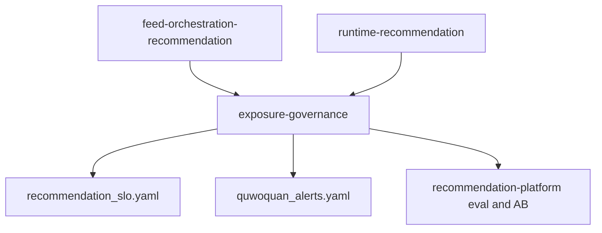

# 推荐系统商用成熟度规划

> 版本：2026-06-16  
> 范围：纯规划交付，不实现算法、服务或端侧代码。  
> 承接：`/Users/zhaoyuxi/.cursor/plans/推荐系统全链路自检与规划_90b5be26.plan.md` 与 `specs/changelog/CR-20260616-041-recommendation-baseline-readiness.yaml`。

## 1. 结论

H2 负反馈即时抑制已经完成，`dislike`、`hide_author`、`hide_content_type` 已贯通端侧行为上报、content-service 行为处理、HotPath 状态与 Engine 未来窗口过滤。它解决了“用户明确说不要之后下一批仍继续推荐”的基础闭环，但还不足以达到商用成熟推荐系统的标准。

新一轮商用成熟度门槛不把深度排序模型平台轨作为前置。当前阶段应以成熟的非深度推荐工程能力达成商用可用：动态曝光治理、协同召回、排序校准、时间衰减、离线 replay 评估、在线 AB、KPI/SLO 观测、运营干预与冷启动质量分。

## 2. 已完成任务自检

### 已完成并作为后续基础

- `phase1-negative-feedback`：强负反馈即时抑制已落地，强负反馈只影响未来窗口，不回写用户已看窗口。
- `phase0-baseline-readiness`：推荐编排与运行时的基线规格已回填，`recommendation_slo.yaml` 已作为推荐 SLO 真相源建立。
- `runtime-recommendation` 基线：HotPath、SessionCache、Engine、Rule/CascadeScorer、MMR/UCB1 等归属清晰，深度模型平台轨已排除在当前商用门槛之外。

### 从长期项提升为商用成熟度必备

- `phase1-exposure-p0p1` 与 `phase3-exposure-p2p3`：动态曝光治理必须前移，不能只作为远期能力。它是“不要重复刷、优质内容能复活、曝光随反馈自适应”的商用体验底座。
- `phase2-collab-recall`：未上深度学习时，itemCF/swing i2i 与 u2i 是提升相关性的关键非深度召回。
- `phase2-calibration-time`：排序分校准和统计量时间衰减决定混排阈值、曝光预算和长期内容是否被历史均值钉死。
- `phase2-offline-eval`：没有 replay、NDCG、Recall@K、覆盖率和多样性指标，就无法证明“越用越准”。
- `phase2-business-kpi`、`phase2-exposure-obs`：CTR、停留、完成率、负反馈率、重复曝光率、覆盖率、曝光基尼必须可观测。
- `phase2-ops-intervention`：商用推荐必须支持人工加权、置顶、精品、热点、违规下架实时剔除。
- `phase1-quality-recscore` 与 `phase1-interest-onboarding`：冷启动必须依赖内容质量分和新用户兴趣先验，不能退化为纯时间流。

### 继续单独推进，不计入本轮商用门槛

- 深度排序模型平台轨（MMoE/PLE/ESMM、双塔 ANN、IPS）：长期上限，不阻塞当前商用成熟度。
- 交集差异化平台轨 R-IX01~R-IX07：保持独立 backlog 与工作包推进，不混入本轮曝光治理 L2。
- UGC 媒体上传、审核准入、发布事件驱动导入、端云交集字段漏斗对齐、流式 feed UI：仍属 Phase 1 断点闭环，按各自能力推进。

## 3. 八维商用成熟度门槛

| 维度 | 成熟判据 | SLO / 验收锚点 |
| --- | --- | --- |
| 召回成熟度 | 多路召回基础上补协同 i2i/u2i 与复活召回，不退化为纯时间流 | 内容覆盖率 `>= 0.30`；i2i/u2i replay 指标可比较 |
| 排序成熟度 | 规则/LightGBM + 校准 + 分群 + 统计量时间加权衰减 | calibration error 进入 observe_only；排序分阈值可解释 |
| 曝光成熟度 | served/impressed 双轨、跨会话疲劳、维度频控、near-dup、动态曝光预算与生命周期复活 | 重复曝光率 `< 0.01`；曝光基尼 `<= 0.65`；复活曝光率 observe_only |
| 飞轮成熟度 | H2 强负反馈即时已完成，补显式标签反馈、在线 AB 和真实流量训练晋升证据 | 负反馈率 `<= 0.08`；AB segmentation 固化 |
| 评估成熟度 | replay + NDCG/Recall@K/MAP/覆盖率/多样性 + 最小样本量口径 | 评估报告可复现，线上变更必须有离线或 AB 证据 |
| 观测成熟度 | KPI SLI、曝光健康、看板、告警、回滚层级齐备 | `recommendation_slo.yaml` 为真相源；告警引用同名指标 |
| 运营成熟度 | 人工加权、置顶、精品、热点和违规下架实时剔除有入口和审计 | 干预不绕过 eligibility、审核和单一真相源 |
| 冷启动成熟度 | 内容质量分投影 + 新用户兴趣 onboarding 先验 + 探索保底 | `recScore` 不再恒 0；无行为新用户首刷非空 |

## 4. 新特性树归属

`exposure-governance` 正式作为 `discovery-content` 下的 L2，与 `feed-orchestration-recommendation` 平级：

- `feed-orchestration-recommendation` 继续负责首页 feed 业务编排、端云行为回流、流式体验、交集理由消费。
- `exposure-governance` 拥有曝光记忆、疲劳窗口、动态曝光预算、生命周期复活、活跃度自适应和曝光健康指标。
- `runtime/runtime-recommendation` 只提供 HotPath、MMR、UCB、bandit 原语与存储接口，不拥有业务 IA 或页面体验。

## 5. L3 能力拆分

- L3-1 `served-dedup-write-behind`：下发即标记 served，served 与 impressed 双轨分离，召回下推 exclude。
- L3-2 `cross-session-fatigue-memory`：按用户跨会话滚动窗口与时间衰减疲劳惩罚。
- L3-3 `dimension-frequency-and-neardup`：作者、标签、话题软频控与 near-dup 去重。
- L3-4 `dynamic-exposure-budget`：分级流量池赛马和 bandit 动态曝光预算。
- L3-5 `content-lifecycle-resurfacing`：内容生命周期状态机与季节、事件、社交、常青复活召回。
- L3-6 `activity-adaptive-exposure`：按新用户、活跃用户、沉默回流用户调整窗口、探索比与复活比。
- L3-7 `exposure-observability-capacity`：重复曝光率、覆盖率、曝光基尼、复活率、各池 CTR 与容量策略。

## 6. Metadata-First 前置清单

这些项目只声明为后续实现前置，不在本轮落算法代码：

- Redis key：`rec:served:{<userId>}:{<yyyyMMdd>}`、`rec:impressed:{<userId>}:{<yyyyMMdd>}`、`rec:freq:{<userId>}:{dimension}:{<yyyyMMdd>}`、`rec:near_dup:{<userId>}:{<yyyyMMdd>}`、`rec:exposure_budget:{contentId}`。
- recpolicy：曝光窗口、疲劳半衰期、频控阈值、near-dup 阈值、bandit 先验、流量池晋级/淘汰阈值、复活配额、校准因子。
- 读模型：`rm_exposure_state` 承载内容生命周期状态、曝光预算、复活触发器和统计窗口。
- 行为：显式标签反馈、真实 impressed、served 事件计数必须与训练样本语义区分。

## 7. 验收与门禁

- T1：metadata、Redis key、recpolicy、acceptance 路径一致。
- T2：曝光窗口、疲劳衰减、频控、near-dup、动态预算、生命周期状态机可用确定性单测验证。
- T3：feed 翻页不重复、跨会话疲劳、复活召回、AB 分桶与曝光预算可在 gamma/local-gamma 证明。
- T4：用户连续刷不撞车，明确负反馈后未来窗口收敛，优质老内容在合适触发下复现。

本轮必须通过：

- `bash agent_ops/scaffold/verify_feature_tree_refactor.sh`
- `bash agent_ops/scaffold/verify_acceptance_standard.sh`

## 8. 本轮不执行

- 不实现任何 Go、Dart、Python 算法或服务逻辑。
- 不改用户端 UI。
- 不引入深度模型平台轨。
- 不登记未经用户确认的新长期风险到 `docs/outstanding_risks_backlog.md`。

## 9. 反馈状态闭集与并发容量下一轮（2026-06-17 增补）

> 承接 `/plan-review`（埋点 / 状态 / 存储 / 模型 / 容量 / 实时性）与 `CR-20260617-043`。本节仍是规格冻结，不落算法实现。

### 9.1 七态闭集（只能派生不能互替）

`served`（云侧下发）、`visible`（端进入视窗）、`impressed`（端达可见面积+停留阈值）、`dwell`（端离开聚合）、`interaction`（点击/赞/评/藏/分享/关注/进圈）、`negative`（dislike/report/hide_*）、`training_sample`（云侧派生）。状态语义、派生关系、归因闭环与抗冲击设计见 [`exposure-governance/design.md`](../specs/feature-tree/discovery-content/exposure-governance/design.md)。

### 9.2 并发 / 容量 / 实时性门槛

- 过滤去全量化：禁止 Engine 对长窗口 `SMembers` 全量回读，改 `SISMEMBER` 批量点查或短 Bloom；`served`/`impressed` 按 `user+day` 分桶，`negative` 用户级。运行时边界由 `runtime-recommendation` 的 `ExposureMemory`/`ExposureFilter`/`FeedbackIngestor` 承载。
- 端侧抗冲击：统一 `BehaviorReporter`，分级上报（强信号即时、弱信号批量采样合并），`clientEventId` 幂等，`feedRequestId` 归因闭环，降低云侧上行 QPS。细则见 [`feed-orchestration-recommendation/feedback-ingestion-sampling`](../specs/feature-tree/discovery-content/feed-orchestration-recommendation/feedback-ingestion-sampling/spec.md)。
- 行为入口抗冲击：批量上限、幂等去重、按 user/IP 分级限流、`InflightLimiter` 背压、低价值降采样、缓冲 drop 可观测、同步写异步化。
- 模型容量：rec-model-service 多 worker、打分/特征缓存、跨请求合批、超时预算分层、guardrails 与 online_guardrail 口径统一。见 [`rec-model-service/inference-capacity-elasticity`](../specs/feature-tree/recommendation-platform/rec-model-service/inference-capacity-elasticity/spec.md)。

### 9.3 第一切片

状态分离 + 上报抗冲击 + served/跨会话疲劳存储；其 T1/T2/T3 未闭合前，不进入动态曝光预算、生命周期复活、协同召回实现。
