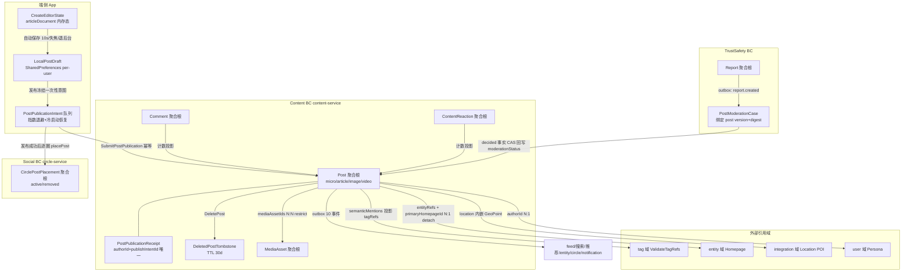
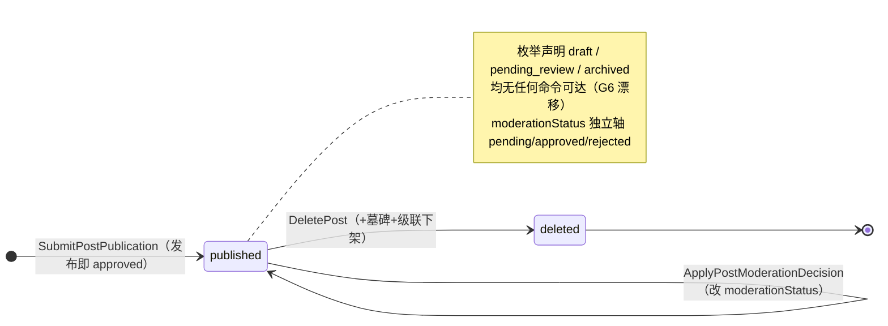

# 发布文字（写文字）商用成熟度专项排查与规划

> 状态：M4「内容创作与发布」文字子集专项审计与商用规划（不是"已商用"证明）
> 证据截点：2026-07-20
> 归属：[`docs/functional_module_commercial_maturity_matrix.md`](functional_module_commercial_maturity_matrix.md) §13 M4 的文字（micro/article）子集专项会话产物
> 风险唯一真相源：[`docs/outstanding_risks_backlog.md`](outstanding_risks_backlog.md)（本文的"待登记项"须经用户确认后才写入 backlog）

## 0. Spec Entry 与结论口径

- **AppRoot Journey/Scenario**：当前 registry（`specs/feature-tree/journey_scenario_registry.yaml`）**无创作发布专属 Journey**——本身即为本轮 GATE_BLOCK 发现之一（G3）。消费侧协同 Journey 为 `content-discovery-to-consumption`。
- **L1_domain_service**：`discovery-content`（页面）+ content 域 canonical metadata（`quwoquan_service/contracts/metadata/content/**`）。
- **L2_business_capability**：`content-type-framework`（写文字入口与编辑器 IA）、`publish-comment-reaction`（发布主链）。
- **L3_story**：`creation-mode-and-surface-ia-unification`（completed，但只覆盖入口+草稿）、`markdown-article-kernel`（pending 空壳）、`post-create-update`（scope 只认领图片/视频）、`creation-tagging-ia`（全 pending）。
- **验收意图**：UAT（写文字端到端旅程）/ SIT（发布→分发→消费组合）/ GWT（编辑器、分型、发布可靠性）/ contract（payload、错误码、事件）。
- **测试证据**：`local_contract`（现状最厚）/ `api_integration`（service 侧较全、App 侧仅 photo 一条薄壳）/ `user_acceptance`（文字发布 roundtrip 零覆盖）。

结论分级沿用矩阵口径：**已证实**（有可定位证据）/ **待专项核验**（静态证据不足）/ **GATE_BLOCK**（商用阻断，须修复或经用户确认降级）。

### 0.1 「发布文字」服务的用户目标（审查主线第 1 问）

用户目标不是"发一条 post"，而是：**想先写几句，再决定要不要加标题、加图、写成长文的用户，能顺手开始表达、可靠地发出去、并看到自己的表达去了哪里、被谁看到、产生了什么回响**。规格真相源 `creation-mode-and-surface-ia-unification/spec.md` 已把该目标冻结为"一个入口、两个编辑器、一套渐进规则"。

本轮排查判定：**表达与可靠提交已成立；"发出去之后"的一半旅程（结果回流、回响、运营观测）尚未成立**——这是商用与 demo 的分界线。

## 1. 业务对象全景表（交付物 1）

| 业务对象 | 用户价值 | 上下游对象 | 聚合/上下文 | 生命周期 | 页面承载 | API/服务 | 存储/事件 | 当前问题 |
|---|---|---|---|---|---|---|---|---|
| **Post**（contentType=micro/article） | 用户表达的最终事实；他人消费的对象 | 上游 LocalPostDraft/PublishIntent/MediaAsset；下游 Comment/Reaction/Feed/搜索/推荐 | Content BC 聚合根（`content/post`） | 发布即 `published+approved` → `deleted`（墓碑）；枚举声明 5 态但仅 2 态可达 | 创作页（写）、feed/作品浏览器/详情（读）、个人主页作品列表 | `SubmitPostPublication`/`GetPost`/`GetFeed`/`DeletePost`/`UpdatePostSettings`/`PromotePostToWork` | Mongo `posts`（17 索引，text/vector/2dsphere）；10 个 outbox 事件（PostPublished 等） | G6 状态枚举漂移；G1 发布后无回流页承载；发布后正文不可编辑（契约 `post_immutable_after_publish`，但 `PostUpdated` 事件描述误导） |
| **LocalPostDraft**（端侧） | 表达不丢失：自动保存、杀进程恢复、跨会话续写 | 下游 PostPublicationIntent | 端侧对象（SharedPreferences `create_drafts_v2:<user>`，per-user scope） | dirty→10s 节流保存→saved/failed；发布成功清稿；显式放弃删除 | 创作页顶栏保存态、`/create/drafts` 本地草稿页 | 无云端 API（产品口径"仅保存在本机"） | SharedPreferences；损坏 payload 侧位保留（`create_drafts_corrupt:*`） | 仅本地无云同步（口径一致，可接受）；草稿卡片类型齐全 |
| **PostPublicationIntent / Receipt** | 一次点击可靠发布：断网/杀进程/重复点击都只产生一个 Post | 上游 LocalPostDraft；下游 Post | 端侧队列（`post_publication_intents_v1:{userId}`）+ 云侧 receipt（`post_command_receipts`，authorId+publishIntentId 唯一索引） | 冻结→提交→retry_wait（指数退避 2-60s）→ accepted/blocked；冷启动恢复补发 | 无独立页面（合理）；反馈仅 Toast | `SubmitPostPublication`（Idempotency-Key=publishIntentId） | Mongo receipt TTL；同事务写 Post+receipt+outbox | `unauthorized` 被判可重试致队列空转（N2）；blocked 态无用户可见承载（N3） |
| **ArticleMarkdown + AssetManifest + RenderProfile** | 长文的唯一持久化真相源（QWQ Rich Markdown v1）；模板/字体渲染意图 | 归属 Post 字段组；下游 article reader/pageflip | Post 聚合内值对象组 | 随 Post 发布固化；digest（sha256）用于幂等与审核绑定 | 文字编辑器（写）、排版页（渲染意图）、文章阅读器（读） | `SubmitPostPublication` 携带；`GetPost` 水合 | Mongo posts 字段 + text 索引 articleMarkdown | `markdown-article-kernel` acceptance 空壳（G3）；编辑器内存态仍由 `ArticleDocumentData` 分页（迁移未竟，有 `verify-markdown-article-no-article-document` 门禁挡双轨回潮） |
| **semanticMentions → tagRefs/entityRefs** | 正文中的实体/标签语义标注 → 内容进入正确的发现/交集通道 | 上游编辑器 mention picker；下游 tag/entity 域校验、推荐/搜索/交集 | Post 聚合内写入事实 + 只读投影（仅 status=published 且 targetRef 合法项派生） | mention: published/pending_review/rejected/offline | 编辑器 entity mention picker（**tag 无创作入口**） | 发布时投影；tag 域 `ValidateTagRefs` 批量校验 | posts 字段 + text 索引 | G8 tag 创作断链：用户无法产生 tag mention，交集证据源缺失（`creation-tagging-ia` 全 pending） |
| **MediaAsset / MediaUploadSession** | 文字帖插图、文章封面/插图的可靠上传与绑定 | 上游本地图片；下游 Post.mediaAssetIds | Media BC 独立聚合根 | init→PUT 直传（sha256 内容寻址）→complete→bind；失败 abort | 创作页插图入口（无独立管理页，合理） | media upload 三段式 API | 对象存储+Mongo；发布时校验 ready+所有权 | 上传是链路中唯一有 operation_result 遥测的操作（良好）；孤儿清理未验证 |
| **CirclePostPlacement** | 文字帖分发到圈子，触达同好 | 上游 Post+Circle；下游圈子 feed | **social BC 独立聚合**（Post 本体不存 placement） | active→removed；Pin/Feature | 发布设置"发布到圈子"多选页 | `PlacePostInCircle`（发布成功后端侧逐圈提交，失败留队列 1 分钟重试） | 独立集合+事件 | 发圈前必须 public（契约 `public_required_for_circle_distribution`）；逐圈提交部分失败的用户可见反馈缺失（N3） |
| **Location（外部引用值）** | 给表达附着地点上下文，进入地点发现通道 | integration 域 POI 查询；写入 Post.location(GeoPoint)+locationName | Post 内嵌 owned value（非独立对象，正确） | 选择→写入→随 Post 固化 | `publish_location_selector_page`（附近+搜索） | integration-service location query | posts.location 2dsphere 索引 | R-CR04 分层债：`CreateLocationService`/`CreateLocationOption` 仍在 `lib/ui`（应迁 `lib/cloud/services/integration`） |
| **PostModerationCase** | 内容安全治理事实：举报→审核→决定 | 上游 Report outbox；下游 Post.moderationStatus | TrustSafety BC 聚合根 | pending→approved/rejected/superseded（fields.yaml 状态机含 `reviewed` 但枚举闭集无——G6b） | **无运营 UI**（Portal 只有举报队列 GovernancePage） | 5 个 internal API（Open/Review/Decide/Supersede/GetPostPublicationEligibility） | Mongo + outbox（decided 事实驱动 `ApplyPostModerationDecision`，version+digest 绑定防旧决定覆盖新 revision） | G5 无机审前置（发布即 approved）；Portal 缺审核工作台 |
| **DeletedPostTombstone** | 删除后引用方拿到 410 语义而非悬挂 | 上游 DeletePost；下游通知/分享/深链回源 | Content BC append_only_fact | TTL 30 天 | 无页面（合理） | 读路径 410 | Mongo TTL 集合 | 已证实（跨重启 api_integration 有测试） |
| **BehaviorEvent（创作侧）** | 发布漏斗与成功率的运营事实 | 上游创作页 surface 事件；下游推荐/运营分析 | content 域 `behaviors.yaml` wire 契约 | — | — | `/content/behaviors` ReportBehaviors | Mongo/Redis/outbox→推荐 HotPath | **G2 链路实质断裂**：创作事件缺 `clientEventId/action/occurredAt` 且未在 behaviors.yaml 登记，云侧 400 拒绝、端侧静默吞，零采集 |

**对象清点结论（审查主线第 2、3 问）**：核心对象定义齐全、聚合边界基本正确（草稿/意图/发布分离、placement 独立聚合、location 内嵌值对象、审核 case 绑定 revision 都是好设计）；问题集中在**状态机声明与实现漂移（G6）**、**投影对象（tag）无创作入口（G8）**、**运营事实对象（创作 behavior）契约缺位（G2）**。不存在"页面临时拼装对象反向成为真相源"的问题——payload 唯一出口 `buildPostPublicationPayloadMap` 已对齐 metadata（但以弱类型 Map 为中介，N6）。

## 2. 对象关系与聚合边界（交付物 2）

**关系审查结论（审查主线 2.2）**：

- 无错误归属、无重复对象、无一概念多模型。`metadata/circle/` 目录只剩 openapi.yaml 而真实对象在 `metadata/social/` 属目录命名二义（N9），不是双真相源。
- 生命周期同步已验证的：删除→墓碑→级联下架（有 api_integration）；审核 rejected→读路径过滤；stale 审核决定不覆盖新 revision。
- 生命周期同步**未验证**的：圈子撤回/解散后 placement 与 post 可见性同步（M8 专项范围，本文不重复）；MediaAsset 孤儿清理。
- 读写模型语义一致性：`tagRefs/entityRefs` 只读投影 + `semanticMentions` 写入事实的分离是正确的 CQRS 表达，且服务端拒绝顶层 refs 与投影不一致的提交（R-CS06 已闭环）。

## 3. 核心对象生命周期（交付物 3）

### 3.1 Post 状态机：契约声明 vs 实际可达

逐状态核对（审查主线 2.3）：

| 状态 | 触发者 | 页面承载 | 可执行操作 | 用户反馈 | 领域事件 | 指标 | 测试 | 缺口 |
|---|---|---|---|---|---|---|---|---|
| （端侧草稿） | 作者 | 创作页+草稿页 | 编辑/恢复/放弃 | 顶栏保存态三值 | 无（本地） | 无（保存成功率 SLO≥99.9% 未观测） | local_contract 厚 | 保存成功率无采集 |
| （端侧意图 pending/retry_wait） | 系统 | **无承载**，仅 Toast"已保存将自动发布" | 无法查看/取消排队中的发布 | Toast 一次性 | 无 | 无 | intent queue local_contract + recovery UAT | N3：排队/失败中的发布任务不可见不可管理 |
| published | 作者 | feed/详情/个人主页（读侧） | 删除/改设置/晋升作品 | **发布成功仅 Toast，无去向**（G1） | PostPublished→6 类消费方 | HTTP RED + SLO 800ms/99.9% | service api_integration 全 | G1 回流断点；发布延迟 P95 告警缺失 |
| moderationStatus=rejected | 审核员（举报驱动） | **作者侧无任何承载**——作者不知道内容被下架、不知道原因、无申诉入口 | 无 | 无通知 | case decided | case API 有 RED+告警 | moderation local_contract | G5b：作者侧审核结果闭环缺失 |
| deleted | 作者 | 删除确认（读侧页面） | — | 列表移除 | PostDeleted+Tombstoned | RED | 删除+墓碑 api_integration | 已证实 |
| draft/pending_review/archived（契约声明） | **无人可触发** | 无 | 无 | 无 | 无 | 无 | 无 | G6：死枚举+`status=="draft"` 死分支 |

### 3.2 端侧草稿→意图→发布链（已证实的可靠性合同，CR-114）

`LocalPostDraft`（自动保存）→ 首次点发布冻结不可变 `PostPublicationIntent`（payload digest+媒体顺序+Idempotency-Key）→ `SubmitPostPublication` → 服务端原子创建 Post+Receipt+outbox → 重复请求返回首个 receipt → 端侧删草稿+逐圈 placement。断网/杀进程/重启由队列+冷启动调度恢复。**该合同的 local_contract 与 service api_integration 证据扎实；缺的是 gamma_local 运行制品（GWT3 partial）。**

### 3.3 micro/article 分型规则（当前为静默系统行为）

`shouldPublishAsArticleForPayload`：标题非空 或 有图 或 正文≥140 字 或 ≥2 自然段 → `contentType=article`（携带 articleMarkdown 三件套）；否则 `micro`。规格（F8）允许自动映射，但同时规定"轻内容/长文的自动判断属于系统内部兼容逻辑"——**问题在于两种结果的消费形态差异巨大**（article 进作品浏览器书页渲染、micro 以文字卡展示），用户无感知无控制（G7）。`publish_identity_confirmation_widget` local_contract 证明了分型行为本身正确。

## 4. 对象—功能—页面双向矩阵（交付物 4）

### 4.1 从对象查页面

| 对象/状态 | 在哪里看到 | 创建/编辑/删除 | 关联操作 | 异常/空态 | 结论 |
|---|---|---|---|---|---|
| Post(micro) 已发布 | feed 文字卡、个人主页 | 创作页写；不可编辑正文；详情可删除 | 评论/点赞/分享（读侧） | 私密内容不出现在发现流（已证实） | 读侧承载完整；**写→读衔接断（G1）** |
| Post(article) 已发布 | feed 卡、作品浏览器书页 | 同上 | 同上 | — | 同上 |
| LocalPostDraft | 草稿页/顶栏状态 | 自动保存/恢复/放弃 | — | 缺素材占位、损坏侧位 | **完整（P3 级承载）** |
| PublicationIntent blocked/retry | **无处可看**（仅一次性 Toast） | 无法取消/重试查看 | — | — | **GATE_BLOCK 候选（N3）**：操作完成后没有结果页/回流 |
| moderationStatus=rejected | **作者无处可看** | 无申诉 | — | — | **G5b 缺口** |
| tag mention | 读侧可点击 | **创作端无入口** | — | — | **G8 断链** |
| entity mention | 编辑器 picker + 读侧可点击 | 完整 | 主页绑定 | — | 已证实 |
| 圈子 placement | 圈子 feed | 发布设置多选 | 部分失败重试 | 无圈子空态文案有 | 部分失败反馈缺失 |
| 位置 | 详情/发现地点通道 | 位置选择页（附近+搜索+权限态） | 不显示位置回退 | 结构化错误已证实（R-CR01 已闭环） | 完整（分层债 R-CR04 除外） |

### 4.2 从页面反查对象

| 页面/路由 | 用户目标 | 主对象 | 字段来自正式元数据 | 操作对应正式 command | 临时字段/拼装 | 上下游连接 | 完整性结论 |
|---|---|---|---|---|---|---|---|
| 加号动作面板 `/create-entry` | 开始表达 | EditorStartAction | ✓（路由 codegen） | — | 无 | 游客可见面板、具体动作触发登录门（无死循环合规） | 完整 |
| 创作页 `/create?type=write` | 写、补图、升级长文 | CreateEditorState→Post | ✓ | SubmitPostPublication | payload 弱类型 Map 中介（N6） | 上游入口完整；**下游发布后断（G1）** | 功能可用、旅程断尾 |
| 排版页 `article_typography_page` | 长文纸张/字体确认 | ArticleRenderProfile | ✓ | —（本地确认） | 内存态仍 ArticleDocumentData 分页（迁移未竟） | 夹在发布流中 | 可用、语义待迁移收口 |
| 发布确认 sheet | 冻结发布设置 | PublishSettings | ✓ | — | **4 处硬编码中文**（N1，违反 R27） | → 发布 | 可用、待修 |
| 位置选择页 | 附着地点 | Location 引用 | ✓（errors.yaml 单轨） | integration query | R-CR04 模型在 ui 层 | 完整 | 可用、分层债 |
| 圈子选择页 | 分发到圈子 | CirclePostPlacement | ✓ | PlacePostInCircle | 推荐圈子位 `const []` 空缺（N7） | 完整 | 可用 |
| 本地草稿页 `/create/drafts` | 找回表达 | LocalPostDraft | 端侧对象 | — | 无 | 完整 | 完整 |
| **（缺失）发布结果/排队管理承载** | 看到表达去向 | Intent/Post | — | — | — | — | **P0 缺失（G1+N3）** |
| **（缺失）审核结果作者侧承载** | 知道内容为何不可见 | ModerationCase 结果 | — | — | — | — | **P0 缺失（G5b，依赖通知链 R-OBJ-003）** |

## 5. 页面成熟度评级与决策（交付物 5+6）

> 评级口径：P0 缺失/错位、P1 空壳、P2 基本可用不完整、P3 功能较完整体验不足、P4 业界成熟商用、P5 交集差异化样板。视觉核验状态在 §5.1 说明。

| 页面/组件 | 成熟度 | 决策 | 判断依据与需补齐项 |
|---|---:|---|---|
| 加号动作面板（create_action_sheet） | P3（视觉已核验达 P4 方向） | 保留精修 | 三动作+社交动作 IA 已冻结、双色完整（§5.1 截图）；差真机回归即可提级 |
| 创作页-文字编辑器（create_page + article_editor 族） | P2（视觉已核验） | 适度重构 | 功能厚（node 富文本/undo/环绕图/mention）且视觉简洁，但：发布后旅程断尾（G1）、micro/article 分型不可见且顶栏「长文编辑」暴露长文心智（G7/N11）、标题渐进披露未按 F5 落实（N11）、正文/标题无上限（N4）、tag 无入口（G8）、引用块 TODO 占位；文件规模逼近红线（R-OBJ-007 关联） |
| 排版页（article_typography_page） | P2（视觉未核验） | 适度重构 | 预览与最终 reader 需同源（矩阵备注已认账）；ArticleDocumentData→Markdown AST 迁移收口 |
| 发布确认 sheet | P2→P3（视觉已核验达标） | 精修 | 四项设置双色干净（§5.1 截图）；硬编码文案（N1）、关联主页入口在 alpha fixture 下崩溃（N10）；补部分失败反馈 |
| 位置选择页 | P2→P3（视觉未核验） | 精修+迁移 | 功能/错误态完整；R-CR04 迁 `lib/cloud/services/integration` |
| 圈子选择页 | P2（视觉未核验） | 精修 | 权限/空态已测；补推荐圈子位或明确删除该占位 |
| 本地草稿页 | P3（视觉已核验） | 精修 | 三类草稿/损坏恢复/scope 隔离完整；空态正常，顶部横幅疑似遮挡首行（N12 待真机复核） |
| **发布结果回流态** | **P0** | **新增** | 见 §9 批次 A 规格 |
| **发布任务（排队/失败）可见性** | **P0** | **新增（轻量）** | 见 §9 批次 A 规格 |

### 5.1 视觉核验状态（2026-07-20 已执行）

两条核验通道，截图归档于 `.qwq_output/env/repo/runs/20260720-text-post-visual-verify/`：

1. **真实运行**：iPhone 15 模拟器（iOS 17.2）+ `--dart-define=APP_RUNTIME_ENV=alpha` 主 app（HEAD `d6ccc4c96` 干净 worktree 构建；主工作区当前存在未完成的登录页改动 `login_page_social_actions.dart` 编译错误，导致主工作区直接构建失败，该改动与本功能无关、未触碰）。首页 mock feed 正常渲染（`01_home.png`），应用可启动、底栏加号可见。模拟器 UI 自动化点击受 macOS 辅助功能权限限制未能驱动全链路。
2. **真实页面渲染核验**：同一 worktree 中以真实页面 widget + alpha mock overrides + 真实中文字体注入渲染写文字链路五个关键表面（浅色+深色），`flutter test` 探针全绿导出 8 张截图。

核验结论：

| 表面 | 截图 | 结论 |
|---|---|---|
| 创作动作面板 | `10_action_sheet_{light,dark}` | 三创作动作+副文案+三社交动作+取消，符合 F1 冻结规格；双色完整；**视觉达 P4 方向** |
| 写文字编辑器 | `11_write_editor_empty` / `12_write_editor_filled` | 简洁、正文优先、标题弱化占位；**两处规格偏差**：a) 顶栏标题「长文编辑」把"长文"心智提前暴露给点了「写文字」的轻表达用户，且主按钮是「下一步」而非"发布"心智（G7 的视觉面）；b) 标题是常驻输入框（弱化占位）而非规格 F5 的「添加标题（可选）轻量入口→点击展开」 |
| 发布确认页 | `13_publish_confirm_{light,dark}` | 四项设置+确认发布，浅深双色完整干净，达标 |
| 本地草稿页 | `14_local_drafts_empty` | 空态正常；**顶部"仅保存在本机"横幅初始位置疑似被导航栏遮挡首行**（测试渲染环境无状态栏 padding，待真机复核确认） |

核验限制如实声明：渲染探针使用 Arial Unicode 字体替代 SF/PingFang（字形形态略有差异）；模拟器全链路手势交互未完成（辅助功能权限缺失）；真机核验仍未执行。因此评级维持"接近 P3、未达 P4"的保守口径，真机核验归批次 A 出口。

## 6. 业界标杆对比（交付物 7，检索日期 2026-07-20）

| 标杆 | 对标页面/旅程 | 功能完整性 | 信息架构 | 关键交互 | 异常恢复 | 可借鉴原则 | 不适合照搬 |
|---|---|---|---|---|---|---|---|
| 小红书「写文字/写长文」（来源：36氪 2025-07 长文功能报道、观察者网实测、心愿游戏教程） | `+`→写文字→（可选）写长文→一键排版→发布 | 标题 20 字限、正文 6000 字限、AI 封面/摘要、6 模板一键排版、发布后右滑卡片阅读 | 入口隐形化："发布长文和发普通笔记几乎一样"，行为惯性不变 | 长文自动切片为图文卡；封面三秒法则（关键词+阅读时长钩子） | 草稿箱、实时预览 | ①轻/长文同入口渐进升级（与我方 F4 同构，验证方向正确）；②**发布结果立即可见可分享**；③长文显性升级入口而非静默分型；④字数上限明确传达 | 长文转图片切片（我方以 Markdown+书页渲染为真相源，不做视觉工业化切片）；AI 排版模板资产 |
| 微博「写长文/头条文章」（来源：微博官方客服 FAQ 20850、32so 教程） | 输入超 140 字自动提示"转成长文"；头条文章编辑器 | 标题/导语/封面/分类/话题标签/预览/定时 | 短文与长文双入口但互通：超限自动引导升级 | **超限时机内引导**而非发布时拒绝 | 草稿跨端同步 | ①超过轻内容阈值时给用户显式"转为文章"选择权（直接对我方 G7 的解法）；②发布前预览校验 | 头条文章的重表单（分类/封面必填）与我方"渐进披露"原则冲突 |
| iOS 备忘录（来源：Apple 支持文档 iph1ac0b3a2） | 新建备忘录→首行自动成标题→格式栏 | 首行即标题、小标题/区域折叠、核对清单、写作工具 | 标题是自然升级入口而非强制字段（规格 F5 的原型） | 全自动保存无保存按钮 | 系统级可靠性 | ①标题自动派生（首行/首句）作为兜底，弱化"无标题"焦虑；②格式工具贴近选区（in-context） | 纯工具语义（无发布/分发概念） |
| Medium（来源：36氪 Medium 进化之路分析） | 编辑器→publish flow→草稿链接协作 | WYSIWYG、in-context toolbar、发布前 topic 选择、草稿分享预览 | "为写作者打造最好的编辑器"是获客起点 | 草稿链接可预览协作 | 自动保存 | ①发布 flow 单独一屏冻结（标题/话题/预览）而非弹层堆叠；②发布后立即进入已发布文章页 | 协作/出版体系超出当前定位 |

**吸收结论**：我方"正文优先、标题渐进、双编辑器"的方向与小红书/iOS 备忘录同构，**结构上不落后**；差距集中在三点——(a) 发布后即刻可见可分享的结果页（小红书/Medium 均有，我方缺失）；(b) 轻→长升级的**显式**用户控制（微博"转成长文"、小红书"写长文"入口，我方是静默分型）；(c) 字数边界与超限反馈的明确传达（小红书 20/6000 明示，我方无上限依赖服务端拒绝且错误码闲置）。

## 7. 交集差异化规划（交付物 8）

M4 定位为**场景增强**：创作主任务不被交集挤占；标签/实体/地点/圈子关联让文字内容进入正确的交集通道，成为 M10（交集主战场）与 M3（发现解释）的证据供给侧。

| 页面/场景 | 主对象 | 是否需要交集 | 交集证据 | 用户价值 | 表达方式 | 用户行动 | 冷启动方案 | 指标 |
|---|---|---|---|---|---|---|---|---|
| 文字编辑器 mention | Post.semanticMentions | 场景增强（供给侧） | 正文实体/标签内联（事实） | 表达被正确归类，进入同好发现通道 | 编辑器内联高亮，不加交集模块 | @实体、#标签 | 无 mention 也可发布，零强制 | mention 采纳率、published mention 占比 |
| 发布设置-圈子 | CirclePostPlacement | 场景增强 | 用户已加入圈子（事实） | 定向触达同好 | 已加入圈子多选 | 选圈发布 | 无圈子时"加入圈子，发现同好"引导（已有） | 圈内发布占比、圈内互动率 |
| 发布设置-位置 | Post.location | 场景增强 | POI 选择（事实） | 进入地点交集（去过/想去） | 附近+搜索选点 | 选择或"不显示位置" | 默认不显示位置 | 带位置发布占比 |
| 发布成功回流（新增） | Post + 交集回响 | 场景增强（回流/沉淀） | 发布后：进入了哪些圈子、关联了哪些实体/标签（事实） | 让作者看到"表达去了哪里" | 结果页轻量摘要行（非模块堆叠） | 查看详情/分享/再发一条 | 无关联时只显示发布成功+去向 | 发布→分享转化率、发布→再创作率 |
| 阅读侧交集解释 | 交集 read model | M10/M3 范围 | — | — | — | — | — | 本文不重复规划 |

**禁止项检查**：不生成不存在的共同关系（mention/placement/location 全部为用户显式动作产生的事实）；不把推荐结果冒充事实；创作首屏不加任何交集模块（符合 F2/F6 轻量化）。**当前最大缺口是供给侧断链**：G8（tag 无创作入口）使"标签交集"的事实供给为零，必须在批次 E 随 `creation-tagging-ia` 收口。

## 8. D1～D6 六维度（交付物 10 之维度部分）

| 维度 | 当前（已证实） | 目标 | 差距任务 | 验收 |
|---|---|---|---|---|
| D1 功能旅程 | 入口→编辑→草稿→可靠提交全通；发布后断尾（G1/N3）；审核结果作者侧无闭环（G5b） | 写→发→见→回响全旅程无断点，失败/排队/被拒均有安全终态 | 批次 A（回流+任务可见）+ 批次 D（审核闭环） | 写文字/写文章两条 UAT roundtrip 绿 |
| D2 DDD/metadata | 聚合边界正确、幂等合同扎实；G6 状态机漂移、G8 tag 断链、N9 目录二义、闲置错误码 | 枚举=可达状态单轨；错误码全部有调用点或删除；mention 双通道 | 批次 E | metadata verify + 契约测试 + 死分支清零 |
| D3 UX/页面 | 预评级 P2/P3；4 处硬编码文案；分型不可见 | 创作主链 ≥P4；分型显性化；文案 token 化 | 批次 A/E + 真机视觉回归 | 双色/断点/iOS 语义回归 + 视觉核验记录 |
| D4 非功能 | SLO 已冻结（spec F 节+service.yaml）；正文无上限（N4）；unauthorized 重试空转（N2） | 长度预算端云同源；队列错误分类正确；弱网恢复已证实保持 | 批次 A/E | 边界用例 local_contract + 弱网 UAT |
| D5 可观测运营 | 云侧 RED+SLO+可用性告警完备；**端侧漏斗零采集（G2）**；无发布大盘；无延迟告警 | 三黄金指标落地：有效发布率、开始→内容可见 P95、失败恢复成功率；intent/upload/post correlation | 批次 C | 采集→SLS/Prom→dashboard→告警全链可回放 |
| D6 测试 | local_contract 厚、service api_integration 全；App api_integration 仅 photo；文字 UAT 零；四环境证据全线未兑现 | 三层齐备 + gamma patrol 发布旅程 + acceptance 无幽灵路径 | 批次 B/F | `verify_test_specs` 绿 + 四环境运行制品落盘 |

## 9. GATE_BLOCK 清单与分批修复路线图（交付物 9+10）

### 9.1 GATE_BLOCK 级（G1～G8）

| # | 问题 | 证据 | 修复批次 |
|---|---|---|---|
| G1 | 发布成功无结果回流（仅 Toast+关页） | `create_page_state_media_helpers.dart` `_publish()` 成功分支 | A |
| G2 | 发布漏斗遥测零采集（事件被云侧 400 拒、端侧静默吞） | `create_page_provider_bridge.dart` payload vs `behavior_service.go ProcessBatch` 校验 | C |
| G3 | 写文字/文章验收无归属：无 Journey、post-create-update scope 不含文字、markdown-article-kernel/post-lifecycle-contract 空壳 | registry + 两个 acceptance.yaml | B |
| G4 | 四环境证据未兑现（alpha failed/beta 无/gamma blocked/prod 仅 health），gamma patrol 无发布旅程 | `.qwq_output/env/*/runs` + `gamma_validation_suites.json` | F |
| G5 | 无机审/频控：发布即 approved；`content_too_long`/`rate_limited` 闲置；G5b 作者侧审核结果无闭环；Portal 无审核台 | `post_publication.go:102-103` + errors.yaml | D |
| G6 | PostStatus 枚举漂移（3 个死状态+死分支）；ModerationCase `reviewed` 不在枚举闭集 | types.yaml vs aggregate.yaml；fields.yaml | E |
| G7 | micro/article 静默分型不可见不可控 | `shouldPublishAsArticleForPayload` | A |
| G8 | tag 创作断链（无入口，creation-tagging-ia 全 pending） | 编辑器仅 entity picker | E |

### 9.2 次级（N1～N12）

N1 发布确认 sheet 硬编码中文 ×4（A）；N2 `unauthorized` 误判可重试（A）；N3 排队/失败发布任务不可见（A）；N4 文章正文/标题无端侧上限（A，与 D 的服务端校验同源）；N5 创作页无曝光/停留/referralSource（C）；N6 payload 弱类型 Map 中介（E）；N7 推荐圈子位空缺（E 或删除占位）；N8 GWT5/GWT6 幽灵测试路径 + localDrafts 声明路径大小写漂移（B）；N9 `metadata/circle/` 目录二义（E）。

本轮实测新增：

- **N10 基线红灯（已证实，2026-07-20 实测）**：`publish_identity_confirmation_widget__local_contract_test.dart` 在干净 HEAD（`d6ccc4c96`）上即有 1 个失败——「发布设置页可进入统一返回页风格的主页与圈子选择」用例中 `homepage_picker_page` 的 `AppMediaImage` 因 mock fixture `avatarBaseUrl` 为空串抛 `ArgumentError`（与 R-TELEMETRY-001 复核记录的「contract_seeded_mock_repository 空 `avatarBaseUrl` 种子前置失败」同根）。发布链路的关联主页选择入口在 alpha fixture 下不可用（批次 A 顺带修复 fixture 种子或空值降级）。
- **N11 编辑器顶栏「长文编辑」暴露长文心智 + 标题渐进披露未按 F5 落实**（视觉核验发现，见 §5.1；随 G7 一并在批次 A 处理）。
- **N12 草稿页顶部横幅疑似被导航栏遮挡首行**（视觉核验发现，待真机复核；批次 A 出口确认）。

### 9.3 分批路线图（每批含出口验收）

**批次 A：旅程闭环（P0，预估 1 个专项轮）**
- 发布成功回流：micro→详情或个人主页锚定 + feed invalidate；article→作品浏览器详情；含"继续创作/分享"轻动作与交集去向摘要行（§7）。
- 分型显性化：达到 article 阈值时在发布确认 sheet 显示"将发布为文章"并允许切换为短文字（借鉴微博"转成长文"显式授权）。
- 发布任务可见：blocked/retry_wait 意图在创作入口或个人主页提供轻量入口（查看原因/重试/放弃）；`unauthorized` 改为不可重试→触发登录续接。
- 字数边界：标题/正文/文章上限端侧明示（对齐 `content_too_long` 服务端校验，见批次 D）。
- 文案 token 化（N1）。
- 出口：写文字（micro）与写文章（article）两条 UAT roundtrip（本地）+ 全部相关 local_contract 绿 + `verify_dart_semantic` 绿。

**批次 B：验收与规格收口**
- 在 registry 登记创作发布 Journey/Scenario；post-create-update 增补文字 GWT 或新开 text-post story；回填 markdown-article-kernel、post-lifecycle-contract acceptance（把已有测试证据挂上）；清 N8 幽灵路径。
- 出口：`verify_feature_tree_refactor` + `verify_acceptance_standard` + `verify_test_specs` 绿。

**批次 C：可观测接线（依赖 H1 轨道口径，不自建第二套）**
- metadata-first：`behaviors.yaml` 或 telemetry catalog 登记创作漏斗事件（含 clientEventId/occurredAt/action）；`_publish()` 接 `operation_result` 兜底；发布失败接 `recordHandledException`。
- 云侧按 contentType 发布量指标 + SubmitPostPublication 延迟 P95 告警 + Grafana 发布漏斗/生产量面板。
- 三黄金指标：有效发布率、开始→内容可见 P95、失败恢复成功率（intent/upload/post correlation）。
- 出口：alpha 全链事件可回放 + 面板/告警配置合入 + 契约测试绿。

**批次 D：内容安全（需用户先裁定方向，见 §10-2）**
- 服务端正文/标题长度校验（激活 `content_too_long`）+ 发布频控（激活 `rate_limited`）。
- 机审方案落地（先审后发 或 发布后机审+高风险拦截，取决于裁定）；作者侧审核结果通知与申诉入口（依赖通知链 R-OBJ-003 协同）；Portal moderation case 审核工作台。
- 出口：审核链 api_integration + 作者侧 local_contract + Portal 页面测试。

**批次 E：契约与结构治理**
- PostStatus/ModerationCase 状态机单轨化（删死枚举死分支或补全命令，按裁定）；tag 创作入口（随 creation-tagging-ia 规格执行）；R-CR04 迁移；payload typed 化；N7/N9 清理。
- 出口：metadata verify/codegen 幂等 + 全量 content 契约测试绿。

**批次 F：四环境证据兑现（依赖环境轨道恢复）**
- alpha verify 修绿 → beta verify 补跑 → gamma-local 补发布 roundtrip patrol 套件（photo/video/text 三类）→ prod gray 验收。
- 出口：`.qwq_output/env/*/runs` 四环境运行制品 + acceptance 状态翻转（partial→completed）。

依赖关系：A/B/C 可并行先行；D 依赖用户裁定；E 中 tag 入口依赖 creation-tagging-ia 规格冻结；F 依赖环境轨道（与 R-TST05/R-TELEMETRY-001 协同）。

## 10. 最终回答（用户审查主线八问）与待确认事项

### 10.1 八问结论

1. **领域模型是否围绕业务对象建立**：是。聚合边界、幂等合同、CQRS 投影正确；漂移集中在状态机声明与死枚举（G6）。
2. **对象关系与生命周期是否合理**：关系合理；生命周期"发布后"一段（回流、审核结果、排队任务）缺页面与通知承载。
3. **页面是否完整承载对象和旅程**：写侧完整，读写衔接断（G1/N3/G5b 三个无承载状态）。
4. **哪些页面是空壳/简陋**：无空壳页面；缺失的是两个 P0 承载（发布结果回流、发布任务可见性）。
5. **哪些页面美观但对象跑偏**：无对象跑偏页面；排版页存在内存态双轨迁移未竟（有门禁挡回潮）。
6. **哪些适度优化、哪些必须重构**：见 §5 表；无需完全重构的页面，核心是补 P0 承载+适度重构创作页与排版页。
7. **相比标杆缺什么**：发布结果即刻可见可分享、轻→长升级显式控制、字数边界明示（§6）。
8. **交集差异化**：文字创作是交集事实的供给侧（mention/placement/location 全为可证实事实，无推断冒充）；补 G8 后，"表达→进入同好交集通道→发布回流展示去向"构成普通内容社区难以复制的闭环（普通社区只有"发布成功"，趣我圈回答"你的表达和谁产生了交集"）。

### 10.2 待用户确认事项（未经确认不写入 backlog、不启动实施）

1. **登记 backlog**：建议将 G1～G8 收敛为 2～3 个 backlog 条目（创作发布旅程闭环与验收缺口；发布链路可观测断链；内容安全机审与审核闭环），请确认登记与拆分粒度。
2. **内容安全方向裁定（批次 D 前置）**：UGC 平台商用面临先审后发合规要求。选项 a) 先审后发（发布→pending_review→机审/人审→published，激活死枚举，改动大）；b) 发布后机审+高风险即时拦截（现行架构增量小，合规风险自担）；c) 维持现状仅举报驱动（不建议商用放量）。
3. **批次优先级**：建议 A→B→C 并行先行，D 待裁定，E/F 跟进；是否按此启动批次 A 实施。

## 11. Exit Review（本轮规划会话）

- **规格达成**：完成用户要求的业务对象中心强制分析全部交付物（对象全景/关系/生命周期/双向矩阵/页面评级/重构决策/标杆对比/交集矩阵/问题清单/逐批任务验收）；规划文档即本文。
- **测试证据**：本轮为分析规划（非代码变更），无新增正式测试；报告引用的全部证据路径已逐一核验存在。本轮实测记录：抽样运行发布链路 3 个 local_contract 套件，`publish_payload_contract`（17 用例）与 `post_publication_intent_queue` 全绿，`publish_identity_confirmation_widget` 在干净 HEAD 上有 1 个失败（N10，根因 alpha fixture 空 `avatarBaseUrl`）；视觉核验探针 4 场景 8 截图全绿（临时 worktree 执行，未进主仓）。现状测试缺口如实列于 D6 与 G3/G4。
- **E2E 验证**：本轮排查覆盖 App→Service→metadata→Ops→测试→环境六个面；四环境现状如实标注为未兑现（G4），不作任何"已验证"声明。
- **产品/UX**：标杆对比（4 标杆实时检索，来源+日期已注明）与页面评级完成；视觉核验已执行（模拟器真实运行 + 真实页面渲染探针，8 截图归档），发现 N11/N12 两个新视觉问题；真机核验仍缺，评级保守。
- **运营观测**：现状与目标差距见 D5/G2；三黄金指标定义完成，落地在批次 C。
- **自动化/门禁**：本文引用的既有门禁（verify_markdown_article_no_article_document、verify_dart_semantic、verify_test_specs 等）状态如实记录；新增门禁需求随各批次定义。
- **剩余风险**：G1～G8 + N1～N12 全部如实列出，无掩盖；与既有 backlog 的关联（R-OBJ-007、R-CR04、R-OBJ-003、R-TST05、R-TELEMETRY-001）已标注，不另建第二套清单；正式登记待用户确认（§10.2-1）。
