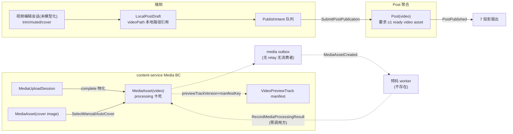

# 发布视频商用成熟度全面排查与规划

> 版本：2026-07-20（M4 发布视频专项会话产出；会话异常重启后由恢复会话收口）
> 审查主线：`业务目标 → 核心业务对象 → 对象关系 → 对象生命周期 → 用户旅程 → 功能能力 → 页面承载 → 交集差异化 → 运营指标 → 测试验证`
> 承接：`docs/functional_module_commercial_maturity_matrix.md` §13（M4）、`specs/feature-tree/discovery-content/publish-comment-reaction/post-create-update/**`（GWT4~GWT6）、`specs/feature-tree/runtime/runtime-media/video-end-to-end-commercial-matrix.md`（当前 GATE_BLOCK）、`docs/outstanding_risks_backlog.md`（R-CS05/R-CS08/R-CS11/R-OBJ-002/R-OBJ-007/R-OPS-ACCEPTANCE-PHANTOM/R-TELEMETRY-001）。
> 树绑定：Journey **缺失（同发图，共享 GATE）**；L1 `discovery-content`；L2 `publish-comment-reaction` + `media-processing-helper-read`（**空壳**）+ `runtime/runtime-media`；L3 `post-create-update`（GWT4 completed / GWT5、GWT6 pending）。
>
> **并行去重边界**：①共享发布底座缺口（结果回流、漏斗遥测、机审裁定、Journey 登记、契约漂移）主批次归「发布文字」规划，图片分型归 `docs/photo-post-commercial-maturity-plan.md`，本文档只认领**视频特有**链路；②视频消费侧（feed 自动播放/沉浸播放器/QoE）归 M3 与 runtime-media 矩阵；③数据工程 video 生产 lane（R-CS05，用户已 defer）不在本轮；④聊天视频消息归 chat 域。

---

## 0. 结论速览（必须回答的八个问题）

| # | 问题 | 结论 |
|---|---|---|
| 1 | 领域模型是否真正围绕业务对象建立 | **是，且视频侧建模严谨**：MediaAsset 状态机对 ready 视频强校验（h264+mp4+aac、≤1h、关键帧≤2s、fastStart、slice key 成对）；预览轨道以 manifest schema 约束（≤64 sprite/≤1000 帧）。**但模型完整性掩盖了实现空洞**（见 2）。 |
| 2 | 对象关系和生命周期是否合理 | **生命周期设计合理、实现断裂**：`processing → ready` 的推进者（转码 worker）**不存在**——`RecordMediaProcessingResult` API/鉴权/SLO/告警全就位但生产链路零调用方；media outbox 声明的 consumers（media-processing）为空挂，`ReadMediaOutboxAfter` 无 relay。真实用户上传的视频将**永远停留 processing，发布被 `media_not_ready` 拒绝**。当前所有环境靠 fixture/测试伪造 ready。 |
| 3 | 页面是否完整承载对象和用户旅程 | 选择→拍摄→编辑（剪辑/静音/封面）→表单→发布链页面齐全且 iOS 侧体验完整；**但 Android 无原生导出 channel（剪辑/静音抛 UnsupportedError）**、上传无进度、发布成功无回流、审核/转码失败无作者侧承载。 |
| 4 | 哪些页面只是空壳或功能简陋 | 页面无空壳；**空壳在特性树与云侧**：`media-processing-helper-read` L2+3 个 L3 全为占位模板（tests 全空）；`adaptive(hls_or_dash)` 变体仅 metadata 声明，无打包实现。 |
| 5 | 哪些页面美观但对象已跑偏 | 视频编辑器/相机页体验良好但**平台能力不对称**（iOS 完整、Android 断腿）——页面语义正确而平台承载跑偏（违 R-XP5 缺失即一致降级的完整语义）。 |
| 6 | 哪些页面适度优化、哪些必须重构 | 见 §5：video_editor 家族适度重构（Android 能力位收口+导出预算）；create 家族与确认页决策同发图规划；新增「上传进度/后台上传」表达；删除 0 页。 |
| 7 | 相比业界标杆还缺什么 | 转码管线（全行业标配、本仓完全缺失）、分片/断点续传（抖音>128MB 强制、IG rupload）、上传进度与后台化、HLS/DASH 自适应、发布频控、审核期可见性语义。见 §6。 |
| 8 | 交集如何形成不可复制的差异化 | 同发图（场景增强）：视频特有增量 = 有效播放（effective_play）已是行为契约闭集成员，视频作品的「共同有效观看」「共同完播」可升级为内容维交集证据；发布侧增量与发图共享（位置/实体/圈子通道）。见 §7。 |

**商用总评：契约与模型 P4、端侧 iOS 旅程 P3，但云侧转码管线 P0（不存在）、Android 平台 P1、验收证据（GWT5/6 pending + 5 个幽灵 planned 路径 + gamma 目录整体缺失）P1。视频商用矩阵当前 GATE_BLOCK（R-CS08/R-CS11），距商用关键阻断 10 项（§8 GATE 表）。**

---

## 1. 业务对象全景表（交付物 1）

> 与发图共享的对象（Post/LocalPostDraft/PublishIntent/CirclePostPlacement/Location/PostModerationCase）见 `photo-post-commercial-maturity-plan.md` §1，此处只列视频特有语义。

| 业务对象 | 用户价值 | 上下游对象 | 聚合/上下文 | 生命周期 | 页面承载 | API/服务 | 存储/事件 | 当前问题 |
|---|---|---|---|---|---|---|---|---|
| `content.Post`（contentType=video） | 视频作品被观看/完播/互动 | MediaAsset(video)≥1 ready 强制、封面 asset、CirclePostPlacement | Content BC | 同发图 | create_page（video flow）→ feed/沉浸 | `SubmitPostPublication`：`coverStrategy/coverFrameTimeMs/durationMs/width/height` + `deviceInfo{trim,muted}` | 同发图 | 发布强依赖 asset ready，而 ready 推进者不存在（→GATE-V1） |
| `content.MediaAsset`（video） | 视频资产转码就绪、可控交付 | MediaUploadSession、Post、VideoPreviewTrack（字段承载） | Media BC，聚合根 | `processing →(worker 回写)→ ready/rejected`；**推进者缺失** | 无独立页 | `RecordMediaProcessingResult`（internal，ready）、`SelectAuto/ManualVideoCover`（**blocked**）、`GetMediaAssetDeliveryReference` | `media_assets` + media outbox（**无 relay 无消费者**） | worker 不存在；outbox 空挂；`adaptive` 变体无实现；非公开视频预览轨道无交付方案 |
| VideoPreviewTrack（非独立对象，MediaAsset 字段） | 拖动进度条显示缩略帧 | MediaAsset（previewTrackVersion+manifestSliceKey 成对） | Media BC 值投影 | 随 asset 版本 | 沉浸播放器时间轴（消费侧） | 无独立 op：App 直 GET manifest 公开交付 URL | `preview_track_manifest.schema.json` 强校验 | 真实生成只在数据工程 media-canary；服务端无生成逻辑；`owner_only` 视频降级为时间浮标（功能空洞） |
| 视频编辑会话（端侧，未模型化） | 剪辑/静音/封面选择 | 本地视频文件、VideoEditorResult 契约 | 端侧 UI | 选择→编辑→导出/跳过导出 | video_editor_page 家族（200+859+285 行） | MethodChannel `quwoquan/video_editing`（**仅 iOS**） | 无持久化（trim/cover 随草稿字段） | Android 无实现抛 UnsupportedError；裸 MethodChannel（R-XP4 存量）；PlatformException 无遥测 |
| 封面（cover asset + strategy） | 首帧/手选帧决定点击率 | MediaAsset(video)、封面图 asset | Media BC | 上传→SelectManual/AutoCover 绑定 | video_editor_page_state_cover（帧轨道滑选） | `SelectAutoVideoCover`/`SelectManualVideoCover`（blocked） | Post 投影 coverUrl/thumbnailUrl | GWT5（封面 PublishIntent 同源契约）pending，gamma 证据未落 |

## 2. 对象关系与聚合边界（交付物 2）



边界判定：视频就绪→发布的传导采用**拉模型**（发布时同步 `FindMediaAssetsForBinding` 校验 ready）而非事件驱动，模型上可接受；但 `MediaAssetCreated → media-processing` 的声明消费者不存在，使 media outbox 成为**只写不读的死信道**——这是「metadata 声明了对象协作关系、实现无人履约」的教科书式断链（对照 01-arch 规则：未兑现的 consumers 声明即第二真相源风险）。

## 3. 核心对象生命周期（交付物 3）

**MediaAsset（video）状态机——设计 vs 实况：**

```text
设计: complete 物化(processing) → [worker probe/转码/封面/预览轨道] → RecordMediaProcessingResult
       → ready(强校验: h264+mp4+aac ≤1h keyframe≤2s fastStart + videoPublicSliceKey+coverPublicSliceKey
               + previewTrackVersion/manifestKey 成对) | rejected
实况: complete 物化(processing) → ∅（无 worker、无 relay）→ 永久 processing
      发布 → prepareMediaAssetsForPublication 校验 ready 失败 → CONTENT.USER.media_not_ready(retry 3s)
      → 端侧 intent 队列指数退避 → 无限重试(不可达 ready) → 用户视角"一直发布中"
```

逐状态核对（提示词 §2.3 口径，视频特有行）：

| 状态 | 触发者 | 页面承载 | 用户反馈 | 事件/存储 | 缺口 |
|---|---|---|---|---|---|
| 编辑中（trim/cover） | 用户 | video_editor 家族 | 三层错误语义+重试 | 草稿字段 | Android 导出不可用（GATE-V2） |
| 上传中 | _publish | 按钮 spinner | 无进度 | session | 全量进内存（大视频 OOM 风险）；上传失败不进离线队列（队列只覆盖 submit 段） |
| processing | complete 物化 | **无任何承载** | 无感知 | asset+outbox（死信道） | **worker 缺失=永久卡死**（GATE-V1）；无「处理中，稍后自动发布」的作者侧表达 |
| ready | worker 回写（不存在） | — | — | — | 同上 |
| rejected（转码失败/机审） | worker/审核 | 无承载 | 无通知 | — | 同发图 GATE-P6 |
| published→消费 | 发布 | feed/沉浸（M3，链路完整） | 曝光/有效播放埋点完备 | PostPublished | 消费侧是全链最成熟段 |

**发布视频端到端实况图**（云侧探索报告原图，2026-07-20 复核仍成立）：断点 A=media outbox 无 relay；断点 B=转码/探测/封面/预览轨道 worker 不存在（全仓 Go 侧 ffmpeg/ffprobe 零命中，19 个服务无 media-processing）；断点 C=审核拒绝无通知。当前 beta/gamma 的"可播放视频"全部来自数据工程 media-canary fixture 导入 + api_integration 测试直接 POST 伪造 ready descriptor。

## 4. 对象—功能—页面双向矩阵（交付物 4）

### 4.1 从页面反查对象（视频特有行；共享行见发图规划 §4.1）

| 页面/路由 | 用户目标 | 主对象 | 核心功能 | 生命周期状态 | 上游入口 | 下游去向 | 完整性结论 |
|---|---|---|---|---|---|---|---|
| `create_media_picker_page`（video 模式） | 选 1 条视频 | 本地媒体 | 子流互斥、maxSelection=1、强制深色 | — | create_page | 就绪探测→编辑器 | ✅（桌面/Web 无视频选择器，能力位缺口） |
| `camera_capture_page`（video 模式） | 摄像 | 本地媒体 | 1s–60s 录制状态机、录中锁定、无麦静音录制 | — | 选择器 | 预览确认→编辑器 | ✅（GWT4 completed） |
| `video_editor_page` 家族 | 剪辑/静音/封面 | 编辑会话 | 滑轨剪辑（≥100ms）、24 帧抽帧、封面帧滑选 | 编辑中 | 选视频自动进入 | 回填 create_page | ⚠️ **Android 导出抛 UnsupportedError**；页面自身无埋点；`exportEdit` 无时长预算 |
| `create_page`（video flow） | 填标题/正文 | LocalPostDraft | 单视频 tile+「编辑」角标 | 草稿 | 编辑器回填 | 确认页 | 同发图（进度/回流/埋点缺口） |
| 沉浸播放器时间轴（消费侧） | 拖动预览 | VideoPreviewTrack | manifest LRU 8 条、100ms debounce、失败静默降级 | 消费 | works_immersive_viewer | — | ✅（但依赖 fixture 生成的 manifest，UGC 链路不可达） |

### 4.2 从对象查页面（缺口方向，视频特有）

| 对象状态/能力 | 应有承载 | 现状 | 判定 |
|---|---|---|---|
| MediaAsset processing（转码中） | 「处理中，完成后自动发布」状态 + 完成通知 | 无 worker 无承载，intent 队列无限退避 | **GATE_BLOCK**（依赖 GATE-V1） |
| 转码 rejected | 作者通知 + 原因 + 重新上传入口 | 无 | GATE_BLOCK |
| 上传中（大视频分钟级） | 进度百分比/后台化/可取消 | spinner | **GATE_BLOCK**（视频比图片更不可接受） |
| Android 剪辑/静音 | 能力位一致降级（隐藏入口或服务端兜底） | 入口存在→点确认才抛错 | GATE_BLOCK（R-XP5：错误态有兜底但入口语义欺骗） |
| 非公开视频预览轨道 | 签名交付或显式降级说明 | 强制 public 才接受，owner_only 静默降级时间浮标 | 缺口（P2 级） |
| 桌面/Web 视频选择 | 能力位路由 | 只有 desktop_image_picker | 缺口（P2 级，跨平台轨道） |

## 5. 页面成熟度评级与决策（交付物 5+6+9）

> 同发图规划：本轮代码级预判，**全部「视觉未核验」**；实施会话须真机双色截图核验。

| 页面 | 预评级 | 主要问题 | 决策 | 目标 |
|---|---|---|---|---|
| video_editor_page 家族（200+859+285+218 行） | **P2** | Android 无导出；页面无埋点；导出无预算/取消；`video_editor_page_state.dart` 859 行近红线 | **适度重构**：能力位收口（`PlatformCapabilities` 登记 videoEditExport 位，Android 隐藏剪辑/静音入口至实现落地）+ 导出进度/取消 + 埋点 | P4 |
| camera_capture_page（video） | **P3** | GWT4 completed，证据充分 | 保留 | P4 |
| create_media_picker_page（video 模式） | **P3** | 深色流达标 | 保留 | P4 |
| create_page（video flow） | **P2** | 同发图（进度/回流/埋点）+ 视频缺「处理中」态表达 | 适度重构（共享批次 A + 视频分型） | P4 |
| create_publish_confirm_sheet | P2 | 同发图（4 处硬编码 + 推荐圈子位） | 精修（共享批次 A3） | P4 |
| **缺失：上传/处理进度与后台化表达** | **P0** | 无 | **新增**（嵌入态：进度条+后台继续+完成通知） | P4 |
| **缺失：转码失败/审核状态作者侧表达** | **P0** | 无 | **新增**（与发图 GATE-P6 共享通知底座，视频加转码失败原因） | P4 |
| one_tap_movie_preview_page | P2 | 一键成片分支（图选流特有，视频消费） | 保留观察（非本轮核心） | P3+ |

## 6. 业界标杆对比（交付物 7；检索日期 2026-07-20）

| 标杆 | 对标页面/旅程 | 功能完整性 | 关键交互 | 异常恢复 | 可借鉴原则 | 不照搬 |
|---|---|---|---|---|---|---|
| 抖音（开放平台分片上传/创建视频官方文档） | 上传→转码→发布→审核→作品页 | >50MB 建议分片、>128MB 强制（单片 5–100MB 建议 20MB）、≤4GB/≤15min；`cover_tsp` 指定帧或 `custom_cover_image_url`；日发布 75 上限 | 转码期间可同步填写标题描述；审核期间仅自己可见 | 分片失败仅重传该片；错误码显式（2114006 超时长/2114007 日上限/2100005 标题超长） | ①**分片上传阈值分级**（小视频单 PUT、大视频分片）；②转码与表单填写并行（隐藏等待）；③审核可见性语义透明；④显式配额错误码 | 15min/4GB 上限数值（按自身 CDN 成本定）；企业号锚点 |
| Instagram（Meta rupload 官方协议 + 架构解析） | 后台上传→容器状态机→发布 | resumable：offset/file_size/bytes_transferred；容器状态 `IN_PROGRESS/FINISHED/PUBLISHED/EXPIRED/ERROR`；`video_status` 双阶段（uploading_phase/processing_phase） | 发布点击即回 feed，上传后台化，进度条 chunk 级恢复 | 本地临时文件持久化→app 杀死可续；chunk 级重试；失败自动存草稿 | ①**uploading/processing 双阶段状态对用户可见**（正对本仓 processing 黑洞）；②上传与发布解耦后台化；③容器 24h 过期语义（对照本仓 session 15min 只覆盖上传段） | rupload 独立主机；Graph API 形态 |
| 小红书（创作服务平台视频发布） | 上传→实时进度条→转码期填表→发布→笔记管理「审核中」 | MP4/MOV、自动转码 | 上传进度条 + 转码并行填表 | 素材校验前置 | ①进度条为发布链路一等公民；②发布结果落笔记管理（状态可查） | 网页端为主的形态 |
| Apple HIG / AVFoundation 惯例 | 系统级视频编辑导出 | AVAssetExportSession 进度/取消为平台标准语义 | 导出进度+可取消 | — | 编辑导出必须有进度与取消（iOS 用户预期） | — |

## 7. 交集差异化规划矩阵（交付物 8；定位=场景增强）

发布侧与发图共享（圈子/位置/实体通道，见发图规划 §7）；视频特有增量：

| 页面/场景 | 主对象 | 需要交集 | 交集证据 | 用户价值 | 表达方式 | 用户行动 | 冷启动 | 指标 |
|---|---|---|---|---|---|---|---|---|
| 视频作品的内容维交集（消费→关系） | Post(video) + effective_play 行为 | 场景增强 | 「你们都完整看过 X 的这条视频」（effective_play 已在行为契约闭集，具备可证实性） | 把高成本消费行为（完播）升级为关系证据 | 交集卡 primaryText 通道（kind registry 增量） | 围观/打招呼 | 完播量低时不出证据（gateKeys 控制） | 新 kind 曝光后有效行动率 |
| 发布确认页-圈子/位置/实体 | 同发图 | 场景增强 | 同发图 §7 | 同 | 同 | 同 | 同 | 同 |
| 视频编辑器/相机/播放器 chrome | — | **无需承载**（工具面+沉浸面，禁止机械加交集） | — | — | — | — | — | — |

红线同发图：新 kind 必须走 `intersection_kind_registry.yaml` metadata-first；「共同完播」证据只能来自已入库的 effective_play 事实（该链路已闭环），禁止推断冒充。

## 8. 六维度分析与 GATE 表（交付物 9 汇总）

### GATE_BLOCK 清单（2026-07-20 全部逐条复核仍在）

| # | 缺口 | 证据 | 维度 |
|---|---|---|---|
| GATE-V1 | **转码 worker 不存在**：`RecordMediaProcessingResult` 零生产调用方；media outbox 无 relay（`ReadMediaOutboxAfter` 仅 port+实现）；UGC 视频永久 processing、发布不可达；所有环境靠 fixture/测试伪造 ready | 全仓 Go ffmpeg/ffprobe 零命中（2026-07-20 复核）；`services/` 无 media/transcode 服务 | D1/D2（**视频商用的第一阻断**） |
| GATE-V2 | Android 视频编辑导出缺失：`quwoquan/video_editing` channel 仅 iOS 实现，剪辑/静音确认时抛 UnsupportedError；入口不按能力位隐藏（语义欺骗式降级） | `rg quwoquan/video_editing` 仅命中 ios/（复核仍在）；R-XP4 存量裸 channel | D1/D3/跨平台 |
| GATE-V3 | 上传硬化缺失（视频加重版）：全量 readAsBytes 进内存（数百 MB OOM 风险；流式 `uploadPreparedSource` 已存在但发布链未用）、单 PUT 无分片/断点续传/进度、上传失败不进离线队列（队列只覆盖 submit 段）、`GetMediaUploadSession` resume 契约三层齐备但零消费 | coordinator 复核（onProgress 零命中） | D4 |
| GATE-V4 | GWT5/GWT6 pending + 5 个幽灵 planned 路径：`test/api_integration/gamma/` 目录整体不存在（video_publish_cover_roundtrip 等 3 个 api_integration + 2 个 UAT pages 文件缺失）；App 侧视频发布 api_integration 为 0 | acceptance planned vs 磁盘核对 | D6（R-OPS-ACCEPTANCE-PHANTOM 实例） |
| GATE-V5 | 视频商用四环境矩阵 GATE_BLOCK：R-CS08（beta-local 0/29、gamma-local 0/29、prod media 0/1 外部可达；缺真机 runner、SLS QoE readback、对象存储/VOD worker）+ R-CS11（灰度三阶段非 dry-run 生产报告与回滚演练缺失） | backlog 原文（未关闭） | D6/四环境 |
| GATE-V6 | `media-processing-helper-read` 特性树空壳：L2+3 个 L3 占位模板、tests 全空——转码状态机/失败恢复这一视频强依赖能力在规格层零覆盖 | acceptance 原文复核 | D6/规格 |
| GATE-V7 | 转码就绪竞态无用户语义：completeUpload 后立即发布，`media_not_ready` 只靠 intent 队列指数退避兜底；无「处理中」状态表达、无 ready 后自动继续的通知闭环 | `_isRetryable` 复核 | D1 |
| GATE-V8 | media/cover operation commercial blocked（`CONTENT_MEDIA_GAMMA_UAT`）：SelectAuto/ManualVideoCover、upload session 4 op 实现已通但缺 gamma 页面证据 | `media_asset/service.yaml` | D6 |
| GATE-V9 | `adaptive(hls_or_dash)` 仅 metadata 声明：只有 progressive MP4（fastStart+fallback_to_original 兜底），无 HLS/DASH 打包 | `media_variant_profiles.yaml` vs 实现 | D4（商用带宽成本/弱网体验） |
| GATE-V10 | 观测缺口（视频特有）：无转码时长/队列积压/失败率指标、media outbox lag、上传→ready 端到端时延、预览轨道加载成功率；`intent 队列把 unauthorized 判为可重试`（登录失效死循环退避） | 告警文件复核 | D5 |

### 六维度现状 → 目标

| 维度 | 现状 | 目标（商用） |
|---|---|---|
| D1 旅程 | iOS 选择→编辑→发布链完整；processing 黑洞；Android 断腿；回流缺失 | 上传→处理→就绪→发布→回流全态承载；双平台能力位一致语义 |
| D2 DDD/元数据 | 模型/契约严谨；media outbox 死信道；worker 声明空挂 | worker 落地兑现 consumers 声明；outbox relay 接通或收敛声明（单轨） |
| D3 UX/token | 编辑器三层错误语义良好；确认页硬编码（共享）；进度/后台化缺失 | 进度/取消/后台化补齐；Android 入口能力位收口；真机双色核验 |
| D4 非功能 | 全量内存+单 PUT；无分片阈值；无导出预算；无 HLS | 分级上传（阈值入 metadata）；流式化；导出/上传预算文档；HLS 按放量节奏排期 |
| D5 可观测 | 上传段 operation_result 有；转码管线零指标；漏斗断链（共享） | 转码时长/积压/失败率 + 上传→ready E2E 时延 + 预览轨道成功率；黄金三指标（共享批次 C） |
| D6 测试 | local_contract 充分（26 文件）；App api_integration 0；gamma 目录缺失；UAT 为 fake 相机 widget 级；四环境矩阵 GATE_BLOCK | 真实 gamma 视频发布 roundtrip + patrol 旅程；幽灵路径清理；矩阵按 runtime-media 规格逐 target 转绿 |

## 9. 分批商用路线图（交付物 10：每项含目标规格/任务/验收）

> 排序原则：GATE-V1（转码管线）是视频商用的唯一第一优先——没有它，其余端侧优化都在优化一条不可用的链路。共享底座批次跟随发图/发文字规划编号。

- **批次 V-A 转码管线落地（云侧，最高优先，对应 GATE-V1/V6/V9/V10）**
  - 目标规格：新建 media-processing worker（形态裁定见待确认 1：独立 `media-processing-service` vs content-service 内 worker goroutine + 队列）。消费 media outbox（补 relay）→ ffprobe 探测 → 转码归一（h264/mp4/aac/fastStart，符合既有 ready 强校验）→ 封面帧提取 → 预览轨道 sprite/manifest 生成（复用 media-canary 的确定性算法与 schema）→ `RecordMediaProcessingResult` 回写 ready/rejected。
  - 验收：api_integration 覆盖「真实上传 mp4 → worker 处理 → asset ready → 发布成功 → previewTrackManifestUrl 可拉」全链（testcontainers + 真实 ffmpeg）；`media-processing-helper-read` L2/L3 acceptance 从空壳回填（GATE-V6 同批关闭）；转码时长/失败率/积压指标 + media outbox lag 告警上线；`adaptive(hls_or_dash)` 本批只做决策登记（做/不做/何时做），不留死声明。
  - 部署：`process_domain_mapping.yaml` 与 compose/gamma-local 拓扑同步；prod 平面按 media plane 隔离。
- **批次 V-B 端侧上传硬化（对应 GATE-V3/V7）**
  - 发布链切换 `uploadPreparedSource` 流式上传（大文件不进内存）；进度回调贯通（bytes 粒度）→ 创作页进度条 + 取消；分片阈值决策（>50MB 分片，阈值入 metadata 配置）；上传失败纳入离线队列（断点续传消费 `GetMediaUploadSession` resume 契约，正好补齐 `CONTENT_MEDIA_GAMMA_UAT` 要求的 resume 证据）；「处理中」态表达（completeUpload 后 asset processing → 排队卡片「处理完成后自动发布」+ ready 通知续发）；`unauthorized` 改为引导重登（修 `_isRetryable`）。
  - 验收：大文件（≥200MB 模拟）上传内存水位断言；断网续传 local_contract + gamma 真机弱网 patrol；处理中→自动发布 UAT。
- **批次 V-C Android 能力位收口（对应 GATE-V2）**
  - 已完成：`quwoquan/video_editing` 已迁入 `core/platform/ios_video_editing_bridge.dart`，页面不再直接持有原生通道，R-XP4 存量 allowlist 已清零。剩余：`PlatformCapabilities` 登记 `videoEditExport` 能力位，Android 隐藏剪辑/静音入口（保留封面选择——纯 Dart 可用），入口语义诚实，并补齐原生失败遥测。
  - 长期（独立排期）：Android MediaCodec/Transformer 导出实现，能力位翻牌。
  - 验收：capability profile 驱动的双平台行为契约测试（R-XP9：同一批测试断言 iOS 显示入口/Android 隐藏入口）。
- **批次 V-D 验收诚信与四环境（对应 GATE-V4/V5/V8）**
  - 建 `test/api_integration/gamma/` 目录并落地 GWT5/GWT6 声明的 3 个 roundtrip（依赖 V-A 后 UGC 链可达）；2 个 UAT pages 文件补齐或从 planned 摘除（诚实化）；gamma patrol 新增视频发布旅程（选视频→编辑→上传→处理→发布→feed 回读封面一致）；`CONTENT_MEDIA_GAMMA_UAT` 翻牌（覆盖 GATE-V8 的 cover/upload 4+2 op）；R-CS08 视频矩阵按 target 逐项转绿、R-CS11 灰度三阶段非 dry-run 报告（环境轨协同）。
- **批次 V-E 共享底座（跟随发图/发文字批次执行，视频分型验收）**
  - 结果回流（视频卡「处理中/已发布」双态）、漏斗事件契约化（video 分型字段：durationMs/编辑动作）、编辑器页埋点、确认页 token 化、审核通知、机审裁定、发布频控——验收断言补 contentType=video 分支。
- **批次 V-F 交集增量（依赖交集会话协同）**
  - 「共同完播」kind 走 registry metadata-first 评审；预览轨道 owner_only 交付方案（签名 URL）与「发布于此」事实沉淀跟随发图 §7 决议。

## 10. Exit Review 与待确认事项

- **规格达成**：十项交付物齐备；八问有结论；与发图/发文字/图片编辑/消费侧/数据工程五条并行轨道的去重边界显式。
- **测试证据**：本轮为排查规划（非实施）；关键断言 2026-07-20 在当前工作树逐条复核（worker 零命中、Android channel 仅 iOS、onProgress 零命中、gamma 目录缺失、幽灵路径仍在）；实施批次验收已映射三层测试。
- **E2E**：视频 UGC 链路当前在「complete→ready」处物理断裂（GATE-V1），四环境矩阵 GATE_BLOCK 与 backlog R-CS08/R-CS11 口径一致；批次 V-A→V-D 构成闭环路径。
- **产品/UX**：页面决策与标杆原则见 §5/§6；「视觉未核验」显式标记；Android 语义欺骗式降级已定性并给出短/长期路径。
- **运营观测**：转码管线指标/上传 E2E 时延/预览轨道成功率缺口在 GATE-V10，批次 V-A/V-B 承载。
- **自动化/门禁**：V-A 完成前，建议在 runtime-media 矩阵 gate 增加「UGC 视频不可达 ready」的显式 KNOWN_BLOCK 标注，防止 fixture 绿灯被误读为 UGC 链路可用。
- **剩余风险**：与 backlog 一致（R-CS05/R-CS08/R-CS11/R-OBJ-002/R-OBJ-007/R-OPS-ACCEPTANCE-PHANTOM/R-TELEMETRY-001 未关闭）；本文档不新增 backlog 条目（下列待确认事项经用户确认后登记）。

**用户裁决与实施状态（2026-07-20 当轮）**：
1. **转码 worker 形态已裁决**：统一整合到 content-service，但以**独立功能模块**存在（`internal/application/media/processing` 编排 + `internal/infrastructure/content/media/processing` ffmpeg 管线），今后可解耦为独立服务——worker 只依赖窄端口（OutboxSource/AssetSnapshotLoader/CheckpointStore/VideoProcessor/ResultRecorder），拆分时 ResultRecorder 换成 `POST /internal/content/media/{id}:processing-result` HTTP 客户端即可，编排逻辑零改动。
2. ~~worker 缺失登记 backlog~~ → 用户裁决**不登记、立刻解决**。**批次 V-A 主体已落地（GATE-V1 关闭）**：
   - media outbox relay 接通：`mediaprocessing.Worker` 是 media outbox 唯一生产消费者（checkpoint 集合 `media_projection_checkpoints` 入 `media_asset/storage.yaml`），兑现 `MediaAssetCreated -> media-processing` 的 metadata consumers 声明，死信道消除。
   - ffmpeg 管线：probe → 统一归一转码（h264/aac/mp4/faststart/keyframe 2s，无音轨注入静音 AAC）→ 封面帧 → 预览轨道（5s 间隔、5 列 sprite、多 sprite 分片，全程满足 `preview_track_manifest.schema.json` 约束，与 media-canary 参数同源）→ `RecordMediaProcessingResult(ready)`；内容性失败（损坏/超 1h/不可解码）落 `rejected+原因`，基础设施失败重试不推进 checkpoint。
   - 装配：composition root 默认启用（`media_processing.disabled` 显式关闭口），ffmpeg 缺失 fail-fast；Dockerfile（apk/apt 双分支）安装 ffmpeg；worker health check `content_media_processing_worker` + Prometheus 指标（jobs_total/duration_seconds/outbox_pending）+ 新增积压/失败告警（`ContentMediaProcessingOutboxBacklog`/`ContentMediaProcessingJobFailures`，`quwoquan_alerts.yaml`）。
   - App 端 manifest 版本语义对齐：预览轨道身份收敛为 (assetId, trackVersion)，manifest.assetVersion 允许落后 descriptor（发布前封面命令会推进聚合版本），修复了 fixture 从未暴露的 UGC 版本竞态（`video_preview_track_remote.dart` + local_contract 测试 3/3 绿）。
   - 测试：worker 编排 local_contract 5 用例绿（ready/rejected/基础设施重试/幂等跳过/image 跳过）；manifest/probe 契约 6 用例绿（1h 上限全区间 schema 约束）；新增 api_integration `TestMediaProcessingWorkerNormalizesAssetsAndProjectsDeliveryDescriptors`（真实 MinIO+Mongo+ffmpeg：视频带音轨/无音轨、图片归一化和垃圾字节场景 + 发布绑定互通断言）。
   - 剩余（批次 V-A 尾项）：`media-processing-helper-read` 特性树 acceptance 回填、直通复用（合规视频免重编码）吞吐优化、`adaptive(hls_or_dash)` 决策登记随 4 裁决。
3. Android 视频编辑长期路径维持待确认（R-XP8 三方包矩阵登记）；短期能力位收口归批次 V-C。
4. HLS/DASH 排期维持待确认（现状 progressive fast-start MP4 已由 worker 真实交付，`fallback_to_original` 兜底语义成立）。
5. 批次优先级按建议执行（V-A > V-B > V-D > V-C > V-E > V-F）；本轮 V-A 主体完成，频控/长度校验（共享底座批次 D 子项）经发布准入体系单轨实装（详见发图规划裁决段 2）。
