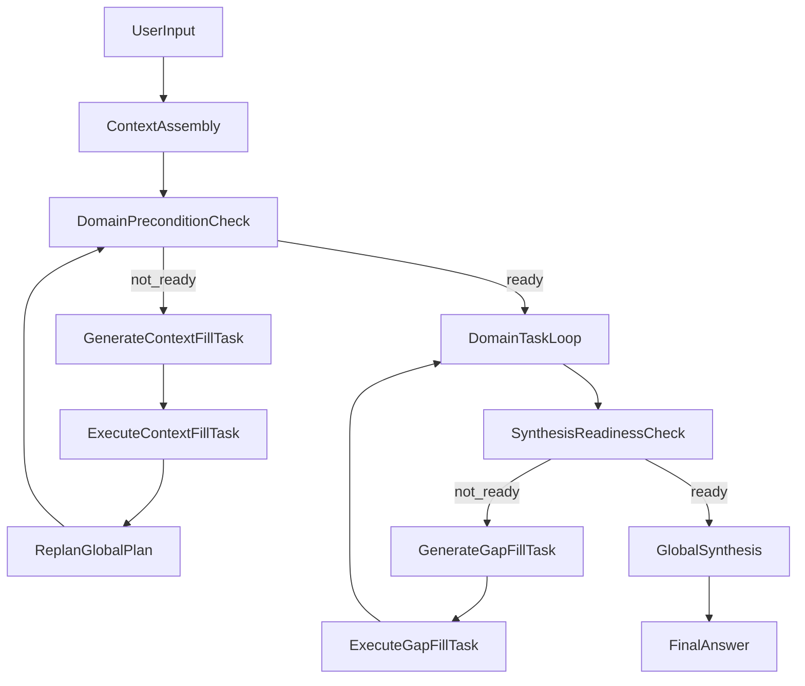

# personal-assistant-domain-orchestration-v1（已合并）

## 状态

本规格已合并到统一规格：`openspec/specs/personal-assistant/spec.md`。  
后续“总分总、双门禁、垂类补齐、模板治理”能力均在统一规格中维护，不再单独维护本文件。

## 迁移说明

- 原 `DomainPreconditionCheck/SynthesisReadinessCheck` 条款已并入统一规格。
- 原契约条款（`ContextEnvelope/PreconditionSpec/PostconditionSpec/FillTask`）已并入统一规格。
- 本文件仅保留记录追溯用途。
# personal-assistant-domain-orchestration-v1

## Purpose

个人私人助理垂类编排 v1：建立“总规划 -> 垂类执行 -> 全局汇总”的商业级执行标准，支持单问多域拆解、多轮补查、跨域一致性校验，并强制每个子任务继承全局上下文（含设备信息与 GPS 位置），最终输出可追溯、可解释、可灰度放量的答案。该标准以行业一线个人助手能力为对标目标（如 Google Assistant、Microsoft Copilot 的任务编排与补齐闭环水准）。

---

## ADDED Requirements

### Requirement: 多垂类识别与任务拆解

系统 MUST 在执行前完成多垂类识别，并将用户问题拆解为结构化子任务，而非单次混合查询。

#### Scenario: 单问多域可拆解

- **WHEN** 用户提出跨域问题（如天气 + 出行 + 推荐）
- **THEN** 系统输出至少包含 `domains`、`tasks`、`dependencies` 的总规划结构

#### Scenario: 垂类可扩展

- **WHEN** 新增一个垂类定义
- **THEN** 无需改动总循环语义，仅通过垂类定义与模板资产即可接入

---

### Requirement: 总分总执行闭环

系统 SHALL 采用 Total-Sub-Total 三阶段执行：`GlobalPlan -> DomainExecution -> GlobalSynthesis`，并支持失败重规划。

#### Scenario: 全流程可复现

- **WHEN** 任意 run 执行完成
- **THEN** 可复现三阶段输入输出与状态迁移，不退化为黑盒单轮回答

#### Scenario: 失败触发重规划

- **WHEN** 任一子任务执行失败或证据不足
- **THEN** 系统进入 Reflect/Replan，并继续执行替代路径

---

### Requirement: 首轮全局上下文组装与逐步披露

系统 MUST 在进入任何 domain 之前完成 `ContextAssembly`，并采用“最小必要 -> 按缺口补齐”的逐步披露策略获取上下文。

#### Scenario: 首轮最小上下文启动

- **WHEN** 用户发起一次新问题
- **THEN** 系统先组装最小上下文（问题、近期会话、设备信息、位置能力状态），不进行无差别全量扩查

#### Scenario: 长期记忆按需披露

- **WHEN** 任务需要回答“很久前发生了什么”
- **THEN** 系统触发长期记忆检索补齐，并将结果回写到 `contextEnvelope`

---

### Requirement: Domain 入口条件门禁

系统 MUST 在进入每个 domain 前执行 `DomainPreconditionCheck`（入口门禁），仅当对应前置条件满足时才允许执行 domain 任务。

#### Scenario: 前置条件不满足则阻断 domain

- **WHEN** 某 domain 所需上下文槽位缺失（如需要 GPS 但不可用）
- **THEN** 不得进入该 domain，必须先生成并执行 `ContextFillTask`

#### Scenario: 补齐后再进入 domain

- **WHEN** `ContextFillTask` 完成并通过复检
- **THEN** 任务回流总规划并进入对应 domain 执行

---

### Requirement: 垂类任务契约标准化

每个垂类任务 MUST 遵循统一契约，输入输出字段保持一致，便于调度、汇总与评测。

#### Scenario: 任务输入契约完整

- **WHEN** 启动任一垂类子任务
- **THEN** 输入包含 `taskId/domainId/subQuestion/contextEnvelope/constraints`

#### Scenario: 任务输出契约完整

- **WHEN** 任一垂类子任务完成
- **THEN** 输出包含 `answerDraft/evidence/confidence/uncertainty/assumptions`

---

### Requirement: 垂类内多轮迭代与补查策略

垂类执行器 MUST 支持迭代补查（改写 query、换 provider、交叉验证），并在边际收益低时停止迭代。

#### Scenario: 证据不足自动补查

- **WHEN** 首轮证据数量不足或质量低
- **THEN** 自动触发下一轮补查，并记录补查原因与策略

#### Scenario: 达到停止条件终止

- **WHEN** 满足轮次/成本/时延上限或边际收益阈值
- **THEN** 终止补查并产出不确定性说明

---

### Requirement: 子任务全局上下文强制注入

系统 MUST 为每个子任务注入统一全局上下文，至少包含共享实体、全局约束、前序结果、设备信息与位置信息。

#### Scenario: 设备与位置上下文可用

- **WHEN** 子任务执行
- **THEN** `contextEnvelope` 中包含 `deviceProfile`（如手机型号/系统版本）与 `gpsLocation`（经纬度/精度/时间戳）

#### Scenario: 定位权限降级

- **WHEN** 用户拒绝定位权限或 GPS 无法获取
- **THEN** 系统降级为城市级位置信息并在最终回答中显式标注不确定性

---

### Requirement: 提示词模板资产化治理

模型请求提示词 MUST 采用模板资产，不得将总规划、垂类执行、补查、汇总、降级提示词写入业务代码字符串。

#### Scenario: 模板版本可追踪

- **WHEN** 任一 run 调用模型
- **THEN** 日志可回溯 `templateId/templateVersion/variableBindings`

#### Scenario: 模板热切换可灰度

- **WHEN** 发布新模板版本
- **THEN** 支持按环境或流量比例切换，并可快速回滚

---

### Requirement: 最终汇总一致性校验

全局汇总前 MUST 执行跨域一致性校验，识别冲突、缺口与风险，并在必要时回退到补查。

#### Scenario: 识别跨域冲突

- **WHEN** 不同垂类结论冲突（如“强降雨”与“推荐全天户外”）
- **THEN** 汇总层标记冲突并触发修正策略

#### Scenario: 覆盖缺口补全

- **WHEN** 用户问题中的关键子意图未覆盖
- **THEN** 汇总层触发缺口补查或明确说明未覆盖项

---

### Requirement: 汇总充分性门禁与回流补齐

在生成最终答案前，系统 MUST 执行 `SynthesisReadinessCheck`（汇总门禁）检查结论生成前置条件是否充分；不足时 MUST 触发回流补齐任务。

#### Scenario: 汇总条件不充分不得直接出答案

- **WHEN** 子意图覆盖率、关键证据、冲突闭合任一未达阈值
- **THEN** 系统不得直接生成最终答案，必须生成 `GapFillTask`

#### Scenario: 生成新检索条件并重跑 domain

- **WHEN** `GapFillTask` 被触发
- **THEN** 系统生成新的检索条件，执行“改写查询或扩大范围检索”，并在复检通过后再进入最终汇总

---

### Requirement: 预算与停止条件

系统 MUST 实施预算控制（轮次、时延、成本、工具调用次数），并对超预算场景给出可解释降级输出。

#### Scenario: 成本超限保护

- **WHEN** 当前 run 成本达到预算上限
- **THEN** 停止新增检索并返回“基于现有证据”的保守结论

#### Scenario: 时延超限保护

- **WHEN** 执行耗时超过时延阈值
- **THEN** 结束当前规划并返回最优可得答案与后续建议

---

### Requirement: 总分总可观测与回放

系统 SHALL 提供四层可观测轨迹：`plan/task/round/synthesis`，并可通过 runId/traceId 回放全过程。

#### Scenario: 轨迹层级完整

- **WHEN** 查询一次 run 的执行详情
- **THEN** 至少可见总规划、每个垂类任务、每轮补查、最终汇总的结构化轨迹

#### Scenario: 设备与位置上下文可审计

- **WHEN** 回放某次 run
- **THEN** 可见本次使用的设备型号、系统信息、位置来源与精度等级（按隐私策略脱敏）

---

### Requirement: 质量评测与发布门禁

系统 MUST 建立垂类化评测指标，并将质量门禁接入灰度发布策略。

#### Scenario: 质量未达标阻断放量

- **WHEN** 任一核心垂类准确率或覆盖率低于门槛
- **THEN** 阻断灰度扩量并触发回滚建议

#### Scenario: 线上反馈闭环

- **WHEN** 用户反馈“无帮助/不准确”
- **THEN** 该反馈可映射至垂类、模板版本与执行轨迹用于回归评测

---

## 规范性数据契约（v1）

### GlobalPlan

- `runId`
- `userGoal`
- `domains[]`
- `tasks[]`
- `dependencies[]`
- `priorityPolicy`
- `stopConditions`
- `budget`
- `contextAssemblyPlan`
- `domainEntryConditions`
- `synthesisReadinessConditions`

### DomainTaskContext

- `taskId`
- `domainId`
- `subQuestion`
- `globalConstraints`
- `sharedEntities`
- `priorDomainResults`
- `deviceProfile`:
  - `deviceModel`
  - `deviceOs`
  - `osVersion`
  - `appVersion`
- `gpsLocation`:
  - `lat`
  - `lng`
  - `locationPrecision`
  - `locationTimestamp`
  - `locationSource`
- `missingSlots[]`
- `contextFreshness`
- `contextConfidence`

### ContextEnvelope

- `sourceStatus`
- `freshness`
- `confidence`
- `missingSlots[]`
- `deviceProfile`
- `gpsLocation`
- `longtermMemorySummary`

### DomainResult

- `taskId`
- `domainId`
- `answerDraft`
- `evidence[]`
- `confidence`
- `uncertainty`
- `assumptions`
- `nextQuerySuggestions[]`

### SynthesisReport

- `finalAnswer`
- `keyEvidence`
- `conflictResolution`
- `recommendations`
- `remainingUncertainty`
- `readinessCheckResult`
- `gapFillActions`

### PreconditionSpec

- `domainId`
- `requiredSlots[]`
- `softRequiredSlots[]`
- `fallbackPolicy`
- `blockingRules`

### PostconditionSpec

- `intentCoverageThreshold`
- `evidenceSufficiencyThreshold`
- `conflictClosureRequired`
- `mustHaveDomains[]`
- `postconditionBlockingRules`

### FillTask

- `fillTaskId`
- `fillType`（`context_fill` | `gap_fill`）
- `targetSlot`
- `reason`
- `generatedQueryConditions`
- `scopeExpansionPolicy`
- `retryPolicy`

---

## 模板资产规范（不进代码）

必备模板：

- `planner.global_plan`
- `planner.context_assembly`
- `planner.precondition_check`
- `planner.fill_task_generation`
- `domain.<domainId>.task`
- `domain.<domainId>.iterate`
- `domain.<domainId>.requery_or_expand_scope`
- `planner.postcondition_check`
- `synthesizer.final_answer`
- `guardrail.fallback_tool_unavailable`
- `quality.self_check`

模板变量至少包含：

- `{{user_question}}`
- `{{global_constraints}}`
- `{{prior_domain_results}}`
- `{{missing_slots}}`
- `{{required_context_by_domain}}`
- `{{postcondition_status}}`
- `{{longterm_memory_summary}}`
- `{{device_model}}`
- `{{device_os}}`
- `{{gps_lat}}`
- `{{gps_lng}}`
- `{{location_precision}}`
- `{{location_timestamp}}`

模板治理要求：

- 每个模板 MUST 有 `templateId/templateVersion`
- 变量字典 MUST 明确必填/可选字段
- 模板变更 MUST 支持灰度与回滚

---

## 执行流程图（双门禁总分总）

---

## 运行配置与灰度门禁（建议基线）

运行配置：

- domain 路由开关
- 上下文组装与逐步披露开关
- Domain 入口条件阈值（按垂类）
- 汇总充分性阈值（覆盖率/证据/冲突闭合）
- 任务预算阈值（轮次/时延/成本）
- 模板版本与灰度比例
- 位置权限降级策略（精确/城市级/未知）

灰度阶段：

1. 预检（配置、模板、回放可用性）
2. 冒烟（核心垂类与跨域问题）
3. 低流量灰度（监控准确率、冲突率、P95、成本）
4. 扩量与收口（达标放量，不达标回滚）

回滚阈值（任一满足）：

- 核心垂类准确率连续两窗口低于门槛
- 跨域冲突率连续两窗口高于门槛
- P95 或成本连续超限

---

## 验收清单（发布前）

- [ ] 跨域问题可生成结构化总规划且可回放
- [ ] 首轮上下文组装后必须通过 Domain 入口门禁才可进入 domain
- [ ] 子任务上下文强制包含设备型号与 GPS 信息
- [ ] 无定位权限时可降级并显式不确定性
- [ ] 长期记忆缺失时可触发补齐任务并回写上下文后再执行 domain
- [ ] 汇总前必须通过充分性门禁；不通过时会自动生成 gap fill 并重跑 domain
- [ ] run 回放可见 `ContextAssembly -> DomainPreconditionCheck -> FillTask -> Domain -> SynthesisReadinessCheck -> GlobalSynthesis` 全链路
- [ ] 模板均为资产化管理，无业务代码内硬编码提示词
- [ ] 四层轨迹（plan/task/round/synthesis）完整可查
- [ ] 质量门禁可阻断不达标灰度放量
