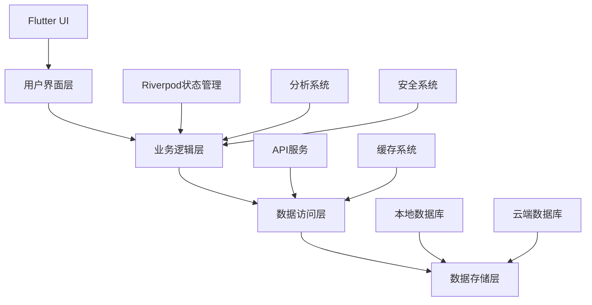

# 趣窝圈App 项目规则框架

## 📋 规则体系架构

基于项目全生命周期管理，将分散的规则整合为8个核心维度：

### 1. 📋 项目计划书 (Project Planning)
### 2. 📝 功能规格清单及细则 (Feature Specifications)
### 3. 🏗️ 系统架构 (System Architecture)
### 4. 🎨 设计规则 (Design Rules)
### 5. 💻 编码规则 (Coding Rules)
### 6. 🧪 质量保证规则 (Quality Assurance)
### 7. 🚀 上线规则 (Release Rules)
### 8. 🔄 持续反馈改进规则 (Continuous Improvement)

---

## 1. 📋 项目计划书 (Project Planning)

### 1.1 项目概述
- **项目名称**: 趣窝圈 (QuWoQuan)
- **技术栈**: Flutter + Riverpod + GoRouter
- **目标平台**: iOS, Android, Web, Desktop
- **设计风格**: Instagram风格 + 中国社交功能

### 1.2 开发阶段规划
```yaml
第一阶段 - 基础架构完善 (2-3周):
  - 测试框架搭建
  - 分析系统实现
  - 设计系统完善
  - 应用框架优化

第二阶段 - 核心功能开发 (4-6周):
  - 主页功能模块
  - 搜索功能模块
  - 创建功能模块
  - 聊天功能模块
  - 个人资料功能模块

第三阶段 - 集成测试与优化 (2-3周):
  - 系统集成测试
  - 性能优化
  - 安全加固
  - 用户体验优化

第四阶段 - 发布准备与上线 (1-2周):
  - 灰度测试
  - 生产环境部署
  - 监控体系建立
  - 用户反馈收集
```

### 1.3 里程碑与交付物
- **里程碑1**: 基础架构完成，测试覆盖率>80%
- **里程碑2**: 核心功能完成，用户体验达标
- **里程碑3**: 系统集成完成，性能指标达标
- **里程碑4**: 产品上线，用户满意度>4.0

### 1.4 资源配置
- **开发团队**: 前端2人，后端2人，测试1人，产品1人
- **技术栈**: Flutter, Dart, Firebase, AWS
- **开发工具**: VS Code, Android Studio, Xcode
- **项目管理**: GitHub, Jira, Confluence

---

## 2. 📝 功能规格清单及细则 (Feature Specifications)

### 2.1 功能模块清单
```yaml
核心功能模块:
  主页模块:
    - 多频道内容展示 (图片、文章、视频、动态)
    - 图片频道二级分类 (摄影分类)
    - 内容浏览与交互
    - 作者主页访问
    - 点赞、评论、转发、更多功能

  搜索模块:
    - 内容搜索
    - 用户搜索
    - 标签搜索
    - 搜索历史
    - 热门搜索推荐

  创建模块:
    - 图片发布
    - 文章发布
    - 视频发布
    - 动态发布
    - 草稿保存

  聊天模块:
    - 私聊功能
    - 群聊功能
    - 消息类型支持
    - 消息状态管理
    - 通知推送

  个人资料模块:
    - 个人信息管理
    - 内容管理
    - 关注/粉丝管理
    - 设置功能
    - 隐私控制
```

### 2.2 功能规格细则
- **详细功能描述**: 每个功能的具体实现要求
- **交互流程设计**: 用户操作流程和界面跳转
- **数据模型定义**: 功能相关的数据结构
- **API接口规范**: 功能对应的后端接口
- **测试用例设计**: 功能测试的具体场景

### 2.3 用户体验要求
- **响应式设计**: 支持多设备适配
- **主题支持**: 浅色/深色模式切换
- **无障碍访问**: 字体缩放、高对比度、屏幕阅读器
- **性能要求**: 页面加载时间<2秒，操作响应时间<500ms
- **兼容性**: 支持iOS 12+, Android 8+

---

## 3. 🏗️ 系统架构 (System Architecture)

### 3.1 整体架构设计


### 3.2 模块化架构
```yaml
目录结构:
  lib/
    app/                    # 全局应用状态和配置
    core/                   # 核心功能
      design_system/        # 设计系统
      navigation/          # 路由导航
      data/               # 数据层
      constants/          # 常量定义
      resources/          # 资源管理
    features/             # 功能模块
      home/              # 首页功能
      search/            # 搜索功能
      create/            # 创建功能
      chat/              # 聊天功能
      profile/           # 个人资料功能
    shared/              # 共享组件
      widgets/           # 通用组件
    analytics/           # 分析系统
    test/                # 测试代码
```

### 3.3 API端云一致性架构
```yaml
API架构原则:
  统一接口规范:
    - RESTful设计标准
    - 统一的响应格式
    - 统一的错误处理
    - 统一的认证机制

  数据模型一致性:
    - 端侧和云侧共享数据模型
    - 数据同步策略
    - 离线数据管理
    - 缓存一致性

  版本管理:
    - API版本控制
    - 向后兼容性
    - 渐进式升级
    - 废弃策略
```

### 3.4 数据流架构
```yaml
数据流设计:
  实时数据流:
    - WebSocket连接
    - 实时消息推送
    - 在线状态同步
    - 实时通知

  批量数据流:
    - 定时同步任务
    - 增量数据更新
    - 数据备份策略
    - 数据恢复机制

  离线数据流:
    - 本地数据存储
    - 离线操作队列
    - 网络恢复同步
    - 冲突解决策略
```

---

## 4. 🎨 设计规则 (Design Rules)

### 4.1 设计系统规范
```yaml
设计令牌系统:
  颜色系统:
    主色调:
      - 主蓝色: AppColors.primaryColor (#1877F2)
      - 悬停状态: AppColors.primaryColorHover (#166FE5)
      - 激活状态: AppColors.primaryColorActive (#1565C0)
      - 浅色版本: AppColors.primaryColorLight (#E7F3FF)
      - 深色版本: AppColors.primaryColorDark (#0D47A1)
    
    次要色调:
      - 主紫色: AppColors.secondaryColor (#8B5CF6)
      - 悬停状态: AppColors.secondaryColorHover (#7C3AED)
      - 激活状态: AppColors.secondaryColorActive (#6D28D9)
      - 浅色版本: AppColors.secondaryColorLight (#F3E8FF)
      - 深色版本: AppColors.secondaryColorDark (#4C1D95)
    
    强调色调:
      - 主绿色: AppColors.accentColor (#10B981)
      - 悬停状态: AppColors.accentColorHover (#059669)
      - 激活状态: AppColors.accentColorActive (#047857)
      - 浅色版本: AppColors.accentColorLight (#D1FAE5)
      - 深色版本: AppColors.accentColorDark (#064E3B)
    
    功能性颜色:
      - 成功色: AppColors.success (#00BA7C)
      - 警告色: AppColors.warning (#FF9500)
      - 错误色: AppColors.error (#ED4956)
      - 信息色: AppColors.info (#1877F2)
    
    特殊功能色:
      - 链接色: AppColors.special.linkColor
      - 悬停色: AppColors.special.hoverColor
      - 选中色: AppColors.special.selectedColor
      - 焦点色: AppColors.special.focusColor
      - 禁用色: AppColors.special.disabledColor

  字体系统:
    - 主字体: SF Pro (iOS), Roboto (Android)
    - 字号: 12px-48px响应式
    - 字重: 400, 500, 600, 700
    - 行高: 1.2-1.6倍字号

  间距系统:
    基础间距:
      - 基础单位: 4px网格
      - xs: 4px, sm: 8px, md: 12px, lg: 16px, xl: 20px
      - xxl: 24px, xxxl: 32px, xxxxl: 40px, xxxxxl: 48px
    
    语义化间距:
      - 组内间距: intraGroupTight(4px), intraGroupNormal(8px), intraGroupRelaxed(12px)
      - 组间间距: interGroupCompact(16px), interGroupNormal(24px), interGroupSpacious(32px), interGroupSection(48px)
      - 容器间距: containerXs(8px), containerSm(12px), containerMd(16px), containerLg(24px), containerXl(32px)
    
    图标尺寸:
      - 小图标: AppSpacing.iconSmall (16px)
      - 中图标: AppSpacing.iconMedium (20px)
      - 大图标: AppSpacing.iconLarge (24px)
      - 超大图标: AppSpacing.iconXlarge (32px)
      - 特大图标: AppSpacing.iconXxlarge (40px)

  组件系统:
    - 按钮: 主要、次要、文本按钮
    - 输入框: 标准、搜索、多行输入
    - 卡片: 内容卡片、操作卡片
    - 导航: 顶部导航、底部导航、侧边导航
```

### 4.2 语义标签使用规范
```yaml
语义标签要求:
  颜色使用:
    - 必须使用: AppColors.primaryColor, AppColors.secondaryColor, AppColors.accentColor
    - 禁止使用: 硬编码颜色值 Color(0xFF1877F2)
    - 禁止使用: 魔鬼数字 const Color(0xFFFFFFFF)
    - 禁止使用: 非语义颜色 Colors.blue, Colors.red

  间距使用:
    - 必须使用: AppSpacing.semantic[DesignSemanticConstants.container][DesignSemanticConstants.md]
    - 禁止使用: 硬编码间距 EdgeInsets.all(16.w)
    - 禁止使用: 魔鬼数字 const EdgeInsets.all(20)

  文本使用:
    - 必须使用: UITextConstants.loading, UITextConstants.retry
    - 禁止使用: 硬编码字符串 '加载中...', '重试'

  内容类型:
    - 必须使用: ContentTypeConstants.image, ContentTypeConstants.video
    - 禁止使用: 硬编码字符串 'image', 'video'

  设计语义:
    - 必须使用: DesignSemanticConstants.container, DesignSemanticConstants.md
    - 禁止使用: 硬编码字符串 'container', 'md'
```

### 4.2 响应式设计规则
```yaml
断点系统:
  移动端: < 768px
    - 单列布局
    - 触摸优化
    - 手势支持

  平板端: 768px - 1024px
    - 双列布局
    - 键盘支持
    - 鼠标悬停

  桌面端: > 1024px
    - 多列布局
    - 键盘导航
    - 窗口管理
```

### 4.3 无障碍设计规则
```yaml
无障碍要求:
  视觉无障碍:
    - 颜色对比度 >= 4.5:1
    - 字体大小缩放支持
    - 高对比度模式
    - 色彩无障碍设计

  交互无障碍:
    - 触摸目标 >= 44px
    - 键盘导航支持
    - 屏幕阅读器支持
    - 语音控制支持

  认知无障碍:
    - 清晰的信息层级
    - 一致的操作模式
    - 错误信息明确
    - 操作反馈及时
```

---

## 5. 💻 编码规则 (Coding Rules)

### 5.1 代码规范
```yaml
命名规范:
  文件命名:
    - 页面: xxx_page.dart
    - 组件: xxx_widget.dart
    - 状态: xxx_state.dart
    - 服务: xxx_service.dart
    - 模型: xxx.dart

  类命名:
    - 页面: XxxPage
    - 组件: XxxWidget
    - 状态: XxxState
    - 提供者: XxxNotifier
    - 服务: XxxService
    - 模型: Xxx

  变量命名:
    - 常量: UPPER_SNAKE_CASE
    - 变量: camelCase
    - 私有变量: _camelCase
    - 布尔值: is/has/can开头
```

### 5.2 语义标签编码规范
```yaml
语义标签使用要求:
  颜色系统:
    必须使用语义颜色:
      - 主色调: AppColors.primaryColor, AppColors.primaryColorHover, AppColors.primaryColorActive
      - 次要色调: AppColors.secondaryColor, AppColors.secondaryColorHover, AppColors.secondaryColorActive
      - 强调色调: AppColors.accentColor, AppColors.accentColorHover, AppColors.accentColorActive
      - 功能性颜色: AppColors.success, AppColors.warning, AppColors.error, AppColors.info
      - 特殊功能色: AppColors.special.linkColor, AppColors.special.hoverColor, AppColors.special.selectedColor
    
    禁止使用:
      - 硬编码颜色值: Color(0xFF1877F2)
      - 魔鬼数字: const Color(0xFFFFFFFF)
      - 非语义颜色: Colors.blue, Colors.red, Colors.green

  间距系统:
    必须使用语义间距:
      - 基础间距: AppSpacing.xs, AppSpacing.sm, AppSpacing.md, AppSpacing.lg, AppSpacing.xl
      - 语义间距: AppSpacing.semantic[DesignSemanticConstants.container][DesignSemanticConstants.md]
      - 图标尺寸: AppSpacing.iconSmall, AppSpacing.iconMedium, AppSpacing.iconLarge
      - 布局高度: AppSpacing.bottomNavHeight, AppSpacing.tabNavigationHeight
    
    禁止使用:
      - 硬编码间距: EdgeInsets.all(16.w)
      - 魔鬼数字: const EdgeInsets.all(20)
      - 硬编码尺寸: 48.h, 24.sp

  文本常量:
    必须使用资源管理器:
      - 通用文本: AppStrings.loading, AppStrings.retry, AppStrings.cancel
      - 导航文本: AppStrings.home, AppStrings.search, AppStrings.create
      - 操作文本: AppStrings.like, AppStrings.share, AppStrings.follow
      - 功能文本: AppStrings.moreFunctions, AppStrings.reward, AppStrings.save
      - Toast消息: AppStrings.linkCopied, AppStrings.userBlocked
    
    资源管理器使用:
      - 语言切换: Strings.setLanguage('en_US'), Strings.setLanguage('zh_CN')
      - 动态获取: AppStrings.moreFunctions (自动根据当前语言返回对应文本)
      - 统一管理: 所有UI文本必须通过AppStrings访问
    
    禁止使用:
      - 硬编码字符串: '加载中...', '重试', '首页'
      - 旧版常量: UITextConstants.loading (已废弃，使用AppStrings.loading)
    
    资源管理器实现:
      - 核心类: Strings (lib/core/resources/strings.dart)
      - 便捷访问: AppStrings (lib/core/resources/app_strings.dart)
      - 导出管理: resources.dart (统一导出所有资源)
      - 语言支持: zh_CN (中文), en_US (英文)
      - 扩展性: 支持添加新语言和字符串

  内容类型:
    必须使用语义类型:
      - 媒体类型: ContentTypeConstants.image, ContentTypeConstants.video, ContentTypeConstants.audio
      - 发布者类型: ContentTypeConstants.author, ContentTypeConstants.circle, ContentTypeConstants.official
      - 显示模式: ContentTypeConstants.singleMode, ContentTypeConstants.gridMode
    
    禁止使用:
      - 硬编码字符串: 'image', 'video', 'author'

  设计语义:
    必须使用语义常量:
      - 间距语义: DesignSemanticConstants.container, DesignSemanticConstants.intraGroup, DesignSemanticConstants.interGroup
      - 尺寸语义: DesignSemanticConstants.xs, DesignSemanticConstants.sm, DesignSemanticConstants.md, DesignSemanticConstants.lg
      - 组件语义: DesignSemanticConstants.button, DesignSemanticConstants.card, DesignSemanticConstants.input
    
    禁止使用:
      - 硬编码字符串: 'container', 'md', 'button'

  空值安全处理:
    语义间距映射必须处理空值:
      - 正确: AppSpacing.semantic[DesignSemanticConstants.container]?[DesignSemanticConstants.sm] ?? AppSpacing.containerSm
      - 错误: AppSpacing.semantic[DesignSemanticConstants.container][DesignSemanticConstants.sm]
```

### 5.3 状态管理规则
```dart
// 状态类必须是不可变的
class HomeState {
  final bool isLoading;
  final List<Post> posts;
  final String? error;
  
  const HomeState({
    required this.isLoading,
    required this.posts,
    this.error,
  });
  
  // 提供copyWith方法
  HomeState copyWith({
    bool? isLoading,
    List<Post>? posts,
    String? error,
  }) {
    return HomeState(
      isLoading: isLoading ?? this.isLoading,
      posts: posts ?? this.posts,
      error: error ?? this.error,
    );
  }
}
```

### 5.4 错误处理规则
```dart
// 所有异步操作必须有try-catch
try {
  final result = await apiCall();
  // 处理成功结果
} catch (e) {
  // 记录错误并显示用户友好的消息
  ref.read(appStateProvider.notifier).setGlobalError('操作失败，请重试');
}
```

### 5.5 性能优化规则
```dart
// 使用Consumer而不是Provider.of
class MyWidget extends ConsumerWidget {
  @override
  Widget build(BuildContext context, WidgetRef ref) {
    final data = ref.watch(dataProvider);
    return Text(data);
  }
}

// 使用select优化监听
final isLoading = ref.watch(homeProvider.select((state) => state.isLoading));
```

---

## 6. 🧪 质量保证规则 (Quality Assurance)

### 6.1 测试体系架构
```yaml
测试层级:
  单元测试 (Unit Tests):
    - 业务逻辑测试
    - 工具类测试
    - 模型测试
    - 覆盖率要求: >80%

  Widget测试 (Widget Tests):
    - UI组件测试
    - 交互行为测试
    - 状态变化测试
    - 覆盖率要求: >70%

  集成测试 (Integration Tests):
    - 功能模块测试
    - API集成测试
    - 数据流测试
    - 覆盖率要求: >60%

  E2E测试 (End-to-End Tests):
    - 用户场景测试
    - 跨平台测试
    - 性能测试
    - 覆盖率要求: >40%
```

### 6.2 测试用例设计规则
```yaml
测试用例分类:
  功能测试:
    - 正常流程测试
    - 异常流程测试
    - 边界条件测试
    - 并发操作测试

  兼容性测试:
    - 多设备测试
    - 多系统版本测试
    - 多屏幕尺寸测试
    - 多网络环境测试

  性能测试:
    - 响应时间测试
    - 内存使用测试
    - 电池消耗测试
    - 网络流量测试

  安全测试:
    - 数据加密测试
    - 权限验证测试
    - 输入验证测试
    - 漏洞扫描测试
```

### 6.3 代码质量规则
```yaml
代码质量标准:
  静态分析:
    - Dart Analyzer检查
    - Lint规则检查
    - 代码复杂度检查
    - 重复代码检查

  代码审查:
    - 功能正确性审查
    - 性能影响审查
    - 安全漏洞审查
    - 可维护性审查

  技术债务管理:
    - 技术债务识别
    - 优先级评估
    - 修复计划制定
    - 定期清理执行
```

---

## 7. 🚀 上线规则 (Release Rules)

### 7.1 灰度发布规则
```yaml
灰度发布策略:
  发布阶段:
    阶段1 - 内测 (1-2天):
      - 内部员工测试
      - 核心用户测试
      - 比例: 0.1%
      - 目标: 功能验证

    阶段2 - 小范围灰度 (3-5天):
      - 特定用户群体
      - 比例: 1-5%
      - 目标: 稳定性验证

    阶段3 - 中等范围灰度 (5-7天):
      - 扩展用户群体
      - 比例: 10-20%
      - 目标: 性能验证

    阶段4 - 大范围灰度 (7-10天):
      - 更多用户群体
      - 比例: 50-80%
      - 目标: 用户体验验证

    阶段5 - 全量发布:
      - 所有用户
      - 比例: 100%
      - 目标: 功能正式上线
```

### 7.2 灰度维度控制
```yaml
灰度维度:
  用户级灰度:
    - 用户ID分桶
    - 用户标签筛选
    - 用户分群控制
    - VIP用户优先

  设备级灰度:
    - 设备类型筛选
    - 系统版本控制
    - 性能等级分组
    - 应用版本管理

  地区级灰度:
    - 地理位置控制
    - 网络环境筛选
    - IP地址范围
    - 运营商分组

  组合灰度:
    - 多维度组合
    - 条件逻辑控制
    - 动态配置调整
    - 实时生效机制
```

### 7.3 监控告警规则
```yaml
监控指标:
  业务指标:
    - 用户活跃度
    - 功能使用率
    - 转化率
    - 留存率

  技术指标:
    - 响应时间
    - 错误率
    - 崩溃率
    - 内存使用率

  用户反馈:
    - 满意度评分
    - 投诉率
    - 客服工单数
    - 应用商店评分

告警机制:
  - 实时监控
  - 阈值告警
  - 自动回滚
  - 通知机制
```

### 7.4 回滚策略规则
```yaml
回滚触发条件:
  自动回滚:
    - 错误率 > 10%
    - 崩溃率 > 5%
    - 响应时间 > 5秒
    - 内存泄漏检测

  手动回滚:
    - 用户投诉激增
    - 业务指标异常
    - 安全漏洞发现
    - 产品决策调整

回滚流程:
  1. 停止灰度发布
  2. 回滚到稳定版本
  3. 通知相关人员
  4. 记录回滚原因
  5. 分析问题根因
  6. 制定修复方案
```

---

## 8. 🔄 持续反馈改进规则 (Continuous Improvement)

### 8.1 数据收集规则
```yaml
数据收集策略:
  用户行为数据:
    - 页面访问统计
    - 功能使用频率
    - 用户操作路径
    - 停留时间分析

  性能数据:
    - 页面加载时间
    - 操作响应时间
    - 内存使用情况
    - 网络请求统计

  错误数据:
    - 异常堆栈信息
    - 错误发生频率
    - 错误影响范围
    - 错误修复状态

  用户反馈:
    - 应用商店评价
    - 用户调研结果
    - 客服反馈统计
    - 社交媒体反馈
```

### 8.2 分析评估规则
```yaml
数据分析维度:
  用户分析:
    - 用户画像分析
    - 用户行为分析
    - 用户满意度分析
    - 用户流失分析

  功能分析:
    - 功能使用率分析
    - 功能效果评估
    - 功能优化建议
    - 新功能需求识别

  性能分析:
    - 性能瓶颈识别
    - 性能优化效果
    - 资源使用优化
    - 用户体验改善

  质量分析:
    - 缺陷分布分析
    - 质量趋势分析
    - 测试效果评估
    - 质量改进建议
```

### 8.3 改进实施规则
```yaml
改进流程:
  问题识别:
    - 数据分析发现
    - 用户反馈收集
    - 团队讨论识别
    - 竞品对比分析

  优先级评估:
    - 影响范围评估
    - 紧急程度评估
    - 实施难度评估
    - 投入产出比评估

  改进方案:
    - 技术方案设计
    - 实施计划制定
    - 资源需求评估
    - 风险评估分析

  效果验证:
    - A/B测试验证
    - 用户反馈收集
    - 数据指标对比
    - 持续监控跟踪
```

### 8.4 知识管理规则
```yaml
知识积累:
  技术知识:
    - 最佳实践总结
    - 技术方案文档
    - 问题解决方案
    - 经验教训记录

  产品知识:
    - 用户需求分析
    - 功能设计经验
    - 用户体验优化
    - 产品迭代历史

  团队知识:
    - 团队协作经验
    - 沟通协作模式
    - 项目管理经验
    - 团队成长记录

知识分享:
  - 定期技术分享
  - 经验交流会议
  - 文档知识库
  - 培训体系建设
```

---

## 📋 规则实施检查清单

### 项目计划书检查
- [ ] 开发阶段规划明确
- [ ] 里程碑设置合理
- [ ] 资源配置充足
- [ ] 交付物定义清晰

### 功能规格检查
- [ ] 功能清单完整
- [ ] 规格细则详细
- [ ] 用户体验要求明确
- [ ] 技术实现可行

### 系统架构检查
- [ ] 架构设计合理
- [ ] 模块划分清晰
- [ ] API设计一致
- [ ] 数据流设计完整

### 设计规则检查
- [ ] 设计系统完整
- [ ] 响应式设计支持
- [ ] 无障碍设计达标
- [ ] 设计一致性保证

### 编码规则检查
- [ ] 代码规范统一
- [ ] 语义标签使用正确
- [ ] 状态管理规范
- [ ] 错误处理完善
- [ ] 性能优化到位
- [ ] 空值安全处理
- [ ] 硬编码值已替换
- [ ] 魔鬼数字已消除

### 质量保证检查
- [ ] 测试体系完整
- [ ] 测试用例充分
- [ ] 代码质量达标
- [ ] 技术债务可控

### 上线规则检查
- [ ] 灰度策略完善
- [ ] 监控告警有效
- [ ] 回滚机制可靠
- [ ] 发布流程规范

### 持续改进检查
- [ ] 数据收集全面
- [ ] 分析评估深入
- [ ] 改进实施有效
- [ ] 知识管理完善

---

**创建时间**: 2024年12月19日  
**版本**: v1.0  
**维护者**: 项目团队  
**下次评审**: 2025年1月19日
