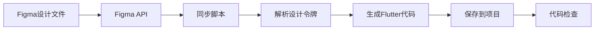

# Figma原型同步指南

## 📋 文档概述

### 基本信息
- **文档版本**: v1.0
- **创建日期**: 2024年12月19日
- **适用范围**: 趣我圈App Figma设计原型同步
- **目标**: 实现Figma设计到Flutter代码的自动化同步

### 文档目的
本文档提供完整的Figma原型同步方案，包括：
1. Figma API配置和连接
2. 设计令牌自动同步
3. 代码生成和维护流程
4. 最佳实践和注意事项

## 🚀 快速开始

### 1. 获取Figma访问令牌

1. 登录 [Figma](https://www.figma.com/)
2. 进入 **Settings** → **Account** → **Personal access tokens**
3. 点击 **Create new token**
4. 输入令牌名称（如：`quwoquan-app-sync`）
5. 复制生成的令牌

### 2. 获取Figma文件ID

1. 打开你的Figma设计文件
2. 从浏览器地址栏复制文件URL
   - 格式：`https://www.figma.com/file/FILE_KEY/File-Name`
   - `FILE_KEY` 就是文件ID

### 3. 配置环境变量

1. 复制 `.env.example` 文件为 `.env`
2. 填写配置信息：

```bash
# Figma API配置
FIGMA_ACCESS_TOKEN=your_figma_access_token_here
FIGMA_FILE_KEY=your_figma_file_key_here

# 可选：指定设计令牌节点ID
FIGMA_DESIGN_TOKENS_NODE_ID=your_design_tokens_node_id_here
```

### 4. 安装依赖

#### Node.js版本（推荐）
```bash
npm install
```

#### Python版本
```bash
pip install requests python-dotenv
```

### 5. 运行同步脚本

#### Node.js版本
```bash
npm run sync:figma
# 或
node scripts/sync_figma.js
```

#### Python版本
```bash
python3 scripts/sync_figma.py
```

## 📐 Figma设计令牌组织

### 推荐结构

在Figma中创建设计令牌时，建议使用以下结构：

```
Design Tokens (页面或Frame)
├── Colors (Frame)
│   ├── Primary (矩形，填充主色)
│   ├── Secondary (矩形，填充次色)
│   ├── Success (矩形，填充成功色)
│   ├── Warning (矩形，填充警告色)
│   └── Error (矩形，填充错误色)
├── Spacing (Frame)
│   ├── XS (Frame，宽度4px)
│   ├── SM (Frame，宽度8px)
│   ├── MD (Frame，宽度16px)
│   ├── LG (Frame，宽度24px)
│   └── XL (Frame，宽度32px)
└── Typography (Frame)
    └── ... (字体相关令牌)
```

### 命名规范

#### 颜色命名
- 使用英文小写
- 单词之间用空格或连字符分隔
- 示例：`Primary`, `primary color`, `background-primary`

#### 间距命名
- 使用标准尺寸名称：`XS`, `SM`, `MD`, `LG`, `XL`
- 或使用描述性名称：`spacing-xs`, `gap-small`

## 🔧 配置说明

### figma.config.json

```json
{
  "figma": {
    "apiUrl": "https://api.figma.com/v1",
    "fileKey": "",
    "nodeIds": {
      "designTokens": "",
      "colors": "",
      "spacing": "",
      "typography": ""
    },
    "sync": {
      "colors": true,
      "spacing": true,
      "typography": true,
      "components": false
    },
    "output": {
      "colors": "lib/core/design_system/colors/app_colors.dart",
      "spacing": "lib/core/design_system/spacing/app_spacing.dart",
      "typography": "lib/core/design_system/typography/app_typography.dart"
    }
  }
}
```

### 配置项说明

| 配置项 | 说明 | 必填 |
|--------|------|------|
| `fileKey` | Figma文件ID | 是 |
| `nodeIds.designTokens` | 设计令牌节点ID | 否 |
| `sync.colors` | 是否同步颜色 | 是 |
| `sync.spacing` | 是否同步间距 | 是 |
| `output.colors` | 颜色输出文件路径 | 是 |

## ⚠️ 重要提示

### 关于代码覆盖

**当前设计系统代码已手动实现完整功能**，包括：
- 完整的颜色系统（品牌色、功能色、主题色等）
- 完整的间距系统（基础间距、语义间距、响应式支持）

**同步脚本会覆盖这些文件**，因此：
1. ✅ **首次设置时**：可以使用同步脚本从Figma导入基础设计令牌
2. ⚠️ **已手动实现后**：不建议直接运行同步脚本，除非：
   - 设计令牌发生重大变更
   - 需要从Figma重新导入基础值
   - 已备份当前代码

### 安全使用建议

1. **备份当前代码**：
   ```bash
   git commit -m "backup: design system before figma sync"
   ```

2. **使用版本控制**：
   - 运行同步前先提交当前代码
   - 同步后检查差异
   - 如有问题可以快速回退

3. **手动合并**（推荐）：
   - 从Figma导出设计令牌数据
   - 手动更新代码中的对应值
   - 保持代码结构和注释

## 📝 同步流程

### 自动同步流程



### 手动同步步骤

1. **更新Figma设计**
   - 在Figma中修改设计令牌
   - 确保命名符合规范

2. **运行同步脚本**
   ```bash
   npm run sync:figma
   ```

3. **检查生成的文件**
   - 查看 `lib/core/design_system/colors/app_colors.dart`
   - 查看 `lib/core/design_system/spacing/app_spacing.dart`

4. **验证代码**
   ```bash
   flutter analyze
   flutter test
   ```

5. **提交更改**
   ```bash
   git add lib/core/design_system/
   git commit -m "chore: sync design tokens from Figma"
   ```

## 🎨 设计令牌映射

### 颜色映射

| Figma名称 | Flutter常量 | 说明 |
|-----------|-------------|------|
| `Primary` | `AppColors.primaryColor` | 主色调 |
| `Secondary` | `AppColors.secondaryColor` | 次色调 |
| `Success` | `AppColors.success` | 成功色 |
| `Warning` | `AppColors.warning` | 警告色 |
| `Error` | `AppColors.error` | 错误色 |

### 间距映射

| Figma名称 | Flutter常量 | 默认值 |
|-----------|-------------|--------|
| `XS` | `AppSpacing.xs` | 4.0 |
| `SM` | `AppSpacing.sm` | 8.0 |
| `MD` | `AppSpacing.md` | 16.0 |
| `LG` | `AppSpacing.lg` | 24.0 |
| `XL` | `AppSpacing.xl` | 32.0 |

## 🔍 故障排除

### 常见问题

#### 1. API请求失败

**错误信息**:
```
❌ API请求失败: 401 Unauthorized
```

**解决方案**:
- 检查 `FIGMA_ACCESS_TOKEN` 是否正确
- 确认令牌未过期
- 重新生成访问令牌

#### 2. 文件未找到

**错误信息**:
```
❌ 获取Figma文件失败: 404 Not Found
```

**解决方案**:
- 检查 `FIGMA_FILE_KEY` 是否正确
- 确认文件ID从URL中正确提取
- 确认有文件访问权限

#### 3. 未找到设计令牌节点

**警告信息**:
```
⚠️  未找到设计令牌节点，将使用默认值
```

**解决方案**:
- 在Figma中创建名为 "Design Tokens" 的页面或Frame
- 或设置 `FIGMA_DESIGN_TOKENS_NODE_ID` 环境变量
- 获取节点ID：在Figma中选择节点，URL中会显示节点ID

#### 4. 颜色提取失败

**问题**: 同步后颜色值为空或默认值

**解决方案**:
- 确保颜色使用 `SOLID` 填充类型
- 检查颜色节点是否为 `RECTANGLE` 类型
- 确认颜色命名符合规范

## 📚 最佳实践

### 1. 设计令牌管理

- ✅ 在Figma中集中管理所有设计令牌
- ✅ 使用清晰的命名规范
- ✅ 定期同步设计令牌
- ✅ 版本控制设计令牌变更

### 2. 代码生成

- ✅ 自动生成的代码不要手动修改
- ✅ 在生成的文件顶部添加注释说明
- ✅ 同步后运行代码检查
- ✅ 提交前验证代码正确性

### 3. 团队协作

- ✅ 设计团队更新令牌后通知开发团队
- ✅ 开发团队同步后通知设计团队验证
- ✅ 建立设计令牌变更流程
- ✅ 记录设计令牌变更历史

### 4. 持续集成

- ✅ 在CI/CD中集成同步检查
- ✅ 自动检测设计令牌变更
- ✅ 自动运行代码检查
- ✅ 生成同步报告

## 🔄 同步策略

### 同步频率

| 场景 | 频率 | 说明 |
|------|------|------|
| 设计阶段 | 每日 | 频繁更新设计令牌 |
| 开发阶段 | 每周 | 稳定后减少同步频率 |
| 发布前 | 每次 | 确保与设计一致 |
| 紧急修复 | 立即 | 设计问题修复后立即同步 |

### 同步检查清单

- [ ] Figma设计令牌已更新
- [ ] 环境变量配置正确
- [ ] 同步脚本运行成功
- [ ] 生成的文件符合预期
- [ ] 代码检查通过
- [ ] 测试用例通过
- [ ] 设计团队已确认

## 🛠️ 高级配置

### 自定义映射

在 `figma.config.json` 中可以自定义映射关系：

```json
{
  "mapping": {
    "colors": {
      "primary": "primaryColor",
      "brand/primary": "primaryColor",
      "ui/background": "light.backgroundPrimary"
    },
    "spacing": {
      "xs": "xs",
      "small": "sm",
      "medium": "md"
    }
  }
}
```

### 批量同步

可以配置多个Figma文件同步：

```json
{
  "files": [
    {
      "key": "file-key-1",
      "name": "主设计文件"
    },
    {
      "key": "file-key-2",
      "name": "组件库文件"
    }
  ]
}
```

## 📖 相关文档

- [Figma API文档](https://www.figma.com/developers/api)
- [设计规则文档](./03_DESIGN_RULES.md)
- [编码规则文档](./04_CODING_RULES.md)
- [设计颜色检查清单](./04.1_DESIGN_COLOR_CHECKLIST.md)

## 🆘 获取帮助

### 技术支持
- 查看本文档的故障排除部分
- 检查Figma API文档
- 联系开发团队

### 反馈建议
- 提交Issue到项目仓库
- 联系设计团队讨论改进方案

---

**最后更新**: 2024年12月19日  
**版本**: v1.0  
**维护者**: 项目团队
