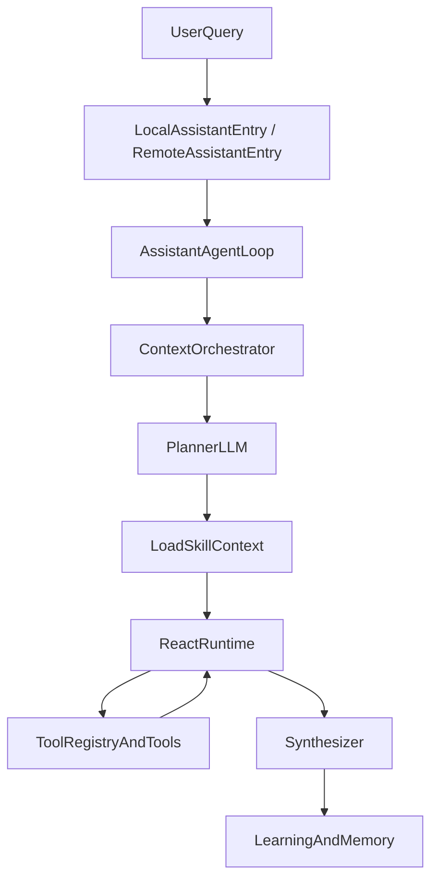

# 小趣私人助理：框架、流程与原理

> **定位**：小趣私人助理增量开发三类核心文档之一  
> **必读顺序**：先读本文，再读 `PERSONAL_ASSISTANT_SKILL_AND_TOOL_EXTENSIBILITY.md`，最后读 `PERSONAL_ASSISTANT_DESIGN_AND_CONSTRAINTS.md`

---

## 1. 产品定位与总原则

小趣私人助理是用户的个人全能助理，不是平台客服，也不是靠规则堆起来的垂类机器人。

- `LLM-first`：意图识别、技能选择、检索策略与阶段推进以模型决策为主
- `Runtime-thin`：`assistant_agent_loop`、`local_phase_execution_owner`、`react_runtime`、`tool_registry` 负责编排、守卫、解析与回放，不承担垂类知识
- `Skill-centered`：垂类知识、约束、示例、工具策略、对话状态机沉淀在 skill 资产
- `Metadata-driven`：工具文案、工具权限、提示词模板、输出契约、检索策略以 metadata 或 prompt asset 为真相源
- `No-fake-answer`：没有证据就说明边界，不伪造实时结果

---

## 2. 端到端处理流水线



### 2.1 关键阶段

1. `LocalAssistantEntry` / `RemoteAssistantEntry` 接收请求，并将会话绑定到单一 backend。
2. `ContextOrchestrator` 组装会话摘要、长期记忆、位置与槽位提示。
3. Planner 读取 skill catalog，由模型输出 `primaryDomainId`、`mode`、`queryNormalization`、`slotFillPlan`。
4. 运行时按 `domainId` 加载 skill 指令、dialogue 状态与可用工具。
5. `ReactRuntime` 执行 `Reason -> Act -> Observe -> Assess -> Decide` 循环。
6. `Synthesizer` 生成最终回答，并回写学习信号与长期记忆。

### 2.2 核心设计决策

- 意图路由不依赖关键词表，而是让 Planner 读取 skill 描述后自主选择。
- ReAct 循环之外有安全守卫，保证即使模型出错也不会无限循环或越权调用。
- 记忆召回发生在 ReAct 前，减少模型主动记忆检索的负担。
- 最终回答基于已有证据与结构化输出契约，不允许靠写死文案兜底。

---

## 3. ReAct 主循环

```text
Reason -> 产生结构化决策与 toolCalls
Act -> 校验预算、权限与循环风险后执行工具
Observe -> 截断和标准化工具观测结果
Assess -> 判断证据是否充分，是否需要补查、追问或终答
Decide -> 进入下一轮、切换阶段或结束
```

### 3.1 安全守卫

- `ToolLoopDetector`：阻断重复参数和无进展循环
- `ToolResultTruncator`：限制单次工具结果占用上下文
- `ToolExecutionGuard`：统一做权限、确认、预算和安全检查

### 3.2 运行时职责边界

运行时只负责：

- 编排阶段与消息
- 调用模型与工具
- 记录 trace / process / stream 事件
- 校验结构化响应

运行时不负责：

- 垂类知识推断
- 垂类特判和垂类兜底
- 用户可见文案策略
- 提示词正文拼装规则的第二套真相源

---

## 4. Prompt Stack 与上下文注入

### 4.1 Prompt Assets

- 全局基线模板：`stack.identity`、`stack.safety`、`stack.persona`、`stack.tool_policy`
- 阶段模板：`planner.*`、`synthesizer.*`、`web.*`
- 阶段输出契约：`phase.output_contract.*`

### 4.2 注入原则

- 指令先于数据
- 固定层优先于动态层
- 数据贴近用户消息
- 模板正文必须资产化，运行时代码只引用模板 ID 与变量绑定

---

## 5. Skill、Tool、Memory 在主流程中的位置

### 5.1 Skill

- 提供域说明、域约束、对话状态机、示例和检索策略
- 通过 `domainId` 被加载，而不是在 runtime 里硬编码 if/switch

### 5.2 Tool

- 通过工具元数据与注册表暴露能力
- 运行时根据 metadata 和权限矩阵做可调用性判断

### 5.3 Memory 与学习闭环

- 每轮结束回写摘要与画像标签
- 下一轮开始按 query 召回相关记忆
- 学习信号服务于后续个性化，不应在 engine 中被写成垂类经验规则

---

## 6. 关键代码与资产索引

### 6.1 运行时

- `quwoquan_app/lib/assistant/application/assistant_providers.dart`
- `quwoquan_app/lib/assistant/application/assistant_gateway.dart`
- `quwoquan_app/lib/assistant/application/local_assistant_entry.dart`
- `quwoquan_app/lib/assistant/application/remote_assistant_entry.dart`
- `quwoquan_app/lib/assistant/application/assistant_edge_service.dart`
- `quwoquan_app/lib/assistant/runtime/assistant_runtime.dart`
- `quwoquan_app/lib/assistant/application/assistant_journey_projector.dart`
- `quwoquan_app/lib/assistant/application/assistant_stream_projector.dart`
- `quwoquan_app/lib/assistant/contracts/assistant_turn_contract.dart`
- `quwoquan_app/lib/assistant/contracts/process_protocol.dart`

### 6.2 Skill / Tool / Prompt

- `quwoquan_app/lib/assistant/skills/assistant_skill_runtime.dart`
- `quwoquan_app/lib/assistant/skills/skill_manifest.dart`
- `quwoquan_app/lib/assistant/tools/tool_schema.dart`
- `quwoquan_app/lib/assistant/capabilities/capabilities.dart`
- `quwoquan_app/assets/assistant/skills/`
- `quwoquan_app/assets/assistant/tools/catalog/tool_catalog.meta.json`
- `quwoquan_app/assets/assistant/prompts/`

更深层历史实现仍可能位于 `quwoquan_app/lib/personal_assistant/`，但当前开发入口统一以 `quwoquan_app/lib/assistant/` 为准。

**禁止**：不得再引入第二份 owner / gateway 主链；编排统一以 `orchestration/assistant_agent_loop.dart`、`orchestration/local_phase_execution_owner.dart` 与各 phase 为准。

### 2.3 架构升级目标（World-Class）

- **等待体验**：用户在 30–60 秒长等待期间持续看到可信、用户语言、可解释的工作说明，过程流不出现长时间空白
- **Single-pass-first**：默认一次深理解后，先产出 2–4 路互补检索 lanes，再并行执行；replan 仅作例外补救
- **多路检索设计**：`SearchPlanItem` 按证据维度驱动，不再只是 query 变体
- **Process narrative**：phase / trace 统一投影到 canonical `AssistantJourney`，只保留用户可理解的阶段、里程碑与来源摘要

---

## 7. 与其他核心文档的关系

- 扩展 Skill 与 Tool：见 `PERSONAL_ASSISTANT_SKILL_AND_TOOL_EXTENSIBILITY.md`
- 设计、开发、测试与门禁约束：见 `PERSONAL_ASSISTANT_DESIGN_AND_CONSTRAINTS.md`

---

## 8. 参考旧文档

以下文档保留为详细参考，但不再作为第一入口：

- `architecture_overview.md`
- `react-agent-tool-lifecycle-spec-v4.md`
- `prompt-template-architecture-v2.md`
