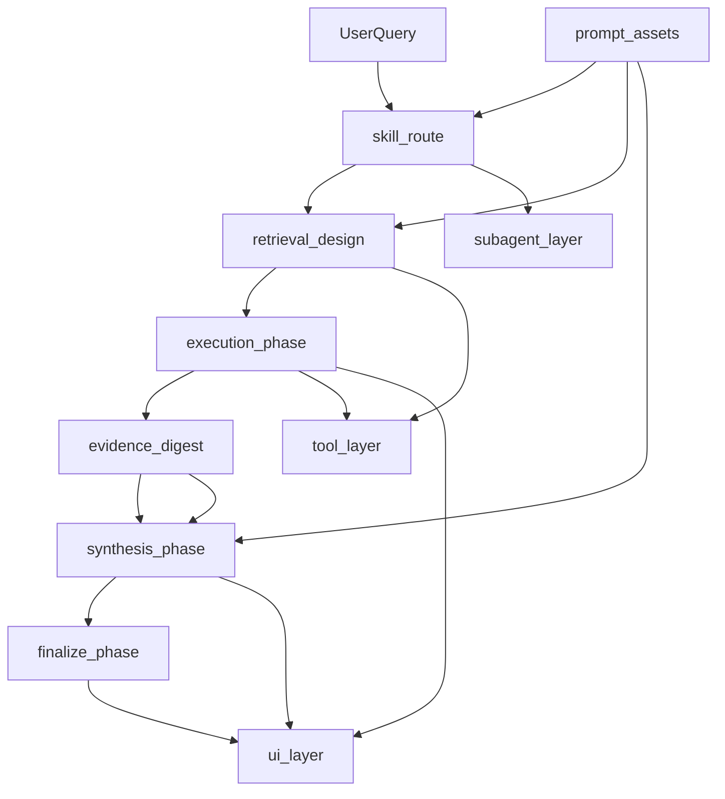
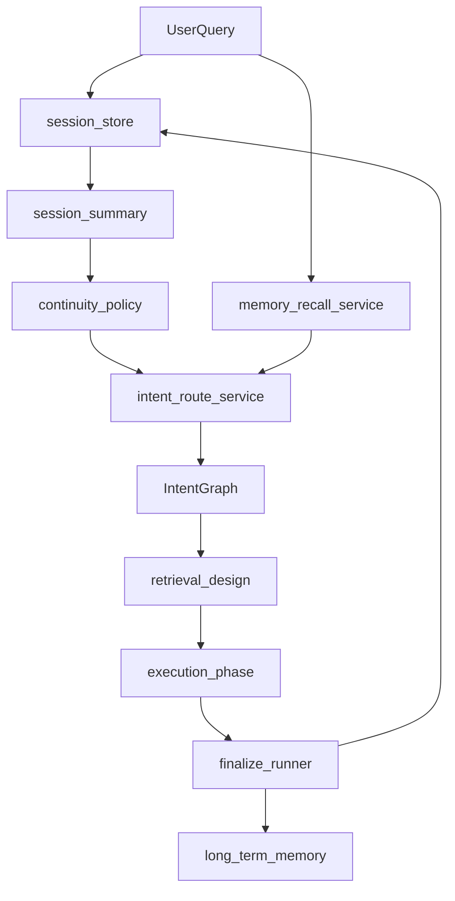
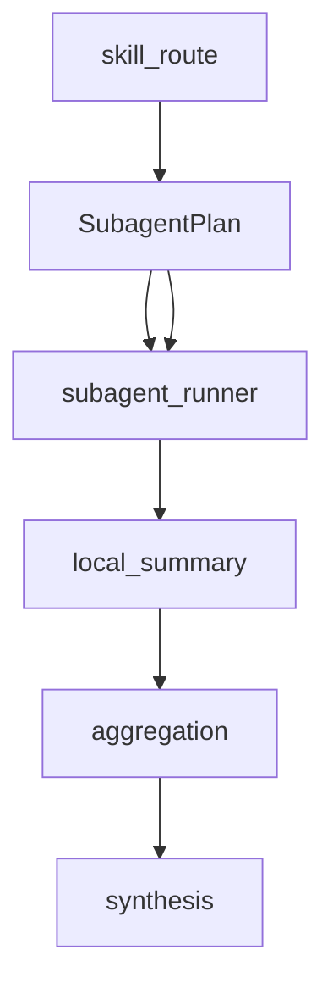
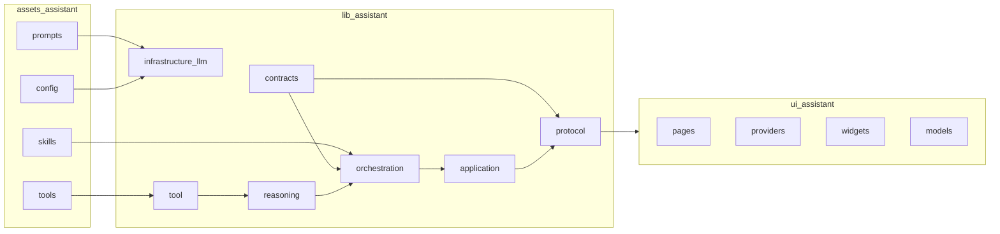

# 小趣私人助理：目录级设计文档

> **状态**：Phase 0 Frozen / Phase 1 Boundary 收口中
> **用途**：冻结端侧 assistant 工程目录、模块职责、模型交互、工具交互、UI 叙事与 multi-agent 协同边界
> **适用范围**：`quwoquan_app/lib/assistant/`、`quwoquan_app/assets/assistant/`、`quwoquan_app/lib/ui/assistant/`、`quwoquan_app/test/assistant/`
> **关联规格**：`PERSONAL_ASSISTANT_DESIGN_AND_CONSTRAINTS.md`、`PERSONAL_ASSISTANT_SKILL_AND_TOOL_EXTENSIBILITY.md`、`PERSONAL_ASSISTANT_SKILL_MULTI_AGENT_SPEC.md`

---

## 1. 设计目标

本设计用于把小趣私人助理从“单一大编排文件驱动”重构为“目录级分层协同”的工程结构。目标不是单纯拆文件，而是让每一类职责回到自己的目录、自己的 typed contract 和自己的 codec / runtime / presentation 边界。

### 1.1 核心目标

- 所有请求统一走 skill 主导主线，默认分支也必须是系统级默认 skill
- 模型交互、工具交互、subagent 执行、UI 叙事、结构化响应分别独立
- `Map<String, dynamic>` 只存在于各自输入输出边界与 codec 层，不进入编排核心
- `assistant_pipeline_engine.dart` 只保留编排入口，不再承载实现堆叠
- multi-agent 并行执行时，子 agent 的局部输入、局部总结、证据采纳、失败挂起必须独立
- 里程碑 3 的输入必须由里程碑 2 直接产出 typed `SubagentPlan`，不能靠 engine 补洞

### 1.2 Phase 0 / Phase 1 冻结边界

#### Phase 0：目录级 SSOT 冻结

Phase 0 只冻结“谁负责什么”，不再扩展新实现细节：
- `PERSONAL_ASSISTANT_DESIGN_AND_CONSTRAINTS.md`、`PERSONAL_ASSISTANT_SKILL_MULTI_AGENT_SPEC.md`、`PERSONAL_ASSISTANT_SKILL_MULTI_AGENT_TASK_TEMPLATE.md` 作为当前助理主线 SSOT
- `intent` / `session` / `memory` 三条能力线的目录归位原则
- `assets/assistant/prompts/`、`assets/assistant/skills/`、`assets/assistant/tools/` 的职责边界
- `lib/assistant/orchestration/`、`lib/assistant/tool/`、`lib/assistant/protocol/`、`lib/ui/assistant/` 的单向职责边界
- 禁止把兼容桥、第二套 prompt 真相源或垂类 if/switch 再塞回主编排核心

#### Phase 1：模板变量与 prompt 键名收口

Phase 1 只冻结“模型能看到什么”，不扩展模型参数面：
- prompt 键名以 `assistant_pipeline_prompt_keys.dart` 为唯一来源
- runtime / state 键名以 `assistant_pipeline_state_keys.dart` 为唯一来源
- `assistant_pipeline_template_builder.dart` 只负责阶段输入组装，不负责业务判定
- `Map<String, dynamic>` 只保留在 IO / codec / prompt 边界，不进入编排核心
- 新增模型输入字段时，优先收进 typed contract，再落到模板组装，不再散落 string literal

### 1.2 非目标

- 不在 runtime 中新增第二套 prompt 语义真相源
- 不在 engine 中维护垂类规则、关键词路由或硬编码模板片段
- 不保留 compatibility bridge 作为中间妥协层
- 不把 UI 叙事直接从 trace 原样透出，必须经过投影层

---

## 2. 总体架构

### 2.1 分层总览



### 2.2 三条主线

1. **Skill 主导主线**：所有请求先进入 skill 路由，再决定是否进入多 skill 并行、系统兜底 skill 或继续单 skill 主线。
2. **工具执行主线**：搜索、web search、web fetch、设备工具等只做执行和返回，不做成答判断。
3. **用户叙事主线**：用户看到的是连续叙事、进度、检索量、接纳量、耗时、局部成答和最终答案，而不是内部 phase / trace 的原样输出。

---

## 3. 工程目录与职责归位

### 3.1 `assets/assistant/`

#### `assets/assistant/prompts/`

职责：
- 管理所有模型提示词正文
- 管理 prompt stack、阶段模板、输出契约与 few-shot 示例
- 作为模型交互的唯一文本真相源

建议子目录：

```text
assets/assistant/prompts/
├── stack/
├── contracts/
├── stages/
│   ├── understand/
│   ├── retrieval/
│   ├── execute/
│   ├── digest/
│   ├── synthesize/
│   └── finalize/
└── session/
```

职责边界：
- `stack.*` 只定义全局约束与身份
- `contracts/*` 只定义阶段输出结构
- `stages/understand/*` 只做理解、路由、澄清、下一步动作
- `stages/retrieval/*` 只做搜索词与检索设计
- `stages/execute/*` 只做工具与子任务执行约束
- `stages/digest/*` 只做证据裁剪与摘要
- `stages/synthesize/*` 只做成答与下一步建议
- `session/*` 只做跨轮摘要与连续性材料

#### `assets/assistant/skills/`

职责：
- 管理 skill 资产
- 表达领域 / 子领域 / skill 的层级结构
- 表达 skill 的目标、边界、工具约束、few-shot、状态机与输出要求

规范：
- 领域必选，子领域可选
- 每个子领域只展示 1 到 5 个推荐 skill
- 模型可一次选择多个 skill，标记 primary / supporting
- 未选中具体 skill 时由系统级默认 skill 承接

建议结构：

```text
assets/assistant/skills/{domain}/
├── {skill}/
│   ├── SKILL.md
│   ├── references/
│   ├── dialogue/
│   ├── scripts/
│   └── config/
└── {subdomain}/
    └── {skill}/
```

#### `assets/assistant/tools/`

职责：
- 管理 tool metadata
- 管理工具描述、权限、调用约束、输入输出说明
- 作为工具 schema 的唯一配置真相源

#### `assets/assistant/config/`

职责：
- 管理运行时配置
- 管理 react policy、observability schema、progress policy、retrieval policy
- 只给代码读，不直接给模型读

---

### 3.2 `lib/assistant/`

#### `lib/assistant/contracts/`

职责：
- 管理所有 typed contract
- 作为模型输出、工具输入、运行时状态、UI 投影的数据载体

应保留的核心类型：
- `IntentGraph`
- `QueryTask`
- `SubagentPlan`
- `AssistantTurnOutput`
- `AssistantToolResultRow`
- `AssistantRoundTrace`
- `RunArtifacts*`
- `SynthesisReadinessResult`

约束：
- 新增字段优先进 contract，不直接进 engine 内部 Map
- contract 负责 `fromJson` / `toJson`，但不承担业务规则

#### `lib/assistant/infrastructure/llm/`

职责：
- 管理模型 provider
- 管理 prompt stack 拼接
- 管理 tool schema wire
- 管理模板加载和调用

原则：
- provider 只做模型交互和 prompt 组装
- 不做业务决策

#### `lib/assistant/tool/`

职责：
- 工具 schema、工具注册、工具 metadata、工具执行、工具轨迹编码
- 搜索、web search、web fetch、设备工具统一归位

#### `lib/assistant/reasoning/`

职责：
- 管理路由、证据评估、运行时判定、后验收口
- 负责把“模型输出”转成“运行时决策”

#### `lib/assistant/orchestration/`

职责：
- 管理 assistant 主编排
- 管理 phases
- 管理 pipeline 组合与状态传递

其中：
- `assistant_agent_loop.dart` 是外部主入口
- `assistant_pipeline_engine.dart` 只能是编排入口，不再是所有实现的堆叠仓库

#### `lib/assistant/application/`

职责：
- 管理流式投影、journey 投影、process timeline 投影
- 管理 trace 到 UI 状态的 reducer

#### `lib/assistant/protocol/`

职责：
- 管理 assistant turn、display state、timeline、persisted turn 等协议投影
- 管理 UI 可消费的稳态输出

#### `lib/ui/assistant/`

职责：
- 用户界面入口
- 过程展示
- 最终答案展示
- 抽屉栏、时间线、气泡、过程面板

#### `lib/assistant/generated/`

职责：
- 只放 codegen 产物
- 不允许手写业务逻辑

### 3.3 Intent / Session / Memory 模块补全

这一节补齐工程目录中最容易被混淆但必须明确归位的三条能力线：**意图管理**、**会话管理**、**记忆管理**。它们都属于 assistant 的核心能力，但职责不同，不能混成一层。

#### 3.3.1 Intent 模块

意图模块负责把用户原始输入变成可执行的路由与检索起点，产出 `IntentGraph`、`QueryTask`、路由技能选择和连续性所需的最小上下文。

建议目录：

```text
lib/assistant/intent/
├── intent_route_service.dart
├── intent_graph_builder.dart
├── intent_route_catalog.dart
├── intent_continuity_policy.dart
└── intent_route_validator.dart
```

职责边界：
- `intent_route_service.dart`：统一承接用户问题到 skill 路由
- `intent_graph_builder.dart`：从模型输出或预计算载荷构建 `IntentGraph`
- `intent_route_catalog.dart`：提供目录树摘要、推荐 skill、路由元数据
- `intent_continuity_policy.dart`：给出当前轮是否延续、是否补查、是否澄清的策略输入
- `intent_route_validator.dart`：校验 route 输出是否满足后续检索与 subagent 输入要求

与现有代码的对应关系：
- `intent/model_output_extractors.dart` 负责从模型输出或预计算载荷构建 `IntentGraph`
- `understand_phase.dart` 负责调用理解阶段模型并产出 `IntentGraph`
- `reasoning/planner/problem_framer.dart` 负责把问题整理成规划载荷
- `context/assembly/answer_boundary_resolver.dart` 负责基于 `IntentGraph` 约束证据边界
- `execution_preparation_resolver.dart` 负责把 `IntentGraph` 转成执行壳和工具约束

#### 3.3.2 Session 模块

会话模块负责“这一段对话从哪里开始、最近发生了什么、当前这一轮应该继承哪些上下文”。它管理的是会话级状态，不负责长期记忆检索，也不负责技能选择。

建议目录：

```text
lib/assistant/conversation/session/
├── assistant_session_store.dart
├── session_summary_builder.dart
├── recent_dialogue_rounds.dart
├── assistant_session_wire.dart
└── session_transcript_service.dart
```

职责边界：
- `assistant_session_store.dart`：负责会话持久化、读写、append、descriptor
- `session_summary_builder.dart`：负责近期轮次摘要与会话摘要
- `recent_dialogue_rounds.dart`：负责最近 N 轮结构化提取
- `assistant_session_wire.dart`：负责会话列表/详情的 wire 结构
- `session_transcript_service.dart`：负责把会话历史转成可注入的 transcript / summary 材料

与现有代码的对应关系：
- `assistant/session/assistant_session_manager.dart` 当前主要承担会话集合、topic 语义和偏好事实读出职责
- `assistant/session/assistant_session_store.dart` 负责会话持久化、读写、历史归一化与降级清洗
- `assistant/session/session_summary_builder.dart` 负责近期轮次摘要与会话摘要
- `session/session_transcript_service.dart` 负责把会话历史转成可注入的 transcript / summary 材料
- `protocol/recent_dialogue_rounds.dart` 可作为最近轮次的纯函数实现
- `protocol/assistant_session_wire.dart` 已是会话 wire 协议边界

#### 3.3.3 Memory 模块

记忆模块分成短期记忆与长期记忆。短期记忆属于当前会话的连续性上下文，长期记忆属于跨会话的偏好、事实、召回与学习信号。

建议目录：

```text
lib/assistant/memory/
├── short_term/
│   ├── session_context_memory.dart
│   ├── session_snapshot_memory.dart
│   └── turn_carryover_state.dart
├── long_term/
│   ├── assistant_memory_repository.dart
│   ├── vector_store.dart
│   ├── memory_recall_service.dart
│   └── memory_retrieval_provider.dart
└── preference/
    └── preference_fact_service.dart
```

职责边界：
- `short_term/`：保存当前会话内的摘要、轮次、未完成槽位、连续性状态
- `long_term/`：保存向量记忆、文本记忆、跨会话召回
- `preference/`：保存偏好事实、学习信号、长期偏好聚合

与现有代码的对应关系：
- `memory/long_term/assistant_memory_repository.dart` 是长期记忆主入口
- `memory/long_term/memory_embedding_service.dart` 负责文本 embedding 生成与 fallback
- `memory/long_term/memory_recall_service.dart` 负责长期记忆召回结果封装
- `memory/long_term/memory_retrieval_provider.dart` 负责长期记忆在 retrieval 层的适配
- `memory/long_term/vector_store.dart` 是长期向量存储接口
- `memory/long_term/storage/objectbox_vector_store.dart` 是具体存储实现
- `FinalizeRunner` 负责把答案、学习标签等写入长期记忆
- `AssistantSessionManager` 负责短期会话语义；持久化与历史归一化已下放到 `assistant_session_store.dart`
- `RecallCoordinator` 是 skill shortlist recall，不属于长期记忆模块，必须与 `memory_recall_service.dart` 分开命名

#### 3.3.4 意图 / 会话 / 记忆的协同关系



协同原则：
- **Intent** 先决定“要做什么”
- **Session** 决定“这轮对话继承什么”
- **Memory** 决定“跨轮还能记住什么”
- 三者都不能直接替代对方
- Skill 回路是意图主线的一部分，不是记忆回路

#### 3.3.5 需要明确分离的几个容易混淆点

1. `RecallCoordinator` 是 skill 召回，不是长期记忆召回。
2. `AssistantSessionManager` 是会话存储与摘要，不是长期记忆库。
3. `ContextContinuityPolicy` 是连续性政策，不是历史本体。
4. `ConversationStateKernel` 是轮末状态决策，不是 session store。
5. `FinalizeRunner` 负责写记忆，不负责理解和路由。

---

## 4. 模型交互设计

### 4.1 Prompt 分层

每次模型调用的输入分为三层：

1. **Prompt Stack**：identity / safety / thinking policy / persona / tool policy
2. **阶段模板**：理解、检索设计、执行、证据摘要、成答、收尾
3. **动态注入层**：skill pack、dialogue script、session context、tool result、evidence context

### 4.2 模型交互流程

#### 4.2.1 `skill_route`

职责：
- 理解用户意图
- 选择 1 到 n 个 skill
- 决定是否澄清
- 输出路由叙事
- 生成 `selectedTargets`

输入：
- 用户原始问题
- 最近会话摘要
- 目录树摘要
- skill catalog
- 最小策略标记

输出：
- primary / supporting skill 列表
- `routeNarrative`
- `needClarify`
- `pendingClarifications`
- 每个目标 skill 的 `role`
- 每个目标 skill 的 `taskBrief`
- 每个目标 skill 的 `localContextSeed`

#### 4.2.2 `retrieval_design`

职责：
- 设计检索词
- 生成查询任务
- 生成证据优先级
- 约束 fresh/authority/coverage

输入：
- `IntentGraph`
- `QueryTask`
- 上轮检索结果
- skill 约束

输出：
- 搜索词
- 检索策略
- 证据优先级
- 补查建议

#### 4.2.3 `execution_phase`

职责：
- 调用工具
- 运行 subagent
- 记录 tool trace
- 产出局部执行结果

输入：
- 检索设计
- 工具预算
- subagent plan
- 运行时上下文

输出：
- tool trace
- tool result
- subagent result
- execution snapshot

#### 4.2.4 `evidence_digest`

职责：
- 从 tool result 中提取可采纳证据
- 合并 evidence ledger
- 标注缺口和不足

输入：
- tool results
- trace
- slot state
- retrieval policy

输出：
- evidence digest
- evidence gaps
- readiness hint

#### 4.2.5 `synthesizer.final_answer`

职责：
- 汇总理解、检索、工具、证据和 subagent 结果
- 输出自然语言答案和下一步建议

输入：
- `understandingSnapshot`
- `retrievalProcessing`
- `evidenceContext`
- `subagent summaries`
- `conversation spine`

输出：
- `assistant_turn`
- `userMarkdown`
- `result.summary`
- `nextAction`

#### 4.2.6 `finalize.response`

职责：
- 把稳定答案落盘
- 形成 UI 可消费的最终显示结构

输入：
- synthesis result
- display state
- diagnostics

输出：
- finalized run response
- persisted turn
- observability payload

---

## 5. 工具交互设计

### 5.1 工具链路总则

工具只负责执行，不负责判断是否成答。工具链路必须满足：

- 输入结构 typed
- 输出结构 typed
- 最终 wire 只在 codec 边界生成
- 工具结果进入 evidence / synthesis / UI 时都通过投影层，不直接散落在 engine 中

### 5.2 工具模块职责

#### `search`

- 输入：搜索词、过滤条件、freshness、authority、预算
- 输出：候选结果、引用、质量分、可采纳摘要
- 嵌入流程：retrieval_design -> execution -> evidence_digest

#### `web_search`

- 输入：自然语言 query、provider、freshness、约束
- 输出：搜索结果、引用、authority/freshness metrics
- 嵌入流程：tool execution -> evidence ledger -> synthesis

#### `web_fetch`

- 输入：URL、fetch 规则、引用目标
- 输出：网页正文摘要、引用、失败信息
- 嵌入流程：search 之后的精读 / 证据补全

#### `tool_result`

- 输入：工具执行结果
- 输出：标准化 observation / reference / trace
- 嵌入流程：trace -> evidence -> synthesis -> UI

### 5.3 工具边界文件职责

- `tool_schema.dart`：工具 contract
- `tool_registry.dart`：工具注册与执行
- `tool_metadata_registry.dart`：工具元数据
- `tool_retrieval_broker.dart`：检索 broker
- `websearch_tool.dart` / `web_fetch_tool.dart`：具体工具实现

---

## 6. Skill 增强主线

### 6.1 skill 作为会话资产

skill 不只是一个 prompt 文件，而是一套模型主导会话资产，包含：

- 目标
- 边界
- 状态机
- 工具约束
- few-shot
- 输出要求

### 6.2 skill 路由规则

- 所有请求统一进入 skill 路由
- 默认分支也必须落到系统级默认 skill
- 模型可一次输出多个 skill
- 选中 skill 后进入连续叙事，直到成答或 replan

### 6.3 skill 目录树与推荐入口

- 领域 / 子领域 / skill 三层
- 每个节点只展示 1 到 5 个推荐 skill
- 不使用规则召回、关键词硬过滤、硬阈值

### 6.4 skill 会话主线

1. `skill_route`
2. `skill_subagent_turn`
3. `skill_synthesis`

在这个主线下：
- 主要 skill 负责主方向
- supporting skill 负责补充视角
- 系统默认 skill 负责兜底

---

## 7. Multi-agent 设计

### 7.1 计划对象

`SubagentPlan` 是 multi-agent 的最小计划对象，必须至少包含：

- `domainId`
- `problemClass`
- `goal`
- `role`
- `taskBrief`
- `routeNarrative`
- `localContextSeed`
- `needClarify`
- `pendingClarifications`
- 预算字段

### 7.2 并行执行流程



### 7.3 子 agent 职责

每个子 agent 独立负责：
- 自己的检索设计
- 自己的工具调用
- 自己的证据采纳
- 自己的局部总结
- 自己的失败 / 挂起状态

### 7.4 汇总规则

最终汇总只消费：
- 各 subagent 的 `localSummary`
- 各 subagent 的 `acceptedEvidence`
- 各 subagent 的 `rejectedEvidence`
- 各 subagent 的 `missingSlots`
- 各 subagent 的 `failureReason`

不回放完整思考链，不保留重状态。

---

## 8. UI 叙事设计

### 8.1 用户看到的三层展示

1. **运行中主线**：理解、检索、执行、补查、等待、成答
2. **最终答案主线**：结论、解释、证据、下一步建议
3. **诊断主线**：trace、tool result、subagent progress、失败原因

### 8.2 UI 职责边界

#### `AssistantConversationController`
- 负责接收流式事件
- 负责写入 process timeline / journey
- 不负责拼装业务语义

#### `AssistantProcessTimeline`
- 负责阶段进度、耗时、搜索量、接纳量
- 负责运行中抽屉栏主显示

#### `AssistantDisplayStateProjection`
- 负责把 run artifacts 投影成稳定的展示态
- 负责最终答案区块的稳定渲染

#### `AssistantJourneyViewModel`
- 负责会话级叙事
- 负责阶段标签、条目、折叠信息的组合

#### `AssistantMessageBubble`
- 负责气泡呈现
- 负责成答文本、过程提示、运行态标签

### 8.3 叙事原则

- 运行中只显示过程事实，不显示内部推理
- 子 agent 不单独抢占主叙事主线
- 顶部抽屉只显示进度、耗时、检索量、接纳量
- 最终答案要保持连续叙事，不插固定占位话术

---

## 9. 当前目录到目标目录的职责映射

| 当前文件 / 目录 | 目标职责 | 处理方式 |
|---|---|---|
| `lib/assistant/orchestration/pipelines/assistant_pipeline_engine.dart` | 编排入口 | 收缩，只保留 orchestration |
| `lib/assistant/orchestration/pipelines/assistant_pipeline_structured_response_assembler.dart` | 结构化响应组装 | 保留并继续收口 |
| `lib/assistant/orchestration/pipelines/assistant_round_trace_codec.dart` | round trace codec | 保留并扩展 typed 边界 |
| `lib/assistant/orchestration/pipelines/assistant_pipeline_response_codec.dart` | Map/typed 编解码边界 | 保留，禁止扩成业务层 |
| `lib/assistant/orchestration/pipelines/assistant_pipeline_template_builder.dart` | 模型输入组装 | 保留，拆分阶段键名 |
| `lib/assistant/orchestration/phases/understand_phase.dart` | skill_route / 理解阶段 | 保留，移除冗余 map 逻辑 |
| `lib/assistant/orchestration/phases/retrieval_design_phase.dart` | 检索设计 | 保留，专注检索策略 |
| `lib/assistant/orchestration/phases/execution_phase.dart` | 执行阶段 | 保留，专注工具 / subagent 执行 |
| `lib/assistant/orchestration/phases/evidence_digest_phase.dart` | 证据摘要 | 保留，负责证据收口 |
| `lib/assistant/orchestration/phases/synthesis_phase.dart` | 成答阶段 | 保留，负责 answer synthesis |
| `lib/assistant/orchestration/phases/finalize_phase.dart` | 收尾阶段 | 保留，负责最终归档 |
| `lib/assistant/contracts/subagent_plan.dart` | 多 agent typed plan | 保留，继续强化 M3 gate |
| `lib/assistant/tool/` | 工具执行与 schema | 按工具职责继续拆分 |
| `lib/assistant/protocol/` | 展示态 / timeline / persisted turn | 只做协议投影，不做业务推理 |
| `lib/ui/assistant/` | 用户呈现 | 只消费投影结果，不反推业务状态 |

---

## 10. 目录级职责边界图



---

## 11. 里程碑与验收

### 11.1 里程碑 2

完成标准：
- `assistant_pipeline_engine.dart` 的旧 Map 职责已显著减少
- `SubagentPlan` 的里程碑 3 输入稳定可用
- round trace / structured response 有明确 codec / assembler 边界
- 多技能场景的路由、计划、回填仍可通过回归测试

### 11.2 里程碑 3

准入标准：
- `skill_route` 已稳定输出 `selectedTargets`
- `SubagentPlan` 可直接进入并行执行
- 每个 subagent 具备独立 `taskBrief`、`routeNarrative`、`localContextSeed`
- 子 agent 失败或挂起不会污染其他候选
- 汇总阶段只消费局部总结与采纳证据

### 11.3 最终验收（M6）

- 这是多 agent 主线的最终集成验收层，对应 `PERSONAL_ASSISTANT_SKILL_MULTI_AGENT_SPEC.md` 里的 Milestone 6
- 验收对象是一条完整问题链，而不是某一个单点 phase
- 编排入口不再堆叠实现细节
- Map 只存在于 IO / codec 边界
- Skill 增强主线与 multi-agent 主线一致
- UI 叙事、工具结果、trace、subagent 过程各自职责归位
- 后续新增 skill / tool / prompt / phase 时，不需要再改动 engine 主体结构

---

## 12. 后续实施顺序

1. 收缩 `assistant_pipeline_engine.dart`
2. 固化 `SubagentPlan`、round trace、structured response 的 typed 边界
3. 将模型模板按 `skill_route / retrieval_design / execution / digest / synthesis / finalize` 重排
4. 收口 tool runtime 与 search / web_fetch 的边界
5. 将 UI 叙事投影与 subagent 过程展示拆成独立模块
6. 进入里程碑 3 的并行 subagent 执行

