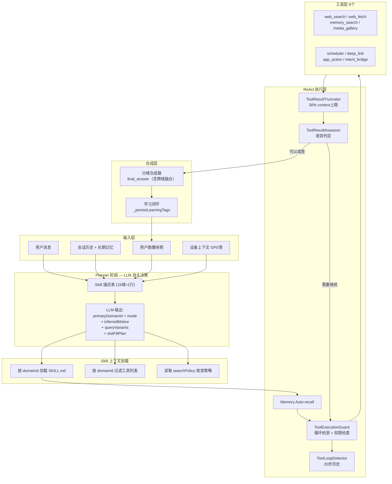

# 小趣私人助理 架构总览

> **版本**：v2.0 · **日期**：2026-03-07
> **受众**：小趣 App 开发团队
> **从属**：`specs/00_MASTER_DEVELOPMENT_FLOW.md` 端云一体化主线
>
> **核心文档收口**：当前助手增量开发请优先阅读以下三份核心文档：
> - `PERSONAL_ASSISTANT_ARCHITECTURE_AND_FLOW.md`
> - `PERSONAL_ASSISTANT_SKILL_AND_TOOL_EXTENSIBILITY.md`
> - `PERSONAL_ASSISTANT_DESIGN_AND_CONSTRAINTS.md`
>
> 本文档保留为历史详细参考，不再作为第一入口。
>
> **迁移说明**：当前端侧助理的公开入口已收口到 `lib/assistant/{application,domain,orchestration,capabilities,infrastructure,generated}`。`lib/personal_assistant/` 仍承载内部实现与兼容 wrapper，但不再作为新增 UI / provider / gateway 的首选依赖。

---

## 一、产品定位

小趣私人助理是**用户的个人全能助理**，而非平台客服或领域垂直机器人。

| 维度 | 定位 |
|---|---|
| 角色 | 私人顾问、生活管家、知识助手、任务执行者 |
| 场景 | 问答（qa）/ 任务执行（task）/ 两者兼有（hybrid） |
| 决策原则 | **LLM-first**：所有意图识别、技能选择、搜索策略由 LLM 自主判断，零规则硬编码 |
| 不做什么 | 不是趣我圈 App 的客服；不绑定单一垂类；不伪造数据 |

---

## 二、完整处理流水线



### 关键设计决策

| 决策 | 当前实现 | 原因 |
|---|---|---|
| 意图路由 | LLM 读 skill 描述表自主选择，无关键词规则 | 零维护成本；语义覆盖更全；支持跨域 |
| 收敛判定 | `ToolResultAssessor` + `_consecutiveLowQuality` 计数 | 防止低质量搜索无限循环 |
| 工具安全 | 三层：LoopDetector → Truncator → Guard | 对标 OpenClaw 生产级防御 |
| 记忆召回 | ReAct 前自动执行 `recallByText`，不需 LLM 主动调用 | 降低遗忘率；LLM 无需感知记忆接口 |
| 学习闭环 | 每轮从 `emergedTags` 持久化画像标签到 VectorStore | 画像随使用自动增强 |

---

## 三、15 域技能分类

LLM 从以下 15 个技能中自主选择，每个技能一行 `description` 是唯一路由依据。

| domainId | description | mode | searchPolicy.strategy |
|---|---|---|---|
| `weather` | 天气查询、出行建议、穿衣推荐、空气质量、紫外线指数 | hybrid | realtime |
| `travel_transport` | 交通路线、地铁公交、打车导航、实时路况 | hybrid | realtime |
| `travel_planning` | 旅行攻略、景点推荐、酒店机票、签证行程规划 | hybrid | research |
| `local_life` | 餐厅美食、本地服务、周边推荐、生活便民 | hybrid | realtime |
| `calendar_task` | 日程管理、提醒设置、待办跟踪、会议安排 | task | none |
| `knowledge_general` | 百科知识、原理解释、科普常识、事实查询 | qa | research |
| `finance_consumer` | 理财分析、基金/股票/保险对比、投资建议、贷款预算规划 | qa | research |
| `health_wellness` | 健康咨询、养生建议、运动指导、症状科普 | qa | research |
| `education_learning` | 学习辅导、考试备考、知识答疑、技能学习 | qa | research |
| `work_productivity` | 工作效率、职业规划、项目管理、简历写作 | hybrid | research |
| `shopping_decision` | 选购对比、性价比分析、测评推荐、下单决策 | hybrid | research |
| `policy_public_service` | 政策解读、办事流程、社保公积金、政务服务 | qa | research |
| `emotion_companion` | 情感陪伴、恋爱家庭、心理疏导、关系建议 | qa | none |
| `fortune_astrology` | 星座运势、占卜塔罗、八字运程、趣味解读 | qa | none |
| `search_fallback` | 通用搜索兜底（系统级默认 skill），无明确匹配时使用 | qa | research |

**废弃域**（已合并或下线）：`huawei_cloud_qa`、`social_companion_chat`、`relationship_matchmaking`、`family_parenting`、`divination_fortune`、`astrology_constellation`

---

## 四、9 工具体系

| 工具名 | 能力 | 需用户确认 | 主要适用域 |
|---|---|---|---|
| `web_search` | 网络检索，支持 `queryVariants` 多路并发 | 否 | 所有信息查询域 |
| `web_fetch` | 抓取指定 URL 正文 | 否 | knowledge / finance |
| `memory_search` | 向量语义搜索用户长期记忆 | 否 | 所有域（个性化） |
| `SystemContextEnvelope` | 系统默认注入时间、位置摘要、设备与权限信息 | 否 | weather / local_life / calendar_task |
| `media_gallery` | 访问设备相册媒体 | 否 | 媒体处理 |
| `intent_bridge` | iOS AppIntent / Android Intent 跳转 | 是 | 系统操作 |
| `scheduler` | 日历事件 CRUD（native EventKit/AlarmManager） | 是 | calendar_task |
| `deep_link` | App 内路由 + 外部 URL Scheme 跳转 | 否 | 跨域跳转 |
| `app_action` | 打电话/发短信/邮件/导航/剪贴板 | 是 | 执行类任务 |

**工具权限配置**：`assets/assistant/tools/catalog/tool_permissions.json`

---

## 五、Prompt Stack 分层

LLM 每次调用的 system prompt 由以下层叠加组装（`llm_provider._resolvePlannerPrompt()`）：

```
L1  stack.identity.md           ← 身份与使命（固定层）
L2  stack.safety.md             ← 安全、降级与危机边界
L3  stack.persona.md            ← 全局人格与语气基线
L4  stack.tool_policy.md        ← 工具权限与执行约束
L5  phase.output_contract.*.md  ← 分阶段输出契约

阶段模板（动态层，每轮变化）：
  ├── planner.global_plan.md         ← Planner 阶段：注入 {{skillCatalog}} + {{contextEnvelope}}
  └── synthesizer.final_answer.md    ← Synthesis 阶段：生成用户可读答案

运行时附加上下文注入（phase owner 组装）：
  ├── <memory_recall>recalled texts</memory_recall>
  ├── <session_history>summarized history</session_history>
  └── <capability_catalog>tool descriptions</capability_catalog>
```

跨域融合已并回当前 answer 合成链路，不再使用独立的 `synthesizer.multi_skill_fusion.md`；流式由运行时事件通道承载，`assistant_turn` JSON 只保留稳态语义，嵌套 `understanding.streamText` / `answerProcessing.streamText` 不再作为流式真相源。

**关键变量**（注入 planner）：
- `{{skillCatalog}}`：所有 15 个 skill 的 `domainId: description [mode=xxx]` 列表
- `{{contextEnvelope}}`：GPS、时间、会话摘要、槽位 hints
- `{{userProfileSnapshot}}`：用户画像标签快照
- `{{domainLearningSignals}}`：当前域历史反馈信号

---

## 六、Memory 与学习闭环

```
每轮对话结束
    │
    ├─ rememberText(displayText)          ← 存对话摘要文本到 VectorStore
    │
    ├─ _persistLearningTags(emergedTags)  ← 存 LLM 产出的画像标签
    │     格式: "用户画像标签: city=深圳; interest=科技股; ..."
    │
下轮对话开始
    │
    └─ recallByText(query, limit=3)       ← Auto-recall：ReAct 前自动执行
          注入 <memory_recall> 块到 system 消息
```

记忆存储：`AssistantMemoryRepository` → `ObjectBoxVectorStore`（文件路径：`~/.assistant/vector_store.json`）

---

## 七、关键文件索引

| 职责 | 文件路径 |
|---|---|
| 端侧公开 Provider 入口 | `lib/assistant/application/assistant_providers.dart` |
| 端侧公开 Gateway 入口 | `lib/assistant/application/assistant_gateway.dart` |
| 端侧公开能力编排入口 | `lib/assistant/application/local_assistant_entry.dart` / `lib/assistant/application/remote_assistant_entry.dart` |
| 端侧 edge assistant 新入口 | `lib/assistant/application/assistant_edge_service.dart` |
| 端侧公开 runtime | `lib/assistant/runtime/assistant_runtime.dart` |
| 端侧对外 API 网关 | `lib/assistant/api/assistant_api_gateway.dart` |
| 当前 typed contract 入口 | `lib/assistant/contracts/assistant_turn_contract.dart` |
| 当前 process protocol 入口 | `lib/assistant/contracts/process_protocol.dart` |
| 当前用户旅程投影入口 | `lib/assistant/application/assistant_journey_projector.dart` |
| 当前渠道 Adapter SPI | `lib/assistant/spi/assistant_adapter_runtime.dart` |
| 当前 Provider/告警治理 | `lib/assistant/observability/assistant_observability_runtime.dart` |
| 技能分类配置 | `assets/assistant/prompts/domain_routing/domain_routing_catalog.json` |
| Planner 提示词 | `assets/assistant/prompts/global/planner.global_plan.md` |
| 工具元数据 | `assets/assistant/tools/catalog/tool_catalog.meta.json` |
| 工具权限 | `assets/assistant/tools/catalog/tool_permissions.json` |

更深层 legacy implementation 仍位于 `lib/personal_assistant/`，但仅作为兼容实现参考，不再作为新增依赖入口。

---

## 八、相关文档

- [小趣私人助理：框架、流程与原理](PERSONAL_ASSISTANT_ARCHITECTURE_AND_FLOW.md) — 当前架构主入口
- [小趣私人助理：Skill 与 Tool 可扩展机制](PERSONAL_ASSISTANT_SKILL_AND_TOOL_EXTENSIBILITY.md) — 当前扩展入口
- [小趣私人助理：设计与开发约束](PERSONAL_ASSISTANT_DESIGN_AND_CONSTRAINTS.md) — 当前必读约束入口
- [**真相源冻结声明**](canonical_truth_sources.md) — 唯一真相源 SSOT、Legacy 兼容层、执行约束（开发必读）
- [Runtime 残留审计基线](runtime_audit_baseline.md) — 当前字符串治理后的热点清单与迁移基线
- [ReAct + 工具生命周期规格 v4](react-agent-tool-lifecycle-spec-v4.md) — ReAct 循环详细规格、工具 Hook 链
- [API 与集成指南](api_and_integration.md) — 外部 API 端点、Adapter SPI、OpenClaw/Feishu 接入
- [运营与部署手册](operations_and_deployment.md) — 环境配置、模型接入、发布流程、灰度回滚
- [Skill 目录结构设计](skill-directory-and-progressive-disclosure-design.md) — 技能资产目录规范
- [开发与交付标准](skill_development_standard.md) — 全链路开发流程规范
