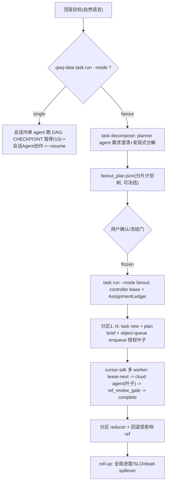

# Fan-out 编排脚手架规范（单/多 agent 统一调度）

> 本文件描述跨垂类通用的「大规模分层 fan-out 编排」机制：在现有 `qwq-data task` 命令族上用
> `--mode single|fanout` 统一单/多 agent 调度，**不新增 `orchestrate` 顶层命令**。
> 单篇隔离与并行执行的底层机制见 [`subagent_scheduler_spec.md`](subagent_scheduler_spec.md)；
> 内容流水线 DAG 与 CHECKPOINT 语义见 [`content_pipeline_spec.md`](content_pipeline_spec.md)。
> 垂类写法见 SOP，本批特例见任务 notes。

## 1. 设计定型

- 单/多 agent **共用同一套 CLI 动词与同一 DAG**，差异只在「驱动者 + 并发 + CHECKPOINT 接缝」，
  不在内容指令本身。**单模式 = fanout 计划的 1 分区、并发 1 特例**（退化等价，契约测试断言，杜绝两套实现）。
- 统一入口为现有 `qwq-data task run` 加 `--mode single|fanout`；分解能力作为 `task` 子命令
  `qwq-data task decompose`（同族，不是新顶层）。
- 分片**不绑定固定行政区划**；分片维度由 planner agent 在**需求澄清阶段**按用户指令决定
  （可省、可区县、可类别、可批大小）。
- 两阶段：**A 分解+冻结**（agent 驱动、可澄清）→ 用户确认 → **B 确定性分层调度**（执行冻结计划，幂等可重放）。
- 复用既有基建，不另起炉灶：`task/run.py` DAG、`task/object_queue.py`、`_common/handoff.py`
  执行合约、Ralph 出口门、单一 gate library、`.cursor/hooks.json` sensor。
- 冻结计划进入阶段 B 后，运行中不再请求人工确认；所有冲突写 ledger，批后 Reconciler 裁决。
- L1 Batch Controller 是同一 `task+batch` 唯一治理者，必须先拿非阻塞 controller lease；第二 controller 直接 `GATE_BLOCK`。
- L1 通过 `AssignmentLedger` 向 L2/L3 下发明确 scope、owner、读写根、预算、deadline；Partition Agent 和 Object/Subagent 不得自行扩展职责边界。
- 支持切片轴：地理（全国→省→市州→区县→景点）、网站（网站→栏目/frontier→URL→sourceUnit）、内容对象（homepage/article/image/video）和混合轴。四川百级默认采用地理主轴：`四川省 -> 市/州 -> 区县/景点 -> sourceUnit -> 内容对象`。

## 2. 阶段 A：分解 + 冻结（agent 驱动，仅 fanout 模式）

- 计划 schema：[`schema/orchestrate/fanout_plan.schema.json`](../schema/orchestrate/fanout_plan.schema.json)
  —— 根目标、垂类、分片维度（人读标签）、递归分区节点、每节点叶子清单、defaults（stage/strategy/concurrency/batchSize/budget）、
  coverageTargets、status(draft|frozen|running|done)。
- 计划库：[`scripts/_common/fanout_plan.py`](../scripts/_common/fanout_plan.py) —— 构建/加载/校验：
  - `leaf_ref(entityType, name)` 派生稳定 ref（`entityType__name`，`/`→`_`），`object-queue jobId` 据此派生。
  - 校验门：叶子去重（`leaf_dedup_issues`）、分区互斥（`partition_mutex_issues`，同叶子不得跨分区）、
    覆盖目标（`coverage_issues`）、空分区/发现门（`discovery_gate_issues`）。
  - `freeze_plan`：发现门全过 + `--confirm` 后 `status=frozen`，冻结后即阶段 B 唯一真相源。
- CLI：[`scripts/task/decompose.py`](../scripts/task/decompose.py) —— `qwq-data task decompose`：
  `init`（落骨架）/ `add-partition`（递归 `--parent`）/ `add-leaves`（幂等去重）/
  `load`（从 agent 发现产物 JSON 批量合并）/ `show`（摘要 + 发现门）/ `freeze`。

## 3. 阶段 B：确定性分层调度（task run --mode fanout）

- `qwq-data task run` 入参：`--mode single|fanout`（默认 single）、`--plan <id>`、
  `--strategy <...>`、`--concurrency N`、`--batch-size N`。
  - `--mode single`（默认）：完全等于现状——单会话顺序跑 DAG，CHECKPOINT 暂停(退出码 10)→会话内 Agent 创作→`--resume`。
  - `--mode fanout`：走冻结计划，对每分区 `task new` + `plan brief`（建 task/batch + content_plan_packet）→
    `object-queue enqueue` 叶子 → 驱动 fan-out 策略；状态落
    [`_shared/orchestrate/{planId}/dispatch_state.json`](../scripts/_common/paths.py)（幂等可重放）。
- 调度实现：[`scripts/task/fanout_dispatch.py`](../scripts/task/fanout_dispatch.py)
  —— `ensure_partition_task`（幂等建 committed 任务）+ `enqueue_partition_leaves`（入队叶子）+ `dispatch`（编排）。
- 策略库：[`scripts/_common/fanout_strategies.py`](../scripts/_common/fanout_strategies.py)，「多种方式一批拉起」一键切换：

| 策略 | 含义 | 并行度 / 成本 |
|---|---|---|
| `by-partition` | 每分区一个 orchestrator agent，各自消费本分区队列、拉叶子 subagent | 中并行 / 中成本 |
| `flat-pool` | M 个 worker 进程跨全分区 lease 叶子（最省 agent 数） | 可控并行 / 最低成本 |
| `by-leaf` | 每叶子一个 cloud agent（最大并行） | 最高并行 / 最高成本 |
| `by-batch` | 叶子按 N 切块，每块一个 agent | 批量并行 / 折中 |

- **CHECKPOINT 接缝复用**：`task/run.py` 的 CHECKPOINT 节点在 single 模式是「pause(10)→会话 Agent→--resume」，
  在 fanout 模式由 worker 把该接缝替换为「lease packet→cloud agent 创作→回写产物→complete」，**DAG/门/回退逻辑不改**。

## 4. SDK 映射（外部 runner）

外部 runner [`agent_ops/runners/fanout_runner.py`](../../agent_ops/runners/fanout_runner.py)
（cursor-sdk Python，归 `agent_ops` 不违反 scripts 目录军规）：

- worker 循环 `object-queue lease-next [--ref]` → 用 lease packet（含执行合约 5 要素）`Agent.create(cloud)` →
  stream → `run.wait()` → 按 `ref_review_gate.passed` 回写。
- 约束守护：每 agent = 独立 cloud agent；同 agent 并发 run 会 `409 agent_busy`，高并发=多 agent；
  进程重启用 `Agent.resume`；**先设 spend limit**；`isRetryable`/`retry_after` 指数退避；
  终态回写 `object-queue complete|fail`、用量回写 `object-queue usage`。
- 失败分流：启动失败（`CursorAgentError`，exit 1）与运行失败（`status==error`，exit 2）区分。
- 用量门：`record_usage` 超 token/cost 预算会把 job 判 `dead`，runner 检测到后**跳过** `complete`，避免 lease 失配。

## 5. 执行类动词 per-ref 寻址（两模式同源调用）

worker 像会话一样逐叶子调用同一动词；缺省行为不变（全量），保证单模式零回归：

| 动词 | per-ref 入参 | 说明 |
|---|---|---|
| `object-queue lease-next` | `--ref <ref>` | by-leaf 定向租约 |
| `produce review` | `--refs <r1,r2>` | 现成 |
| `media check-images` | `--refs <r1,r2>` | 现成 |
| `annotate --list` | `--refs <r1,r2>` | 本轮补齐：按分区/对象过滤人审队列 |
| `download` | `--entity-ids <name>` | 以叶子名定向下载（现成寻址） |
| `ship` | partition 级（task/batch） | 粒度已足够，无需 `--refs` |

## 6. 归并、观测与治理

- `qwq-data task rollup --plan <id>`（[`scripts/task/fanout_rollup.py`](../scripts/task/fanout_rollup.py)）：
  聚合各分区 `object-queue` 摘要 + 分区 `batch_reducer_gate` + 全局进度/SLO + `deadRefs`；
  drift 抽检复用 `qwq-data verify sample-drift`（不在 rollup 内重复实现）；
  dead 溢出独立修复批用 `qwq-data object-queue spillover`。
- 断路器/通知：复用 `object_queue` 的 stuck-detection + token/cost cap + `_notifications.jsonl`；
  分区 reducer 通过才 roll-up 到父节点。
- hooks 分区隔离：`.cursor/hooks.json` 的 `subagentStart`
  （[`agent_ops/hooks/subagent_start_guard.py`](../../agent_ops/hooks/subagent_start_guard.py)）注入
  「单 ref 隔离 + 最小工具集 + Ralph 出口判据」，**当前 observe-only（始终 allow）**，稳定后可转 ask/deny。

## 7. 两模式适配矩阵

| 类别 | 单 agent（single） | 多 agent（fanout） |
|---|---|---|
| 澄清/计划（阶段 A） | 会话内逐条 `plan`/`content_plan`/`task new`，产 1 task brief；人即 planner | `task decompose` 一次产**整棵冻结计划树**（每分区一份 content_plan_packet） |
| 执行（阶段 B，DAG 节点） | `task run --mode single` 顺序驱动；CHECKPOINT 会话 Agent 创作后 `--resume` | `task run --mode fanout` 把分区/叶子下沉 `object_queue`，worker 用 cloud agent 解 CHECKPOINT，终态回写 |
| 聚合（verify/ship） | 整批跑 | per-partition 跑后 `task rollup` 归并 |
| 退化等价 | — | `--mode fanout --concurrency 1 --strategy flat-pool` 与 single 同终态 |

## 8. 测试映射（验收）

| 层 | 文件 | 覆盖 |
|---|---|---|
| T1 契约 | `tests/orchestrate/test_fanout_plan.py` | 去重/互斥/覆盖/冻结门/递归子分区/存取往返 |
| T2 模块 | `tests/orchestrate/test_fanout_strategies.py` | 四策略确定性展开 + 并发上限 + 未知策略拒绝 |
| T2 模块 | `tests/orchestrate/test_fanout_dispatch.py` | 冻结门 + 建 task/batch + 入队 + 幂等 + 状态持久化 + rollup |
| T2 契约 | `tests/orchestrate/test_mode_single_fanout_equivalence.py` | fanout concurrency=1 与 single 同终态 |
| T2 runner | `tests/orchestrate/test_fanout_runner.py` | lease→complete 回写、startup vs run 失败分流、用量/预算门 |

- 全部经 `bash quwoquan_data/scripts/verify/verify_quwoquan_data.sh` 串联（已并入 `make gate`）。
- CLI-first：阶段 A/B 全经 `qwq-data task ...`；runner 属外部 ops，本 spec 链接说明。
