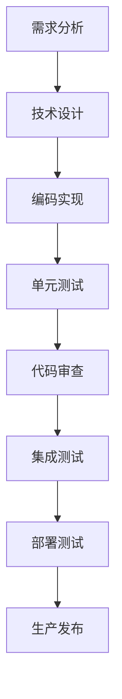
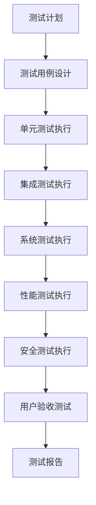
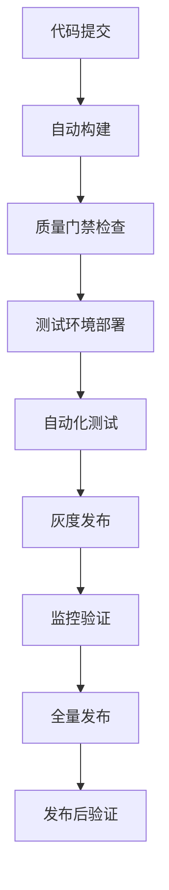

# quwoquan云端服务质量保证规则

## 质量保证体系概述

### 质量目标
- **功能质量**: 功能完整性100%，业务逻辑正确性99.9%
- **性能质量**: API响应时间P95 < 200ms，系统可用性 > 99.9%
- **安全质量**: 安全漏洞0个，数据泄露事件0次
- **代码质量**: 代码覆盖率 > 80%，单元测试覆盖率 > 90%
- **用户体验**: 用户满意度 > 4.5/5.0，投诉率 < 0.1%

### 质量保证组织架构
```
质量保证委员会
├── 质量经理 (1人)
├── 测试团队 (4人)
│   ├── 自动化测试工程师 (2人)
│   ├── 性能测试工程师 (1人)
│   └── 安全测试工程师 (1人)
├── 开发团队质量代表 (6人)
└── 运维团队质量代表 (1人)
```

## 测试规则

### 1. 单元测试规则

#### 测试覆盖率要求
- **代码覆盖率**: ≥ 80%
- **分支覆盖率**: ≥ 75%
- **函数覆盖率**: ≥ 90%
- **核心业务逻辑**: 100%覆盖

#### 测试编写规范
```go
// 测试文件命名: *_test.go
// 测试函数命名: TestFunctionName_Scenario_ExpectedResult

func TestUserService_CreateUser_ValidInput_ReturnsUser(t *testing.T) {
    // Given
    mockRepo := new(MockUserRepository)
    service := NewUserService(mockRepo)
    req := &CreateUserRequest{
        Username: "testuser",
        Email:    "test@example.com",
        Password: "password123",
    }
    
    expectedUser := &User{
        ID:       1,
        Username: "testuser",
        Email:    "test@example.com",
    }
    
    mockRepo.On("Create", mock.Anything).Return(expectedUser, nil)
    
    // When
    result, err := service.CreateUser(context.Background(), req)
    
    // Then
    assert.NoError(t, err)
    assert.Equal(t, expectedUser.Username, result.Username)
    mockRepo.AssertExpectations(t)
}

func TestUserService_CreateUser_InvalidEmail_ReturnsError(t *testing.T) {
    // Given
    service := NewUserService(nil)
    req := &CreateUserRequest{
        Username: "testuser",
        Email:    "invalid-email",
        Password: "password123",
    }
    
    // When
    result, err := service.CreateUser(context.Background(), req)
    
    // Then
    assert.Error(t, err)
    assert.Nil(t, result)
    assert.Contains(t, err.Error(), "invalid email")
}
```

#### 测试数据管理
- **测试数据隔离**: 每个测试使用独立的测试数据
- **数据清理**: 测试结束后自动清理测试数据
- **数据工厂**: 使用Builder模式生成测试数据

```go
// 测试数据工厂
type UserBuilder struct {
    user *User
}

func NewUserBuilder() *UserBuilder {
    return &UserBuilder{
        user: &User{
            Username: "default_user",
            Email:    "default@example.com",
            Password: "default_password",
        },
    }
}

func (b *UserBuilder) WithUsername(username string) *UserBuilder {
    b.user.Username = username
    return b
}

func (b *UserBuilder) WithEmail(email string) *UserBuilder {
    b.user.Email = email
    return b
}

func (b *UserBuilder) Build() *User {
    return b.user
}
```

### 2. 接口测试规则

#### API测试覆盖
- **HTTP状态码**: 所有可能的响应状态码
- **请求参数**: 有效参数、无效参数、边界值
- **响应格式**: JSON结构、字段类型、必需字段
- **错误处理**: 错误码、错误消息、错误详情

#### 接口测试用例设计
```yaml
# API测试用例示例
test_cases:
  - name: "创建用户-成功场景"
    method: POST
    url: "/api/v1/users"
    headers:
      Content-Type: "application/json"
    body:
      username: "testuser"
      email: "test@example.com"
      password: "password123"
    expected_status: 201
    expected_response:
      code: 200
      message: "success"
      data:
        id: 1
        username: "testuser"
        email: "test@example.com"
  
  - name: "创建用户-邮箱格式错误"
    method: POST
    url: "/api/v1/users"
    headers:
      Content-Type: "application/json"
    body:
      username: "testuser"
      email: "invalid-email"
      password: "password123"
    expected_status: 400
    expected_response:
      code: 400
      message: "validation error"
      errors:
        - field: "email"
          message: "invalid email format"
```

#### 接口自动化测试
```go
// 接口测试框架
type APITestSuite struct {
    suite.Suite
    server *httptest.Server
    client *http.Client
}

func (suite *APITestSuite) SetupSuite() {
    // 启动测试服务器
    router := setupTestRouter()
    suite.server = httptest.NewServer(router)
    suite.client = &http.Client{}
}

func (suite *APITestSuite) TestCreateUser_Success() {
    // 准备测试数据
    payload := map[string]string{
        "username": "testuser",
        "email":    "test@example.com",
        "password": "password123",
    }
    
    jsonData, _ := json.Marshal(payload)
    
    // 发送请求
    resp, err := suite.client.Post(
        suite.server.URL+"/api/v1/users",
        "application/json",
        bytes.NewBuffer(jsonData),
    )
    
    // 验证响应
    suite.NoError(err)
    suite.Equal(http.StatusCreated, resp.StatusCode)
    
    var result map[string]interface{}
    err = json.NewDecoder(resp.Body).Decode(&result)
    suite.NoError(err)
    suite.Equal("success", result["message"])
}
```

### 3. 性能测试规则

#### 性能测试指标
- **响应时间**: P50 < 100ms, P95 < 200ms, P99 < 500ms
- **吞吐量**: > 1000 QPS (查询), > 500 TPS (事务)
- **并发用户**: 支持10,000并发用户
- **资源使用**: CPU < 70%, 内存 < 80%, 磁盘I/O < 80%

#### 性能测试场景
```yaml
# 性能测试配置
performance_tests:
  - name: "用户注册性能测试"
    scenario: "用户注册"
    duration: "10m"
    ramp_up: "2m"
    max_users: 1000
    endpoints:
      - url: "/api/v1/users"
        method: POST
        weight: 100
        expected_response_time: 200ms
  
  - name: "内容查询性能测试"
    scenario: "内容查询"
    duration: "15m"
    ramp_up: "3m"
    max_users: 2000
    endpoints:
      - url: "/api/v1/contents"
        method: GET
        weight: 80
        expected_response_time: 150ms
      - url: "/api/v1/contents/{id}"
        method: GET
        weight: 20
        expected_response_time: 100ms
```

#### 性能测试工具
- **负载测试**: JMeter, K6
- **压力测试**: Apache Bench (ab), wrk
- **监控工具**: Prometheus + Grafana
- **分析工具**: pprof, flamegraph

```bash
# 性能测试脚本示例
#!/bin/bash

# 基准测试
echo "开始基准性能测试..."
k6 run --vus 100 --duration 5m performance_test.js

# 压力测试
echo "开始压力测试..."
k6 run --vus 1000 --duration 10m stress_test.js

# 峰值测试
echo "开始峰值测试..."
k6 run --vus 5000 --duration 2m spike_test.js
```

### 4. 安全测试规则

#### 安全测试范围
- **认证授权**: 身份认证、权限控制、会话管理
- **输入验证**: SQL注入、XSS攻击、CSRF攻击
- **数据传输**: HTTPS加密、敏感数据保护
- **API安全**: 接口鉴权、参数校验、频率限制

#### 安全测试用例
```yaml
# 安全测试用例
security_tests:
  - name: "SQL注入测试"
    type: "injection"
    payloads:
      - "' OR '1'='1"
      - "'; DROP TABLE users; --"
      - "1' UNION SELECT * FROM users --"
    expected_result: "blocked"
  
  - name: "XSS攻击测试"
    type: "xss"
    payloads:
      - "<script>alert('XSS')</script>"
      - "javascript:alert('XSS')"
      - ""
    expected_result: "sanitized"
  
  - name: "认证绕过测试"
    type: "auth_bypass"
    scenarios:
      - "无token访问受保护资源"
      - "无效token访问"
      - "过期token访问"
    expected_result: "unauthorized"
```

#### 安全扫描工具
- **静态扫描**: SonarQube, CodeQL
- **依赖扫描**: Snyk, OWASP Dependency Check
- **动态扫描**: OWASP ZAP, Burp Suite
- **容器扫描**: Trivy, Clair

```bash
# 安全扫描脚本
#!/bin/bash

echo "开始安全扫描..."

# 依赖漏洞扫描
echo "扫描依赖漏洞..."
snyk test

# 代码安全扫描
echo "扫描代码安全问题..."
sonar-scanner -Dsonar.projectKey=quwoquan-service

# 容器镜像扫描
echo "扫描容器镜像..."
trivy image quwoquan-service:latest

echo "安全扫描完成"
```

### 5. 集成测试规则

#### 集成测试层次
- **服务内集成**: 模块间接口测试
- **服务间集成**: 微服务间通信测试
- **系统集成**: 端到端业务流程测试
- **第三方集成**: 外部服务集成测试

#### 集成测试环境
```yaml
# 集成测试环境配置
integration_test_env:
  services:
    - name: "user-service"
      image: "quwoquan/user-service:test"
      ports: ["8080:8080"]
      depends_on: ["postgres", "redis"]
    
    - name: "content-service"
      image: "quwoquan/content-service:test"
      ports: ["8081:8080"]
      depends_on: ["postgres", "redis"]
    
    - name: "postgres"
      image: "postgres:13"
      environment:
        POSTGRES_DB: "quwoquan_test"
        POSTGRES_USER: "test"
        POSTGRES_PASSWORD: "test"
    
    - name: "redis"
      image: "redis:6"
      ports: ["6379:6379"]
```

#### 集成测试用例
```go
// 集成测试示例
func TestUserContentIntegration(t *testing.T) {
    // 启动测试环境
    compose := setupTestEnvironment(t)
    defer compose.Down()
    
    // 等待服务就绪
    waitForServices(t)
    
    // 创建用户
    user := createTestUser(t)
    
    // 创建内容
    content := createTestContent(t, user.ID)
    
    // 验证用户可以看到自己的内容
    contents := getUserContents(t, user.ID)
    assert.Contains(t, contents, content.ID)
    
    // 验证内容关联用户信息
    contentDetail := getContentDetail(t, content.ID)
    assert.Equal(t, user.Username, contentDetail.Author.Username)
}
```

## 发布质量保证规则

### 1. 代码审查规则

#### 审查流程
1. **自检**: 开发者完成代码自检
2. **同行审查**: 至少1名同事审查
3. **架构师审查**: 架构变更需架构师审查
4. **安全审查**: 安全相关代码需安全专家审查

#### 审查检查清单
```markdown
## 代码审查检查清单

### 功能正确性
- [ ] 代码实现了预期功能
- [ ] 边界条件处理正确
- [ ] 错误处理完善
- [ ] 业务逻辑正确

### 代码质量
- [ ] 代码符合编码规范
- [ ] 变量命名清晰
- [ ] 函数职责单一
- [ ] 代码可读性好

### 性能考虑
- [ ] 没有明显的性能问题
- [ ] 数据库查询优化
- [ ] 缓存使用合理
- [ ] 内存使用合理

### 安全考虑
- [ ] 输入验证充分
- [ ] 敏感数据保护
- [ ] 权限控制正确
- [ ] 日志不泄露敏感信息

### 测试覆盖
- [ ] 单元测试充分
- [ ] 测试用例覆盖主要场景
- [ ] 集成测试通过
- [ ] 性能测试通过
```

### 2. 构建质量门禁

#### 构建检查项
```yaml
# CI/CD质量门禁配置
quality_gates:
  - name: "代码质量检查"
    tools:
      - golangci-lint
      - go vet
      - go fmt
    thresholds:
      - lint_errors: 0
      - warnings: 10
  
  - name: "单元测试"
    tools:
      - go test
    thresholds:
      - coverage: 80%
      - failures: 0
  
  - name: "安全扫描"
    tools:
      - snyk
      - sonar
    thresholds:
      - vulnerabilities: 0
      - security_hotspots: 0
  
  - name: "性能基准"
    tools:
      - benchmark_test
    thresholds:
      - response_time: 200ms
      - memory_usage: 100MB
```

#### 构建脚本
```bash
#!/bin/bash
# build.sh - 构建质量检查脚本

set -e

echo "开始构建质量检查..."

# 代码格式检查
echo "检查代码格式..."
go fmt ./...
if [ $? -ne 0 ]; then
    echo "代码格式检查失败"
    exit 1
fi

# 静态分析
echo "运行静态分析..."
golangci-lint run
if [ $? -ne 0 ]; then
    echo "静态分析失败"
    exit 1
fi

# 单元测试
echo "运行单元测试..."
go test -race -coverprofile=coverage.out ./...
if [ $? -ne 0 ]; then
    echo "单元测试失败"
    exit 1
fi

# 检查测试覆盖率
coverage=$(go tool cover -func=coverage.out | grep total | awk '{print $3}' | sed 's/%//')
if (( $(echo "$coverage < 80" | bc -l) )); then
    echo "测试覆盖率不足: $coverage% < 80%"
    exit 1
fi

# 安全扫描
echo "运行安全扫描..."
snyk test
if [ $? -ne 0 ]; then
    echo "安全扫描发现漏洞"
    exit 1
fi

echo "构建质量检查通过"
```

### 3. 部署质量保证

#### 部署前检查
- **环境一致性**: 开发、测试、生产环境配置一致
- **依赖检查**: 所有依赖服务可用
- **数据迁移**: 数据库迁移脚本验证
- **配置验证**: 配置文件语法和内容验证

#### 部署脚本
```bash
#!/bin/bash
# deploy.sh - 部署脚本

set -e

ENVIRONMENT=$1
VERSION=$2

if [ -z "$ENVIRONMENT" ] || [ -z "$VERSION" ]; then
    echo "用法: $0 <环境> <版本>"
    exit 1
fi

echo "开始部署到 $ENVIRONMENT 环境，版本 $VERSION"

# 预部署检查
echo "执行预部署检查..."
./scripts/pre-deploy-check.sh $ENVIRONMENT

# 数据库迁移
echo "执行数据库迁移..."
./scripts/migrate.sh $ENVIRONMENT

# 部署应用
echo "部署应用..."
kubectl apply -f deployments/$ENVIRONMENT/app-$VERSION.yaml

# 健康检查
echo "等待应用就绪..."
kubectl rollout status deployment/quwoquan-service -n $ENVIRONMENT

# 后部署验证
echo "执行后部署验证..."
./scripts/post-deploy-verify.sh $ENVIRONMENT

echo "部署完成"
```

## 灰度发布规则

### 1. 灰度发布策略

#### 发布阶段
1. **内测阶段**: 内部团队测试 (5%流量)
2. **小范围灰度**: 选定用户群体 (10%流量)
3. **大范围灰度**: 扩大用户范围 (50%流量)
4. **全量发布**: 所有用户 (100%流量)

#### 灰度配置
```yaml
# 灰度发布配置
canary_release:
  stages:
    - name: "internal_test"
      traffic_percentage: 5
      duration: "1h"
      users: ["internal_team"]
      metrics:
        - error_rate < 1%
        - response_time < 200ms
        - cpu_usage < 70%
    
    - name: "small_canary"
      traffic_percentage: 10
      duration: "2h"
      users: ["beta_users"]
      metrics:
        - error_rate < 0.5%
        - response_time < 150ms
        - user_satisfaction > 4.0
    
    - name: "large_canary"
      traffic_percentage: 50
      duration: "4h"
      users: ["all_users"]
      metrics:
        - error_rate < 0.1%
        - response_time < 100ms
        - business_metrics_normal
```

### 2. 流量控制

#### 流量分割策略
```go
// 流量分割实现
type TrafficSplitter struct {
    rules []TrafficRule
}

type TrafficRule struct {
    Percentage int
    Version    string
    Conditions []Condition
}

type Condition struct {
    Field    string
    Operator string
    Value    interface{}
}

func (ts *TrafficSplitter) GetVersion(req *http.Request) string {
    for _, rule := range ts.rules {
        if ts.matchesRule(req, rule) {
            return rule.Version
        }
    }
    return "stable"
}

func (ts *TrafficSplitter) matchesRule(req *http.Request, rule TrafficRule) bool {
    // 检查流量百分比
    if !ts.checkTrafficPercentage(req, rule.Percentage) {
        return false
    }
    
    // 检查用户条件
    for _, condition := range rule.Conditions {
        if !ts.matchesCondition(req, condition) {
            return false
        }
    }
    
    return true
}
```

### 3. 回滚策略

#### 自动回滚触发条件
- **错误率**: > 5% 持续5分钟
- **响应时间**: P95 > 500ms 持续3分钟
- **系统资源**: CPU > 90% 持续2分钟
- **业务指标**: 关键业务指标异常

#### 回滚脚本
```bash
#!/bin/bash
# rollback.sh - 自动回滚脚本

set -e

ENVIRONMENT=$1
REASON=$2

echo "开始回滚 $ENVIRONMENT 环境，原因: $REASON"

# 获取当前版本
CURRENT_VERSION=$(kubectl get deployment quwoquan-service -n $ENVIRONMENT -o jsonpath='{.spec.template.spec.containers[0].image}' | cut -d':' -f2)

# 获取上一个稳定版本
PREVIOUS_VERSION=$(kubectl get deployment quwoquan-service -n $ENVIRONMENT -o jsonpath='{.metadata.annotations.deployment\.kubernetes\.io/revision}')

echo "从版本 $CURRENT_VERSION 回滚到 $PREVIOUS_VERSION"

# 执行回滚
kubectl rollout undo deployment/quwoquan-service -n $ENVIRONMENT

# 等待回滚完成
kubectl rollout status deployment/quwoquan-service -n $ENVIRONMENT

# 验证回滚结果
echo "验证回滚结果..."
./scripts/health-check.sh $ENVIRONMENT

echo "回滚完成"

# 发送通知
./scripts/notify.sh "rollback_completed" "Environment: $ENVIRONMENT, Reason: $REASON"
```

## 用户反馈规则

### 1. 反馈收集机制

#### 反馈渠道
- **应用内反馈**: 内置反馈功能
- **用户调研**: 定期用户满意度调研
- **客服渠道**: 客服系统收集问题
- **社区论坛**: 用户社区讨论
- **数据分析**: 用户行为数据分析

#### 反馈分类
```yaml
# 反馈分类体系
feedback_categories:
  - name: "功能问题"
    subcategories:
      - "功能缺失"
      - "功能异常"
      - "功能建议"
    priority: "high"
    
  - name: "性能问题"
    subcategories:
      - "响应慢"
      - "卡顿"
      - "崩溃"
    priority: "high"
    
  - name: "界面问题"
    subcategories:
      - "界面错乱"
      - "操作不便"
      - "视觉问题"
    priority: "medium"
    
  - name: "内容问题"
    subcategories:
      - "内容错误"
      - "内容缺失"
      - "内容质量"
    priority: "medium"
```

### 2. 反馈处理流程

#### 处理流程
1. **接收反馈**: 自动分类和优先级评估
2. **初步分析**: 确认问题性质和影响范围
3. **问题分配**: 分配给相应的开发团队
4. **解决方案**: 制定解决方案和时间计划
5. **修复验证**: 修复后验证和测试
6. **用户通知**: 通知用户问题解决情况

#### 反馈处理系统
```go
// 反馈处理系统
type FeedbackHandler struct {
    db     *database.DB
    logger *logger.Logger
    notifier *notification.Service
}

type Feedback struct {
    ID          int64     `json:"id"`
    UserID      int64     `json:"user_id"`
    Category    string    `json:"category"`
    Priority    string    `json:"priority"`
    Title       string    `json:"title"`
    Description string    `json:"description"`
    Status      string    `json:"status"`
    CreatedAt   time.Time `json:"created_at"`
    UpdatedAt   time.Time `json:"updated_at"`
}

func (fh *FeedbackHandler) ProcessFeedback(feedback *Feedback) error {
    // 自动分类
    category, priority := fh.classifyFeedback(feedback)
    feedback.Category = category
    feedback.Priority = priority
    
    // 保存反馈
    if err := fh.db.CreateFeedback(feedback); err != nil {
        return fmt.Errorf("failed to save feedback: %w", err)
    }
    
    // 分配处理人员
    assignee := fh.assignFeedback(feedback)
    
    // 发送通知
    fh.notifier.NotifyAssignee(assignee, feedback)
    
    return nil
}

func (fh *FeedbackHandler) classifyFeedback(feedback *Feedback) (string, string) {
    // 使用机器学习模型进行分类
    // 这里简化处理
    if strings.Contains(strings.ToLower(feedback.Title), "crash") ||
       strings.Contains(strings.ToLower(feedback.Title), "error") {
        return "performance", "high"
    }
    
    if strings.Contains(strings.ToLower(feedback.Title), "slow") ||
       strings.Contains(strings.ToLower(feedback.Title), "lag") {
        return "performance", "high"
    }
    
    return "general", "medium"
}
```

### 3. 反馈分析

#### 分析维度
- **问题趋势**: 问题数量变化趋势
- **问题分布**: 按模块、功能分类统计
- **用户满意度**: 用户满意度评分变化
- **解决效率**: 问题解决时间和效率

#### 分析报告
```go
// 反馈分析报告
type FeedbackReport struct {
    Period       string                 `json:"period"`
    TotalCount   int                    `json:"total_count"`
    CategoryStats map[string]int        `json:"category_stats"`
    PriorityStats map[string]int        `json:"priority_stats"`
    ResolutionTime map[string]time.Duration `json:"resolution_time"`
    UserSatisfaction float64            `json:"user_satisfaction"`
    TopIssues    []IssueSummary         `json:"top_issues"`
}

type IssueSummary struct {
    Title       string `json:"title"`
    Count       int    `json:"count"`
    Category    string `json:"category"`
    Priority    string `json:"priority"`
    Status      string `json:"status"`
}

func (fh *FeedbackHandler) GenerateReport(period string) (*FeedbackReport, error) {
    // 查询指定期间的反馈数据
    feedbacks, err := fh.db.GetFeedbacksByPeriod(period)
    if err != nil {
        return nil, fmt.Errorf("failed to get feedbacks: %w", err)
    }
    
    // 统计分析
    report := &FeedbackReport{
        Period:       period,
        TotalCount:   len(feedbacks),
        CategoryStats: make(map[string]int),
        PriorityStats: make(map[string]int),
        ResolutionTime: make(map[string]time.Duration),
    }
    
    for _, feedback := range feedbacks {
        report.CategoryStats[feedback.Category]++
        report.PriorityStats[feedback.Priority]++
        
        if feedback.Status == "resolved" {
            resolutionTime := feedback.UpdatedAt.Sub(feedback.CreatedAt)
            report.ResolutionTime[feedback.Priority] += resolutionTime
        }
    }
    
    // 计算平均解决时间
    for priority, totalTime := range report.ResolutionTime {
        count := report.PriorityStats[priority]
        if count > 0 {
            report.ResolutionTime[priority] = totalTime / time.Duration(count)
        }
    }
    
    return report, nil
}
```

## 系统监控规则

### 1. 监控指标体系

#### 业务监控指标
- **用户指标**: 注册用户数、活跃用户数、留存率
- **内容指标**: 内容发布量、内容浏览量、内容互动率
- **功能指标**: 功能使用率、功能转化率、功能满意度
- **收入指标**: 付费用户数、ARPU值、收入增长率

#### 技术监控指标
- **性能指标**: 响应时间、吞吐量、并发数
- **可用性指标**: 服务可用率、故障次数、故障时长
- **资源指标**: CPU使用率、内存使用率、磁盘使用率、网络流量
- **错误指标**: 错误率、异常数、日志错误级别分布

#### 监控配置
```yaml
# 监控指标配置
monitoring_config:
  metrics:
    - name: "api_response_time"
      type: "histogram"
      labels: ["method", "endpoint", "status_code"]
      buckets: [0.1, 0.5, 1.0, 2.0, 5.0]
    
    - name: "user_registration_total"
      type: "counter"
      labels: ["source", "platform"]
    
    - name: "active_connections"
      type: "gauge"
      labels: ["service"]
  
  alerts:
    - name: "high_error_rate"
      condition: "error_rate > 5%"
      duration: "5m"
      severity: "critical"
      notification: ["email", "slack"]
    
    - name: "slow_response"
      condition: "response_time_p95 > 500ms"
      duration: "3m"
      severity: "warning"
      notification: ["slack"]
    
    - name: "high_cpu_usage"
      condition: "cpu_usage > 80%"
      duration: "10m"
      severity: "warning"
      notification: ["slack"]
```

### 2. 监控工具配置

#### 监控栈
- **指标收集**: Prometheus
- **可视化**: Grafana
- **日志收集**: ELK Stack (Elasticsearch, Logstash, Kibana)
- **链路追踪**: Jaeger
- **告警**: AlertManager

#### 监控实现
```go
// 监控中间件
func MonitoringMiddleware() gin.HandlerFunc {
    return gin.HandlerFunc(func(c *gin.Context) {
        start := time.Now()
        
        // 处理请求
        c.Next()
        
        // 记录指标
        duration := time.Since(start)
        
        // 记录响应时间
        responseTimeHistogram.WithLabelValues(
            c.Request.Method,
            c.FullPath(),
            strconv.Itoa(c.Writer.Status()),
        ).Observe(duration.Seconds())
        
        // 记录请求计数
        requestCounter.WithLabelValues(
            c.Request.Method,
            c.FullPath(),
            strconv.Itoa(c.Writer.Status()),
        ).Inc()
        
        // 记录活跃连接
        activeConnections.WithLabelValues("api").Inc()
        defer activeConnections.WithLabelValues("api").Dec()
    })
}

// 健康检查端点
func HealthCheck(c *gin.Context) {
    health := map[string]interface{}{
        "status":    "healthy",
        "timestamp": time.Now().Unix(),
        "version":   version.Version,
        "uptime":    time.Since(startTime).Seconds(),
    }
    
    // 检查依赖服务
    if err := checkDatabase(); err != nil {
        health["database"] = "unhealthy"
        health["status"] = "degraded"
    } else {
        health["database"] = "healthy"
    }
    
    if err := checkRedis(); err != nil {
        health["redis"] = "unhealthy"
        health["status"] = "degraded"
    } else {
        health["redis"] = "healthy"
    }
    
    status := http.StatusOK
    if health["status"] == "degraded" {
        status = http.StatusServiceUnavailable
    }
    
    c.JSON(status, health)
}
```

### 3. 告警规则

#### 告警级别
- **P0 (紧急)**: 服务完全不可用，影响所有用户
- **P1 (高)**: 服务部分不可用，影响大量用户
- **P2 (中)**: 服务性能下降，影响部分用户
- **P3 (低)**: 服务异常，需要关注

#### 告警配置
```yaml
# 告警规则配置
alert_rules:
  - alert: "ServiceDown"
    expr: "up == 0"
    for: "1m"
    labels:
      severity: "critical"
    annotations:
      summary: "服务 {{ $labels.instance }} 不可用"
      description: "服务 {{ $labels.instance }} 已经不可用超过1分钟"
  
  - alert: "HighErrorRate"
    expr: "rate(http_requests_total{status=~\"5..\"}[5m]) / rate(http_requests_total[5m]) > 0.05"
    for: "5m"
    labels:
      severity: "warning"
    annotations:
      summary: "错误率过高"
      description: "服务 {{ $labels.instance }} 错误率超过5%"
  
  - alert: "SlowResponse"
    expr: "histogram_quantile(0.95, rate(http_request_duration_seconds_bucket[5m])) > 0.5"
    for: "3m"
    labels:
      severity: "warning"
    annotations:
      summary: "响应时间过慢"
      description: "服务 {{ $labels.instance }} P95响应时间超过500ms"
```

## 持续改进规则

### 1. 改进流程

#### 改进周期
- **每日改进**: 日常问题修复和优化
- **每周改进**: 性能优化和功能增强
- **每月改进**: 架构优化和技术升级
- **每季度改进**: 重大功能迭代和战略调整

#### 改进流程
1. **问题识别**: 通过监控、反馈、分析识别问题
2. **影响评估**: 评估问题的影响范围和优先级
3. **解决方案**: 制定解决方案和实施计划
4. **实施改进**: 执行改进措施
5. **效果验证**: 验证改进效果
6. **经验总结**: 总结经验和最佳实践

### 2. 改进指标

#### 改进效果评估
- **性能提升**: 响应时间、吞吐量、资源利用率
- **质量提升**: 错误率、可用性、用户满意度
- **效率提升**: 开发效率、部署效率、运维效率
- **成本优化**: 资源成本、人力成本、时间成本

#### 改进跟踪
```go
// 改进跟踪系统
type ImprovementTracker struct {
    db *database.DB
}

type Improvement struct {
    ID          int64     `json:"id"`
    Title       string    `json:"title"`
    Description string    `json:"description"`
    Category    string    `json:"category"`
    Priority    string    `json:"priority"`
    Status      string    `json:"status"`
    Metrics     map[string]float64 `json:"metrics"`
    CreatedAt   time.Time `json:"created_at"`
    CompletedAt *time.Time `json:"completed_at"`
}

func (it *ImprovementTracker) TrackImprovement(improvement *Improvement) error {
    // 保存改进记录
    if err := it.db.CreateImprovement(improvement); err != nil {
        return fmt.Errorf("failed to save improvement: %w", err)
    }
    
    // 设置跟踪指标
    it.setupMetrics(improvement)
    
    return nil
}

func (it *ImprovementTracker) MeasureImpact(improvementID int64, metrics map[string]float64) error {
    // 更新改进效果指标
    improvement, err := it.db.GetImprovement(improvementID)
    if err != nil {
        return fmt.Errorf("failed to get improvement: %w", err)
    }
    
    improvement.Metrics = metrics
    improvement.Status = "completed"
    now := time.Now()
    improvement.CompletedAt = &now
    
    if err := it.db.UpdateImprovement(improvement); err != nil {
        return fmt.Errorf("failed to update improvement: %w", err)
    }
    
    return nil
}
```

### 3. 知识管理

#### 知识库建设
- **技术文档**: 架构设计、开发规范、部署指南
- **问题库**: 常见问题、解决方案、最佳实践
- **经验分享**: 技术分享、案例分析、经验总结
- **培训材料**: 新人培训、技能提升、认证考试

#### 知识分享机制
```yaml
# 知识分享计划
knowledge_sharing:
  weekly_tech_talk:
    frequency: "weekly"
    duration: "1h"
    topics:
      - "技术分享"
      - "问题复盘"
      - "最佳实践"
      - "新技术调研"
  
  monthly_retrospective:
    frequency: "monthly"
    duration: "2h"
    agenda:
      - "项目回顾"
      - "问题总结"
      - "改进建议"
      - "下月计划"
  
  quarterly_innovation:
    frequency: "quarterly"
    duration: "4h"
    activities:
      - "技术调研"
      - "原型开发"
      - "技术选型"
      - "架构优化"
```

### 4. 持续学习

#### 学习计划
- **个人学习**: 技术技能提升、行业趋势跟踪
- **团队学习**: 集体培训、技术分享、代码审查
- **外部学习**: 技术会议、在线课程、开源项目
- **实践学习**: 项目实践、技术实验、创新尝试

#### 学习跟踪
```go
// 学习跟踪系统
type LearningTracker struct {
    db *database.DB
}

type LearningGoal struct {
    ID          int64     `json:"id"`
    UserID      int64     `json:"user_id"`
    Title       string    `json:"title"`
    Description string    `json:"description"`
    Category    string    `json:"category"`
    Status      string    `json:"status"`
    Progress    int       `json:"progress"`
    TargetDate  time.Time `json:"target_date"`
    CreatedAt   time.Time `json:"created_at"`
}

func (lt *LearningTracker) CreateGoal(userID int64, goal *LearningGoal) error {
    goal.UserID = userID
    goal.Status = "in_progress"
    goal.Progress = 0
    
    return lt.db.CreateLearningGoal(goal)
}

func (lt *LearningTracker) UpdateProgress(goalID int64, progress int) error {
    goal, err := lt.db.GetLearningGoal(goalID)
    if err != nil {
        return fmt.Errorf("failed to get goal: %w", err)
    }
    
    goal.Progress = progress
    if progress >= 100 {
        goal.Status = "completed"
    }
    
    return lt.db.UpdateLearningGoal(goal)
}
```

## 质量保证工具链

### 1. 开发阶段工具
- **代码质量**: SonarQube, golangci-lint
- **单元测试**: Go test, testify
- **代码覆盖率**: go cover, gocov
- **依赖管理**: Go modules, Snyk

### 2. 测试阶段工具
- **接口测试**: Postman, Newman
- **性能测试**: JMeter, K6, wrk
- **安全测试**: OWASP ZAP, SonarQube Security
- **自动化测试**: Selenium, Cypress

### 3. 部署阶段工具
- **CI/CD**: GitLab CI, Jenkins
- **容器化**: Docker, Kubernetes
- **配置管理**: Helm, Kustomize
- **服务网格**: Istio

### 4. 运维阶段工具
- **监控**: Prometheus, Grafana
- **日志**: ELK Stack, Fluentd
- **链路追踪**: Jaeger, Zipkin
- **告警**: AlertManager, PagerDuty

## 质量保证流程

### 1. 开发流程


### 2. 测试流程


### 3. 发布流程


## 质量保证度量

### 1. 质量指标
- **缺陷密度**: 每千行代码的缺陷数
- **测试覆盖率**: 代码和功能测试覆盖率
- **缺陷逃逸率**: 生产环境发现的缺陷比例
- **修复效率**: 缺陷修复的平均时间

### 2. 效率指标
- **开发效率**: 功能点开发速度
- **部署频率**: 部署到生产的频率
- **恢复时间**: 故障恢复的平均时间
- **变更失败率**: 部署失败的比例

### 3. 用户满意度指标
- **用户满意度**: 用户调研评分
- **净推荐值**: NPS评分
- **用户留存率**: 用户留存情况
- **支持请求**: 用户支持请求数量

## 总结

本质量保证规则文档建立了完整的质量保证体系，涵盖从开发到运维的全生命周期质量管控。通过系统化的测试、监控、反馈和改进机制，确保quwoquan云端服务的高质量交付和持续改进。

质量保证不是一次性的活动，而是持续的过程。需要团队全体成员的参与和承诺，通过不断的学习、实践和改进，提升产品质量和开发效率。


