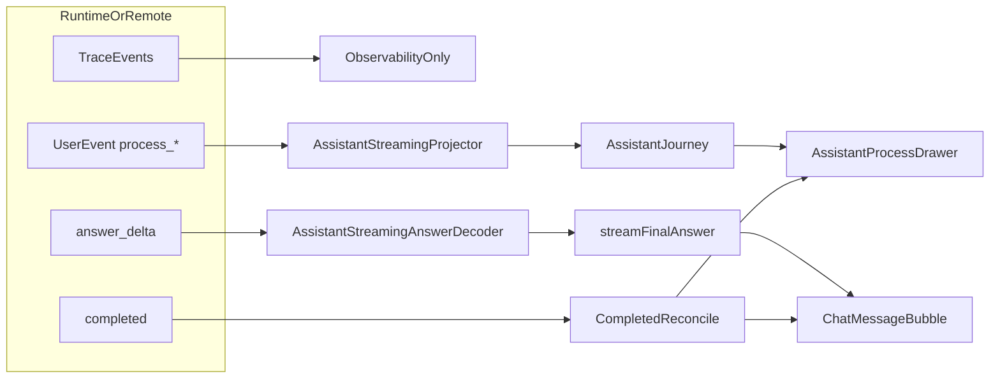

# run-stream-protocol--stream-event-ordering-and-finalization 设计方案

## 设计动因

当前私人助手流式链路存在 3 个系统性问题：

1. **过程与答案耦合**：`trace`、`thinkingProgress`、`chunk`、`answer_delta` 同时参与用户态渲染，导致 raw reasoning、内部查询词、过程占位文案可能泄漏进 UI。
2. **终态封口不稳**：remote terminal payload 缺失时，当前实现可能直接拿 partial stream 合成 completed；local repair 路径还会把 `thinkingProgress(streaming=true)` 当作答案恢复来源。
3. **完成态口径分叉**：流式态过程抽屉、completed response、记录重载三条链路各自做投影和兜底，无法保证摘要、来源计数、耗时和阶段轨迹一致。

本设计的目标是把流式链路收口成一条正式主线：**`process_* -> AssistantJourney`、`answer_delta -> StreamingAnswerDecoder`、`completed -> final reconcile`**，并明确 `trace` 只留给调试与回放。

## 方案概览

## 关键设计决策

### 决策 1：`trace` 退出用户可见主链

- `trace` 继续保留，用于 observability、开发回放、失败诊断。
- `AssistantStreamingProjector.emitTrace()` 只允许更新内部 `AssistantJourneyProjector` 的 typed stage/readiness 信息，不再把 `trace.message` 作为用户语言过程文案直接输出。
- 任何从 trace 进入 UI 的字符串必须先经过明确的 typed adapter 或 metadata 映射；不允许直接把 `thinkingProgress` 文本当作用户过程。

### 决策 2：正式接入 `process_replace / process_append / process_commit`

- `OpenClawBridge` 已可解析 `process_*`，但后续链路未消费；本次将其升级为正式 `AssistantRunStreamEvent` 输入。
- `AssistantStreamingProjector.emitUserEvent()` 不再只处理 `answer_delta`，而是：
  - `answer_delta` -> `AssistantRunStreamEvent.answerDelta`
  - `process_*` -> 进入用户过程 reducer，更新 `AssistantJourney`
- 本地执行链路也需要输出同形态 `UserEvent`，避免 remote / local 在 UI 侧分叉。

### 决策 3：答案和过程的 reducer 严格分离

- `streamFinalAnswer` 只能由 `answer_delta` 和 terminal payload 进入。
- `AssistantJourney` 只能由 `process_*`、typed tool metadata、readiness 收口进入。
- `ChatDetailPage` 不再让 `trace / chunk / journey / completed` 多路同时修改答案或过程的同一字段。

### 决策 4：completed 只能在“答案已闭合”时封口

- `RemoteAssistantEntry` 合成 completed 前，必须先判断：
  - 是否存在经过 `AssistantStreamingAnswerDecoder` 校验后的可展示最终答案
  - 是否 terminal payload 确实缺失
- 若只有过程文本、thinking 文本或未闭合结构，则禁止直接 synthesize completed，必须：
  - 先尝试 `runRemote`
  - 再不行则返回显式 incomplete / degraded response

### 决策 5：repair 路径彻底排除 thinking 文本

- `LocalPhaseExecutionOwner._recoverDisplayMarkdownFromTraces()` 只允许恢复：
  - `answerDelta`
  - `streamDelta`
  - 明确标记为最终答案的 `assistantDelta`
- `thinkingProgress(streaming=true)` 不再视为可恢复答案来源。

### 决策 6：完成态摘要统一由 typed journey + metadata 生成

- `AssistantJourneyViewModel` 不再仅因为 seeded stages 就声明 `hasVisibleContent=true`。
- 完成态首行由统一摘要生成逻辑负责，输入包括：
  - `finalAnswerReady`
  - `referenceCount`
  - `elapsedMs`
  - 终态 summary
- UI 展示与动效只依赖 `JourneyStageId / JourneyStageStatus / AssistantJourneyReadiness`，不再依赖中文文案 `contains()`。

## 分层设计

### 1. Runtime / provider 层

涉及文件：

- `quwoquan_app/lib/assistant/infrastructure/llm/llm_provider.dart`
- `quwoquan_app/lib/assistant/reasoning/runtime/react_runtime.dart`

设计要求：

- 停止把 provider 的 `reasoning` / `<think>` / `reasonShort` 直接作为用户可见 delta 推给 UI。
- 保留 reasoning 提取能力，但仅用于 debug、trace、评估、结构化上下文，不作为用户过程正文直出。
- `react_runtime` 的 `phaseHint` 继续可作为模型内部指引，但不再生成用户可见“开始规划: xxx”“正在思考...”这类硬编码过程消息。
- 本地主线若需要用户可见过程，必须明确生成 `UserEvent process_*`。

### 2. Stream projector 层

涉及文件：

- `quwoquan_app/lib/assistant/application/assistant_stream_projector.dart`
- `quwoquan_app/lib/assistant/application/assistant_journey_projector.dart`
- `quwoquan_app/lib/assistant/infrastructure/openclaw_bridge.dart`

设计要求：

- `AssistantStreamingProjector` 新增正式过程事件入口，按 `scope + type + payload` 更新 `AssistantJourney`。
- `AssistantJourneyProjector` 的阶段推进优先级：
  1. `process_*` 明确过程事件
  2. typed tool metadata / readiness
  3. trace 只作为 fallback typed signal，不消费原始文本
- `_stageFromPhaseHint()`、`_stageForTool()` 仍可保留 typed fallback，但禁止用中文可见 label 进行反推。
- 远端和本地最终都输出同构 `AssistantRunStreamEvent.journey(...)`。

### 3. Finalization / repair 层

涉及文件：

- `quwoquan_app/lib/assistant/application/remote_assistant_entry.dart`
- `quwoquan_app/lib/assistant/orchestration/local_phase_execution_owner.dart`
- `quwoquan_app/lib/assistant/application/assistant_streaming_answer_decoder.dart`

设计要求：

- remote synthesize completed 时，先走 `AssistantStreamingAnswerDecoder` 的可见答案判定，而不是直接依赖原始 `streamedAnswer`。
- local repair 只允许从 answer 通道恢复 display markdown。
- `AssistantStreamingAnswerDecoder` 继续负责：
  - 移除 JSON envelope / XML tool call
  - 过滤 `progress / ask_user / clarify / tool_call`
  - 去重、截断未闭合 fence
- 但不再承担“把 thinking 文本识别成答案”的容错职责。

### 4. UI reducer 与渲染层

涉及文件：

- `quwoquan_app/lib/ui/chat/pages/chat_detail_page.dart`
- `quwoquan_app/lib/ui/chat/widgets/message/assistant_journey_view_model.dart`
- `quwoquan_app/lib/ui/chat/widgets/message/assistant_process_drawer.dart`
- `quwoquan_app/lib/ui/chat/widgets/message/chat_message_bubble.dart`

设计要求：

- `ChatDetailPage` 中：
  - `journeyUpdate` 只更新 `journey/elapsed/summary`
  - `answerDelta` 只更新 `streamFinalAnswer`
  - `completed` 只做 final reconcile
- `answerGateOpen` 开启条件统一为：
  - `journey.readiness.finalAnswerReady == true`
  - 或已进入 `JourneyStageId.answer` 且 decoder 已有可见 answer 内容
- 过程抽屉显示条件改为“存在真实 stage summary / entry / references / running state with real signals”，不再被 seeded 空 stages 触发。
- 完成态摘要模板按 asset/config 驱动，耗时统一取整数秒。
- `_PhaseActivityIndicator` 改为基于 typed stage 选择动效，不再用 `contains('搜索')` 等字符串判断。

### 5. Config / metadata / current 清理

涉及文件：

- `quwoquan_app/assets/assistant/config/user_phase_hints.json`
- `quwoquan_app/assets/assistant/config/progress_text_policy.json`
- `quwoquan_app/assets/assistant/tools/catalog/tool_catalog.meta.json`
- `quwoquan_app/lib/assistant/protocol/display_text_classifier.dart`

设计要求：

- `display_text_classifier.dart` 读取路径切到 `assets/assistant/config/progress_text_policy.json`。
- 与过程/终态摘要相关的新模板优先进入 assistant config 或 tool metadata，而不是散落到 widget。
- 清理旧 timeline copy 与 current compatibility 路径，避免第二真相源继续存在。

## 数据与状态口径

### 用户可见状态

- `streamFinalAnswer`：当前轮最终答案增量缓冲
- `journey`：当前轮 canonical `AssistantJourney`
- `assistantElapsedMs`：当前轮耗时
- `displayMarkdown / displayPlainText`：completed 后终态展示口径

### 非用户可见状态

- `trace`：开发态回放与诊断
- `reasoningText`：模型原始思维/推理文本
- `machineEnvelope`：结构化协议原文

## 错误与降级策略

### 远端 terminal payload 缺失

1. 先检查 answer 通道是否已有完整可展示答案。
2. 若是，合成 degraded completed，并显式标记来源为 `remote_stream_terminal_payload_missing`。
3. 若否，回退到 `runRemote()`。
4. 若回退仍失败，返回 degraded incomplete，不伪造最终答案。

### 本地 phase repair

- 只从 answer 通道恢复。
- 若无法恢复，则允许 completed 为空并走高质量 fallback，不允许把思考文本包进最终 answer。

## 测试设计

### T1

- contract / governance 测试：
  - 旧 `assets/personal_assistant/...` 路径已清理
  - 无 `thinkingProgress -> final answer` 恢复逻辑
  - 无 UI 字符串路由回归

### T2

- `ChatDetailPage` 流式回归：
  - `process_*` 驱动 journey，`answer_delta` 驱动答案
  - answer gate 行为稳定
  - 无真实 journey 时不展示过程抽屉
- `AssistantProcessDrawer`：
  - 完成态首行摘要正确
  - 耗时为整数秒
  - typed stage 动效正确

### T4

- 手工/集成回放验证：
  - 长等待期间持续有可信过程说明
  - 原始 reasoning 和内部协议不出现在 UI
  - terminal payload 缺失时不截断答案、不提前结束

## 回滚与兼容清理

- 不新增新的 compatibility shim。
- 允许短期保留 trace fallback 的 typed stage 推进，但禁止再保留 trace 原文直出。
- 若远端暂未稳定提供 `process_*`，本地仍可基于 typed tool metadata 与 readiness 生成 `AssistantJourney`，但必须保证原始 reasoning 不直出给用户。

## 未来演进

- 后续把完成态摘要模板、过程阶段命名和 wait reassurance 进一步下沉到 assistant metadata/config。
- 后续若 `assistant_run` metadata 补齐 `uiProcessTimelineV2`，UI 可直接消费生成产物，减少本地手写 projector 逻辑。
