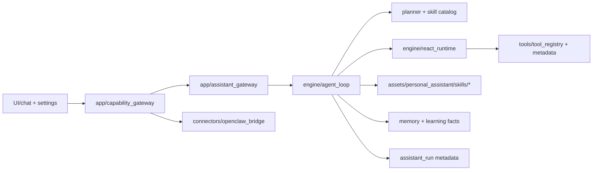
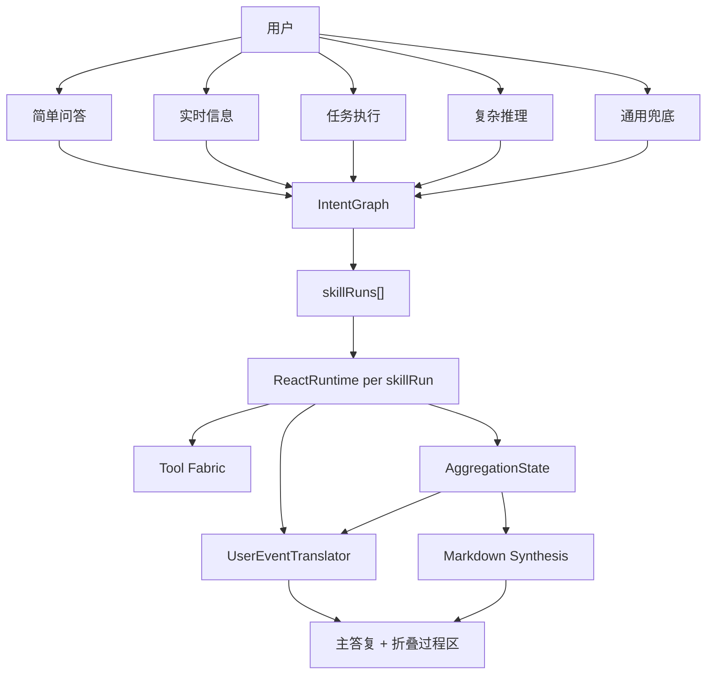
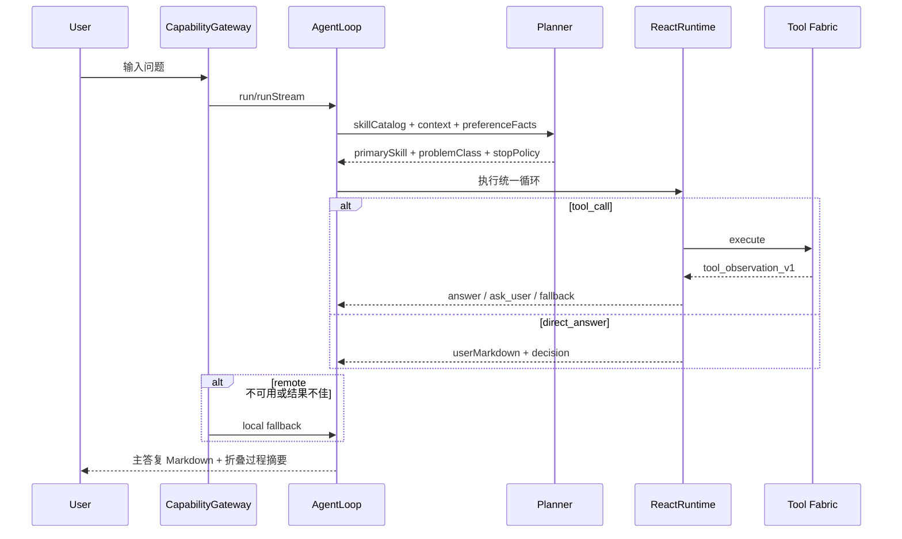

# world-class-trinity-experience-baseline 设计方案

## 设计动因

本特性不是继续追加天气、购物、闲聊等垂类局部优化，而是把“小趣私人助理”重构成一条可持续演进的统一主线：模型负责规划与选择，Skill 负责领域策略与体验差异，Tool Fabric 负责受控执行，UI 负责 Markdown-first 呈现与折叠可解释过程，Learning 负责事实沉淀与偏好回注。

本期要解决的不是“某一类问题不好用”，而是以下系统性问题：

- 同一个问题在本地、远端、不同入口上的处理心智不统一。
- 轻问题也容易进入重型搜索和反思循环，缺少收敛约束。
- 垂类体验差异散落在 prompt、runtime 和 UI，Skill 尚未成为真相源。
- 过程区表达的是内部状态，而不是用户任务进展。
- 偏好行为记录与主链脱节，无法形成“本会话即时生效”的体验。
- fallback 还不是高水准通用能力，模型或搜索质量不佳时容易显露系统混乱。

## 上游输入评审

### spec.md 评审

- `spec.md` 已稳定，目标、范围、5 个交付包、问题分型主线与鲁棒性目标均已明确，可进入设计。
- 规格已明确“模型主导、不做垂类硬编码、Skill 驱动差异化、Markdown-first、过程区折叠可解释、长期偏好可见可撤销”的关键方向，没有重大需求缺口。

### acceptance.yaml 评审

- `acceptance.yaml` 已定义 13 条可测量验收项，覆盖统一主线、问题分型、Skill DSL、Markdown-first、过程区、偏好事实、能力面统一、天气试点、鲁棒性与测试责任。
- `A1~A13` 已具备 `T1~T4` 责任矩阵，足以支撑设计分解和后续 `/dev` 实施。

### 仍需在设计阶段补充明确的阻断项

- 需要将 `assistant_run` metadata 中的协议字段补齐到设计目标，包括过程摘要、来源计数与偏好事实挂载位。
- 需要明确 Skill DSL 2.0 与现有 `SKILL.md` 目录的兼容迁移策略。
- 需要明确“过程区摘要文案”来源于 Skill Shell / Synthesis，而不是 UI 自由拼装。

结论：上游规格足以支撑设计，阻断项可在本设计内收敛，不构成 `GATE_BLOCK`。

## 对标输入分析

### 对标对象

- OpenClaw 类远端执行面：统一 `run / runStream / skills / invoke` 能力面，流式事件、远端优先、渠道互操作。
- 现代 Agent Runtime：模型主导 Planner、统一 Tool Registry、安全守卫外置、记忆与偏好回注。
- 一流对话体验：主答复优先、过程可解释但折叠、简单问题快收敛、复杂问题有结构、失败时仍给高质量结果。

### 借鉴点

- 用统一能力面连接本地执行、远端执行、渠道集成和 Skill 调用。
- 用 Planner + Skill Catalog 替代硬编码垂类路由。
- 用 Tool 元数据 + 守卫控制能力边界，而不是让模型完全自由调用。
- 用主答复 Markdown + 折叠过程区的双层结构提升可读性和信任感。
- 用事实型偏好系统先记录再回注，而不是直接做黑盒“自动学习人格”。

### 不借鉴点

- 不把原始 CoT、原始工具 JSON 或内部 trace 直接暴露给用户。
- 不把主答复产品化为大量固定卡片，保持 Markdown-first。
- 不让实时问题为了“更全面”而失去收敛速度。
- 不让 fallback 退化成低质模板错误回复。

### 当前差距

- 小趣已有 OpenClaw 能力面、CapabilityGateway、Tool Metadata、Skill 目录和协议基础，但还没有把它们统一成“Skill 中心化”的单一路径。
- 当前最大 gap 不是“有没有能力”，而是“能力边界没收口，差异化不在 Skill 上，主线还不够清晰”。

## 方案对比

### 方案 A：继续在现有 runtime 中增量打补丁

**做法**：

- 保留现有 `AgentLoop + ReactRuntime` 结构。
- 在 runtime 中继续针对天气、购物、闲聊等场景添加策略判断。
- UI 层增强过程区与 Markdown 样式，偏好仅做局部即时改写。

**优点**：

- 开发成本低，短期可较快修复部分场景问题。
- 对现有功能影响小，风险较可控。

**缺点**：

- 会进一步加重 runtime 对垂类的耦合。
- 新增领域能力仍需改引擎，难以规模扩展。
- 偏好、过程、收敛逻辑会继续散落。
- 难以真正解决“不同问题思维链不同，但主线统一”的核心问题。

**适用条件**：

- 只想做短期止血，不追求后续 Skill 扩展能力。

### 方案 B：Skill 中心化的统一主线（本期选型）

**做法**：

- 保留现有 `AgentLoop + ReactRuntime + CapabilityGateway` 基础架构。
- 将差异化策略系统性下沉到 Skill DSL 2.0。
- Planner 读取 Skill Catalog 自主决定问题所属主线。
- Tool Fabric 保持统一，靠元数据和守卫控制工具使用边界。
- UI 统一 Markdown-first 与折叠过程区。
- 偏好作为事实层进入会话主线，先本会话生效，再长期可见可撤销。

**优点**：

- 保持当前架构最小破坏升级。
- 不需要引擎层继续堆垂类硬编码。
- 适合今后持续新增 Skill 和优化领域体验。
- 能同时解决主线统一、问题分型、过程表达、偏好回注和 fallback 水准问题。

**缺点**：

- 设计面更大，需要同步处理 Skill、metadata、UI、runtime、测试。
- 需要明确旧 Skill 目录与新 DSL 的兼容迁移。

**适用条件**：

- 希望本次规格之后能直接进入商业交付、并为后续持续扩展打基础。

### 方案 C：云侧新建独立 Agent 服务，端侧只做薄 UI

**做法**：

- 把主执行链迁到新的云服务。
- 端侧只负责输入、渲染、权限桥接和少量本地工具。

**优点**：

- 最终有利于多端统一、集中运维和可观测。
- 适合未来平台化。

**缺点**：

- 当前改造成本高，涉及新服务、新 metadata、新部署和灰度策略。
- 会显著拉长交付周期，不适合本期“可进入 `/dev` 并快速商用收敛”的目标。

**适用条件**：

- 未来 P2/P3 阶段做平台化时作为演进方向。

## 选型决策

**选定方案**：方案 B，Skill 中心化的统一主线。

**理由**：

- 它兼顾了“模型主导”和“工程可控”。
- 它能最大程度复用现有 `OpenClaw` 协议外壳与本地执行内核。
- 它允许“不同问题思维链不同”，但差异集中到 Skill Shell，而不是继续在 runtime 层散落逻辑。
- 它能在不新增服务进程的前提下进入商用交付，并为未来云侧平台化保留演进空间。

## 关键设计决策

- 决策 1：保留 `CapabilityGateway` 作为统一能力外壳，不改变 `localOnly / remotePreferred / hybrid` 路由模式。
- 决策 2：首轮识别与二阶段规划分离。新增 `IntentGraph` 作为首轮导引结果，Planner 不再承担所有职责。
- 决策 3：Skill 升级为领域真相源，至少承载槽位、状态、工具预算、Markdown 风格、引用策略、偏好挂钩。
- 决策 4：主答复统一 Markdown-first；天气等高频场景不新增重卡片组件。
- 决策 5：过程区统一为“1 行摘要 + 1 个可展开来源计数”，并默认折叠。
- 决策 6：偏好系统分层为“本会话即时生效”与“长期偏好事实可见可撤销”。
- 决策 7：fallback 不是错误模板，而是高质量通用 Skill。
- 决策 8：runtime 只保留通用 ReAct、守卫、预算、回退能力，不承载领域体验细节。
- 决策 9：多 Skill 走正式 `skillRuns[]` 编排，不再使用“主 loop 完成后再补 subagent”的后置补丁模式。
- 决策 10：UI 不再直接消费 raw trace，统一只消费 `UserEvent` 与持久化的 `uiProcessTimelineV2`。

## 新增统一主线控制面

### `IntentGraph`

`IntentGraph` 是首轮导引的唯一结构化输出，只负责“理解与分发”，不负责详细执行规划。最小字段为：

- `userGoal`
- `problemShape`
- `primarySkill`
- `secondarySkills`
- `globalConstraints`
- `clarificationNeeded`

职责约束：

- 只做问题理解、问题分型、主副 skill 拆分、全局约束识别。
- 不直接生成 `queryVariants`、tool args 或过程区文案。
- 单 skill 问题要求 `secondarySkills=[]`。
- 多 skill 问题必须显式进入 `skillRuns[]`，禁止再退回单 loop 混合处理。

### `skillRuns[]`

每个 `skillRun` 是一个正式执行单元，而不是补丁式子任务。最小字段为：

- `runId`
- `domainId`
- `goal`
- `problemClass`
- `shell`
- `slotState`
- `answerReady`
- `stopReason`
- `references`
- `resultSummary`

执行原则：

- 单 skill 问题退化为 1 个 `skillRun`。
- 多 skill 问题由 `primary + secondary` 组成多个平级 `skillRun`。
- 每个 `skillRun` 必须注入自己的 `SkillExecutionShell`，禁止继承父任务残留预算。
- `ReactRuntime` 对 `skillRun` 执行，不再只理解“全局单轮 loop”。

### `AggregationState`

`AggregationState` 是全局出口判定器，统一决定是“成答、部分回答、继续扩展、请求澄清”。最小字段为：

- `allSkillsReady`
- `blockingSkills`
- `canGivePartialAnswer`
- `needExpansion`
- `expansionPlan`
- `finalAnswerReady`
- `finalAnswerMode`

出口约束：

- 所有 `skillRun.answerReady=true` 时，允许直接进入 `finalSynthesis`。
- 有阻塞但可回答部分结果时，允许部分回答并声明边界。
- 需要继续搜索、换源或补充 skill 时，通过 `expansionPlan` 触发下一轮。
- 信息不足且无法安全假设时，必须请求澄清。

### `UserEvent` 与 `uiProcessTimelineV2`

用户过程展示不再来源于 trace 翻译，而由正式 `UserEvent` 协议驱动。最小事件面为：

- `process_replace`
- `process_append`
- `process_commit`
- `answer_delta`

作用域分层：

- `root`：入口理解、任务拆分、整体进度
- `skill`：单个 `skillRun` 的进度与结论整理
- `aggregation`：整体是否可答、是否扩展、汇总中

持久化原则：

- UI 必须把过程状态落到消息级 `uiProcessTimelineV2`。
- live streaming 只负责演绎动画，不作为唯一数据源。
- 完成态与历史重载态必须使用同一份时间线结构恢复。

## 元数据唯一源分层

### `assistant_run` metadata 承载

- run/stream 回合结果与过程结果的持久化字段
- 协议版本、结构化决策、工具观测、子代理运行摘要
- 过程摘要与来源计数
- 偏好事实挂载位（本会话快照 / 长期偏好事实引用）
- 错误码与契约测试场景

### Skill 目录承载

- 领域目标与边界
- 槽位定义
- 状态机与状态迁移
- 工具绑定与预算
- Markdown 风格与引用策略
- 偏好挂钩策略

### Tool Catalog 承载

- 工具可用性与域矩阵
- 参数 schema
- 结果必需输出路径
- 用户可见 phase 文案模板和交互元数据
- 权限与确认要求

### UI 层承载

- Markdown 渲染
- 过程区折叠与展开交互
- 偏好设置展示与撤销入口

### 明确禁止的第二真相源

- 禁止在 `AgentLoop`、`ReactRuntime`、`ChatDetailPage` 中硬编码“天气要怎样”“购物要怎样”的策略判断。
- 禁止 UI 自行拼装过程区业务语义；过程摘要应由结构化结果提供。
- 禁止在多个位置并行维护 domain → tool override 表。

## 5 个交付包的具体方案

### 包 1：Unified Runtime Mainline

#### 设计方案

- `AgentLoop` 拆为两段：
  - 入口导引：生成 `IntentGraph`
  - 编排执行：根据 `IntentGraph` 派生 `skillRuns[]`、执行、聚合与成答
- `AgentLoop` 负责：
  - 会话事实与长期事实召回
  - 本会话偏好注入
  - Skill Catalog 和 Planner 输入装配
  - 合成就绪判断
  - 学习事实持久化
- `Planner` 负责：
  - 在已知 Skill 范围内给出 `problemClass / mode / stopPolicy / queryNormalization`
  - 不再承担首轮主副 skill 拆分
- `ReactRuntime` 负责：
  - 通用循环执行
  - 不关心某个领域怎么答，只关心 tool_call / observation / assess / decide
- `CapabilityGateway` 负责：
  - 统一本地/远端能力入口
  - 远端结果质量门控
  - stream 事件对齐
- 正式引入：
  - `IntentGraph`
  - `skillRuns[]`
  - `AggregationState`

#### 包内最小实现边界

- 不改 `CapabilityGateway` 总体路由模式。
- 不引入新的服务进程。
- 允许通过 feature flag 渐进切换到新 Skill Shell 路径。
- 删除 UI 预写 `domainId` 的控制权。
- 单 skill 与多 skill 共用一套 orchestrator，不再使用 `subagentPlan` 后补。

### 包 2：Skill DSL 2.0

#### 设计方案

每个 Skill 统一升级为以下结构：

- `manifest`
- `slot_contract`
- `dialogue_state`
- `tool_binding`
- `response_style`
- `reference_policy`
- `execution_shell`
- `preference_hooks`

#### 执行要求

- 天气、购物决策、闲聊陪伴、fallback_general_search 先成为试点 Skill。
- 现有 `SKILL.md` 保持兼容，但必须逐步补齐新的结构段。
- `execution_shell` 负责定义：
  - 是否允许反思重搜
  - 最大检索轮次
  - 是否允许 subagent
  - stop policy
  - 过程区摘要策略

### 包 3：Markdown-first Rendering

#### 设计方案

- 主答复永远以 `userMarkdown` 为中心。
- 过程区统一折叠，仅显示：
  - 一行摘要
  - 一项可展开来源计数
- 过程区上游统一改为 `UserEvent` 协议，不再从 trace 中猜语义。
- `trace`、raw reasoning、`<think>`、query 构造词、tool args 只进入 observability，不进入用户可见过程区和最终成答。
- Skill 通过 `response_style` 定义 Markdown 编排骨架：
  - 标题层级
  - 结论优先或依据优先
  - emoji 使用密度
  - 表格/引用/列表使用规则

#### 特别约束

- 天气等高频场景不增加专属 UI 卡片组件。
- UI 不参与领域格式决策，只负责渲染统一结果结构。
- 完成态、历史重载态、流式态统一依赖 `uiProcessTimelineV2` 恢复过程抽屉。

### 包 3.1：流式过程演绎协议

#### 设计方案

- 在 `CapabilityGateway` 内增加 `UserEventTranslator`，把本地 trace 与远端 SSE 统一翻译为用户态事件。
- 流式过程中，UI 只消费：
  - `process_replace`
  - `process_append`
  - `process_commit`
  - `answer_delta`
- 事件必须按 `root / skill / aggregation` 三层分发，保证复合问题可解释。

#### 关键实现点

- `OpenClawBridge` 兼容新的 `user_event/*` SSE 事件。
- 本地主线生成与远端桥回放必须产生相同形态的 `UserEvent`。
- UI 采用 reducer 处理事件，禁止 `trace / userPhase / chunk / completed` 多处直接改同一份状态。
- `answer_delta` 是最终答案正文的唯一流式来源；`process_*` 是过程抽屉的唯一流式来源；`completed` 是唯一终态封口来源。
- terminal payload 缺失时，只允许在 answer 通道已确认闭合后合成 completed；禁止使用 `thinkingProgress`、repair thinking 或 raw reasoning 封箱。
- 完成态摘要必须统一由 canonical `AssistantJourney` + 来源计数 + 整数秒耗时生成，历史重载与实时完成态使用同一口径。

### 包 4：Session + Long-term Preference Facts

#### 设计方案

- 本会话偏好：
  - 由当前会话内行为即时形成
  - 写入 `sessionPreferenceFacts`
  - 直接影响后续 Planner 与 Synthesizer
- 长期偏好：
  - 只记录事实，不做过度学习
  - 在设置中可见、可撤销
  - 按全局 + Skill/Domain 局部偏好组织

#### 偏好维度

- 任务类型偏好
- 结构与密度偏好
- 表达风格偏好
- 过程透明度偏好
- 收敛容忍度偏好
- 按 Skill 的局部偏好

### 包 5：Fallback General Skill High-quality Baseline

#### 设计方案

- 新增高质量 `fallback_general_search` 基线要求：
  - 在模型输出不稳、搜索质量低、工具失败、远端不可用时统一承接
  - 给出结论、边界说明、下一步建议
  - 不暴露内部系统状态

#### 触发条件

- Planner 低信心
- Skill 竞争冲突
- 关键槽位无法补齐
- 低质量搜索连续触发 stop policy
- 结构化解析失败

## TDD / ATDD 策略

### ATDD

- 以 `acceptance.yaml` A1~A13 为产品验收驱动。
- 设计阶段先把验收项绑定到 5 个交付包和 5 类问题分型。

### TDD

- 先写 Red：
  - Skill DSL contract tests
  - problemClass 路由 tests
  - `IntentGraph` / `skillRuns[]` / `AggregationState` 契约 tests
  - `UserEvent` / `uiProcessTimelineV2` 契约 tests
  - Markdown 渲染和过程区 regression tests
  - preference facts read/write tests
  - fallback quality contract tests
- 再做 Green：
  - metadata 补齐
  - runtime 接线
  - Skill 试点落地
- 最后 Refactor：
  - 清除 runtime 中残余领域硬编码
  - 合并重复过程文案拼装逻辑

## Story 与测试层映射

### Story S1：统一主线与问题分型

- 对应包：1
- 测试层：
  - `T1`：Planner / problemClass / stopPolicy contract
  - `T3`：local/remote/hybrid 行为一致性

### Story S2：Skill DSL 2.0 与试点 Skill

- 对应包：2
- 测试层：
  - `T1`：Skill 结构与字段契约
  - `T3`：天气/购物/闲聊/fallback 集成闭环

### Story S3：Markdown-first 与过程区

- 对应包：3
- 测试层：
  - `T2`：Markdown / 过程区 UI 回归
  - `T3`：run/stream 端到端渲染一致性

### Story S4：偏好事实与设置页

- 对应包：4
- 测试层：
  - `T1`：偏好事实 schema 与注入逻辑
  - `T2`：设置页可见/撤销交互

### Story S5：通用 fallback 高质量基线

- 对应包：5
- 测试层：
  - `T1`：fallback contract
  - `T3`：低质量搜索、工具失败、远端不可用回退
  - `T4`：弱网和权限异常真实场景

## 角色职责与多重防护网

- 产品：定义 5 类问题体验目标、过程区交互、偏好设置展示与撤销心智。
- 架构：定义 Unified Runtime Mainline、Skill DSL 2.0、metadata 边界、灰度策略。
- 开发：按 TDD 执行 metadata → codegen → runtime → UI → tests。
- 测试：维护 `T1~T4` 证据矩阵，尤其关注回退、弱网、权限、定位、远端失败。
- 发布：负责 5/25/50/100 放量、监控指标与回滚执行。

多重防护网：

- Skill 驱动防止垂类散落
- Tool Guard 防止无限循环和危险动作
- CapabilityGateway 防止远端不合格结果直接暴露
- UI 渲染降级防止结构化输出异常直达用户
- Fallback General Skill 防止系统“失态”

## 实时性与弱网设计

### 时延目标

- 简单问答：首个有用响应目标 `< 1.2s`
- 实时信息：首个有用响应目标 `< 2.5s`
- 复杂推理：先给结构骨架目标 `< 2s`

### 一致性与重试

- stream 事件顺序：`trace -> chunk -> completed`
- 远端 fallback 到本地时，不允许双路 chunk 叠加
- 实时问题的 stop policy 必须由 Skill Shell 显式定义

### 弱网与降级

- 远端超时：优先本地回退
- 搜索失败：优先 fallback general skill
- 定位失败：天气等 Skill 进入 `ask_user` 或高质量降级路径

## 并发性能与容量设计

- 简单问题默认不允许多路扩搜。
- 复杂推理允许更高预算，但必须由 Skill Shell 控制工具轮次。
- subagent 不是默认策略，仅在复杂任务场景启用。
- 搜索和网页抓取要有结果截断和预算上限，防止上下文被单工具吞掉。

## 灰度发布与回滚设计

### 灰度开关

- `skill_shell_v2_enabled`
- `markdown_first_rendering_enabled`
- `session_preference_facts_enabled`
- `fallback_general_skill_enabled`
- `problem_class_routing_enabled`

### 放量节奏

- 5%：天气试点
- 25%：天气 + fallback
- 50%：加购物决策和闲聊陪伴
- 100%：统一主线默认开启

### 观测指标

- `decision_parse_success`
- `render_fallback_rate`
- `search_overrun_rate`
- `fallback_activation_rate`
- `remote_to_local_failover_rate`
- `session_preference_apply_rate`

### 回滚条件

- `decision_parse_success < 99.5%`
- `render_fallback_rate > 1%`
- `simple_qa_latency` 明显回退
- 远端回退后 UI 出现双路内容叠加

## 元数据基线变更

本次设计阶段确认需要的 metadata 变更如下：

- `assistant_run/fields.yaml`
  - 新增过程摘要字段
  - 新增来源计数字段
  - 新增会话偏好事实字段
  - 新增长期偏好事实字段
- `assistant_run/service.yaml`
  - 补齐偏好事实相关 contract test 场景
  - 补齐过程区折叠结果相关 assertions
- `assistant_run/errors.yaml`
  - 复用现有结构化错误，若新增设置读写/撤销失败场景，再扩展错误码

## 未来演进

- 演进 1：将 Skill DSL 2.0 下沉为更强的结构化 schema，而非仅 Markdown + frontmatter。
- 演进 2：当远端执行成熟后，逐步将主路径迁到云侧，但保持相同 `run / runStream / skills / invoke` 能力面。
- 演进 3：长期偏好在事实积累足够后，升级为可学习标签系统和策略优化器。
- 演进 4：引入更强的商用质量与成本看板。

## 遗留带规划任务

- 当前不做第三方 Skill 市场化，但要保留 Skill DSL 与权限模型的兼容扩展点。
- 当前不做全端统一 UI，但 Markdown-first 渲染规则要尽量平台中立。
- 当前不做长期偏好自动优化，但设置页必须先建立“可见可撤销”的用户心智。

## 架构交付件（按新规范补齐）

### 组件/包图（Component + Package）

- 适用范围与约束：适用于当前移动端助理主链路与 OpenClaw 远端桥接；不覆盖新建云服务。
- 当前实现映射：`app/*`、`engine/*`、`tools/*`、`assets/personal_assistant/skills/*`、`contracts/metadata/assistant/assistant_run/*`。
- 验收映射：A1、A4、A8、A11。

### 用例图（Use Case）

- 适用范围与约束：覆盖 5 类问题分型，不覆盖后台批处理任务。
- 当前实现映射：`agent_loop.dart`、`react_runtime.dart`、`skill/*`、`capability_gateway.dart`、`openclaw_bridge.dart`、`chat_detail_page.dart`。
- 验收映射：A1、A3、A5、A6、A9、A10、A12。

### 流程图（主流程 + 失败流程）

- 适用范围与约束：覆盖正常路径、工具失败、远端失败、本地回退四路径。
- 当前实现映射：`capability_gateway.dart`、`agent_loop.dart`、`react_runtime.dart`、`tool_registry.dart`、`openclaw_bridge.dart`。
- 验收映射：A1、A8、A9、A11。
