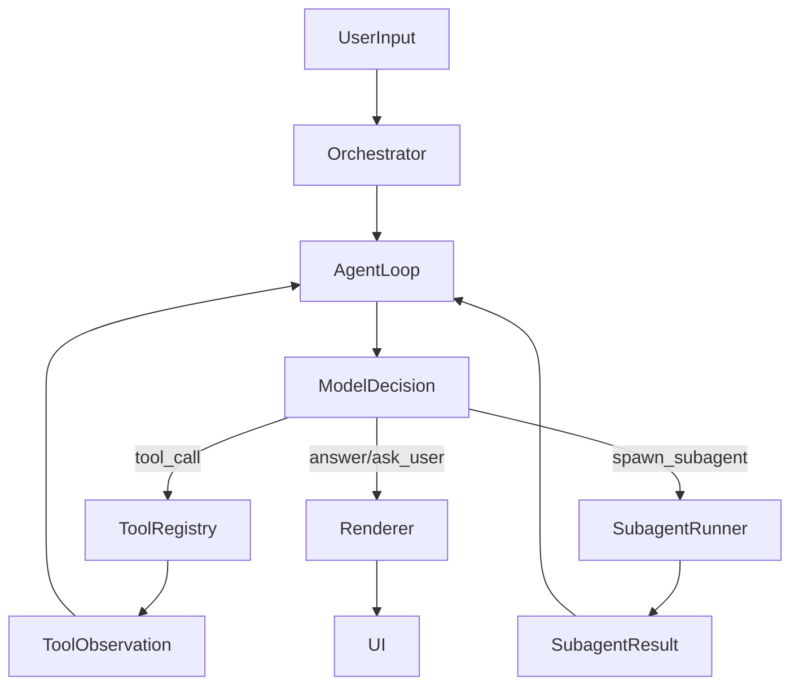
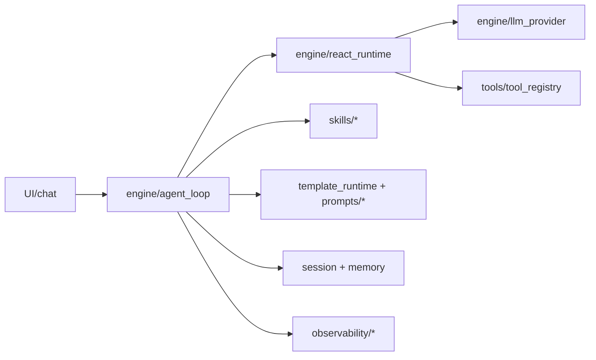
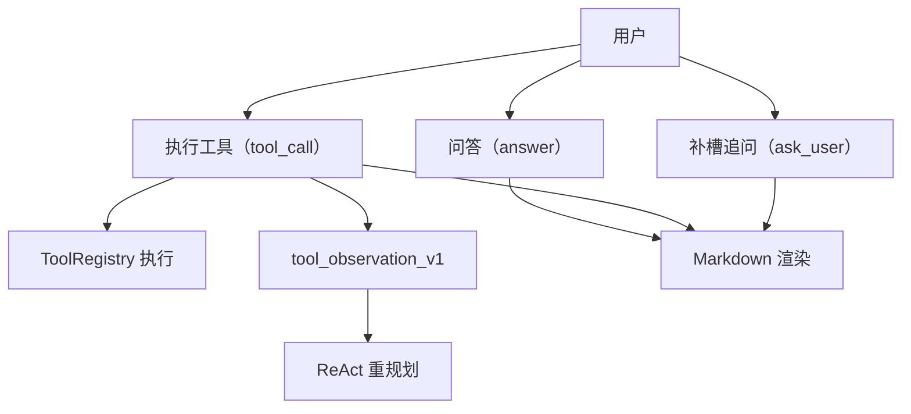
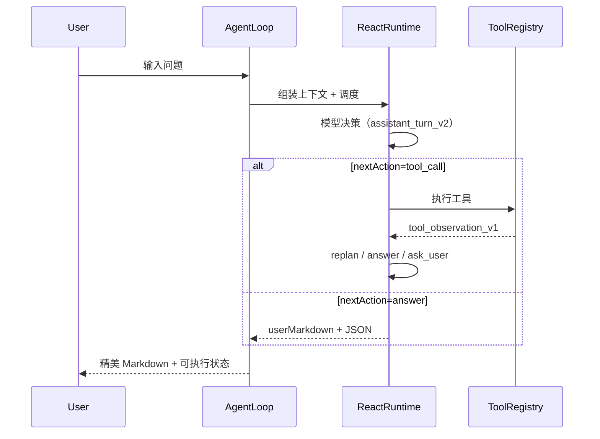

# 设计说明：world-class-trinity-experience-baseline（重构版）

## 设计动因

现状问题并非单点缺陷，而是“协议弱约束 + 字符串分支 + 渲染路径分裂”导致的系统性不稳定。  
目标从“体验补丁”升级为“可扩展 Agent Runtime 基线”，保证：

- 对话可持续（会答 + 会做）
- 过程可解释（trace/subagent）
- 输出可控（md+json）
- 扩展可治理（prompt/skill/tool/connector）

## 业界实现借鉴（源码机制）

### OpenClaw 类借鉴
- 统一 `run/runStream` 协议
- 事件流：`trace/chunk/completed/failed`
- 远端优先 + 本地回退
- 渠道无关的能力面（skills/invoke/run）

### Nanobot 类借鉴
- 单循环 AgentLoop（message -> model -> tool -> observe -> next）
- ToolRegistry 统一 schema 校验与错误封装
- Session + Memory consolidation
- Subagent 异步拆分与回注

### 结论
采用“OpenClaw 协议外壳 + Nanobot 执行内核”的组合设计，适配当前小趣架构最小破坏升级。

## 选型比较

### 方案 A：继续文本驱动（弃用）
- 成本低，但不可国际化、不可稳定回归。

### 方案 B：`md+json` 双通道协议（本期选型）
- 机器执行靠 JSON，用户展示靠 Markdown。
- 结构化失败恢复 + 补槽追问 + 统一渲染降级。

### 方案 C：AUI 专有协议（暂缓）
- 先不引入，以免协议耦合过高。

## 核心设计

### 1) 回合协议：`assistant_turn_v2`

```text
decision.nextAction = answer | tool_call | ask_user | spawn_subagent | retry | abort
slotState = machine-readable slots with confidence/source
toolPlan = executable tool list with retry/idempotency
askUser = l10n key + args + optional flag
userMarkdown = final render payload for UI
```

### 2) 工具观察协议：`tool_observation_v1`

```text
ok/errorCode/errorClass/retryable/slotDelta/i18nKey
```

禁止任何关键路径依赖 `contains("中文文案")`。

### 3) 子代理协议

- `subagent_plan_v1`：goal、budget、tool whitelist、timeout
- `subagent_result_v1`：status、findings、evidence、nextAction

### 4) Prompt Stack 分层

1. global system prompt（边界/隐私/安全）
2. runtime policy prompt（预算/权限/槽位）
3. domain skill prompt（天气等垂类策略）
4. recovery prompt（工具失败恢复）
5. output contract prompt（强制结构化输出）

### 5) 渲染策略

- 优先渲染 `userMarkdown`
- 结构块解析失败 -> 安全降级到纯 Markdown
- trace/subagent 使用时间线组件，不污染主答复正文

## 目标执行流



## 架构交付件（按新规范补齐）

### 组件/包图（Component + Package）



- 适用范围与约束：适用于当前移动端个人助理主链路；不覆盖独立服务编排。
- 当前实现映射：`engine/*`、`skills/*`、`tools/*`、`template_runtime/*`、`observability/*`。
- 演进点与触发条件：当多技能并行默认开启时，补充独立 scheduler 组件。

### 用例图（Use Case）



- 适用范围与约束：覆盖单轮到多轮主会话，不含后台批处理任务。
- 当前实现映射：`react_runtime.dart`、`tool_registry.dart`、`chat_detail_page.dart`。
- 演进点与触发条件：当子代理跨域汇总成为默认路径时，补 `subagent` 用例分层。

### 流程图（主流程 + 失败流程）



- 适用范围与约束：覆盖工具成功、失败、追问三路径；不覆盖离线批量回放。
- 当前实现映射：`agent_loop.dart`、`react_runtime.dart`、`tool_registry.dart`。
- 演进点与触发条件：当 failover 指标超阈值时，加入 provider 级自动切换流程节点。

## 交付映射（tasks / acceptance / tests）

| 交付项 | tasks.md | acceptance.yaml | tests |
|---|---|---|---|
| 结构化决策与工具观测 | I1/I2/T1 | A3/A7/A9 | `react_runtime_tool_observation_contract_test.dart` |
| 双轨渲染与降级 | U1/U2/T3 | A2/A10 | `structured_response_contract_test.dart` |
| 子代理回注主会话 | S2-1/S2-3 | A4/A5 | `chat_detail_page_assistant_ui_regression_test.dart` |
| 质量指标门禁 | R3/T4 | A9/A10/A11 | `quality_metrics_gate_test.dart` |

## 风险控制

1. 协议改造期间双写：旧逻辑可回退，新协议逐步放量。  
2. 天气垂类先试点，验证稳定后推广其它垂类。  
3. 通过 feature flag 控制 `structured_decision_enabled` 灰度。  
4. 所有协议字段变更必须带版本号与兼容策略。

## 与现有系统边界

- 不新增服务进程，不破坏现有 `CapabilityGateway` 路由模式。
- 不修改 codegen generated 文件。
- metadata 仍为唯一真相源，先变 metadata 再业务代码。
