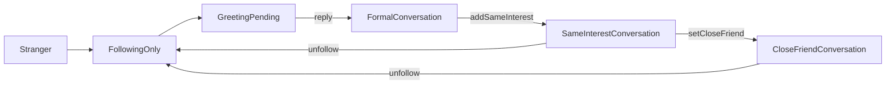

# 联系人与会话治理设计方案

## 设计动因

`contact-and-session-governance/spec.md` 已冻结“关注 -> 打招呼 -> 回复建会话 -> 会话内加同好 -> 同好/密友”的产品链路，但现有端云基础只具备：

- `FollowEdge`：关注/互关布尔关系
- `BlockEdge`：用户级阻断
- `Conversation`：正式会话容器
- `UserSetting.allowStrangerMsg`：陌生人消息设置

缺失的是中间层：

1. 未回复前的接触请求容器
2. 正式会话与请求箱的升级语义
3. 同好/密友能力位的统一真相源
4. 对打招呼、会话升级、RTC 门禁、对象级治理的统一判定

如果直接把打招呼落成正式 `Conversation`，会污染普通聊天列表，也会让 RTC、群治理、请求箱的状态语义全部耦合到聊天主容器中。因此本设计采用“请求箱对象 + 正式会话升级 + 能力位投影”的分层方案。

## 上游输入评审

- `spec.md` 已冻结五态关系、请求箱边界、群治理边界和 RTC 门禁语义
- `realtime-call/spec.md` 已冻结 1v1/多人通话、多人选择规则、通话中加人与链接入会
- `group-settings/spec.md` 已冻结群设置页只保留 `退出群聊`
- 当前无额外产品阻断项

## 对标输入分析

| 对标 | 借鉴 | 不借鉴 | 当前差距 |
|------|------|--------|---------|
| 微信好友申请 | 请求箱与正式会话分层、先通过再进入稳定沟通 | 强行把所有申请都做成会话 | 当前缺请求箱对象 |
| Instagram 私信请求 | 请求不污染主列表、由接收方决定是否升级 | 请求与正式私信并存过久导致心智混乱 | 当前缺会话升级语义 |
| 微信联系人关系 | 同意后进入稳定联系人，可进一步强化关系 | 好友语义过强、无法表达密友层 | 当前仅有 follow 布尔值 |
| Signal/WhatsApp 隐私门禁 | 由对象级 block/设置控制准入 | 以弱提醒代替强门禁 | 当前 allowStrangerMsg 未被 chat/rtc 消费 |

## 方案对比

### 对比 1：打招呼是否直接创建 Conversation

#### 方案 A：直接创建正式会话

打招呼一发送就创建 `Conversation(type=direct)`，在列表中标记为“待对方回复”。

**优点**：
- 复用现有聊天对象与列表
- 表层实现简单

**缺点**：
- 污染普通聊天列表
- 会话状态需要承载“待回复/已忽略/被拒绝”非聊天语义
- 后续同好/密友、RTC 门禁判断都要从 Conversation 反推

#### 方案 B：独立 GreetingRequest，再升级 Conversation（选定）

未回复前使用独立请求对象；回复后创建或升级为正式会话。

**优点**：
- 请求箱与正式会话职责清晰
- 主聊天列表不被污染
- 关系、治理、RTC 门禁更易统一

**缺点**：
- 需要新增 metadata 对象、事件和读模型

### 对比 2：同好/密友如何建模

#### 方案 A：仅用 FollowEdge 布尔值推导

`同好 = isMutual`，`密友` 作为前端本地标签或 `UserSetting` 字段。

**优点**：
- 初始成本低

**缺点**：
- 密友缺乏稳定真相源
- 无法为会话、RTC、推荐统一输出能力位
- 取消关注后的关系回收难做审计

#### 方案 B：FollowEdge + RelationshipTier 投影（选定）

保留 `FollowEdge` 作为底层边；通过新对象/新读模型统一输出 `none/following_only/same_interest/close_friend`。

**优点**：
- 互关与密友可统一计算与审计
- 能给聊天页、主页、RTC 一次性输出能力位

**缺点**：
- 需要新增对象或至少新增 relation-tier 投影

### 对比 3：RTC 门禁放在哪层

#### 方案 A：页面层零散判断

资料页、聊天页、RTC Provider 各自判断是否展示语音/视频按钮。

**优点**：
- 前端可快速落 UI

**缺点**：
- 多处漂移
- 云侧仍无法阻断绕过

#### 方案 B：能力位统一下沉（选定）

关系层统一计算：

- `canGreet`
- `canOpenConversation`
- `canAddSameInterest`
- `canStartVoiceCall`
- `canStartVideoCall`
- `canSetCloseFriend`

前端只消费能力位，云侧 API 同步复核。

**优点**：
- 单一真相源
- 前后端语义一致

## 关键设计决策

### KD-1：请求箱对象（已定）

新增独立对象 `GreetingRequest`，作为未升级前的请求容器。

建议字段：

| 字段 | 说明 |
|------|------|
| `id` | 请求 ID |
| `requesterSubAccountId` | 发起方 |
| `targetSubAccountId` | 接收方 |
| `requestMessage` | 自定义内容 |
| `status` | `pending/replied/ignored/rejected/cancelled/expired/blocked` |
| `source` | `profile/conversation/invite/recommendation` |
| `promotedConversationId` | 升级后的正式会话 |
| `createdAt/updatedAt/decisionAt/expireAt` | 生命周期字段 |

### KD-2：关系层输出（已定）

底层保留 `FollowEdge`，上层统一输出 `RelationshipCapabilityView`：

```text
relationTier: self | stranger | following_only | same_interest | close_friend
isFollowing
isFollowedBy
isMutual
isCloseFriend
hasPendingGreeting
hasFormalConversation
canGreet
canOpenConversation
canAddSameInterest
canStartVoiceCall
canStartVideoCall
canSetCloseFriend
```

其中：

- `same_interest = isMutual`
- `close_friend = isMutual && closeFriendFlag`
- 取消关注后自动回收 `same_interest/close_friend` 能力

### KD-3：会话升级语义（已定）

正式会话与请求箱分层：



规则：

1. `GreetingPending` 不进入普通聊天列表
2. `reply` 后进入 `FormalConversation`
3. `FormalConversation` 但未互关时，在会话顶部展示“加同好”
4. 升级为同好后，RTC 入口解锁

### KD-4：列表分层（已定）

列表拆成两层：

1. 请求箱
   - 收件箱
   - 发件箱
2. 正式聊天列表
   - 只展示正式 `Conversation`

请求箱和正式聊天列表共享同一导航域，但数据源与 badge 分离，避免污染主聊天列表。

### KD-5：免骚扰与阻断策略（已定）

`GreetingRequest.create` 前置校验：

1. `BlockEdge`：任一方拉黑，直接拒绝
2. `allowStrangerMsg` / isolation policy：不允许陌生人打招呼则拒绝
3. Pending 去重：同一对用户最多 1 条有效 pending 请求
4. 频控：同一发起者对同一目标设置冷却期

云侧与端侧都消费同一错误码族。

### KD-6：对象级治理边界（已定）

1v1 与群聊中的举报/拉黑统一下沉到对象级：

- 用户对象：主页、成员卡片
- 消息对象：长按菜单

群对象当前不提供举报能力。

### KD-7：前端状态分层（已定）

推荐 Provider 分层：

```text
relationshipProvider(userId)
greetingInboxProvider()
greetingOutboxProvider()
conversationMetaProvider(conversationId)
conversationCapabilityProvider(conversationId)
composerUiProvider(conversationId)
```

`ChatDetailPage` 只消费能力位，不自行推导互关、密友、待回复状态。

## Metadata-first 落地顺序

### 1. 对象与字段

建议顺序：

1. 新增 `GreetingRequest`
2. 新增/扩展 `RelationshipTier` 读模型
3. 扩展 `Conversation` 的升级来源字段
4. 扩展 `rtc/call_session/errors.yaml` 的门禁错误码

### 2. API 与事件

建议新增：

- GreetingRequest API：
  - `CreateGreetingRequest`
  - `ListGreetingInbox`
  - `ListGreetingOutbox`
  - `ReplyGreetingRequest`
  - `IgnoreGreetingRequest`
  - `CancelGreetingRequest`
- 关系 API：
  - `AddSameInterest`
  - `SetCloseFriend`
  - `UnsetCloseFriend`
  - `GetRelationshipCapability`
- Events：
  - `GreetingRequested`
  - `GreetingReplied`
  - `GreetingPromotedToConversation`
  - `SameInterestGranted`
  - `SameInterestRevoked`
  - `CloseFriendSet`
  - `CloseFriendUnset`

### 3. 投影与读模型

至少需要：

- `greeting_inbox_view`
- `relationship_capability_view`

如果不先做投影，前端会同时依赖 `follow_edge + block_edge + conversation + settings + greeting_request` 多源拼装，风险过高。

## 扩展场景映射

| 需求 | 扩展场景 |
|------|----------|
| 新增 GreetingRequest | `S01` 或 `S03` |
| 扩展 Conversation 字段 | `S11` |
| 新增请求/关系 API | `S05` / `S15` |
| 新增事件 | `S06` |
| 新增关系/请求投影 | `S07` |
| 增加门禁契约测试 | `S20` |

## 与下游特性的协作

### 对 `realtime-call`

- 提供 `canStartVoiceCall/canStartVideoCall`
- `InitiateCall/InviteToCall` 必须复核关系门禁

### 对 `group-settings`

- 提供群对象治理边界说明
- 让群设置页只承担设置与退出，不承担举报/拉黑逻辑

### 对 `profile/chat`

- 主页消费五态按钮矩阵
- 会话页消费“加同好关系条”

## 风险与预案

### 风险 1：对象建模过度分散

如果请求箱、关系层、会话升级分别由多个服务临时维护，状态会飘。

**预案**：优先把请求对象和能力位统一到 `user/chat` 边界内，避免前端拼装多个不一致来源。

### 风险 2：直接在 Conversation 上扩 pending 状态

会让正式聊天列表和请求箱边界被破坏。

**预案**：请求独立建模，仅在升级成功后落正式会话。

### 风险 3：前端继续把能力判断分散在页面

**预案**：设计阶段明确 provider 层输出能力位，页面只消费。

## 适用场景与约束

- **适用**：关注、打招呼、正式会话、同好/密友升级、1v1 RTC 门禁
- **约束**：与 `user/follow_edge`、`user/block_edge`、`messages/conversation`、`rtc/call_session` 保持 metadata 一致
- **局限性**：本设计不覆盖群对象举报，也不覆盖推荐算法判定同好

## 未来演进

1. 基于共同圈子/互动强度推荐“可能成为同好”
2. 对密友增加专属排序或快捷入口
3. 把请求箱与通知中心进一步融合
