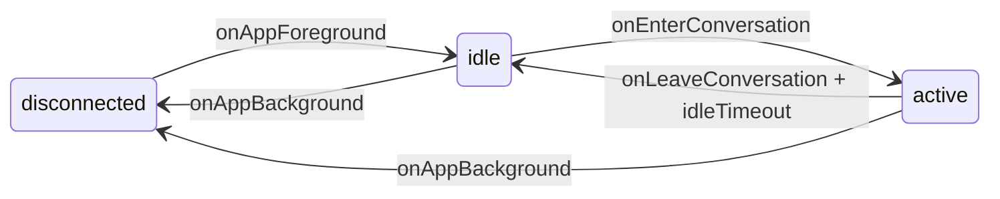

# L3 特性：实时推送与离线同步（Realtime Push & Offline Sync）

> **层级**：L3 story（隶属 L2 `list-detail-message-delivery`，L1 `chat-conversation`）
> **状态**：implemented（production Remote-only + alpha composition 子集）
> **依赖**：`gateway-orchestrator-foundation/realtime-gateway`（Remote WebSocket/Long-polling 对端）、`messages/chat` contract fixture（alpha runner 事件真相源）

## 背景与动机

趣聊端侧此前已经有 `LongPollTransport` / `WebSocketTransport` 原型，但接入存在三类关键缺口：

- **Mock 模式误连真实 transport**：alpha/mock 下仍可能触发 remote long-poll，出现 `HandshakeException: WRONG_VERSION_NUMBER`
- **生命周期未闭环**：`onAppForeground()` / `onAppBackground()` 没有接到 App root，Remote 空闲态 LongPoll 很容易 silent fail
- **Mock 演示不可信**：Mock 只能切 transport state，不能推送 contract 对齐的新消息/入群事件，无法证明 handler 和 UI 更新链路

本 Story 冻结端侧 Phase 1 可交付子集：production 只装配 Remote，将 App 生命周期接到 realtime 状态机；alpha runner 在独立 composition root 注入 contract fixture delegate。服务端 EventPublisher、离线推送和全量 gap fill 不由本 Story 冒充完成，归各自登记对象与验收节点。

## 目标用户

- **alpha 开发与验收人员**：需要稳定演示“进入聊天后收到 realtime 新气泡”，且 fixture 实现不进入 production kernel
- **beta remote 联调人员**：需要验证前台 idle LongPoll、进入会话 active WebSocket、退后台 disconnect 的最小闭环

## 本迭代范围

### F1 唯一连接端口与物理装配

1. `RealtimeConnectionDelegate` 是 production Remote 与 alpha/test composition 共用的生命周期端口，统一暴露 `idle` / `active` / `disconnected` 三态与 `foreground/background/enter/leave/dispose` 方法。
2. `RealtimeConnectionNotifier` + `realtimeConnectionManagerProvider` 是 UI 唯一入口；production 默认 factory 只能构造 Remote，不观察 `appDataSourceModeProvider`。
3. alpha runner 覆盖整个 notifier 并持有 fixture delegate；UI、Shell、页面禁止实例化 transport 或依赖 alpha/mock package。

### F2 生命周期驱动的端侧状态机

4. `QuWoQuanAppRoot` 监听 `AppLifecycleState`，将 `resumed` 映射到 `onAppForeground()`，将 `paused` / `hidden` / `detached` 映射到 `onAppBackground()`。
5. `inactive` 不触发 background 语义，避免 iOS 瞬时中断导致无意义重连。
6. `ChatConversationPage` 进入时调用 `onEnterConversation(conversationId)`，离开时调用 `onLeaveConversation()`。
7. Remote 的 leave-idle 计时只使用 `RealtimeConfig.wsIdleTimeoutSec`；alpha fixture 离开页面立即取消待推事件，不模拟 transport idle timeout。

### F3 Remote 空闲态与活跃态最小闭环

8. Remote foreground 进入 `idle` 时启动 `LongPollTransport`，请求路径与 page id 来自 realtime metadata/codegen。
9. Remote 进入聊天页时切到 `active`，停止 long-poll 并发起 WebSocket connect。
10. Remote 退后台时 teardown LongPoll / WebSocket / reconnect timer，回到 `disconnected`。
11. Remote connect 所用 `userId` 来自 `currentUserIdProvider` 对应的认证会话，而非 `ChatMockData`。

### F4 Alpha contract fixture 驱动事件

12. `AlphaRealtimeConnectionDelegate` 只读取生成的 immutable fixture bundle 中 `chat_realtime_fixture_core` seed，运行时不读取仓库文件。
13. 至少覆盖两类事件：`MessageSent`（新增文本消息）和 `ConversationMemberAdded`（群会话系统消息）。
14. Alpha delegate 在进入聊天后延迟推送 fixture 事件，复用与 Remote 相同的 `RealtimeMessageHandler`；local contract 对应 fixture adapter 只能位于 `test/support`。

## 状态机与交互语义

说明：

- **foreground but no active chat**：进入 `idle`，production Remote 轮询 inbox，alpha fixture 不发网络请求
- **viewing chat detail**：进入 `active`，production Remote 用 WebSocket，alpha runner 推送 contract fixture 事件
- **background**：统一 `disconnected`，transport 全部释放

## 本轮不做什么（Out of Scope）

- `chat-service` EventPublisher 接入与 Redis fanout
- FCM/APNs 注册、离线推送触达、通知点击直达聊天页
- 全量 seq gap fill / SyncMessages 恢复策略
- `/config/realtime` 热更新配置拉取
- Realtime 连接态埋点、SLO histogram、灰度与回滚仪表盘
- 多设备同时在线同步、消息压缩、端到端加密推送

## 约束

### 架构与真相源约束

- `RealtimeConnectionNotifier` 是 UI 层唯一可见入口；页面不得直接 new `LongPollTransport` / `WebSocketTransport`
- Production realtime source 禁止 import alpha/mock package、fixture loader 或任意 mock 数据目录。
- Alpha 事件 payload 的唯一真相源是生成 bundle 内的 contract fixture；未登记会话不生成伪造 realtime 事件，新增场景必须先登记 fixture。
- Long-poll 请求路径与 page id 必须来自 `realtime_api_metadata.g.dart` 与 `realtime_request_page_ids.g.dart`
- Production Remote、alpha runner 与 test fixture 都必须复用同一个 `RealtimeMessageHandler`，不得维护第二条消息插入链路

### 产品与体验约束

- alpha composition 进入聊天后应在约 300ms 内看到新增 realtime 消息，而不是重复过往消息
- 群聊 fixture 必须能证明 `ConversationMemberAdded` 分支会产生系统消息
- 页面卸载、退后台不得留下 leaked timer 或继续追加延迟推送；runtime mode 变化不得替换 realtime delegate

## 对标与吸收结论

| 对标 | 借鉴点 | 本轮不引入 |
|---|---|---|
| 微信 | 前台活跃即时、后台断连、聊天页进入即提升连接等级 | 专有推送通道、离线推送体验 |
| 飞书 | HTTP 发送 + WebSocket 接收拆分；状态机明确 | 多租户和复杂鉴权编排 |
| Discord | WebSocket + reconnect timer 基本模型 | 完整 resume/session 缓存 |

## 跨特性依赖

| 依赖 | 方向 | 说明 |
|---|---|---|
| `gateway-orchestrator-foundation/realtime-gateway` | ← | Remote LongPoll/WS 的对端服务与 metadata 契约 |
| `messages/chat` contract fixture | ← | Mock event catalog 的唯一 fixture 来源 |
| `voice-message` | ← | 证明聊天页依赖 provider/handler 驱动而非局部 `_messages` 状态 |

## 验收重点

### local_contract 契约与静态层

- `chat_realtime_fixture_core` 已登记到 chat fixture 与 alpha seed manifest
- Remote realtime 文件不再依赖 `ChatMockData`
- Long-poll transport 使用 generated metadata path + page id

### local_contract 模块与交互层

- Alpha/test fixture delegate 进入聊天后只走 state + catalog，不发 remote HTTP/WS
- Remote 生命周期状态机覆盖 foreground idle、enter active、background disconnect
- `ChatConversationPage` 在 alpha/test composition 下可观察到 fixture realtime 新消息
- `ConversationMemberAdded` 通过 `RealtimeMessageHandler` 插入系统消息

### api_integration 端云集成层

- transport contract 测试验证 Long-poll 路径与 request page id 仍与 metadata 一致
- Remote delegate 生命周期测试验证 idle/active transport 切换未偏离现有 transport 语义

### user_acceptance 端到端旅程层

- alpha 旅程可稳定演示：进聊天 → 新消息出现 → 页面退出不残留异常定时器；production 依赖图不包含该 fixture 实现

详细条目见 `acceptance.yaml`。
