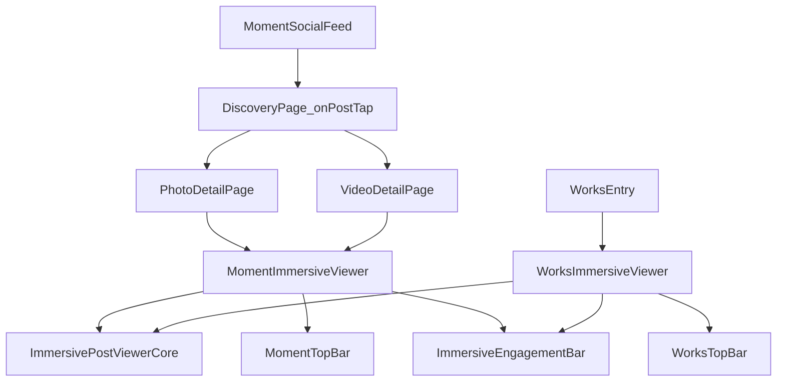

# moment-display-journey 设计

## 设计动因

当前微趣点击后进入的侵入式浏览器在结构上与作品浏览器存在实现分叉，导致顶部/底部工具栏与交互行为难以持续一致。  
本次设计目标是：**以作品侵入式浏览器为行为基线**，抽离通用内核能力，按 `works/moment` 做场景装配，并显式拆分顶部工具栏差异，统一底部互动条实现。

## 关键决策

### 1) 架构分层：Core + Scene + Toolbar + Engagement

| 层 | 职责 | 命名规则 |
|---|---|---|
| Core | 手势、分页、状态同步、回调、沉浸模式 | 中性命名：`ImmersivePostViewerCore` |
| Scene | 业务场景装配（works 或 moment） | 场景命名：`WorksImmersiveViewer` / `MomentImmersiveViewer` |
| TopBar | 顶栏视觉与交互差异 | `WorksTopBar` / `MomentTopBar` |
| BottomBar | 互动动作统一能力 | `ImmersiveEngagementBar`（从 works 现实现抽取） |

### 2) 命名治理

- `works` 仅作为场景名，不再承载通用组件语义。
- 通用能力统一使用中性命名：`Immersive*`、`Post*`、`Engagement*`。
- 禁止在 moment 场景再复制一套“近似 works”的底栏逻辑，必须复用同源组件。

### 3) 顶栏/底栏策略

| 区域 | works | moment | 设计结论 |
|---|---|---|---|
| 顶栏 | 完整信息（返回、位置、作者、关注、更多） | 仅返回、更多 | 顶栏分离，避免复杂条件分支 |
| 底栏 | 作者/关注/赞/收藏/评论/分享 | 同左 | 统一底栏同源实现，行为与计数规则一致 |

### 4) 微趣浏览规则

- 图片：同帖横向滑动，跨帖纵向滑动。
- 视频：跨帖纵向滑动。
- 同一微趣内图/视频不混编。
- 文本区保持底部 3 行折叠 + 全文展开（与当前体验一致）。

### 5) 路由与数据流

关键参数链路：

- `MomentSocialFeed` 点击 -> `DiscoveryPage._onPostTap(post, mediaIndex, {feedPosts, category})`
- 路由传递 `MediaViewerExtra(posts, initialIndex, category, initialImageIndex)`
- `PhotoDetailPage/VideoDetailPage` 根据 `category=moment` 选择 `MomentImmersiveViewer` 装配与顶栏模式

### 6) 迁移策略

分两步迁移，降低回归风险：

1. 先抽取 `ImmersiveEngagementBar`（从 works 底栏实现抽离），保持现有行为不变。  
2. 再抽取 `ImmersivePostViewerCore`，works/moment 接入同一内核；最后替换 scene 装配层与顶栏组件。

## 适用场景与约束

- **适用**：发现页微趣频道、作品频道侵入式浏览、作者详情联动。
- **约束**：moment 顶栏必须是 backOnly 语义；底栏必须与 works 同源；不新增 metadata 变更。
- **不适用**：不改动端云接口契约，不在本次引入新业务字段。

## 未来演进

- 将 `ImmersivePostViewerCore` 扩展为图片/视频混合场景的统一内核（当前仍保持微趣不混编约束）。
