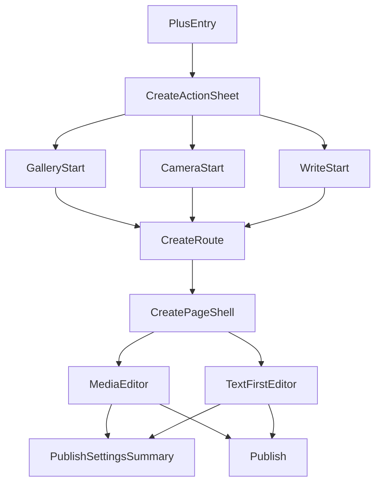

# 创作入口与双编辑器基线重定稿 — 设计方案

## 设计动因

本次设计不是在旧创作架构上继续修修补补，而是一次明确的主线切换：

- 从“先做分类判断，再开始编辑”切换为“先开始表达，再按需补包装”
- 从“四页签 + 身份切换 + 格式切换”切换为“一个入口 + 两个编辑器”
- 从“标题默认暴露”切换为“标题渐进披露”
- 从“设置区长期占据首屏”切换为“设置保留但默认轻量化”

目标是为 `/dev` 提供一条不需要二次裁决的大方向实现路径，让第一版就具备高完成度和高审美下限。

## 上游输入评审

| 输入 | 结论 |
|------|------|
| 新版 `spec.md` | 已冻结动作优先入口、双编辑器、标题渐进披露、媒体互斥规则、SLO、灰度与回滚边界 |
| 当前代码中的 `CreatePage` | 过于集中，混合了入口动作、四种编辑态、草稿、媒体选择、身份切换、发布设置和发布逻辑，不适合继续演进 |
| 当前 `GlobalQuickActionSheet` 与 `CreateEntrySheet` | 两套入口语义并存，必须统一 |
| 当前媒体选择器与图片编辑器 | 可复用，适合在本轮作为稳定子能力保留 |
| 当前发布仓储与发布设置能力 | 可复用，但展示方式必须轻量化 |

结论：

- 本轮优先做端侧 IA 和编辑体验重构，不在第一开发批次强绑定 metadata 新字段演进。
- 保留现有路由 ID、图片编辑子流程、发布设置能力与现有内容发布契约。
- 真正需要重构的是入口层、编辑器状态模型、编辑器骨架和媒体规则落点。

## 当前实现问题审计

### 1. 入口割裂

当前存在两套创作首层：

- `quwoquan_app/lib/core/widgets/global_surface_actions.dart`
- `quwoquan_app/lib/ui/content/entry/widgets/create_entry_sheet.dart`

前者是全局 `+`，后者通过 `create-entry` 路由进入。两套入口都指向同一个 `CreatePage`，但视觉和分流逻辑并不一致。

### 2. `CreatePage` 过重

当前 `quwoquan_app/lib/ui/content/entry/pages/create_page.dart` 同时承载：

- 起始动作处理
- 四个编辑态：`moment/photo/video/article`
- 两种局部编辑模式
- 草稿加载、保存、恢复
- 媒体选择与视频缩略图生成
- 发布设置
- 发布逻辑
- 图片编辑二级流转

这会直接导致：

- 改任何一个编辑器都要理解整页状态机
- 轻内容体验总被历史兼容逻辑拖慢
- 很难做出真正简洁的 iOS 风格骨架

### 3. 标题默认暴露

当前图片、视频、文章路径都把标题输入框常驻首屏，这和本次“轻内容不打扰”的目标冲突。

### 4. 媒体规则分散

当前图片上限、视频规则、文章封面规则、点滴图片规则分别散落在不同分支中，缺少统一的“媒体编辑器规则”。

## 方案对比

### 方案 A：保留现有 `CreatePage`，仅隐藏四 Tab 和身份切换

**描述**

- 不改状态模型
- 只在 UI 上隐藏旧分流入口
- 在原四态结构上拼出双编辑器效果

**优点**

- 开发改动面最小
- 可以更快出一个表面上的新 UI

**缺点**

- 结构没有真正收敛
- 旧逻辑仍会持续反噬新体验
- 双编辑器只是“画皮”，不是稳定基线

### 方案 B：保留现有入口分流，但把编辑器改成两个页面

**描述**

- `GlobalQuickActionSheet` 和 `CreateEntrySheet` 继续共存
- 新增 `MediaCreateEditorPage` 与 `TextCreateEditorPage`

**优点**

- 编辑器可获得真正拆分
- 入口改造风险略低

**缺点**

- 用户仍然会遭遇两套 `+` 心智
- 首层 IA 没有真正收口
- 仍不满足“全局入口好分辨、够清爽”的目标

### 方案 C：统一入口语义，保留路由 ID，重构为共享状态壳层 + 两个编辑器子树（选定）

**描述**

- 用一个共享的 iOS 风格动作菜单统一所有 `+` 入口
- 保留现有 `create-entry` / `create` 路由 ID，避免路由漂移
- 将 `CreatePage` 重构为轻壳层，内部只切换 `media` / `text` 两种编辑器
- 用新的 `CreateEditorStateV2` 替代旧四态 provider 结构

**优点**

- 真正收口入口心智和编辑心智
- 对外路由兼容，便于灰度和回滚
- 后续视觉、动效、标题策略都能在稳定骨架上迭代

**缺点**

- 需要一次性重构 `CreatePage` 主体结构
- 需要设计草稿兼容迁移

## 选型决策

**选定方案 C**。

原因：

1. 它是唯一能同时解决“入口不够简洁”和“编辑器结构过重”的方案。
2. 它保留现有路由和可复用子能力，避免把第一版做成大拆大建。
3. 它能在不引入新 metadata 复杂度的前提下，先把用户体验做对。

## 目标结构



## 关键设计决策

### KD1. 统一 `+` 入口，但保留现有路由入口能力

统一后的入口行为：

- 全局 `+` 与发现页 `+` 都走同一份 `CreateActionSheet`
- `create-entry` 仍可保留，作为“独立路由打开入口菜单”的兼容壳层
- 路由页和全局按钮都复用同一份菜单组件，不再维护不同首层文案和布局

代码落点：

- `quwoquan_app/lib/core/widgets/global_surface_actions.dart`
- `quwoquan_app/lib/app/navigation/app_router.dart`
- `quwoquan_app/lib/ui/content/entry/widgets/create_entry_sheet.dart`

设计决策：

- 将 `CreateEntrySheet` 降级为共享动作菜单的兼容包装层，稳定后可删除
- 将动作菜单抽成一个可复用组件，例如 `CreateActionSheet`

### KD2. 保留 `EditorStartAction`，但只用来决定初始编辑器

现有 `gallery / capture / write` 枚举足够，不需要新增复杂入口枚举体系。

第一版规则：

- `gallery` -> 进入媒体编辑器，并立即拉起媒体选择器
- `capture` -> 进入媒体编辑器，并立即拉起相机
- `write` -> 进入文字为主编辑器，并聚焦正文

不再通过起始动作决定“点滴/作品/图片/视频/文章”。

### KD3. 用 `CreateEditorStateV2` 替代旧四态状态结构

新的状态模型只表达两个编辑器和共享字段，不表达旧四页签。

建议模型：

```dart
enum CreateEditorKind { media, text }
enum CreateMediaKind { none, images, video }
enum TitlePresentation { collapsed, expanded }

class CreateEditorStateV2 {
  final CreateEditorKind editorKind;
  final CreateMediaKind mediaKind;
  final List<String> imagePaths;
  final String videoPath;
  final String videoThumbnail;
  final String title;
  final String body;
  final TitlePresentation titlePresentation;
  final bool titleHintDismissed;
  final PublishSettings settings;
  final String? draftId;
}
```

约束：

- provider 中不再保存 `moment/photo/video/article` 四份平行 map
- 不再保存 `contentIdentity`、`workFormat` 之类用户不可见的一层心智
- 图片与视频互斥由状态模型本身保证

代码落点：

- `quwoquan_app/lib/ui/content/entry/providers/create_editor_provider.dart`
- `quwoquan_app/lib/ui/content/entry/models/create_editor_models.dart`

### KD4. `CreatePage` 变成轻壳层，不再直接持有所有 UI 分支

`CreatePage` 只负责：

- 路由参数解析
- 起始动作触发
- 草稿恢复
- 发布动作分发
- 决定当前渲染 `MediaCreateEditor` 还是 `TextFirstEditor`

具体页面内容拆分为两个独立子树：

- `MediaCreateEditor`
- `TextFirstEditor`

建议落点：

- `quwoquan_app/lib/ui/content/entry/pages/create_page.dart`
- `quwoquan_app/lib/ui/content/entry/widgets/media_create_editor.dart`
- `quwoquan_app/lib/ui/content/entry/widgets/text_create_editor.dart`

如果第一批次不想新增太多文件，也至少要在 `create_page.dart` 内部按“壳层 / 媒体编辑器 / 文字编辑器 / 设置摘要 / 发布动作”分段，避免继续在一个巨型方法里演进。

### KD5. 媒体编辑器统一媒体规则

媒体编辑器只维护两种媒体状态：

1. 多图
2. 单视频

规则：

- 进入媒体编辑器时，如果当前无媒体，则根据起始动作选择相册或相机
- 若已有图片，则再次添加只允许继续选图
- 若已有视频，则添加动作默认为“替换视频”或“先删除再改图片”
- 若用户从图片切换到视频，需要显式清空图片后进入视频态
- 若用户从视频切换到图片，需要先删除视频

UI 结构：

- 顶部导航：`关闭 / 发布`
- 主预览区：单一大预览
- 横向缩略条：当前媒体列表 + 继续添加入口
- 文本区：标题入口、配文输入
- 设置入口：折叠摘要

代码落点：

- `quwoquan_app/lib/components/media/picker/create_media_picker_page.dart`
- `quwoquan_app/lib/core/models/create_media_models.dart`
- 新的媒体编辑器子组件

### KD6. 文字为主编辑器以正文为第一优先级

文字为主编辑器打开后立即进入正文，不先出现厚重标题框。

页面结构：

1. 标题轻入口
2. 正文输入区
3. 插图入口
4. 设置入口

插图规则：

- 文字编辑器允许插图
- 一旦插图，仍保持在文字编辑器，不跳到媒体编辑器
- 第一版插图只支持图片，不在文字编辑器中承载视频

原因：

- 这样可以保留“写文字后补图”的自然路径
- 同时避免两个编辑器都要支持视频导致边界再次模糊

### KD7. 标题采用“轻入口 -> 展开输入 -> 轻提醒”三段式

标题展示态只有三种：

1. `collapsed`
   - 显示为一行轻入口：`添加标题（可选）`
2. `expanded`
   - 展示真实标题输入框
3. `hinting`
   - 在正文或媒体区附近显示一条轻提醒，但不阻塞

展开条件：

- 用户点击标题入口
- 已有标题
- 草稿恢复时已存在标题

建议提示条件：

- `媒体编辑器`
  - 当前为视频
  - 图片数 `>= 4`
  - 配文 `>= 80` 字
- `文字为主编辑器`
  - 正文 `>= 140` 字
  - 段落数 `>= 2`
  - 已插入图片

提示呈现：

- 采用 inline hint 或顶部轻卡片
- 只做建议，不做阻塞
- 首次用户手动关闭后，本次会话不再重复提示

### KD8. 发布设置改为“摘要态 + 二级页”

现有设置能力继续保留，但主编辑页只展示摘要态。

摘要态建议包含：

- 位置：未设置 / 已选地点名称
- 圈子：未设置 / 已选圈子数
- 可见性：公开 / 私密
- 小趣使用：允许 / 排除

交互方式：

- 点击摘要区进入 `CreatePublishSettingsPage` 或展开式二级面板
- 第一版优先选“独立设置页”，比在编辑页内长期展开更清爽

原因：

- 保留复用现有设置能力
- 不把创作首页做成设置表单

代码落点：

- 复用 `publish_settings_models.dart`
- 复用 `publish_settings_services.dart`
- 复用 `publish_location_selector_page.dart`
- 复用 `publish_circle_select_page.dart`

### KD9. 第一版不新增 metadata 字段，发布结果采用兼容映射

本轮先做体验重构，不把 metadata 变更作为进入开发的前置 blocker。

兼容映射规则：

- `媒体编辑器`
  - `videoPath` 非空 -> `contentType=video`
  - `imagePaths` 非空 -> `contentType=image`
- `文字为主编辑器`
  - 无标题、无图片、正文短 -> `contentType=micro`
  - 其他情况 -> `contentType=article`

建议阈值：

- `正文短` = 字数 `< 140` 且单段

这样可以：

- 不阻塞第一版开发
- 避免再次把“点滴/作品”塞回用户首层体验
- 保持现有后端契约可继续使用

### KD10. 草稿采用 `v2` 结构并做本地兼容迁移

历史曾按 `moment/photo/video/article` 嵌套 `data` 存储；**当前实现**仅识别扁平字段集，不再做上述映射。
- 写入与读取仅支持**当前唯一扁平草稿结构**（`editorKind` / `articleDocument` / `settings` 等），**不**再写入 `draftVersion`，**不**再解析嵌套 `data` + 旧 `type` tab 形状。

要求：

- 新草稿只写当前结构；本地仅存旧形状时视为不可恢复（需用户重建草稿）。

### KD11. 现有图片编辑流程继续复用

本轮不重写图片编辑器本体。

规则：

- 多图场景继续沿用现有图片编辑器入口
- 图片编辑完成后回写到媒体编辑器状态
- 视频编辑能力本轮仅保留封面/替换，不进入复杂视频剪辑

这样可以把注意力集中在创作主流程，而不是子工具能力堆叠。

### KD12. 文件级实施落点

主改动文件：

- `quwoquan_app/lib/core/widgets/global_surface_actions.dart`
- `quwoquan_app/lib/ui/content/entry/widgets/create_entry_sheet.dart`
- `quwoquan_app/lib/app/navigation/app_router.dart`
- `quwoquan_app/lib/ui/content/entry/pages/create_page.dart`
- `quwoquan_app/lib/ui/content/entry/providers/create_editor_provider.dart`
- `quwoquan_app/lib/ui/content/entry/models/create_editor_models.dart`
- `quwoquan_app/lib/components/media/picker/create_media_picker_page.dart`
- `quwoquan_app/lib/core/models/create_media_models.dart`

复用文件：

- `quwoquan_app/lib/ui/content/entry/models/publish_settings_models.dart`
- `quwoquan_app/lib/ui/content/entry/services/publish_settings_services.dart`
- `quwoquan_app/lib/ui/content/entry/pages/publish_circle_select_page.dart`
- `quwoquan_app/lib/ui/content/entry/pages/publish_location_selector_page.dart`
- `quwoquan_app/lib/components/media/image/editor/image_editor_page.dart`

## 测试与证据矩阵

| 验收项 | 设计证据 |
|--------|----------|
| A1 入口统一 | `T2` 动作菜单 widget test，`T4` 全局 `+` 与发现页 `+` 一致性巡检 |
| A2 双编辑器收敛 | `T2` 路由与起始动作 widget test |
| A3 媒体规则 | `T2` 媒体互斥、追加、删除切换 test；`T4` 真实多图/单视频路径巡检 |
| A4 标题渐进披露 | `T2` 标题展开/收起/hint 规则 test |
| A5 设置轻量化 | `T2` 设置摘要与设置页往返 test |
| A6 草稿兼容 | `T2` 旧草稿迁移 test；`T4` 杀进程恢复巡检 |
| A7 发布映射兼容 | `T2` publish payload mapping test，`T3` repository contract regression |
| A8 灰度与回滚 | `T1` flag contract，`T3` metrics wiring，`T4` rollout/rollback rehearsal |

建议新增测试文件：

- `quwoquan_app/test/ui/content/entry/create_action_sheet_widget_test.dart`
- `quwoquan_app/test/ui/content/entry/create_editor_v2_route_test.dart`
- `quwoquan_app/test/ui/content/entry/media_editor_rules_widget_test.dart`
- `quwoquan_app/test/ui/content/entry/text_editor_title_progressive_disclosure_test.dart`
- `quwoquan_app/test/ui/content/entry/create_draft_v2_compat_test.dart`
- `quwoquan_app/test/ui/content/entry/publish_settings_summary_widget_test.dart`
- `quwoquan_app/test/ui/content/entry/create_publish_payload_mapping_test.dart`
- `quwoquan_app/test/ui/content/entry/create_rollout_rehearsal_test.dart`

## 灰度与回滚

### 运行时开关

- `simple_create_action_sheet`
- `create_editor_v2`
- `progressive_title_prompt`

### 推荐放量顺序

1. 内部体验 `5%`
2. 白名单 `20%`
3. 公测 `50%`
4. 全量 `100%`

每一阶段至少观察：

- 入口打开成功率
- 草稿保存/恢复成功率
- 发布成功率
- 关键路径 crash-free

### 回滚边界

| 问题 | 动作 |
|------|------|
| 入口语义或视觉有严重问题 | 关闭 `simple_create_action_sheet` |
| 双编辑器主流程异常 | 关闭 `create_editor_v2` |
| 标题提示过度打扰 | 关闭 `progressive_title_prompt` |

要求：

- 任一开关回退后，草稿仍然可读
- 回退不要求整包回滚

## 开发切片

### D0. 统一执行口径

- 正式真相源固定为 `spec.md / design.md / acceptance.yaml / plan.yaml / CR`
- 旧 `tasks.md` 只保留历史参考，不再作为 `/dev`、验收或发布检查清单
- 后续实施统一使用 `D0-D12` 语言，避免高层 `P1-P7` 与执行分解并存

### D1. 入口盘点与一致性基线

- 盘点全局 `+`、发现页 `+` 与 `create-entry` 路由入口
- 冻结哪些入口必须同构、哪些仅复用行为
- 确认 `CreateActionSheet` 是唯一首层创作动作组件

### D2. 共享动作菜单实现

- 抽出共享 `CreateActionSheet`
- 统一全局 `+` 与发现页 `+`
- 固定三段式结构：创作动作 / 社交动作 / 取消

### D3. 路由兼容与壳层收敛

- 保留 `create-entry`、`create` 与 `gallery/capture/write` 协议
- `CreatePage` 只承担壳层、起始动作分发与编辑器决策职责
- 旧四页签与身份/格式切换不再是主路径 UI

### D4. 状态模型 V2

- 引入 `CreateEditorStateV2`
- provider 改为双编辑器共享状态，不再持有四份平行 map
- 把媒体互斥、标题展示态、发布设置与草稿 ID 收敛进统一模型

### D5. 草稿持久化韧性

- 仅支持当前扁平草稿结构的读写（无 `draftVersion`、无旧 tab 嵌套 `data` 迁移路径）。
- 自动保存、冷启动恢复、类型切换与发布后清理语义全部单独验证

### D6. 媒体编辑器

- 落大预览 + 横向缩略条
- 落图片/视频互斥、继续追加、替换与删除后切换类型
- 接通图片编辑器回写与相册/相机初始进入路径

### D7. 文字为主编辑器

- 落正文优先骨架
- 落 `添加标题（可选）` 渐进披露
- 落写后补图且仍停留在文字编辑器语境中的路径

### D8. 设置轻量化

- 把设置改为摘要态或二级入口
- 保留位置、圈子、可见性、小趣使用开关完整配置能力
- 与现有选择器 roundtrip 稳定兼容

### D9. 发布映射兼容

- `media -> image/video`
- `text -> micro/article`
- 长短内容阈值与 payload 映射单独回归，避免和设置轻量化绑成一个切片

### D10. 开关与观测

- 接入 `simple_create_action_sheet`
- 接入 `create_editor_v2`
- 接入 `progressive_title_prompt`
- 补齐入口耗时、编辑器 ready、草稿恢复、发布成功率与 crash-free 指标

### D11. 测试矩阵闭环

- 为 `A1-A8` 建立 `T1-T4` 证据归属
- 新增动作菜单、编辑器 V2、媒体规则、标题渐进披露、草稿兼容测试
- 将入口启动和草稿恢复巡检纳入回归矩阵

### D12. 回滚演练与放量前检查

- 验证三个关键开关的独立关闭路径
- 验证回退后草稿仍可读、发布仍可用
- 形成 canary 到全量的实际操作手册与放量前检查项

## 非目标

- 本轮不做新的后端身份字段设计落地。
- 本轮不在创作阶段重新引入 `点滴/作品` 一级切换。
- 本轮不重做视频剪辑工具链。
- 本轮不在第一批次里做富文本块或 AI 包装能力。

## 进入 `/dev` 的判断

满足以下条件后即可进入开发：

1. `spec.md` 已冻结入口、双编辑器、标题、媒体规则和回滚边界。
2. `design.md` 已明确主改动文件、状态模型、兼容策略和实施切片。
3. `acceptance.yaml` 已改为面向本轮目标的待实施验收项。
4. `plan.yaml` 已成为正式实施计划。
5. CR 已记录此次重定稿的原因、受影响节点与重测范围。
