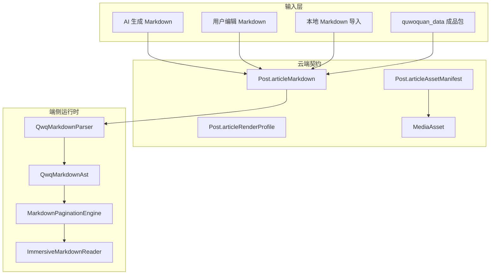

# Markdown 长文内核设计方案

## 设计决策

本场景选定方案为：**Markdown 作为唯一持久化真相源，端侧运行时使用 Markdown AST / page model，不再把 `ArticleDocumentData` 作为长文内核主模型**。

原因：

1. Markdown 能同时服务 AI 生成、用户编辑、冷启动生产和云端审校。
2. AST 与分页属于运行时结果，适合随屏幕、字体、模板动态变化。
3. 应用尚未正式上线，旧预制数据可重生成，不需要维护双真相源。
4. 标准 Markdown 生态成熟，富布局可通过受控指令扩展，而不是引入任意 HTML。

## 上游输入

| 输入 | 结论 |
|------|------|
| 当前 `ArticleDocumentData` | 保留为迁移参考和局部渲染经验，不作为新持久化主链 |
| 当前 pageflip 物理层 | 可继续复用，输入从 `ArticlePageData` 逐步切到 Markdown page model |
| 当前 `CreatePage` 发布出口 | `buildCreatePostPayloadMap` 是端侧 wire 出口，必须改为写 `articleMarkdown` |
| 当前 content/post metadata | 需要新增 Markdown 字段并把 `articleDocument` 从新写入字段移除 |
| 当前 `quwoquan_data` | 需要从 `posts.ndjson` 元数据输出升级为 Markdown 成品包 |

## 架构分层



## Markdown 规范设计

### 解析边界

- 标准 Markdown 由 `markdown` package 解析为基础 AST。
- Front matter 使用 `yaml` package 解析。
- QWQ 富布局指令由本地 wrapper 预处理和校验。
- 任意 HTML 默认拒绝；后续如需开放，必须通过 allowlist 元数据声明。

### 指令模型

每个富布局指令转换为 `QwqMarkdownBlock`：

| 指令 | block kind | 关键属性 |
|------|------------|----------|
| `figure` | `figure` | `assetId`、`layout`、`caption` |
| `gallery` | `gallery` | `assetIds`、`layout`、`caption` |
| `callout` | `callout` | `type`、`title`、`children` |
| `card` | `card` | `cardType`、`entityRef`、`title`、`body` |
| `section` | `section` | `title`、`style` |
| `spacer` | `spacer` | `size` |

### 资源引用

Markdown 中只允许以下资源引用：

- `asset://{asset_id}`
- 标准图片语法中的 `asset://{asset_id}`

发布前必须校验 asset id 存在于 `articleAssetManifest.assets[]`。

## AST 模型设计

端侧新增模型建议放在：

`quwoquan_app/lib/ui/content/markdown/`

核心类型：

- `QwqMarkdownDocument`
- `QwqMarkdownFrontMatter`
- `QwqMarkdownBlock`
- `QwqMarkdownInline`
- `QwqMarkdownAssetRef`
- `QwqMarkdownLayoutIntent`
- `QwqMarkdownPageData`

不变量：

- AST 保留源码顺序。
- AST 不保存具体页码。
- AST 中的 asset ref 必须能回查 manifest。
- parser 输出应可 snapshot 测试。

## 分页设计

`MarkdownPaginationEngine` 输入：

- `QwqMarkdownDocument`
- viewport width / height
- template
- font preset
- text scale
- layout policy

输出：

- `List<QwqMarkdownPageData>`

分页原则：

- 文本按段落、列表项、callout/card 边界切分。
- figure/gallery 尽量保持原子性，必要时整块移到下一页。
- wrap 布局在大屏生成环绕 slice，小屏降级为通栏 slice。
- page model 不写回云端。

## 云端契约设计

### Post 新字段

- `articleMarkdown`: Markdown 原文。
- `articleMarkdownVersion`: 当前为 `qwq-rich-md/1`。
- `articleMarkdownDigest`: 云侧根据规范化 Markdown 计算。
- `articleAssetManifest`: 长文素材清单。
- `articleRenderProfile`: 模板、字体、布局能力与降级策略。

### MediaAsset 扩展

现有 `MediaAsset.postId` 为 `NOT_NULL`，长文导入和草稿素材需要允许素材先于帖子存在。M2 metadata 需扩展：

- `postId` 从强绑定改为可选绑定，或新增 `ownerId/scope/bindings`。
- 增加 `assetScope`: `draft | published | cold_start`。
- 增加 `sourceKind/sourceUrl/license/hash/objectKey` 等素材治理字段。

### API

新写入路径：

- `CreatePost` writable fields 添加 Markdown 字段，移除 `articleDocument`。
- `UpdatePost` 仅 draft 可修改 Markdown 字段。
- `GetPost` detail projection 返回 Markdown 字段和 manifest。
- 素材上传 API 复用现有 `InitMediaUpload/CompleteMediaUpload`，补充草稿素材和 bind 语义。

## 全局创作入口设计

短期策略：

- `CreateEditorState` 增加 Markdown session 字段。
- 文章发布时由 Markdown session 生成 `articleMarkdown`。
- 现有可视化 block 只作为编辑视图，不再直接输出 `articleDocument`。

长期策略：

- 编辑器内部状态转为 AST editing session。
- 保存草稿保存 Markdown + manifest。
- 预览读取 AST/page model。

## quwoquan_data 设计

新增 Markdown 成品包：

```text
publish/{batch_id}/posts/{post_id}/
├── article.md
├── gallery.md
├── manifest.json
└── images/
```

`manifest.json` 结构：

```json
{
  "schemaVersion": 1,
  "postId": "west_lake_article_001_article_001",
  "articleMarkdown": "article.md",
  "galleryMarkdown": "gallery.md",
  "articleMarkdownVersion": "qwq-rich-md/1",
  "assets": [
    {
      "assetId": "asset_cover",
      "kind": "image",
      "relativePath": "images/asset_cover.png",
      "sourceUrl": "https://example.com/image.png",
      "objectKey": "media/image/post/west_lake/v1/cover.png",
      "hash": "sha256:...",
      "mimeType": "image/png",
      "scope": "cold_start"
    }
  ]
}
```

## 开发切片

- D0：冻结规格与 metadata 草案。
- D1：端侧 parser wrapper 与 AST 模型。
- D2：端侧 Markdown 分页与只读 reader。
- D3：content/post metadata 新字段与 codegen。
- D4：content-service 写入、读取、投影和素材 bind。
- D5：全局创作入口 Markdown session 与发布 payload。
- D6：`quwoquan_data` Markdown 成品包。
- D7：旧 `articleDocument` seed/fixture 清理与重生成。
- D8：T1-T4、视觉、契约、seed gate 收口。

## 风险与控制

- 双真相风险：禁止新写入路径持久化 `articleDocument`。
- Parser 失控风险：富布局指令 allowlist，任意 HTML 默认拒绝。
- 分页漂移风险：AST snapshot、分页 snapshot、关键视觉断言共同覆盖。
- 素材缺失风险：发布前校验 manifest 与正文引用。
- 范围过大风险：M1/M2 可并行，但每个切片都必须保持可验证边界。
