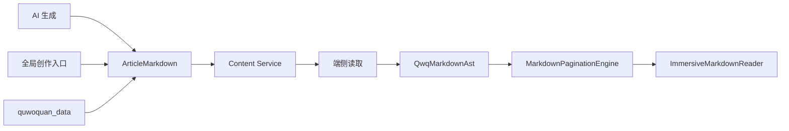

# L3 Scenario: markdown-article-kernel

## 节点定位

- `L1_capability`: `discovery-content`
- `L2_journey`: `content-type-framework`
- `L3_scenario`: `markdown-article-kernel`

本场景冻结趣我圈长文系统的 Markdown 内核升级基线：长文内容以 Markdown 作为唯一持久化真相源，端侧运行时解析为 `QwqMarkdownAst`，再由 `MarkdownPaginationEngine` 动态分页并交给侵入式媒体浏览器渲染。当前应用尚未正式上线，存量 `articleDocument` 预制数据不做兼容保留，全部按 Markdown 重新生成。

## 背景与动机

当前长文链路以 `ArticleDocumentData` / `articleDocument` 为编辑、发布、存储与阅读的中心对象。这能支撑图文环绕和动态分页，但也带来三类结构问题：

1. **创作来源分裂**：AI 生成、用户编辑、冷启动数据和云端存储容易形成不同结构。
2. **持久化过早结构化**：把端侧渲染结构直接作为云端真相源，会让模板、字体、屏幕尺寸和分页策略难以演进。
3. **冷启动产物不可直接发表**：`quwoquan_data` 当前更偏元数据收口，缺少可替代创作者发布的 Markdown 长文与图片素材包。

本次升级把“内容真相”和“运行时排版结果”拆开：Markdown 负责可编辑、可审校、可再生成；AST 与分页只负责当前设备上的阅读表现。

## 目标

- 冻结 `QWQ Rich Markdown v1`，同时兼容标准 Markdown 输入。
- 新增端侧 `QwqMarkdownAst`、资源引用模型和分页 page model。
- 新增云侧 `articleMarkdown`、`articleAssetManifest`、`articleRenderProfile` 等 metadata-first 契约。
- 改造全局创作入口，使长文编辑、导入和发布都回写 Markdown。
- 改造 `quwoquan_data`，让 `raw/` 保存原始正文与素材证据，`publish/` 产出可发布的 `article.md`、`gallery.md`、`manifest.json` 和图片包。
- 下线新写入路径中的 `articleDocument`，旧预制数据重生成。

## 非目标

- 不维护 Markdown 与 `articleDocument` 两套持久化真相源。
- 不为了旧 seed 或样例长期保留 `articleDocument` 写入兼容。
- 不允许任意 HTML 成为富布局扩展入口。
- 不在 Markdown 中固化分页边界、具体设备尺寸或 pageflip 几何。
- 不由 `quwoquan_data` 直接写生产库；仍只生成 dry-run payload 和环境投影。

## 核心业务对象

### ArticleMarkdown

长文正文的唯一持久化文本，内容为 `QWQ Rich Markdown v1`。云侧保存原文、版本和 digest；端侧读取后解析为 AST。

### ArticleAssetManifest

长文资源清单。所有图片、视频、附件必须有稳定 asset id、scope、object key、mime、hash、尺寸、来源和授权信息。Markdown 正文只能引用 manifest 中存在的 asset id。

### ArticleRenderProfile

渲染意图配置，包含模板、字体、版心策略、布局能力和降级策略。它表达“如何读”，不表达“内容是什么”。

### QwqMarkdownAst

端侧运行时结构模型，包含 front matter、block、inline、asset ref、layout intent 和 source span。它不是云端持久化真相源。

### QwqMarkdownPageData

分页结果，供详情页、发现沉浸式和侵入式媒体浏览器消费。页数可随设备变化，但内容顺序、资源引用和布局意图必须保持一致。

## QWQ Rich Markdown v1

### 标准 Markdown 子集

必须支持：

- 标题：`#` 到 `###`
- 段落
- 有序列表和无序列表
- 引用
- 链接
- 图片
- 代码块和行内 code
- 分割线

### Front Matter

支持 YAML front matter：

```yaml
---
title: 西湖半日城市漫游
summary: 从湖滨、断桥到龙井路的一条轻量路线。
template: journal
fontPreset: clean
titleStyle: major
coverImage: asset://cover
locationName: 杭州西湖
entity_refs:
  - trees/entities/地点/西湖.yaml
tag_refs:
  - trees/tags/主题/城市漫游.yaml
source_urls:
  - https://example.com/source
visibility: public
assistantUsePolicy: allow
---
```

### 富布局指令

富布局只允许受控指令：

- `figure`：单图、caption、布局方式。
- `gallery`：多图图组。
- `callout`：提示、风险、路线建议。
- `card`：实体、路线、酒店、本地生活卡片。
- `section`：视觉章节。
- `spacer`：轻量留白。

示例：

```md
:::figure id="cover" layout="wrapRight" caption="清晨的湖滨步道"
asset://cover
:::

:::callout type="tip" title="拍摄建议"
上午九点前湖面反光更柔和，适合拍人物剪影。
:::

:::gallery ids="bridge,street,tea" layout="masonry" caption="三个停留点"
:::
```

### 布局降级

- `wrapLeft` / `wrapRight` 在大屏执行图文环绕。
- 小屏或可访问性大字号下统一降级为 `fullWidth`。
- 降级不能丢失图片、caption、阅读顺序和语义标签。
- `gallery` 可从多列降级为单列。

## 主流程



## 端云一致性

- `CreatePost` / `UpdatePost` 新写入长文时使用 `articleMarkdown` 和 `articleAssetManifest`。
- `GetPost` / 详情投影返回 Markdown、manifest 和 render profile。
- `articleDocument` 不再作为新写入字段，不作为测试主断言。
- 全局创作入口和 `quwoquan_data` dry-run payload 使用同一字段。
- 所有新字段先改 metadata，再 codegen，再改 Go/Dart 业务逻辑。

## 冷启动数据要求

`quwoquan_data` 的收口目标从“元数据记录”升级为“可发布内容包”：

```text
raw/{batch_id}/pages/{source_id}/source.md
raw/{batch_id}/assets/{asset_id}.*
publish/{batch_id}/posts/{post_id}/article.md
publish/{batch_id}/posts/{post_id}/gallery.md
publish/{batch_id}/posts/{post_id}/manifest.json
publish/{batch_id}/posts/{post_id}/images/*
```

## 商用品质约束

- Markdown 解析失败时必须返回结构化 runtime failure，不向用户暴露原始异常字符串。
- 素材缺失、hash 不匹配、scope 不合法时不可发布。
- 详情页、发现沉浸式和侵入式媒体浏览器必须消费同一 AST/page model。
- seed、fixture、冷启动 batch 中不得再新增 `articleDocument` 长文真相源。

## 验收概要

- A1：标准 Markdown 可导入、发布、读取和分页渲染。
- A2：富布局 Markdown 可表达 figure、gallery、callout、card 和 wrap 布局。
- A3：全局创作入口发布 Markdown，云端只保存 Markdown 与 manifest。
- A4：本地 Markdown 导入可归一化 asset 引用并发布。
- A5：`quwoquan_data` 产出可发布 Markdown 成品包。
- A6：素材库与 manifest 一致，缺失则拒绝发布。
- A7：同一 Markdown 在多端动态分页，内容语义不漂移。
- A8：旧 `articleDocument` 预制数据全部重生成，无兼容债。
