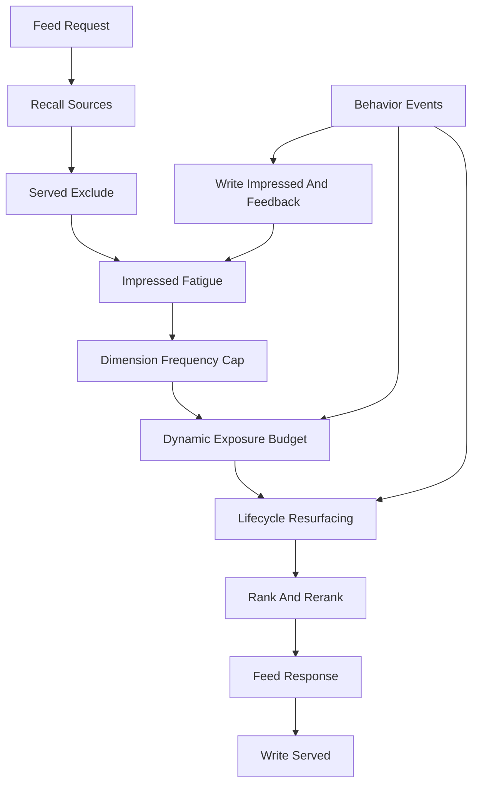
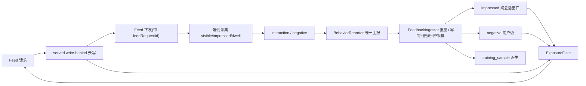

# Design: exposure-governance

## 定位

`exposure-governance` 不是第二套推荐引擎，也不是 UI 侧本地去重。它是推荐编排上方的曝光治理策略层，消费 `runtime-recommendation` 的 HotPath、缓存、打分和重排原语，向 `feed-orchestration-recommendation` 提供一致的曝光窗口、预算和复活语义。

## 架构

## 七层职责

1. served 去重：feed 返回时异步写 served，解决翻页和短窗口重复。
2. impressed 疲劳：端侧真实曝光进入 per-user 跨会话窗口，带时间衰减。
3. 维度频控：作者、标签、话题、内容类型和 near-dup 软降权或过滤。
4. 动态预算：内容级分级流量池和 bandit 预算控制试投、晋级、淘汰。
5. 生命周期：New、Rising、Mature、Evergreen、Dormant、Revived、Retired。
6. 活跃度自适应：按 user_segment 调整窗口、探索比、复活比和保底。
7. 可观测容量：重复曝光率、覆盖率、曝光基尼、复活率、各池 CTR、内存和写放大。

## 状态闭集（七态，只能派生不能互替）

推荐反馈状态必须分离：「已下发」不等于「已看见」，「看见」不等于「停留 / 互动」。七态闭集如下：

| 状态 | 产生方 | 权威性 | 主要用途 | 训练样本 |
| --- | --- | --- | --- | --- |
| `served` | 云侧 feed 下发即写 | 服务端权威 | 短窗口翻页 / 刷新去重、重复曝光率 | 否 |
| `visible` | 端侧进入视窗 | 端侧弱信号 | 可见性漏斗、低价值采样 | 否 |
| `impressed` | 端侧达「可见面积 + 停留」阈值 | 端侧权威曝光 | 跨会话疲劳、训练、曝光健康 | 是（正样本候选） |
| `dwell` | 端侧离开 / 切走 / 翻页时聚合 | 端侧 | 停留时长、完成度、质量信号 | 是（强度） |
| `interaction` | 端侧点击 / 赞 / 评 / 藏 / 分享 / 关注 / 进圈 | 端侧强信号 | 正反馈、排序、飞轮 | 是（正样本） |
| `negative` | 端侧 dislike / report / hide_author / hide_content_type | 端侧最高优先级 | 即时抑制、负样本 | 是（负样本） |
| `training_sample` | 云侧由以上派生 | 云侧派生 | 离线训练样本 | 是 |

派生与优先级：

- `served → visible → impressed → dwell` 是同一条内容在端的递进可见链，后一态成立隐含前一态成立。
- `interaction` / `negative` 以 `impressed` 为前置；`negative` 优先级高于 `served` / `impressed` / `dwell` / 动态预算。
- `training_sample` 只能由云侧从 served / impressed / dwell / interaction / negative 组合派生，端侧禁止直接声明正负样本（single-source）。
- `resurfaced`（生命周期复活）是召回侧来源标记，不是反馈状态；复活内容仍按 served / impressed / negative 全流程治理。

## 端云数据流与归因闭环

- 归因闭环：feed 下发携带 `feedRequestId`，端侧 `served` / `impressed` / `interaction` 必须回传同一 `feedRequestId`，禁止点击时重生，保证召回↔曝光↔互动漏斗可对齐。

## 端侧抗冲击与采样（概览，细则见 `feed-orchestration-recommendation/feedback-ingestion-sampling`）

- 统一通道：端侧合并为单一 `BehaviorReporter`，消除 impression / dwell 双通道重复上报与 behaviors / ops 双写。
- 分级上报：`negative` / `interaction` 即时（带客户端限流 + 幂等），`impression` / `dwell` / `visible` 批量合并。
- 采样降流：`visible` 高采样或仅本地，弱 `dwell` 丢弃；同一 `feedRequestId` 内按 (contentId, action) 合并，降低云侧上行 QPS。
- 幂等：每事件带 `clientEventId`，云侧据此去重，避免重试 / 双发重复计数。

## 容量与去全量化

- `served` / `impressed` 按 `user+day` 分桶（跨会话），`negative` 用户级；过滤路径用候选集 membership 点查（`SISMEMBER` 批量）或短 Bloom，禁止长窗口全量 `SMembers` 回读。
- 容量分层：alpha 精确 Set；gamma/prod 必须 day bucket + cardinality budget；海量阶段切 rolling bloom / CMS 或分桶 ZSET。
- 运行时边界 `ExposureMemory` / `ExposureFilter` / `FeedbackIngestor` 由 `runtime-recommendation` 提供（见其 `design.md`）。

## 数据语义补充

- `served`：服务端已经下发给端侧的候选。用于短窗口翻页去重，不等同真实看见，不直接作为训练正样本。
- `impressed`：端侧曝光 tracker 证明用户真实看见。用于疲劳、训练、曝光健康与反馈飞轮。
- `negative`：强负反馈，包括 dislike/report/hide_author/hide_content_type，优先级高于 served/impressed。
- `resurfaced`：由生命周期触发器重新进入召回池的内容，仍必须通过合规、去重、疲劳和预算策略。

## 降级策略

- served 写失败：不阻断 feed，记录 `recommendation_feed_duplicate_exposure_total` 风险，短窗口依赖端侧已看窗口兜底。
- impressed 迟到：只影响后续窗口，不回写已经返回的 feed。
- 动态预算不可用：回退到规则排序 + UCB/MMR 探索，`disable_exposure_dynamic_budget` 回滚层生效。
- 复活源不可用：关闭 `ResurfaceSource`，保留常规召回。
- 频控过强导致候选不足：从硬过滤降级为软降权，并启用 hot/new 保底。

## 策略真相源

- 指标与目标：`quwoquan_service/services/content-service/configs/observability/recommendation_slo.yaml`。
- 告警：`deploy/monitoring/alerts/quwoquan_alerts.yaml#quwoquan_rec_model`。
- Redis key：`quwoquan_service/contracts/metadata/_shared/redis_keyspace.yaml`。
- policy：`quwoquan_service/contracts/metadata/recommendation/rec_model/policy.yaml` 或其 codegen 产物。
- 读模型：`rm_exposure_state` 进入 metadata/projection 后再实现。

## 与交集的关系

交集仍是推荐理由与差异化信号，不拥有曝光治理真相源。交集 spotlight、对象主页和 feed 卡片都必须消费同一套 exposure-governance 结果，不能在交集组件中自建冷却、复活或曝光预算规则。
