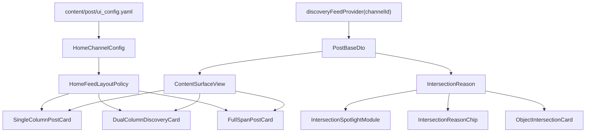
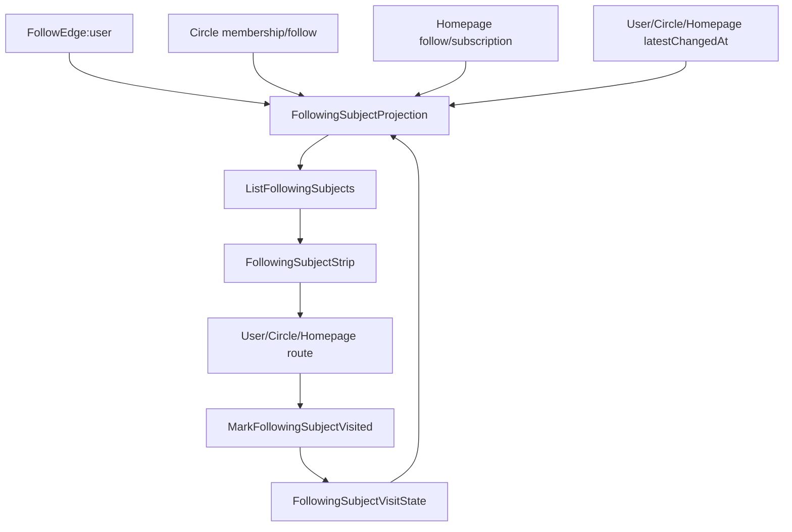

# feed-orchestration-recommendation 设计：四类内容与全量用户反馈

## 0. 需求规格摘要（供 /qwq-extend 与特性树对齐）

- **业务对象**：Post 域 ReportBehaviors API（`POST /content/behaviors`），无独立 behavior 实体；runtime 推荐热路径（HotPath、Engine）。
- **扩展类型**：契约扩展（OpenAPI BehaviorEvent schema、_shared/types.yaml、redis_keyspace.yaml）+ 云侧手写（BehaviorService、HotPath、Engine）+ 端侧手写（BehaviorRepository、UI 回调）。
- **涉及扩展场景**：S20（add-test，可选）；其余为 metadata/contracts 手动更新，无对应 S01–S19。
- **验收**：四类内容（article/moment/photo/video）均可上报全量反馈；hide_author/hide_content_type 生效于 GetFeed 过滤。

## 1. 范围与目标

- **四类内容**：文章(article)、微趣(moment)、美图(photo)、视频(video)。四类在发现流与详情中**统一**使用同一套反馈能力与端云契约。
- **全量反馈**：包括正向（关注作者、赞、收藏、转发、评论）与负向（不感兴趣、不想看此作者、不想看此类内容、举报）。所有反馈需进入推荐热路径或持久化，用于实时/离线排序与过滤。

## 2. 反馈分类与端云映射

### 2.1 正向反馈（参与度信号）

| 反馈类型     | 端侧入口                     | action  | 云侧处理 | 说明 |
|--------------|------------------------------|---------|----------|------|
| 关注作者     | 卡片/详情「关注」按钮        | follow  | HotPath 更新作者亲和；可选调 user-service 关注 API | 需扩展：BehaviorEvent 带 authorId |
| 赞           | 赞按钮                       | like    | 已有：exposed + tag 权重 + 负向过滤仅 contentId | — |
| 收藏         | 收藏按钮                     | favorite| 已有                                     | — |
| 转发         | 分享按钮                     | share   | 已有                                     | — |
| 评论         | 发送评论成功                | comment | 需扩展：supportedBehaviorActions + SignalWeights | 评论数可由 reaction 聚合，此处为「用户主动评论」信号 |

### 2.2 负向反馈（过滤与降权）

| 反馈类型           | 端侧入口               | action           | 云侧处理 | 说明 |
|--------------------|------------------------|------------------|----------|------|
| 不感兴趣           | 更多 → 不感兴趣        | dislike          | 已有：contentId 入 negative_set，tags 降权 | 端侧需接好：上报 contentId + tags/contentType |
| 不想看此作者       | 更多 → 不喜欢该作者    | hide_author      | **新增**：authorId 入 rec:hidden_authors:{userId}，引擎过滤该作者 | 需扩展契约与 HotPath |
| 不想看此类内容     | 更多 → 屏蔽词 / 此类   | hide_content_type| **新增**：contentType 入 rec:hidden_types:{userId}，引擎过滤该类型 | 需扩展契约与 HotPath |
| 举报               | 更多 → 举报            | report           | 已有：contentId 入 negative_set；另可调 POST /content/reports 做工单 | 端侧可先行为上报，再接举报 API |

### 2.3 行为与内容类型

- 四类内容在**同一** POST /content/behaviors 中上报，通过 `contentId` + 可选 `tags`/`contentType` 区分。
- 发现流/详情在任意类型（文章/微趣/美图/视频）下均使用相同 `BehaviorRepository.reportEvents` / `reportSingle`，无需按类型分接口。

## 3. 契约扩展（metadata / API）

### 3.1 行为事件请求体扩展

当前：`events[].contentId, action, tags?, duration?`。

扩展为（保持向后兼容）：

- `events[].authorId`（可选）：用于 follow、hide_author。
- `events[].contentType`（可选）：用于 hide_content_type，取值与 feed 一致：article | moment | photo | video。

### 3.2 新增 action 枚举

在现有 impression/click/dwell/like/favorite/share/dislike/report 基础上增加：

- **comment**：用户对该条内容发起评论。
- **follow**：用户在该内容场景下关注作者（可带 authorId）。
- **hide_author**：不想看此作者（**必带 authorId**；contentId 可选，用于同条内容入 negative）。
- **hide_content_type**：不想看此类内容（**必带 contentType**；contentId 可选）。

### 3.3 Redis 键与 SessionState 扩展

- **rec:hidden_authors:{userId}**：SET，成员为 authorId。TTL 建议 7 天。HotPath 在 ProcessSignal(action=hide_author) 时 SAdd；GetSessionState 时 SMembers 读出，注入 SessionState.HiddenAuthorIDs。
- **rec:hidden_types:{userId}**：SET，成员为 contentType（article/moment/photo/video）。TTL 建议 7 天。HotPath 在 ProcessSignal(action=hide_content_type) 时 SAdd；GetSessionState 时 SMembers 读出，注入 SessionState.HiddenContentTypes。

需在 `contracts/metadata/_shared/redis_keyspace.yaml` 中登记上述两个 pattern。

## 4. 云侧实现要点

### 4.1 BehaviorService

- 请求体解析：支持 `authorId`、`contentType` 写入 `BehaviorSignal`（或等价结构）。
- supportedBehaviorActions 增加：comment, follow, hide_author, hide_content_type。
- 校验：hide_author 时 authorId 必填；hide_content_type 时 contentType 必填且为允许枚举。

### 4.2 HotPath（runtime/recommendation）

- **BehaviorSignal** 增加可选字段：AuthorID string, ContentType string。
- **ProcessSignal**：
  - action == hide_author：addHiddenAuthor(ctx, userId, authorId)；并将当前 contentId 入 negative（同现有 dislike 逻辑）。
  - action == hide_content_type：addHiddenType(ctx, userId, contentType)；并将当前 contentId 入 negative。
- **GetSessionState**：除现有 exposed/negative/tagWeights 外，读取 rec:hidden_authors:{userId}、rec:hidden_types:{userId}，写入 SessionState.HiddenAuthorIDs、HiddenContentTypes。
- **SignalWeights**：comment 2.0，follow 1.5；hide_author / hide_content_type 可不参与 tag 权重，仅做过滤。

### 4.3 Engine（Stage 4 过滤）

- 在现有「exposed + negative + dedup」基础上增加：
  - 若 candidate.AuthorID 在 session.HiddenAuthorIDs 中，则过滤；
  - 若 candidate.ContentType 在 session.HiddenContentTypes 中，则过滤。

### 4.4 与 block/report 的关系

- **用户关系**：「不喜欢该作者」可同时调 user-service 的 block（POST /user/block/{targetUserId}），实现全站不看到该作者；推荐侧 hide_author 负责发现流/推荐结果过滤。两者可并存。
- **举报**：action=report 已入 negative_set；若存在 POST /content/reports，端侧可在同一操作中先上报 report 行为，再调举报接口提交工单。

## 5. 端侧实现要点

### 5.1 BehaviorEvent / BehaviorRepository

- **BehaviorEvent** 增加可选字段：authorId, contentType。toJson() 中按需序列化。
- **reportSingle** 增加可选参数：authorId, contentType。
- 文档注释中 action 枚举补充：comment, follow, hide_author, hide_content_type。

### 5.2 四类内容统一入口

- 发现流：微趣/美图/视频/文章卡片共用同一套「更多」菜单与回调；回调内根据当前 post 的 type/authorId 调用 reportSingle 或 reportEvents。
- 详情页：文章详情、视频/图片详情同样使用 BehaviorRepository，传 contentId、可选 authorId/contentType。

### 5.3 具体回调对接（当前缺口）

| 入口           | 当前实现           | 目标实现 |
|----------------|--------------------|----------|
| 不感兴趣       | 仅 Toast           | reportSingle(contentId, 'dislike', tags: [contentType 或 post.tags]) |
| 不喜欢该作者   | 仅 Toast           | reportSingle(contentId, 'hide_author', authorId: authorId)；可选调 user block API |
| 屏蔽词/此类    | onTap null         | reportSingle(contentId, 'hide_content_type', contentType: post.type) 或按「此类」解析 |
| 举报           | 仅 Toast           | reportSingle(contentId, 'report')；可选调 POST /content/reports |
| 关注           | TODO Toast         | 调 user-service 关注 API（若有）+ reportSingle(contentId, 'follow', authorId: authorId) |
| 评论成功       | —                  | 在评论提交成功后 reportSingle(contentId, 'comment') |

### 5.4 内容类型与 tags

- 发现流 post 的 type：与 `GeneratedPostRuntimeMetadata.feedCategoryToRequestType` 对齐（article/moment/photo/video）。上报 dislike 或 hide_content_type 时带 contentType=post.type；like/favorite 等可带 tags=post.tags。

## 6. 数据流小结

```
端侧（四类内容统一）
  │
  ├─ 关注 / 赞 / 收藏 / 转发 / 评论 → reportSingle(…, action=follow|like|favorite|share|comment[, authorId])
  ├─ 不感兴趣 → reportSingle(…, action=dislike[, tags/contentType])
  ├─ 不想看此作者 → reportSingle(…, action=hide_author, authorId=…)
  ├─ 不想看此类 → reportSingle(…, action=hide_content_type, contentType=…)
  └─ 举报 → reportSingle(…, action=report) [ + 举报 API ]
       │
       ▼
  POST /content/behaviors (sessionId + events[])
       │
       ▼
  BehaviorService.ProcessBatch → HotPath.ProcessSignalBatch
       │
       ├─ exposed_set / negative_set / tag_weights（现有）
       ├─ rec:hidden_authors:{userId}（hide_author）
       └─ rec:hidden_types:{userId}（hide_content_type）
       │
       ▼
  GetFeed → GetSessionState(HiddenAuthorIDs, HiddenContentTypes) → Stage 4 过滤作者/类型 → 返回结果
```

## 7. 验收标准（与 spec 对齐）

- A1：四类内容在发现流与详情中均可完成关注、赞、收藏、转发、评论及不感兴趣、不想看此作者、不想看此类、举报；端侧均通过 BehaviorRepository 上报，且 action/authorId/contentType 与契约一致。
- A7：metadata/OpenAPI 与 runtime 键、SessionState、Engine 过滤逻辑一致；redis_keyspace.yaml 已登记新键。
- A8：行为上报与过滤的契约测试/单元测试覆盖新增 action 与过滤逻辑。

## 8. 首页交集与多形态信息流改版设计（V8）

### 8.1 展示架构

首页展示层按“数据同源、渲染分流”组织：



`PostBaseDto` 是内容数据契约，`ContentSurfaceView` 是 UI 展示模型，`IntersectionReason` 是交集解释契约。任何展示组件只能消费这三者，不得新增本地拼装的交集列表或第二套 post wire。

### 8.2 Metadata layout policy

`content/post/ui_config.yaml` 的 `home_channels` 增加以下字段：

- `layout_template`：`singleColumnRelations` / `dualColumnDiscovery` / `mixedFullSpanDiscovery`。
- `phone_columns`：手机端列数，关注为 1，发现型频道为 2。
- `supports_full_span_modules`：是否允许交集 spotlight、文章大卡、对象卡跨全部列。
- `intersection_module_policy`：`none` / `spotlightSegment` / `campusSpotlight` / `segmentInsert` / `inlineOnly`。
- `content_card_policy`：`richRelation` / `compactVisual` / `articleFullSpan`。

旧 `template` 字段保留为兼容路由字段，但真实展示策略以新 layout policy 为准。

### 8.3 频道策略

| 频道 | 手机布局 | 交集策略 | 卡片策略 |
| --- | --- | --- | --- |
| 关注 | 单列 | none | richRelation |
| 推荐 | 双列 | spotlight + 段间插卡 | compactVisual |
| 校园 | 双列 | campus spotlight | compactVisual |
| 旅行 | 双列 | 段间插卡 + 地点承接 | compactVisual |
| 摄影 | 双列 | 卡片内轻理由 | compactVisual |
| 科技 / 汽车 | 双列发现流 | 段间插卡 | compactVisual |
| 精品 | 侵入式 | 轻浮层 + 小趣解释入口 | immersive |

### 8.4 Sliver 组织

`HomeMultiFormFeed` 拆分为：

- `HomeFeedScrollView`：分页、触底、sliver 编排、曝光触发。
- `HomeFeedLayoutPolicy`：根据 `HomeChannelConfig` 与 viewport 决定列数、full-span 插入、卡片策略。
- `HomePostCardRenderer`：按 `ContentSurfaceKind` 与卡片策略选择单列卡、双列发现卡或 full-span 大卡。

手机双列发现流使用 `SliverMasonryGrid.count(crossAxisCount: 2)`；full-span 模块通过 `SliverToBoxAdapter` 插入，避免横向 rail 与瀑布流割裂。

### 8.5 卡片策略

- 单列关系卡保留作者、时间、正文、九宫格、视频卡、底部互动。
- 双列发现卡重封面和标题，正文最多 2 行，交集理由只展示一行。
- 文章、口碑、问答、强解释交集卡优先通过详情页与对象页承接；首页频道主布局不再为科技/汽车额外切出独立 full-span 主流。
- 精品侵入式继续由 `WorksImmersiveViewer` 承载，交集只做轻提示，不打断沉浸。

### 8.6 验证

- local_contract：`ContentUIConfig.homeChannels` layout policy 契约测试；`HomeFeedLayoutPolicy` 单测；`IntersectionReason` 解析契约。
- local_contract：首页 widget 覆盖 390px 手机和 768px 平板；推荐/校园/旅行/关注/精品各频道都应走正确布局。
- api_integration：feed `intersectionReasons` 与 tag-service `shared-tags` 真打，验证对象页承接。
- user_acceptance：首页看到交集 → 点击内容/对象 → 小趣解释或关注/加入 → 行为回流推荐。

## 9. 关注页对象列表与未读变化设计（V9）

### 9.1 数据流



### 9.2 聚合读模型

`FollowingSubjectItemView` 是关注频道顶部列表的唯一数据契约：

- `subjectType`: `user | circle | homepage`
- `subjectId`
- `displayName`
- `avatarUrl` / `coverUrl`
- `subtitle`
- `targetRouteId`
- `targetObjectId`
- `followedAt`
- `lastVisitedAt`
- `latestChangedAt`
- `unreadChangeCount`
- `hasUnreadChanges`
- `latestChangeReason`

### 9.3 访问水位

`FollowingSubjectVisitState` 只记录 viewer 维度访问事实：

- `viewerSubAccountId`
- `subjectType`
- `subjectId`
- `lastVisitedAt`
- `updatedAt`

`hasUnreadChanges` 由服务端计算：`latestChangedAt > lastVisitedAt` 或 `unreadChangeCount > 0`。

### 9.4 API

- `GET /user/following-subjects`
  - `operation: ListFollowingSubjects`
  - `auth: required`
  - query: `cursor, limit, subjectType`
- `POST /user/following-subjects/{subjectType}/{subjectId}:mark-visited`
  - `operation: MarkFollowingSubjectVisited`
  - `auth: required`
  - request: `MarkFollowingSubjectVisitedRequest`
  - response: `FollowingSubjectVisitResult`

### 9.5 端侧组件

- `FollowingSubjectRepository`：三层 Repository，经 Provider 注入。
- `FollowingSubjectStrip`：关注频道顶部横向对象列表。
- `FollowingSubjectAvatarTile`：头像/封面、名称、小红点。
- `FollowingSubjectUnreadDot`：仅表达上次访问后变化，不接入消息 unread。

### 9.6 登录门禁

关注频道必须作为登录态页面处理：

- tab 点击和横滑切入前先 gate。
- 深链进入时展示登录占位或重定向登录，不发起 following subjects 请求。
- 文案统一走 `AuthGateReason.followingFeed`，不在页面各自拼提示语。
