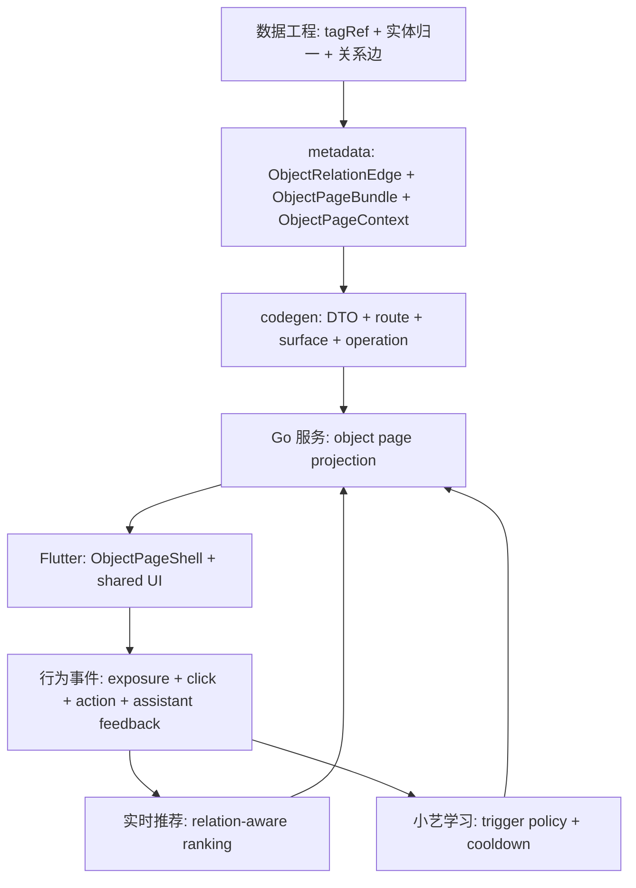

# L1 设计：对象主页网络升级

## 设计目标

本设计把用户主页、圈子/群组主页、共享主页从三套详情页升级为统一对象页网络。目标不是简单换皮，而是让对象身份、内容归属、交集证据、推荐排序、小艺主动服务、运营灰度和行为回流共用同一组契约。

## 上游与依赖

| 上游 | 角色 | 设计影响 |
|---|---|---|
| `user-identity-profile-relationship/profile-homepage-redesign` | 用户主页既有规格 | 保留 profile 主档归属，替换首屏、看点、交集和小艺入口 |
| `circle-community/circle-experience-redesign/circle-homepage-redesign` | 圈子/群组详情规格 | 收敛 `首页/内容/群或组织/成员`，支持组织模板 |
| `shared-homepage-network` | 共享主页主档和口碑规格 | 扩展为对象网络中的共享主页节点 |
| `product-ops-growth/experiment-bucketing-and-rollout` | 灰度与分桶 | `experimentBucket`、白名单、地域、版本进入 rollout 上下文 |
| `recommendation-platform` | 实时推荐 | 消费对象页行为与关系边，做 relation-aware ranking |
| `assistant-run-learning` | 小艺主动服务 | 消费 `ObjectPageContext`，回流 accept/dismiss |
| 数据工程 `control_plane/governance/taxonomy` | 标签真相源 | `tagRef`、实体归一与关系边作为对象网络输入；`publish/tags` 仅保存发布对象引用快照 |

## 核心数据流

## 关键设计决策

### D1：跨域体验层，不抢领域主档

对象主页网络是跨域体验与投影层。用户主档仍归 user，圈子/群组仍归 circle，共享主页主档仍归 entity-service。本节点只定义跨域对象页 bundle、关系边、灰度、埋点和 UI 统一规范。

### D2：一次性全量开发，分 cohort 灰度发布

用户要求三类主页一次性全量重构到位，因此实现不拆旧新双线。但生产发布必须通过 rollout 控制：

- 端侧版本：`appVersion/buildNumber`
- 用户范围：`userWhitelist/experimentBucket`
- 地域范围：`region/city/campus`
- 对象范围：`objectType/canonicalEntityId`
- 环境范围：`runtimeEnv`

灰度开关只控制展示与策略启用，不允许创建第二套 mock 数据或第二套路由。

### D3：交集证据来自关系边，不拼文案

`ObjectRelationEdge` 是视觉证据、推荐理由、小艺解释和行为归因的共同源头。端侧只选择展示形态，不生成事实关系。

### D4：小艺主动提示必须可学习

小艺主动提示只在满足置信度和冷却规则时出现。所有 `impression/click/accept/dismiss` 必须进入行为管道，否则无法判断主动服务是否打扰或有效。

### D5：设计系统由同一组件承载差异化

三类主页不再维护三套 header 和看点区。共享组件根据 `objectType` 切换形态：

- `user`：圆形头像、人设摘要、关注/私信/邀请。
- `circle`：群像卡、成员与群入口、加入/发布。
- `homepage`：场景封面、可信状态、口碑/认领/相关圈子。

## metadata 与服务设计

新增或扩展契约：

- `ObjectRelationEdge`
  - `edgeId`
  - `edgeType`
  - `sourceObjectType/sourceObjectId`
  - `targetObjectType/targetObjectId`
  - `canonicalEntityId`
  - `tagRefs`
  - `evidenceRefs`
  - `confidence`
  - `createdAt`
- `ObjectPageBundle`
  - `identity`
  - `stats`
  - `intersectionReasons`
  - `highlightItems`
  - `contentSections`
  - `relatedObjects`
  - `assistantContext`
  - `rolloutContext`
- `ObjectPageContext`
  - `objectType/objectId/canonicalEntityId`
  - `tagRefs/entityRefs/relationEdges`
  - `referralSource/feedRequestId/recommendationTraceId`
  - `experimentBucket/rolloutCohort`

四项硬债处理：

- `HomepageType` 改为模板驱动并覆盖首发校园与旅游对象。
- entity-service 读模型持久化，聚合内容、口碑、相关圈子与关系边。
- comment 模型增加实体关联或对象关联字段，形成 `comment_about_entity`。
- 统一 `canonicalEntityId` 与 `homepageId` 映射，禁止离线实体页与运行时主页双真相源。

## 运营灰度设计

### 灰度维度

| 维度 | 示例 | 用途 |
|---|---|---|
| 地域 | `region=cn-east`、`city=hangzhou`、`campus=pku` | 校园/旅游场景先行 |
| 版本 | `appVersion>=1.0.0`、`buildNumber>=100` | 老版本降级 |
| 白名单 | 内部用户、运营用户、KOL | 首轮人工验收 |
| 分桶 | `experimentBucket=A/B/C` | 对比交集策略与小艺提示 |
| 对象类型 | `university/sight/restaurant` | 按对象模板逐步放量 |
| 环境 | `alpha/beta/gamma/prod` | 数据源与 seed 策略隔离 |

### 回滚层级

1. 关闭小艺主动提示，仅保留手动入口。
2. 关闭关系证据可视化，回退为简化交集卡。
3. 关闭新对象页模板，回退到旧详情页兼容壳。
4. 关闭推荐策略变体，保留页面展示。

回滚不得改变数据真相源，不得恢复旧 `resonance` 或旧扁平标签链路。

## 埋点与实时推荐闭环

对象页事件统一字段：

- `eventId`
- `userId`
- `sessionId`
- `objectType`
- `objectId`
- `canonicalEntityId`
- `tagRefs`
- `entityRefs`
- `relationEdgeIds`
- `intersectionReasonIds`
- `referralSource`
- `feedRequestId`
- `recommendationTraceId`
- `experimentBucket`
- `rolloutCohort`
- `surfaceId`
- `operationId`
- `timestamp`

事件进入行为仓后，实时推荐使用：

- 交集曝光但未点击：降低该理由展示频率或调整排序。
- 交集点击：增强对应 `tagRef/relationEdge`。
- 加入圈子、关注用户、认领主页：作为强正反馈。
- 小艺 dismiss：降低该触发策略或延长冷却时间。

## 小艺主动服务设计

触发策略：

- 陌生对象但存在高置信交集。
- 进入数据稀疏共享主页，需要摘要帮助理解。
- 用户反复浏览同类对象但未行动。
- 从推荐流进入对象页，需解释推荐原因。

展示原则：

- 不遮挡头部主操作。
- 不在首屏同时出现多个主动提示。
- 可关闭、可追问、可转入小艺完整对话。
- 同一用户同一对象有冷却期。

## 端侧 UI 设计

共享组件：

- `ObjectIdentityHeader`
- `ObjectRelationRibbon`
- `ObjectHighlightSection`
- `ObjectContextTabBar`
- `ObjectAssistantActionDock`
- `ObjectBreadcrumbTrail`
- `ObjectPageSkeleton`
- `ObjectEmptyState`

三页改造：

- 用户页：重排为 `看点 / 作品 / 圈子 / 互动`，看点首屏突出作品气质与关系证据。
- 圈子页：重排为 `首页 / 内容 / 群或组织 / 成员`，支持兴趣圈与学校/组织模板。
- 共享主页：重排为 `首页 / 内容 / 口碑 / 关联`，评论、内容、圈子、用户关系归到对象维度。

## 测试设计

- local_contract：metadata、DTO、route/surface/operation、fixture、灰度策略静态校验。
- local_contract：Widget/Provider/Repository mock，覆盖三页首屏、交集证据、小艺提示、空态、灰度分支。
- api_integration：local-gamma/contract，验证 entity-service 持久化、对象关系 bundle、行为事件入库、推荐回流。
- user_acceptance：端到端旅程，覆盖用户→圈子→学校→内容→评论→小艺解释→行动。

## 风险

- 后端硬债阻塞 UI：S1 必须先完成契约和最小持久化读模型。
- 一次性全量范围大：共享 UI 必须先行，三页不可各自重复实现。
- 灰度维度过多：先保证白名单、版本、地域、bucket 四类最小可用，再扩展对象类型。
