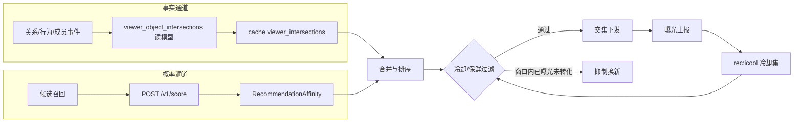

# L2 设计：交集统一体验与推荐

## 设计目标

把交集的展示与推荐统一到一套契约和一组共享组件上：事实交集与概率交集分通道计算、合并排序后统一经保鲜期与冷却窗口过滤再下发；端侧用同一个 `IntersectionEntity` 原子在我的主页聚合入口、对象页交集卡、首页/频道交集推荐三处统一呈现。

## 核心数据流

## 关键设计决策

### D1：事实与概率严格分通道

事实交集必须带证据、可回查、满足权限；概率交集（`RecommendationAffinity`）只承载排序分与模型理由桶，不生成事实文案。两者在 `IntersectionReason.intersectionClass`（`fact|affinity`）上区分。**已删除 `ObjectIntersection` 独立 projection**；对象页/feed/搜索统一 `List<IntersectionReason>` + `IntersectionPoint`。

### D2：请求期零打分，事实预物化

事实交集来自增量物化读模型 `viewer_object_intersections`（消费关系/行为/成员事件），请求期只查询 + 缓存，不做实时打分，保证高并发低延迟。概率交集走现有 `/v1/score` 批量打分并缓存。

### D3：跨会话推荐冷却窗口

现有 `rec:exposed` 仅会话级（30min）。新增 `rec:icool:{userId}`（sorted set，member=objectId、score=冷却过期 unix 秒），曝光未转化即写入，默认 14 天可配；下发前 `ZRANGEBYSCORE -inf now` 之外的成员视为冷却中并排除，过期成员自然解禁。

### D4：保鲜期分维度

`viewer_object_intersection` 读模型每条带 `computedAt`/`expiresAt`。identity/membership 保鲜久（如 30 天），location/content/relationship 保鲜短（如 3-7 天）。过期条目由后台重算刷新，避免展示陈旧事实。

### D5：我的主页聚合入口复用未读水位机制

复用 `following_subject` 的 `lastVisitedAt`/`unreadChangeCount` 思路：per-user per-dimension 维护已读水位；未读 = `computedAt > watermark`。打开按维度列表即调用 `POST /v1/intersections/visit` 推进水位并清零红点。最多展示 3 个维度，超出收起"展开更多"。

### D6：端侧统一原子，零文案拼装

抽 `IntersectionEntity`（头像/displayName/维度 chip/证据微缩/计数 badge）三密度变体（rail/inbox/对象页摘要）。所有文案走 `UITextConstants`/`l10n`，端侧不拼装事实句子；红色仅用于未读/新增数字。

## metadata 与服务设计

### 扩展 `IntersectionReason`

新增字段：`avatarUrl`、`displayName`、`intersectionClass`(fact|affinity)、`intersectionId`、`freshAt`、`expiresAt`、`confidenceLabel`、`modelReasonBucket`。保持端只读、禁止本地拼装。

### 新增 `recommendation/intersection` 域

- `service.yaml`
  - `GET /v1/intersections/summary` → 我的主页聚合（per-dimension 计数 + 未读）
  - `GET /v1/intersections?dimension=&cursor=` → 按维度分页列表（自上次新增）
  - `POST /v1/intersections/visit` → 推进已读水位、清零
  - `GET /v1/feed/intersections?channel=` → 频道交集推荐（事实 + 概率混排、过冷却）
  - `POST /v1/intersections/exposure` → 曝光上报（写冷却集）
- `fields.yaml`：请求/响应实体。
- `events.yaml`：交集曝光/点击/转化/清零事件（可与 content behaviors 协同）。
- `policy.yaml`：`intersectionCooldownDays`（默认 14）、各维度 freshness TTL、混排权重。
- projection `viewer_object_intersection.yaml`：`storage_backend`/`collection`/`source_events`，承载事实读模型。

### 接通已存契约

- `object_page_bundle.yaml` 仅 `intersectionReasons: List<IntersectionReason>` 单通道（删除并行 `intersections`）。
- `object_membership.yaml` 增 `expiresAt`。

### 行为归因

`behaviors.yaml` 的 `impression`/`click` 补 `intersectionId`/`intersectionDimension`/`intersectionClass`/`intersectionEvidenceId`，并补"交集列表访问/清零"事件，闭合曝光→点击→转化漏斗。

### Redis 键空间

`redis_keyspace.yaml` 登记：
- `rec:icool:{<userId>}`：sorted set，rec scene，ttl = cooldown 上限，跨会话冷却。
- `cache:viewer_intersections:{userId}`：general scene，事实读模型缓存。

## 后端实现（DDD 分层）

- infrastructure：增量物化 `viewer_object_intersections`（消费关系/行为/成员事件），冷却集 ZADD/ZRANGEBYSCORE，保鲜重算。
- application：组装 summary/list/visit/feed-intersections/exposure；混排事实 + 概率。
- entity-service：`homepage_service.go` 用真实交集填充 bundle `intersections`，移除硬编码 `defaultIntersectionReasons`。
- discovery 投影：`discovery_projector` 真实写入 `intersectionReasons`（事实 + 概率、过冷却、按 channel）。

## 端侧实现

- 移除 profile/entity/circle 三处 `ObjectAssistantActionDock` demo 调用及兜底文案；下线 `today_intersection_rail` 死代码。
- 新增「我的交集」聚合入口卡 + 分组列表页。
- 圈子主页接入交集卡。
- 重设计 `unified_object_card`（去关注按钮、真实头像 + 名字 + 维度 chip、共同点安静 chip、模块头红数字、点卡进对象页）。
- 抽 `IntersectionEntity` 原子，三入口统一消费。

## 运营灰度与回滚

- 交集策略变体、冷却天数、混排权重由 `policy.yaml` + rollout 控制。
- 回滚层级：关闭概率交集（仅事实）→ 关闭频道交集 rail → 回退简化交集卡。

## 测试设计

- T1：新 projection/service 字段、冷却/保鲜 keyspace 登记、behaviors 归因；Mock 与 Remote 字段一致。
- T2：inbox 清零、≤3 维度展开、卡去按钮/头像名字/红数字、campus/travel 出交集、空态。
- T3：summary/list/visit/feed-intersections/exposure 与真实 API 对齐，冷却窗口生效。
- T4：发现交集→进对象页→行动→回流→冷却换新；inbox 自上次新增。

## 风险

- 事实物化管线复杂：先保证读模型 + summary/list 最小闭环，再接全量事件源。
- 冷却窗口与保鲜期交叉：以 `policy.yaml` 单一真相源配置，避免双处硬编码。
- 端侧多入口统一：先抽 `IntersectionEntity` 原子，三入口不可各自实现。
