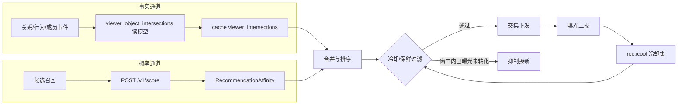
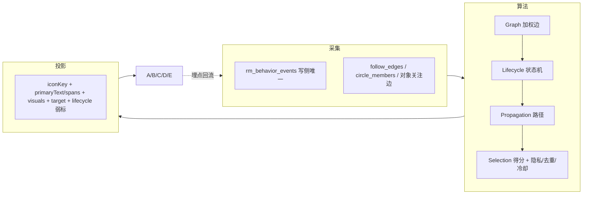

# L2 设计：交集统一体验与推荐

## 设计目标

把交集的展示与推荐统一到一套契约和一组共享组件上：事实交集与概率交集分通道计算、合并排序后统一经保鲜期与冷却窗口过滤再下发；端侧用同一个 `IntersectionEntity` 原子在我的主页聚合入口、对象页交集卡、首页/频道交集推荐三处统一呈现。

## 核心数据流



## 关键设计决策

### D1：事实与概率严格分通道

事实交集必须带证据、可回查、满足权限；概率交集（`RecommendationAffinity`）只承载排序分与模型理由桶，不生成事实文案。两者在 `IntersectionReason.intersectionClass`（`fact|affinity`）上区分。**已删除 `ObjectIntersection` 独立 projection**；对象页/feed/搜索统一 `List<IntersectionReason>` + `IntersectionPoint`。

### D2：请求期零打分，事实预物化

事实交集来自增量物化读模型 `viewer_object_intersections`（消费关系/行为/成员事件），请求期只查询 + 缓存，不做实时打分，保证高并发低延迟。概率交集走现有 `/v1/score` 批量打分并缓存。

### D3：跨会话推荐冷却窗口

现有 `rec:exposed` 仅会话级（30min）。新增 `rec:icool:{userId}`（sorted set，member=objectId、score=冷却过期 unix 秒），曝光未转化即写入，默认 14 天可配；下发前 `ZRANGEBYSCORE -inf now` 之外的成员视为冷却中并排除，过期成员自然解禁。

### D4：保鲜期分维度

`viewer_object_intersection` 读模型每条带 `computedAt`/`expiresAt`。identity/membership 保鲜久（如 30 天），location/content/relationship 保鲜短（如 3-7 天）。过期条目由后台重算刷新，避免展示陈旧事实。

### D5：我的主页聚合入口复用未读水位机制

复用 `following_subject` 的 `lastVisitedAt`/`unreadChangeCount` 思路：per-user per-dimension 维护已读水位；未读 = `computedAt > watermark`。打开按维度列表即调用 `POST /v1/intersections/visit` 推进水位并清零红点。最多展示 3 个维度，超出收起"展开更多"。

### D6：端侧统一原子，零文案拼装

抽 `IntersectionEntity`（头像/displayName/维度 chip/证据微缩/计数 badge）三密度变体（rail/inbox/对象页摘要）。所有文案走 `UITextConstants`/`l10n`，端侧不拼装事实句子；红色仅用于未读/新增数字。

## metadata 与服务设计

### 扩展 `IntersectionReason`

新增字段：`avatarUrl`、`displayName`、`intersectionClass`(fact|affinity)、`intersectionId`、`freshAt`、`expiresAt`、`confidenceLabel`、`modelReasonBucket`。保持端只读、禁止本地拼装。

### 新增 `recommendation/intersection` 域

- `service.yaml`
  - `GET /v1/intersections/summary` → 我的主页聚合（per-dimension 计数 + 未读）
  - `GET /v1/intersections?dimension=&cursor=` → 按维度分页列表（自上次新增）
  - `POST /v1/intersections/visit` → 推进已读水位、清零
  - `GET /v1/feed/intersections?channel=` → 频道交集推荐（事实 + 概率混排、过冷却）
  - `POST /v1/intersections/exposure` → 曝光上报（写冷却集）
- `fields.yaml`：请求/响应实体。
- `events.yaml`：交集曝光/点击/转化/清零事件（可与 content behaviors 协同）。
- `policy.yaml`：`intersectionCooldownDays`（默认 14）、各维度 freshness TTL、混排权重。
- projection `viewer_object_intersection.yaml`：`storage_backend`/`collection`/`source_events`，承载事实读模型。

### 接通已存契约

- `object_page_bundle.yaml` 仅 `intersectionReasons: List<IntersectionReason>` 单通道（删除并行 `intersections`）。
- `object_membership.yaml` 增 `expiresAt`。

### 行为归因

`behaviors.yaml` 的 `impression`/`click` 补 `intersectionId`/`intersectionDimension`/`intersectionClass`/`intersectionEvidenceId`，并补"交集列表访问/清零"事件，闭合曝光→点击→转化漏斗。

### Redis 键空间

`redis_keyspace.yaml` 登记：
- `rec:icool:{<userId>}`：sorted set，rec scene，ttl = cooldown 上限，跨会话冷却。
- `cache:viewer_intersections:{userId}`：general scene，事实读模型缓存。

## 后端实现（DDD 分层）

- infrastructure：增量物化 `viewer_object_intersections`（消费关系/行为/成员事件），冷却集 ZADD/ZRANGEBYSCORE，保鲜重算。
- application：组装 summary/list/visit/feed-intersections/exposure；混排事实 + 概率。
- entity-service：`homepage_service.go` 用真实交集填充 bundle `intersections`，移除硬编码 `defaultIntersectionReasons`。
- discovery 投影：`discovery_projector` 真实写入 `intersectionReasons`（事实 + 概率、过冷却、按 channel）。

## 端侧实现

- 移除 profile/entity/circle 三处 `ObjectAssistantActionDock` demo 调用及兜底文案；下线 `today_intersection_rail` 死代码。
- 新增「我的交集」聚合入口卡 + 分组列表页。
- 圈子主页接入交集卡。
- 重设计 `unified_object_card`（去关注按钮、真实头像 + 名字 + 维度 chip、共同点安静 chip、模块头红数字、点卡进对象页）。
- 抽 `IntersectionEntity` 原子，三入口统一消费。

## 运营灰度与回滚

- 交集策略变体、冷却天数、混排权重由 `policy.yaml` + rollout 控制。
- 回滚层级：关闭概率交集（仅事实）→ 关闭频道交集 rail → 回退简化交集卡。

## 测试设计

- local_contract：新 projection/service 字段、冷却/保鲜 keyspace 登记、behaviors 归因；Mock 与 Remote 字段一致。
- local_contract：inbox 清零、≤3 维度展开、卡去按钮/头像名字/红数字、campus/travel 出交集、空态。
- api_integration：summary/list/visit/feed-intersections/exposure 与真实 API 对齐，冷却窗口生效。
- user_acceptance：发现交集→进对象页→行动→回流→冷却换新；inbox 自上次新增。

## 风险

- 事实物化管线复杂：先保证读模型 + summary/list 最小闭环，再接全量事件源。
- 冷却窗口与保鲜期交叉：以 `policy.yaml` 单一真相源配置，避免双处硬编码。
- 端侧多入口统一：先抽 `IntersectionEntity` 原子，三入口不可各自实现。

---

## Phase 0 冻结：`IntersectionService` pipeline 与选择得分（交集落地总路标）

> 本节是「交集落地总路标」Phase 0 在服务端 design 的冻结口径，配套真相源
> [`specs/product/intersection-definition-and-application.md`](../../../product/intersection-definition-and-application.md) §20
> 与机读注册表 `recommendation/rec_model/intersection_kind_registry.yaml`。门禁
> `quwoquan_service/scripts/recommendation/verify_intersection_kind_registry.py`（入 `make verify`）。

### P0-1 固定管线

`IntersectionService`（消费方：我的主页 summary/list、对象页 object）固定六段管线：

```text
召回(source) → 隐私过滤(privacyScope) → 去重(dedupeKey) → 价值打分排序 → 冷却/多样性裁剪 → 渲染契约(hydrate primaryText)
```

每段单一职责、单向流动；上节「核心数据流」是事实/概率双通道召回的展开，本节是召回之后的统一裁决链。

### P0-2 选择得分公式

```text
score = valueWeight(tier) × freshness(decay) × confidence × diversityPenalty × cooldownGate
```

- `valueWeight(tier)`：local_contract=1.0 / local_contract=0.75 / api_integration=0.5 / user_acceptance=0.3（注册表 `valueTierWeights`）。
- `freshness = exp(-ageHours / freshnessHalfLifeHours)`，`policy.yaml` 分维度 TTL 派生半衰期。
- `confidence`：fact=1.0；affinity=模型分，低于注册表 `confidenceThreshold` 不产出。
- `diversityPenalty`：同维度/同对象连续命中降权，保证多样性。
- `cooldownGate`：`rec:icool` 窗口内已曝光对象降权（`policy.intersection.cooldownDays`）。
- **affinity 永远排在 fact 之后，且必须显式标「推荐」**（`intersectionClass=affinity`）。

### P0-3 入选门槛 / 红线（GATE_BLOCK 语义）

1. 数量门槛：至少 1 个可枚举可点击样本，否则降级纯计数 → 维度母表达 → 隐藏整块。
2. 置信门槛：affinity < `confidenceThreshold` 不产出；fact 达数量门槛即可。
3. 真实性红线：禁用推荐分/热度伪造 fact；fact 数字必须来自真实证据点派生（single-source）。
4. 隐私门槛：`commonContact` 必须先过双向可见性才产出。
5. 空态：无合格交集隐藏整块，禁占位假交集。

### P0-4 与 `policy.yaml` 对齐

`recommendation/rec_model/policy.yaml` `intersection` 块为冷却/保鲜/混排权重唯一真相源
（`factWeight / affinityWeight / maxAffinityPerSurface / cooldownDays / freshnessTtlDaysByDimension`），
feed 内混排见 `feed_intersection_mixer.go`。

### P0-5 feed 交集 API 的 Phase 0 处置（交接会话 E）

上文「新增 `recommendation/intersection` 域」列出的 `GET /v1/feed/intersections` 与
`POST /v1/intersections/exposure` 属**首页推荐页（会话 E）**范围：Phase 0 决定**删除 feed spotlight 独立 API**，
交集改由 post 内 `intersection_reason_chip` 承载（详见 §20.6 删除清单）。`Feed()` 内部数据路径
（`feed_service.go` post-chip 用）**保留**。Phase 0 不在本会话执行该删除，避免触发会话 E 的推荐页 UI 大改。

---

## 架构基线 v2 设计（Graph + Lifecycle + Propagation + Projection）

> 真相源：`specs/product/intersection-definition-and-application.md` §21。本节是服务/端侧设计承接；本期只落契约草案 + 端原型，云侧算法分期。

### 端到端三段管线



统一血缘：`边(sourceRef+dimension)` → `edgeWeight + lifecycleState + propagationPath` → `primaryText/spans + visuals + target` → 埋点回流，全程单一真相源、无第二文案/标识通道。

### 草案契约字段设计（metadata-first，本期生成端 DTO，云侧不实现逻辑）

| 契约 | 新增字段 | 用途 |
|---|---|---|
| `intersection_kind_registry.yaml` | `relationStrengthBase` / `interactionFrequencyKey` / `recencyHalfLifeDays` / `lifecycleApplicable` / `propagationRole` / `iconKey`；恢复 `coLiked` | Graph 加权 + iconKey 真相源 |
| `intersection_reason.yaml` | `lifecycleState` / `previousStrength` / `strengthDelta` / `edgeWeight` / `iconKey` / `objectVisual` | Lifecycle 弱标 + 类型图标 + 尾部对象封面 |
| `intersection_text_span.yaml` | `visual`(IntersectionVisual?) | 句内 inline 头像簇 |
| `intersection_dimension_tally.yaml` / `intersection_inbox_summary.yaml` | `strengthenedCount` / `reactivatedCount` / `iconKey` | lifecycle 态分桶 |
| `author_impact_item.yaml` | `propagationPath` / `hopCount` / `secondarySpreadCount` / `iconKey` | 传播视图（守红线，绝对计数） |
| `circle_impact_item.yaml` | `impactId` / `primarySpans` / `sampleVisuals` / `countTarget` / `evidenceSnapshotId` / `countObjectKind` / `propagationPath` / `iconKey` | 补统一交互子契约（解决 G4）+ 传播视图 |
| `intersection_propagation_path.yaml`（新增） | `nodes`(visual+target) / `hopCount` / `pathKind` | 传播链值对象（可选多跳承载） |
| `policy.yaml` `intersection` | `graphWeights` / `lifecycleWeights` / `propagation` | 数值真算配置位（本期给安全默认） |

### 性能与容量弹性（冷热三档，云侧部分后置）

- 热（请求期）：小集合求交 + `cache:viewer_intersections`(TTL 900s) + `rec:icool` 冷却 + 上限/截断 + 分页 cursor。
- 温（高频聚合）：`viewer_object_intersections` 增量物化预投影，按 viewer 分片水平扩展。
- 冷（离线批）：Lifecycle 状态机、多跳 Propagation、Affinity 打分、**coLiked 大集合求交** —— 分期。
- coLiked 红线：禁请求期全量，必须预投影/采样/上限，排序最末（user_acceptance）。
- 降级开关分级：关概率 → 关频道 → 回退简化卡。

### 端侧实现（本期 Mock 原型）

- 共享层：`IntersectionIconResolver`（iconKey→设计系统图标）+ `IntersectionLifecycleBadge`（新/增强/重新活跃）+ 句内 inline 头像渲染（`InteractiveIntersectionText` 消费 `span.visual`）+ 尾部对象封面 + 传播视图件（复用 `IntersectionVisualCluster`/`IntersectionTargetNavigator`）。
- `circle_impact` 卡接入统一三件套，与 author_impact 同源。
- `intersection_repository.dart` Mock + fixture 补 lifecycle / 传播 / coLiked / iconKey 样本，供 A–E alpha 原型。

### 分期边界

本期不做：云侧 Go 算法与采集实现、Remote 真实数据、Lifecycle 状态机/多跳 Propagation/Graph 加权/coLiked 大集合求交真算。待 UI 原型评审通过、契约冻结后另会话落地。
