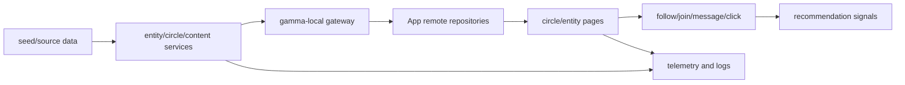

# Object Homepage Gamma Real Data Closure

## Spec Entry

- AppRoot Journey/Scenario: 从首页推荐、搜索、我的主页交集入口进入圈子主页或实体主页，判断“为什么推荐”、查看真实记录/讨论/相关圈子，并完成关注、加入或私信。
- L1_domain_service: `object-homepage-network`
- L2_business_capability: `intersection-unified-experience`
- L3_story: `object-homepage-gamma-real-data-closure`
- 验收意图: `SIT / GWT / UAT / contract`
- 测试证据: `local_contract / api_integration / user_acceptance`
- 当前阶段: `/continue-dev` 下一轮目标规划；本 Story 是圈子主页与实体主页商用重构从本地 UI 到 gamma-local 真实链路的实施门。

## 用户价值

用户进入圈子主页或实体主页时，必须能基于真实服务数据判断：

- 这里是什么，是否可信。
- 实体/圈子「我的交集」与「这里打动的人 / 圈子打动的人」双模块。
- 谁和我有关，以及证据是否可点开。
- 我能做什么：关注、加入、私信、查看记录、参与讨论、进入相关圈子。

本 Story 的价值不是再做一个本地 demo，而是让真实/种子数据经由 `Data -> Service -> App -> Behavior -> Recommendation -> Observability -> Environment` 闭环，支撑商用验收。

## 范围

### In Scope

- 当前 `/continue-dev` 收口轮次只验证 **homepage-only** 的 `H100 -> H1000` 真实端到端闭环，不把 article/image 的放量链路混入同一批执行。
- gamma-local 拓扑闭环：`entity-service`、`circle-service` 进入 compose、gateway route、port profile、package、healthcheck、stackctl 验证证据。
- 端云契约闭环：实体主页、圈子主页、对象交集、相关圈子、打动摘要（内部契约仍为 impact）、关注/加入状态全部走 metadata/service 契约，不在 App 维护第二套模型。
- 种子与身份闭环：`app_gamma_seed_manifest.json` 覆盖 viewer、用户关系、实体主页、圈子、记录、讨论、相关圈子与对象交集所需数据；api_integration/user_acceptance 使用同一 viewer 和 token 语义。
- 真实 API 探针：覆盖 `/v1/homepages/{homepageId}/object-page-bundle`、`/introduction`、`/related-groups`、`/v1/circles`、`/v1/circles/{circleId}`、`/impact`、`/v1/content/intersections/object`；前台模块标题必须稳定映射为「这里打动的人 / 圈子打动的人」。
- App Remote 验收：实体/圈子页面在 remote/gamma 数据模式下消费同一契约，禁止回落到 Dart mock 或 UI 自造主句。
- 交集事实契约：商用可见理由只消费 `IntersectionReason.primaryText / primarySpans / sampleVisuals / representativeActor / objectVisual / lifecycleState / actionHints / iconKey`；`join(primarySpans.text) == primaryText` 必须可测。
- 可观测闭环：首页曝光、理由曝光、span 点击、证据展开、关注/加入/私信、Tab 切换、记录点击、错误态和空态都有 `surface/objectType/objectId/reasonId/targetType/targetId/env` 归因。
- 实体主页 author 阶段默认通过 `cursor_sdk` 使用**最新 `composer`** 模型执行，并记录 startup、throughput、firstPassRate、authoritative ledger 等真实执行证据。
- 实体主页正文主源闭集冻结为 `Wikipedia + 百度百科 + 搜狗百科 + 今日头条百科`；权威 rank 为 `0/1/2/2`。Wikidata、OSM、百科搜索只做候选发现；Wikivoyage、360、官网、政府、门户、媒体、OTA 不得进入 source plan/source unit/writing pack/`primaryEvidenceRef`。

### Out of Scope

- 不在本 Story 建深排平台、premium pool、商业运营后台、支付或预约链路。
- 不新增 homepage/circle 专属交集 API；优先复用 `/v1/content/intersections/object`，只有 metadata 契约缺字段时才补契约。
- 不解决 `R-IX01` 到 `R-IX04` 的全量算法与商业策略能力；这些风险只影响推荐精度，不阻塞真实事实展示闭环。
- 不宣称 prod-ready；通过 gamma-local api_integration、user_acceptance 和 UAT 证据后，才能进入 prod rollout 规格。
- 不在本轮执行 article/image 的 `H100/H1000` 放量验证；Pinterest image-only 商业线仅保留共享 runtime/composer 的非干扰回归，不纳入本 Story 的完成定义。

## 商用成熟度判定

本 Story 是“圈子主页与实体主页商用成熟”的阻断门。只有本地 widget/provider 通过，不能判定商用成熟；必须同时满足：

- 静态拓扑不是 404，也不是只在 compose 中存在；stackctl health 和 api_integration 探针必须证明可访问。
- App 页面不能用 mock、旧 `EvidenceGroup`、`intersectionPoints` 或本地拼句兜底真实推荐理由。
- 实体主页不能暴露“统一对象键、对象页模板、来源、灰度 cohort、主页管理”等运维字段。
- 圈子主页和实体主页的相关二级模块必须可点击、可刷新、可恢复，而不是静态展示。
- 错误态、空态、未登录、弱网、无理由、无记录都必须有恢复动作和埋点。

## Contract Direction

### Reuse First

- 实体主页继续使用 `quwoquan_service/contracts/metadata/entity/homepage/service.yaml`。
- 圈子主页继续使用 `quwoquan_service/contracts/metadata/social/circle/service.yaml`。
- 对象交集继续使用 `quwoquan_service/contracts/metadata/content/post/service.yaml` 中的 `/v1/content/intersections/object`。
- App 侧继续通过 generated route/path 与 repository 消费契约，不手写第二套 URL、错误码或 DTO。

### Minimum Extensions

仅在现有契约无法表达商用字段时扩展 metadata：

- `HomepageDetailBundle` 缺少公开字段时，只补用户语义字段，不暴露运维字段。
- `CircleDetailView` 缺少封面、独立头像、成员头像簇、加入状态或 action state 时，先补 read model。
- `IntersectionReason` 已能表达主句、span、visual、actionHints 时，不新增平行结构。
- 若 `objectType=homepage` 无法决定地点/学校/公司等细分类，优先由服务端根据 homepage metadata 解析 subtype；不要让 App 临时把用户文案逻辑写死。

### Anti-overdesign

- 不新增 `homepage-intersections` 或 `circle-intersections` 并行接口。
- 不为旧 demo 建 shim、fallback、allowlist 或兼容层。
- 不把“相关圈子”做成独立复杂推荐平台；本轮只要求 read model、排序理由、点击/加入闭环。
- 不把所有商业运营能力前置到本 Story；保留可观测字段和配置来源即可。

## End-to-End Flow

## Implementation Order

1. 规格与契约收口：确认 L2/L3 acceptance、metadata 字段、禁词、端云模型一致。
2. gamma-local 健康闭环：修复 gateway health、TLS/port/profile、stackctl verify 中断点。
3. seed 与 API 探针：补齐实体、圈子、相关圈子、打动摘要（impact）、对象交集的 api_integration manifest 和严格断言。
4. App Remote 串联：确保页面在 remote/gamma 模式下消费真实 bundle、detail、impact、intersection、related groups。
5. 观测与 UAT：补行为归因、错误/空态、弱网/未登录恢复，输出 user_acceptance 或替代 dry-run 证据。
6. Exit Review：按规格达成、测试证据、E2E、产品/UX、运营观测、自动化门禁、剩余风险逐项关闭。

## Continue-Dev Task Review

2026-06-25 复审结论：本 Story 的方向满足商用重构入口，但当前任务清单在未补下列切片前不能直接宣称商用成熟。下一轮可以进入开发，但必须按 P0-P6 顺序推进；P0/P1 未绿时，不允许先做 App UI 或新增并行 API。

### P0 gamma-local health first

- 目标：先让 gamma gateway、product-ops gateway、entity-service、circle-service、content-service 在 stackctl health 中可访问。
- 输入：`docker-compose.gamma-local.yaml`、`quwoquan_ops/environments/local-gamma/Caddyfile`、port profile、stackctl package/health report。
- 输出：`stackctl health --target gamma-local --scope full` 通过；若仍有 TLS EOF，先修 topology/证书/服务启动，不进入对象页开发。
- 禁止：绕过 stackctl 手写第二套 curl base URL，或把 health 失败标成 endpoint 空结果。

### P1 manifest and seed contract closure

- 目标：补齐 `app_gamma_seed_manifest.json` 与 `run_local_gamma_t3.py`，让 seed refs 与 verified endpoints 覆盖商用对象主页所需最小数据。
- 必补 endpoints：`/v1/homepages/{homepageId}/related-groups`、`/v1/homepages/{homepageId}/review-summary`、`/v1/circles/{circleId}/impact`、`/v1/circles/{circleId}/members`、`/v1/circles/{circleId}/feed`、`/v1/content/intersections/object?objectType=homepage|circle&objectId=...`。
- 必补 seed：viewer、relationship、circle membership、related circle、homepage subtype、content anchor、object intersection reason 所需样本必须来自 metadata fixture 或服务 seed 命令。
- 禁止：为通过探针在脚本里手写第二套业务文档结构；若服务没有 seed 能力，先补 service seed 或 metadata fixture。

### P2 typed API probes

- 目标：`run_local_gamma_t3.py` 不只验证 2xx 和 bytes，还要验证商用字段与语义。
- 实体断言：Header 字段、简介、相关圈子卡、关注状态、公开字段白名单；不得出现统一对象键、模板、来源、灰度 cohort、主页管理。
- 圈子断言：独立头像、封面、成员头像簇、成员数、加入状态、impact primaryText、feed/members 可分页。
- 交集断言：`primaryText` 非空、`join(primarySpans.text) == primaryText`、span target 完整、sample visuals/action hints 可导航、objectType=homepage|circle 不退化为 `interest`/`同好`。
- 错误断言：未登录、无理由、无记录、服务不可用返回结构化错误和恢复语义，不返回 raw exception。

### P3 metadata-first model decision

- 目标：只在现有 read model 无法表达商用字段时扩 metadata，并先 verify/codegen。
- 决策：`HomepageDetailBundle`、`CircleDetailView`、`CircleImpactSummary`、`IntersectionReason` 仍是主模型；不新增 `homepage-intersections` 或 `circle-intersections`。
- 关键风险：`objectType=homepage` 需要服务端从 homepage metadata 解析 subtype，不能让 App 用本地文案或硬编码 route 推断用户语义。

### P4 App Remote and local contract parity

- 目标：App 的 remote/gamma 页面消费同一契约，local_contract 与 api_integration 字段一一对应。
- 实体页面：复用现有 `homepage_detail_page_widget` 与 `homepage_repository_contract` 测试资产，补 remote journey 和无内部字段断言。
- 圈子页面：复用现有 `circle_shell_widget`、`circle_detail_journey` 和 circle repository 测试资产，补 impact、members、join state 刷新断言。
- 交集组件：继续以 `ObjectIntersectionSection`/`ObjectIntersectionCard` 为共享渲染入口，禁止恢复 `EvidenceGroup` 或 `intersectionPoints` 本地拼句。

### P5 observability and behavior feedback

- 目标：页面、API、行为事件、推荐回流和告警同源。
- 事件归因：曝光、理由曝光、span 点击、证据展开、关注/加入/私信、Tab 切换、记录点击、错误态和空态都带 `surface/objectType/objectId/reasonId/targetType/targetId/env`。
- 服务观测：health、HTTP error、latency、空结果、鉴权失败、seed/probe failure 都进入 stackctl report 或服务指标。
- 推荐回流：关注、加入、打开对象、打开讨论、点击相关圈子必须能进入 behavior/recommendation attribution，不降级成普通 click。

### P6 exit gate

- 目标：只有当 local_contract、api_integration、user_acceptance 三层证据齐备时，才可声明对象主页商用准入完成。
- 最小门禁：feature-tree/acceptance、metadata verify/codegen、compose config、stackctl health、strict gamma probes、App mock isolation、page horizontal quality、相关 Flutter/Go tests。
- 若 Patrol runner 缺失，只能记录 user_acceptance runner-blocked 或 dry-run 证据，不能宣称自动化 user_acceptance 完成。
