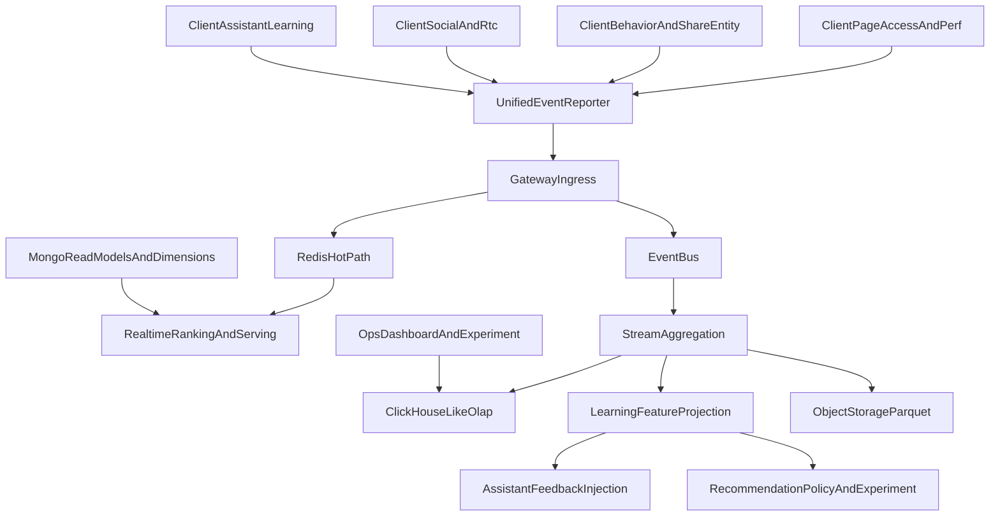

# design：event-ingestion-and-analytics

## 方案对比

| 方案 | 说明 | 优点 | 局限 | 结论 |
|------|------|------|------|------|
| **A. 仅 Redis 热路径 + 本地日志/采样** | 继续依赖现有 `behavior -> Redis hot path` 与端侧本地日志，不建设统一事件总线与 OLAP | 实现快、成本低、对现网影响小 | 无法支撑跨域漏斗、留存、实验、分享回流、Assistant 学习与统一分析 | 不采纳为目标态；仅可作为短期降级方案 |
| **B. Redis 热路径 + 事件总线 + OLAP + 冷归档** | 保留 Redis/Mongo serving，同时新增统一 reporter、事件总线、流式聚合、OLAP 与对象存储 | 热/冷职责清晰，兼容现有代码，适合持续运营与在线学习 | 需要补齐 schema、事件治理、云同步与双写迁移 | **选用** |
| C. 统一直写 OLAP，Redis 只做查询缓存 | 所有事件统一进 OLAP，在线学习再异步回写特征 | 结构极简，分析口径统一 | 热反馈时延与在线重排不稳定，无法替代现有 Redis 热态 | 不采纳 |

## 选型结论

选用 **方案 B** 作为 baseline 目标态：

- 保留 `content behaviors -> Redis hot path` 与 Mongo read model，避免直接破坏现有推荐服务路径；
- 为页级访问、行为、分享、实体点击、消息、Assistant 学习等事件新增统一上报与总线；
- OLAP 负责准实时/离线分析与实验；对象存储负责低成本归档；
- 学习链路通过统一 envelope 对接推荐与 Assistant 两条反馈应用。

## 总体架构

## 关键设计

### 1. 统一 Reporter 与事件入口

#### 客户端
- 页级访问与 perf：沿用 `page_access_log_util.dart` 与 `AppLogService` 的 pageVisit 语义，但在 `/dev` 中新增统一 reporter 双写或替代本地-only 路径。
- 内容行为：在 `content_behavior_tracker.dart` 的基础上补充 `eventId`、`surfaceId`、`routeId`、`experimentBucket`、`entityType/entityId`、`shareTarget` 等字段。
- Assistant 学习：保留 `InteractionEvent / Scorecard` 端侧模型，通过真实 cloud sync 接入统一 gateway，而不再停留在 `cloudStub`。
- Social/RTC：新增消息送达、已读、首回时延、RTC 接通与质量事件的统一 envelope 要求。

#### 服务端
- Gateway 负责 schema 校验、字段等级校验、幂等与优先级分流。
- `P0/P1` 事件可同时进入 Redis 热路径与事件总线；`P2` 默认只入总线或按采样率进入。

### 2. 热/冷职责边界

#### Redis 热路径
- 保留现有 `rec:session_signals`、`rec:exposed`、`rec:negative`、`rec:realtime_interest` 等 key 模式。
- 适合 `impression` 去重、负反馈过滤、实时兴趣更新、会话短期上下文。
- 不承担长期明细分析职责。

#### EventBus + OLAP
- 事件总线承担削峰、重放、补数、异步多消费。
- OLAP 承担体验、行为、实验、留存、分享回流、实体点击、聊天/RTC、Assistant 学习明细与聚合查询。
- 冷数据对象存储承接大时间跨度重算与低成本留存。

#### Mongo / 维表
- Mongo 保留 read model，如 discovery feed 与 feature projection；
- 关系维表或配置存储负责指标字典、实验配置、实体目录、告警阈值。

### 3. 统一事件模型与 metadata/codegen

本阶段不要求一次性完成所有 codegen，但设计冻结以下规则：

1. 事件 envelope 为统一真相源，禁止 UI、Repository、学习服务、运营看板各自维护第二套字段表。
2. 共享维度（surface/route/operation/experiment/version/idempotency）优先走 metadata 驱动；page access 与 cloud request headers 保持同源语义。
3. `AnalyticsService` 不得继续作为独立 schema 演进源；后续要么被统一 reporter 替代，要么成为 façade。
4. Assistant 学习 `InteractionEvent / Scorecard` 必须映射到统一 envelope，并保留领域专有字段。

### 4. 幂等、去重、采样、背压

#### 幂等
- 每个事件生成 `eventId`；客户端重试与服务端重放以 `eventId + eventVersion` 判重。
- 曝光类可保留 session 内逻辑去重；行为类仍需事件级幂等键。

#### 去重
- 客户端：保留轻量去重（如 impression）。
- 服务端：
  - Redis 集合类信号做状态去重；
  - EventBus/OLAP 依赖 `eventId` 去重与批处理幂等。

#### 采样与背压
- `P0`：全量，不允许静默丢弃。
- `P1`：默认全量或低采样；当背压触发时优先保留关键域。
- `P2`：允许按实验、环境、业务域采样与丢弃。
- 客户端队列满：先丢 `P2`，再降级部分 `P1`；`P0` 需要单独保底通道。

### 5. 容量与成本设计

- page access 与高频播放器事件默认批量聚合上报，禁止一帧一事件进入统一 reporter。
- OLAP 以日分区 + 常用维度排序键构建；热点查询走物化视图与聚合表。
- 冷数据 `90d+` 转对象存储 Parquet，避免 OLAP 热存长期膨胀。
- 训练/实验特征先按日/小时流式聚合，避免把所有原始字段长期保留在热存。

## 迁移路径

### Phase 0：规格冻结
- 补齐 `spec.md / design.md / acceptance.yaml / plan.yaml / CR`。
- 收敛 `event catalog`、`metric dictionary`、`schema governance`、`learning bridge` 文档。

### Phase 1：端侧双写
- 页级访问与行为事件同时保留现有路径与统一 reporter。
- `AnalyticsService` 迁移为 façade 或桥接层。
- Assistant learning 接入真实云同步。

### Phase 2：云侧多消费
- Gateway -> EventBus -> StreamAgg -> OLAP/ObjectStorage 全链路可跑通。
- 运营与实验开始基于统一事件模型查询。
- 推荐与 Assistant 反馈链使用统一 FeatureProjection。

### Phase 3：收口与淘汰
- 淘汰长期未迁移的第二套事件字典与本地-only 统计口径。
- 将双写变为单写，保留回滚开关。

## 灰度与回滚

### 灰度
- 按域灰度：`discovery/content` → `assistant` → `chat/rtc` → 其余域。
- 按事件级灰度：先 `page access + behavior + learning`，后扩展到 `social/share/entity`。
- 按消费侧灰度：先 OLAP 明细落库，再打开运营 dashboard 与在线学习策略消费。

### 回滚
- 关闭统一 reporter 或消费者后，现有 Redis 热路径与 Mongo serving 仍可工作。
- schema 升级采用版本兼容，不允许直接覆写旧事件字段含义。
- 实验字段与特征消费异常时，回退到无实验/无学习增强的默认策略。

## T1~T4 证据矩阵

- **T1**：规格、事件字典、字段分级、SLO 与设计方案文档评审。
- **T2**：metadata/schema/contract 测试与样例事件校验。
- **T3**：端到云接入、OLAP 可查询、反馈链路可复盘。
- **T4**：大促/弱网/高频播放/高并发聊天/实验切桶等生产级验证。

## 相关输出

- `specs/feature-tree/product-ops-growth/event-ingestion-and-analytics/spec.md`
- `specs/feature-tree/product-ops-growth/event-ingestion-and-analytics/acceptance.yaml`
- `specs/feature-tree/product-ops-growth/event-ingestion-and-analytics/plan.yaml`
- `specs/feature-tree/product-ops-growth/event-ingestion-and-analytics/analytics-metric-dictionary/*`
- `specs/feature-tree/product-ops-growth/event-ingestion-and-analytics/event-schema-governance/*`
- `specs/feature-tree/assistant-run-learning/learning-event-feedback-injection/learning-event-ingestion*.md`
