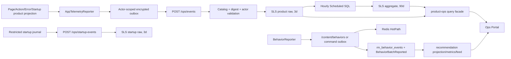

# design：event-ingestion-and-analytics

## 选型

采用单轨 `App Reporter → product-ops → SLS raw → Scheduled SQL aggregate → product-ops query facade → Portal`。
产品日志不驱动推荐；推荐继续走 `BehaviorReporter → content-service → Redis/Mongo/outbox → BehaviorBatchReported`。

明确不采用 Mongo 日志库、Elasticsearch mirror、ClickHouse、消息队列、对象存储归档、浏览器直连 SLS，
也不允许双写、fallback 或协议版本兼容信封。

## 端到端架构


```mermaid
flowchart LR
  Producers["Page/Action/Error/Startup product projection"] --> Reporter["AppTelemetryReporter"]
  Reporter --> Outbox["Actor-scoped encrypted outbox"]
  Outbox --> Ops["POST /ops/events"]
  Ops --> Validate["Catalog + digest + actor validation"]
  Validate --> SLSRaw["SLS product raw, 3d"]
  StartupJournal["Restricted startup journal"] --> StartupAPI["POST /ops/startup-events"]
  StartupAPI --> SLSStartup["SLS startup raw, 3d"]
  SLSRaw --> SQL["Hourly Scheduled SQL"]
  SQL --> SLSAgg["SLS aggregate, 90d"]
  SLSRaw --> Facade["product-ops query facade"]
  SLSAgg --> Facade
  Facade --> Portal["Ops Portal"]

  Behavior["BehaviorReporter"] --> Content["/content/behaviors or command outbox"]
  Content --> Hot["Redis HotPath"]
  Content --> Projection["rm_behavior_events + BehaviorBatchReported"]
  Projection --> Rank["recommendation projection/metrics/feed"]
  Rank --> Portal
```

## 关键边界

1. `event_catalog.yaml`、`app_pages.yaml` 由同一 codegen 生成 Dart/Go/TypeScript；App 与服务端都严格拒绝未知值。
2. 启动 journal 是启动可靠性内部事实；`app_startup` 才是产品指标，两者不可互相转发。
3. `visit_record` 是业务事实，继续用 Mongo；`EventRecord` 是短期日志事实，只用 SLS。
4. Redis 只保存幂等状态和推荐热状态，不成为产品日志明细或查询 fallback。
5. Portal 只访问 product-ops；SLS RAM 凭据只注入服务部署。

## 批次幂等状态机

```text
open events → seal canonical body → SHA-256 digest → pending
pending → synchronous PutLogs success → committed → ACK(delete)
pending → timeout/unknown → query _batchKey
  found complete → committed → duplicate ACK(delete)
  not yet observable → unavailable with recovery.action=retry; body/digest stay frozen
committed retry → duplicateBatch=true
400/422 → encrypted dead letter
```

当前 Go SDK 的 PutLogs 只有 hash key、没有 sequence id 参数；hash key 负责 shard/order，不能单独当作幂等。
因此必须以 Redis 状态和 `_batchKey/_batchIndex` 完整性确认闭合超时歧义，且 raw 查询和 Scheduled SQL 均去重。

## 部署顺序

1. 创建 Project、三 Logstore、TTL、索引、RAM、Scheduled SQL 和告警。
2. 部署 product-ops 并通过协议模拟与真实 SLS api_integration。
3. 发布 App，完成 beta/gamma UAT 后逐级 rollout。
4. beta 验证后按 runbook 删除遗留 `event_records`；代码不保留双轨期。

## 验证设计

- local_contract：目录/codegen、session/page、采样/限流/outbox、strict validator、查询权限与行为单出口。
- api_integration：可控 SLS 协议服务器覆盖成功、超时后已写、429/5xx、整批非法；真实 SLS 验证 TTL、去重与聚合。
- user_acceptance：gamma 真机覆盖冷启动、页面 open/return、生命周期换 session、断网补传、异常脱敏、推荐反馈一次生效。

## Alpha / Beta / Gamma 验证闭环设计

### 固定边界与晋级规则

| 环境 | 唯一目的 | 允许依赖 | 明确禁止 | 晋级输出 |
| --- | --- | --- | --- | --- |
| alpha | 确定性 `local_contract` | metadata/codegen、fake-SLS、miniredis、contract fixture | 云凭据、真实 SLS、Mongo/ES 日志 fallback | 可重复的协议正确性证据 |
| beta | 服务/存储/Portal 的 `api_integration` | 受控 beta SLS Project、VPC endpoint、测试 actor、只读验证 RAM | Dart mock、浏览器直连 SLS、生产 Project | 真实写入、聚合、查询、权限和 SLO 证据 |
| gamma | App 真机 `user_acceptance` | local-gamma mirror、真机、beta 同构的受控 SLS 资源、Portal | 以录制/Mock 冒充远端、绕过 outbox 直写 SLS | 用户旅程、隐私和恢复证据 |

`gamma` 的唯一目标仍为 `gamma-local`，不存在远端 gamma。若执行 runner 无法到达 SLS VPC endpoint，
gamma 只能完成协议/界面验证，不能标记为真实 SLS 验收；必须改在获批私网连通的 runner 重跑，
不能改用公网 endpoint、共享 Project 或 ES 代替。

alpha → beta → gamma 必须串行。任一环境失败时，后续环境只能诊断，不能拿定向通过的用例替代该环境的
全门证据；prod 的 5% rollout 以前必须三段均有对应输出。

### Alpha：确定性契约层

入口为 `python3 quwoquan_ops/cli/stackctl.py verify --env alpha --kind all --tier t3`，但 alpha 的遥测
实质只允许运行本地测试，不启动 product-ops 的真实 SLS writer。验收集至少包含：

1. `event_catalog.yaml` / `app_pages.yaml` 三端生成一致且二次 codegen 无漂移；未知 event、extension、
   enum、页面、时间窗口、50 条和 128 KiB 边界均双端拒绝。
2. App session/page/context/outbox：`inactive` 不换会话，`paused/hidden/detached`、登录/登出/切号换会话；
   actor 隔离、TTL、dead-letter、单飞、冻结 body/digest、断网恢复和全量 `app_startup`。
3. fake-SLS：成功、429/5xx、非法整批、PutLogs 超时但已写、重复 canonical batch；断言一批事实、
   duplicate ACK 和不重建 digest。此层允许 protocol fake，不允许任何运行时存储 fallback。
4. 安全：匿名 `/ops/events` 为 401、`/ops/startup-events` 拒绝产品/身份字段、Portal 默认掩码
   sessionId；本地 AppLog 不产生 Ops HTTP。

alpha 的入口需增加一项静态断言：虽然 `configs/alpha/config.yaml` 含 SLS 占位变量，alpha 验证路径不得
调用 `load_product_telemetry_sls`，也不得要求 Secret。当前 `avatarBaseUrl` 空 fixture 会在 alpha T3
中止，因此先修 fixture，再把该断言和完整遥测用例作为 alpha green 的必要条件。

### Beta：真实 SLS 的服务集成层

beta 在 VPC 可达的受控 runner 执行，先由受控资源流程创建独立 beta Project、三个 Standard Logstore、
字段索引、3/3/90 天 TTL、三条 Scheduled SQL、告警及最小 RAM。服务部署角色只拥有目标 Logstore 的写入与
必要查询权；验证角色必须是独立的只读 RAM，且只能读 beta Project 的目标 Logstore。两种 Secret 不可混用：

- 部署角色继续使用 `PRODUCT_OPS_SLS_*` 与 `ALIBABA_CLOUD_*`，只由部署 Secret 注入 product-ops；
- 新增 `TEST_SLS_*` 仅供受控验证 runner 查询资源和 raw/aggregate 结果，永不注入 App、Portal 或服务。

将新增一个仅由 `stackctl verify --env beta` 调度的 product-ops telemetry probe（归入
`quwoquan_ops/tests/acceptance/user_acceptance/service_ops/product-ops-service/`，不另建环境脚本）。
它使用登记的 `page_open`、`page_return`、`app_startup` 和 `runtime_exception`，以 run-id 派生的合法
`appVersion` 作为隔离维度，所有测试请求仍经 `/ops/events`，不允许测试程序直写 raw Logstore。

probe 的原子断言为：

1. 相同 canonical batch 连发两次：HTTP ACK 依次为正常/`duplicateBatch=true`；只读角色查询
   `_batchKey + _batchIndex` 后仅有一份完整 raw 记录。
2. raw 公共九字段、强类型扩展、`ingestedAt` 与 `occurredAt` 正确；startup diagnostic 与产品 raw
   分属不同 Logstore，前者不含身份/页面字段。
3. 资源 API 读取的 TTL、索引白名单、`callStack` 非索引、RAM scope 与受版本控制清单一致；错误权限
   或缺 Secret 必须 fail-closed。
4. 等待 Scheduled SQL 的闭合窗口（最长 10 分钟）后，三个聚合均可查；hourly 行没有
   `sessionId/userId/callStack/_batchKey`，同一 batch 重放不使计数翻倍。另发一条仍在 72 小时
   合法窗口内、但 `occurredAt` 属于已过去 business hour 的事件；它必须在**下一接收窗口**生成该
   business hour 的增量，Portal 汇总后恰好加一。Scheduled SQL 的 Exactly-Once 只保证任务结果
   写入不重不丢，不能替代该迟到数据语义断言。
5. Portal 只经 product-ops facade 完成 summary/drilldown；30 次预热后的测量请求满足
   summary P95 ≤ 2s、drilldown P95 ≤ 3s，响应声明 source、freshness 和实际窗口。

SLS 不确定写入（如“超时但已写”）的可控注入仍留在 alpha fake-SLS；beta 只验证真实服务的重复请求、
资源、权限、聚合和查询，避免把云网络偶发现象伪装成稳定测试。任意 beta 失败均阻断 gamma 的“真实 SLS”
签署。

### Gamma：真机用户验收层

gamma 使用 `stackctl` 启动 `gamma-local` mirror；只有完成 beta 后才注入 gamma 专用、VPC 可达的 SLS
部署 Secret。真机执行以下顺序，并由 telemetry probe 和 Portal 同时取证：

1. 冷启动至首个可交互内容：出现一条完整 `app_startup`，受限 startup journal 不含产品/身份字段；
   因 `app_startup` 为 100% 采集，正常、慢启动和 `hasError` 都必须出现。
2. 打开页面、停留、返回：形成 `page_open/page_return`；控制中心短暂 `inactive` 不换 session，
   后台/恢复、登出或切号必须换 session，Portal 默认仍掩码。
3. 断网产生事件、恢复网络：密封批次在 15 分钟内经原 body/digest 补传一次且仅一次；不得为测试
   清空或重绑旧 actor outbox。
4. 制造可控异常：1 分钟内 raw/Portal 可见，callStack 最多十层且不含路径、token 或用户输入；
   成功 HTTP、debug、AppLog 和 cache 明细不应出现在云端。
5. 曝光→点击→负反馈：BehaviorReporter/业务命令只形成一次 BehaviorSignal，HotPath、推荐指标和下次
   feed 过滤或降权一致；这条业务链不写入 Ops SLS。

验收证据应包含 stackctl report、脱敏 probe JSON、Portal 查询快照、设备型号/系统/网络、录屏或截图及
run-id。任何凭据、完整 sessionId、_batchKey、callStack 和用户键不得写入证据或指标标签。

### 必须落地的测试编排与失败处理

| 层 | 新增/收口测试 | 阻断条件 | 可接受的证据 |
| --- | --- | --- | --- |
| alpha | 真实-SLS 禁止断言、fake-SLS 协议矩阵、fixture 基线 | fixture 红、任何 Secret/云调用、单轨退化 | local_contract 输出与 codegen hash |
| beta | `TEST_SLS_*` 只读资源/查询 probe、Portal 30 次 P95、Scheduled SQL polling | TTL/索引/RAM 漂移、重复、敏感字段、SLO 超标、10 分钟无聚合 | `.qwq_output/env/beta/runs/<id>/` 的脱敏报告 |
| gamma | Patrol/真机旅程 + probe/Portal 交叉核对 | 无设备、无 VPC 连通、断网重复或丢失、隐私泄露、推荐双计 | `.qwq_output/env/gamma/runs/<id>/` 与设备证据 |

`stackctl verify --env <env> --kind all --tier t3` 负责 alpha/beta/gamma 的自动化汇总；gamma 真机旅程
作为 `user_acceptance` 追加 T4。alpha 当前的 fixture 红、beta/gamma 缺资源或设备都必须保持
`partial / GATE_BLOCK`，不得以 ES、Mongo、mock 或手工控制台截图替代。

## SLS 与 Elasticsearch 选型判定

SLS 不是 Elasticsearch。两者都有索引与查询能力，但当前产品遥测的访问模型是短留存、严格字段、
时序聚合、告警和受控 drilldown，而不是全文相关性检索。选型结论保持 **SLS 单轨**：ES 继续服务内容搜索，
不进入产品日志链路。

| 维度 | SLS（本方案） | Elasticsearch | 本项目结论 |
| --- | --- | --- | --- |
| 数据模型 | Logstore、字段索引、日志查询和 SQL 分析 | Lucene 文档索引、Query DSL、相关性/全文检索 | 九字段遥测是结构化日志，SLS 足够且更贴合 |
| 聚合与留存 | Standard Logstore + Scheduled SQL 将 3 天 raw 压缩为 90 天小时聚合 | 需自行设计 ILM、rollup/transform、索引模板与任务可靠性 | SLS 减少运行面；聚合仍需测试迟到数据与 freshness |
| 幂等 | 不替代应用幂等；保留 Redis batch state、_batchKey/_batchIndex 去重 | 可用 document id 覆盖写，但会迫使引入稳定事件/文档身份且仍要处理批次原子性 | ES 不能消除当前“超时后已写”复杂度 |
| 查询能力 | 字段过滤、时序/SQL 聚合，适合 Portal summary 与小窗口 drilldown | 全文、相关性、复杂嵌套查询和搜索生态更强 | callStack 明确不全文索引，Portal 不需要 ES 强项 |
| 运维/安全 | Project/Logstore/RAM、托管摄取/保留/告警；浏览器仍只走门面 | 需管理 cluster 容量、分片、mapping/ILM、升级和查询隔离；浏览器同样不能直连 | SLS 的服务边界更小，仍须验证 RAM/成本/配额 |
| 成本与可移植性 | 成本随摄取、索引、存储/SQL 模式变化；云服务耦合较高 | 成本随节点、磁盘、副本和运维变化；生态/API 可移植性更好 | 先以 beta 实测摄取与查询成本为准，不能凭主观估价切换 |

SLS 的代价是云厂商耦合、查询语言/生态不如 ES 的全文检索灵活，且 Scheduled SQL 需要 Standard
Logstore、正确索引、Dedicated SQL 与迟到数据策略。只有出现以下任一经量化验证的需求，才重新走一次
metadata/spec/CR 的**替换式**选型评审：raw 留存显著延长且需要任意文本检索、Portal 需要相关性/复杂
跨索引检索、SLS 在目标摄取和查询负载下无法满足 SLO/成本上限，或出现跨云可移植性硬要求。在此之前，
引入 ES 镜像或 fallback 会重新制造双轨和隐私面，属于拒绝项。
