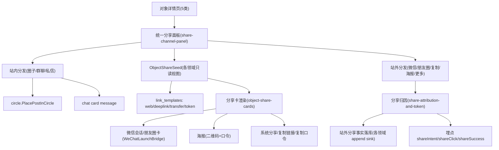
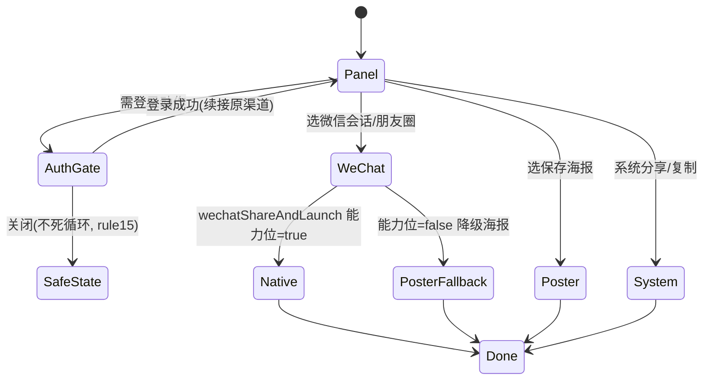

# L2 设计：outbound-share-distribution（对外分享分发）

## 1. 架构定位与数据流

分享分发是**出站编排层**，本身不持有对象数据与链接结构，而是聚合三方真相源生成对外物料。

## 2. 统一分享种子 ObjectShareSeed（跨 5 类对象的最小只读契约）

为避免每类对象各写一套分享逻辑，定义统一只读种子（由各领域 ViewModel/DTO 投影，不新增第二套数据）：

- `objectType`：post/circle/user/entity_homepage
- `objectId` / `routeKey`（post=postId、circle=circleId、user=username、entity=homepageId）
- `title` / `subtitle` / `summary`
- `coverUrl` / `avatarUrl`（缩略图源，按渠道裁剪比例）
- `statsLine`（如「1.2万赞」「3.5万成员」「128 篇作品」）
- `visibility`（public/private）
- `attributionBase`（referralSource、对象归属领域）

字段来源：内容用 `ContentSurfaceView`/`PostBaseDto.primaryVisualUrl/normalizedTitle`；圈子用 `CircleDto`（name/coverUrl/description/memberCount）；用户用 `SubAccountProfileViewData`（displayName/avatarUrl/bio/postCount）；实体用 `HomepageDetail`（title/subtitle/coverUrl/categoryTags/averageRating）。

## 3. 渠道状态机与降级

- 微信能力位缺失（未集成 SDK/Web/鸿蒙未就绪）→ 自动降级「保存海报 + 系统分享」，面板不展示死按钮。
- private 对象 → 渠道置灰并提示不可对外分享；未知或已退役 visibility 必须严格拒绝，不能回退为 public。

### 3.1 面板信息架构

内容/Post 面板使用同一个底部模态，按意图分为两区：

1. **分享到趣我圈**：先展示最近会话，再提供“圈子 / 群聊 / 私信”明确入口。圈子调用 `circle.circle_post_placement.PlacePostInCircle`；群聊和私信发送结构化 card message，不将圈子放置伪装成 Content 分享或聊天。
2. **分享到其他平台**：微信好友、微信朋友圈、复制链接、保存海报和系统“更多”横向排列。微信能力位不可用时调起系统分享作为显式降级，并告知用户。

面板顶部只保留标题和 X，紧凑预览卡用于确认当前分享对象；不再使用大面积模板说明和纵向设置列表占据主体。

## 4. 卡片/海报视觉系统（设计师口径，详规在 object-share-cards）

- 微信卡片受微信 OpenSDK 限制：标题 ≤ 一定字数、缩略图建议 5:4 或 1:1、描述简短；以「对象一句话价值 + 来源品牌」吸引点击。
- 海报为自绘 PNG：封面/头图主视觉 + 标题 + 统计亮点 + 趣窝圈品牌 + 二维码 + 口令；信息层级「视觉钩子 → 价值点 → 行动指令」。
- 所有色/距/字走设计 token，文案走 `UITextConstants`；多形态内容差异化封面策略（视频带时长角标、图文多图拼贴、文章封面+标题、动态正文+小图）。

## 5. 归因与口令（详规在 share-attribution-and-token）

- 每次分享生成 `share_id`，注入对外链接/中转页/海报二维码/口令，落库与埋点同源。
- 口令走 `share_token` 结构（短码 + 包裹文案），服务端短链表解析；面向小红书/今日头条等不支持外链或屏蔽外链的 UGC 平台。
- 归因维度对接 `event-ingestion-and-analytics/analytics-metric-dictionary`，可按渠道/对象类型/活动切分转化。

## 6. 端云一致性与测试分层

- 站外成功分享经对象专属 append sink 记录不可变事实；Post 使用 `content.outbound_share_fact.RecordOutboundShare`，不修改 Post 聚合计数。圈内放置使用 CirclePostPlacement，群聊/私信使用 Chat Message。
- Mock/Remote 一致（rule R12/R13）：分享面板与归因的 Mock 行为与 Remote 落库断言一一对应。
- 测试层：local_contract（link_templates/口令/落库 operation 契约）、local_contract（面板/卡片/海报 widget+provider）、api_integration（分享落库端云）、user_acceptance（真机微信分享+回流端到端，planned）。

## 7. 与现状的衔接（避免返工）

- 复用既有 `ContentShareTemplate`/`ContentShareSheet`/`ContentShareActions`（内容侧已落地），将其抽象为跨 5 类对象的统一面板，而非另起一套（rule R24 抽象克制）。
- 现有 `save_poster` 海报无二维码/口令，本能力补齐；现有 `system_share` 保留为渠道之一。
- 微信渠道为新增，经 NativeBridge 接入，不污染既有系统分享路径。

## 8. 三视角横切自检（运营 / 设计 / 产品）

覆盖整条 `external-acquisition-and-deeplink` Journey（含 runtime 三节点 + 本 L2 三 Story）：

### 运营（增长 / 归因）

- 归因链完整：`referralSource / share_id / utm / inviter` 端云贯穿，入站剥离后交埋点不丢（rule R21/R23）；`sessionId/feedRequestId` 语义统一。
- 可统计：埋点 `shareIntent/shareClick/shareSuccess/tokenResolved/deeplinkOpen/installAttributed` 对接 `analytics-metric-dictionary`，按渠道/对象类型/活动切分。
- SLO/KPI：分享转化率、微信内已装唤起成功率（≥95%）、安装后参数找回率（≥90%）、点击到目标页 P95（≤2.5s）。
- 灰度/回滚：微信 SDK、延迟深链 SDK、各渠道能力位可独立开关；回滚降级到「仅浏览器/下载/系统分享」，不阻断公开 Web 与出站分享。

### 设计（卡片美学 / 体验一致）

- 卡片三段式信息层级（钩子→价值→行动）、社交证明前置、品牌一致；缩略图安全过滤。
- 设计 token（`AppColors/AppSpacing/AppTypography`）+ 文案 token（`UITextConstants`/`l10n`），禁止字面量（rule R27）。
- 空/错/权限态文案跨平台同源（对齐 error-permission-display-semantics）；登录门关闭不死循环（rule 15）。
- 断点版式统一走 `AppSpacing` 断点 token（rule 14 R-XP7），微信卡/海报/PC 落地页一致。

### 产品（覆盖无盲区 / 跨平台统一）

- 体验矩阵 5 对象 × {已装/未装} × {微信(iOS/Android/鸿蒙)/系统浏览器/UGC平台/PC} 均有确定性路径，无静默失败。
- 跨平台统一路由：链接/口令/中转页单一真相源 `link_templates.yaml`，能力位驱动差异（rule 14 R-XP1/R-XP2）。
- 可见性与权限：private 不外分享、public 完整；未知或已退役 visibility default-deny，深链不绕过对象权限判断。

## 9. local_contract–user_acceptance 验收证据矩阵（一体性，rule R12）

| Journey 环节 | 节点 | 主证据 | 关键测试（planned） |
|--------------|------|--------|---------------------|
| 链接/归因/口令结构 | entity-link-templates-metadata | local_contract | link_templates_route_binding / share_attribution_params / transfer_page_token_resolution |
| 入站回流 + 微信唤起 + 延迟深链 | external-inbound-deeplink-routing | local_contract/user_acceptance | deep_link_resolver / wechat_launch_strategy / deferred_deep_link / 各能力位 profile |
| 公开 Web SEO + 中转页 + 安装转化 | public-content-web-entry | local_contract/api_integration | seo_object_pages_snapshot / transfer_page_ua_routing / install_conversion_cta |
| 分享卡片 | object-share-cards | local_contract | wechat_share_card_mapping / object_share_poster_render / 可见性 |
| 分享面板 | share-channel-panel | local_contract | object_share_panel / share_login_continuation / 可见性 |
| 分享归因 + 口令 + 落库 | share-attribution-and-token | local_contract/api_integration | share_attribution_inject / share_token_resolution / object_share_attribution_contract |
| 端到端旅程 | AppRoot UAT_EXTERNAL_ACQUISITION | user_acceptance | external_acquisition_deeplink_e2e |

一体性约束（rule R12/R13/R14）：

- api_integration 每条端云断言（分享落库、短链解析、SEO 渲染、UA 分流）在 local_contract 必须有对应 Mock 断言，Mock 与 Remote 返回结构一致。
- 新增 Remote 方法（circle/user/entity 分享落库、短链解析）必须同时补 Mock + 契约测试。
- `acceptance.yaml` 中 `tests[].file` 路径在 /dev 落地后须与磁盘一致（本次为 planned）。
