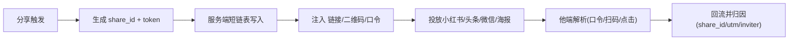

# L3：分享归因与口令（share-attribution-and-token）

> 归属：product-ops-growth / outbound-share-distribution / share-attribution-and-token

## 一、功能定位

为对外分享建立**归因闭环**与**跨 App 口令引流**：每次分享生成可追踪的 `share_id` 与 UTM，注入对外物料；面向不支持外链或屏蔽外链的 UGC 平台（小红书、今日头条评论区/正文）提供口令（淘口令式）+ 二维码 + 短链三路径，确保从任意外部触点都能回流并归因。

## 二、归因模型

- **share_id**：单次分享事件唯一 id，分享时生成，注入 web 链接/中转页/海报二维码/口令；与各对象分享落库（content/post `SharePost` 及 circle/user/entity 对齐 operation）和埋点同源。
- **UTM**：`utm_source`（渠道：wechat_session/wechat_timeline/xiaohongshu/toutiao/browser/poster_qr）、`utm_medium`（social/poster/token/qr/seo）、`utm_campaign`。
- **inviter / referral**：邀请者 subAccountId（对接 `user/invite_record` 拉新归因）、referralSource 语义来源。
- 归因维度对接 `product-ops-growth/event-ingestion-and-analytics/analytics-metric-dictionary`，可按渠道/对象类型/活动切分转化北极星。

## 三、口令机制（跨 App 引流业界做法）

结构来自 `_shared/link_templates.yaml` 的 `share_token`：

```
【趣窝圈】{对象一句话价值}「复制本条 {token} 打开趣窝圈App查看」
```

- 生成：分享侧调服务端短链表，写入 `token → {target_entity, target_id, share_id, utm, inviter}`，返回短 token。
- 投放：复制到剪贴板，用户粘贴到小红书/今日头条等平台评论区/正文。
- 识别：他人打开 App 时（在用户授权/主动粘贴场景，遵循 iOS14+/Android12+ 限制）识别 prefix/suffix 包裹 → 提取 token → 短链解析 → 还原目标 + 归因 → 交 `DeepLinkResolver` 路由。
- 三路径同源：口令 token = 海报二维码短链 `s/{token}` = 中转页 `open?token=` 可互转。



## 四、分享落库端云一致

- 内容：复用 `content/post/service.yaml` 既有 `SharePost`（游客设备维度 vs 登录账号维度独立计数），扩展携带 `share_id/utm/channel`。
- 圈子/用户/实体：在各自 `service.yaml` 新增对齐的分享落库 operation（在 metadata-cr 汇总），与 SharePost 同形态。
- Mock/Remote 一致（rule R12/R13）：分享落库与归因的 Mock 行为与 Remote 断言一一对应。

## 五、约束

- 口令/短链/中转页结构单一真相源 `link_templates.yaml`，不另写第二套（rule R06）。
- 剪贴板读取合规：仅用户主动粘贴/授权场景，隐私采集进入隐私清单与同意流程（对接 `platform-ops-governance/security-privacy-audit`）。
- 归因不丢（rule R21/R23）：`referralSource/share_id/utm` 端云贯穿；`sessionId/feedRequestId` 语义统一。
- 埋点（rule R20/R32）：`shareIntent`（面板曝光/选渠道）、`shareClick`（执行）、`shareSuccess`（落库成功）、`tokenResolved`（口令还原）、`installAttributed`（安装归因）。

## 六、验收摘要

见同目录 `acceptance.yaml`。
