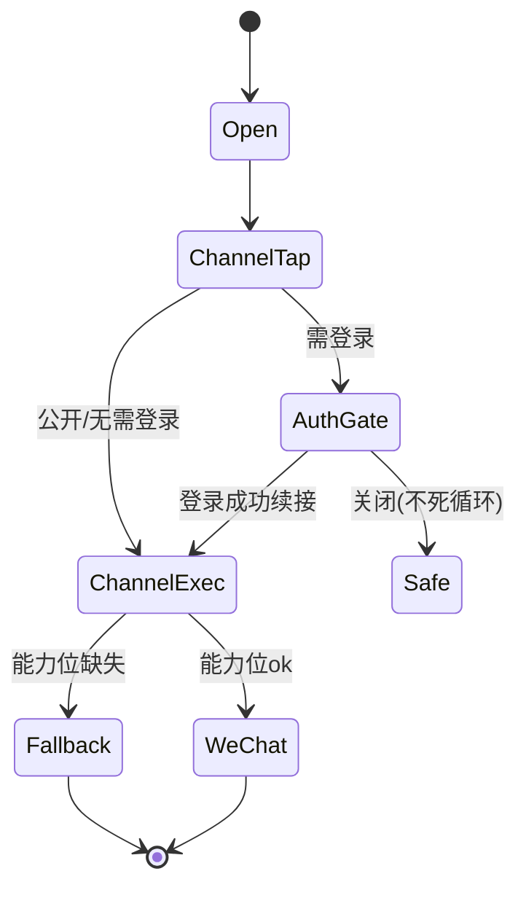

# L3：统一分享面板与渠道编排（share-channel-panel）

> 归属：product-ops-growth / outbound-share-distribution / share-channel-panel

## 一、功能定位

把 5 类对象（内容四形态、实体、用户、圈子、「我」）的分享入口统一到**一个分享面板**，编排渠道、登录门与可见性分级。复用并抽象既有 `ContentShareSheet`/`ContentShareActions`，避免每类对象各起一套（rule R24）。

## 二、渠道清单

| 渠道 | 行为 | 依赖能力位 | 降级 |
|------|------|------------|------|
| 微信好友（会话） | OpenSDK 会话卡 | `wechatShareAndLaunch` | 缺失→海报/系统分享 |
| 微信朋友圈 | OpenSDK 朋友圈卡 | `wechatShareAndLaunch` | 缺失→海报/系统分享 |
| 保存海报 | 自绘 PNG（二维码+口令） | 本地渲染 | 始终可用 |
| 系统分享 | `SharePlus` 系统面板 | 系统 | 始终可用 |
| 复制链接 | 复制 HTTPS landing/中转页 | 无 | 始终可用 |
| 复制口令 | 复制 `share_token` | 无 | 始终可用 |
| 二维码 | 展示对象二维码（短链） | 无 | 始终可用 |

- 站外默认链接为 HTTPS landing/中转页（与 `public-content-web-entry` 一致），App scheme 仅作打开目标。
- 渠道顺序与可用性由 `appDataSourceModeProvider` 透明、能力位驱动，UI 不裸用 `Platform.is*`（rule 14）。

## 三、登录门与无死循环（对齐 rule 15）

- 需账号态的分享动作（如携带个人归因/我的主页分享）走 `runWhenLoggedIn(... AuthGateReason.shareRecord ...)`。
- 关闭登录页回到安全态（面板关闭或对象详情），**不重复弹登录**；登录成功续接原渠道动作（`AuthContinuation`）。
- 纯公开对象的「复制链接/保存海报/系统分享」对游客可用，降低分享门槛。

## 四、可见性分级

- `public`：全部渠道可用。
- `circle_visible`：生成受控预览卡/链接（隐藏正文，提示加入圈子），微信/海报渠道走受控素材。
- `private`：渠道置灰并提示「该内容不可对外分享」。

## 五、交互与状态

## 六、约束

- 复用既有内容分享组件抽象为跨对象面板；不复制 mock 列表进 UI（rule R15/R16）。
- 文案/图标走 `UITextConstants`/设计 token（rule R27）；错误结构化（rule R17/R18）。
- 埋点：面板曝光、渠道点击 `shareIntent`、渠道执行 `shareClick`（详细落库归因在 share-attribution-and-token）。
- 生产纯净：release 默认 Remote，无 mock 切换入口（rule R29）。

## 七、验收摘要

见同目录 `acceptance.yaml`。
