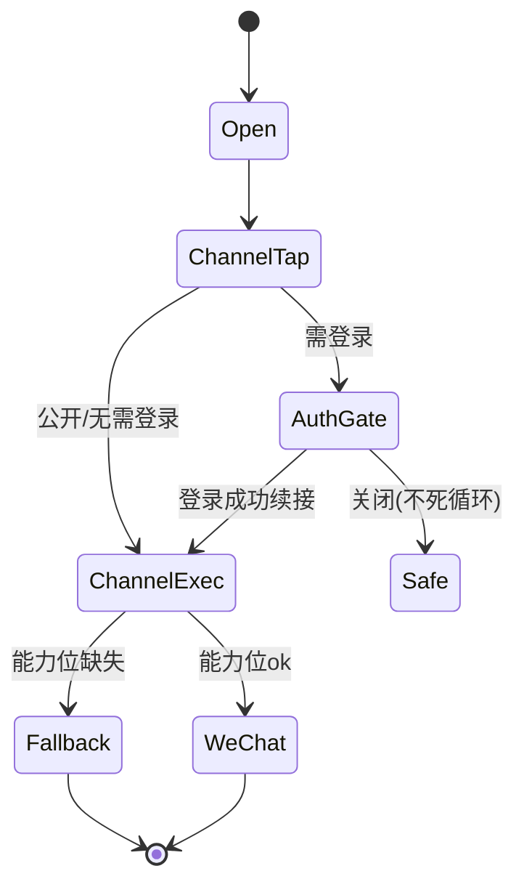

# L3 特性：统一分享面板与渠道编排（share-channel-panel）

> 归属：product-ops-growth / outbound-share-distribution / share-channel-panel

## 一、功能定位

把 5 类对象（内容四形态、实体、用户、圈子、「我」）的分享入口统一到**一个分享面板**，编排站内分发、站外渠道、登录门与可见性分级。复用既有 `ContentShareSheet`/`ForwardShareSheet` 能力，用一个内容分享编排层消除并行面板。

## 二、渠道清单

### 站内分发

| 目标 | 行为 | 真相源 | 失败恢复 |
|------|------|--------|----------|
| 圈子 | 将已发布 Post 放置到用户有权管理的圈子 | `circle.circle_post_placement.PlacePostInCircle` | 保留选择页并结构化重试 |
| 群聊 | 向已有 group conversation 发送 card message | chat conversation contract | 保留目标与附言重试 |
| 私信 | 选择联系人，必要时创建 direct conversation 后发送 card message | chat conversation contract | 保留目标与附言重试 |

### 站外分发

| 渠道 | 行为 | 依赖能力位 | 降级 |
|------|------|------------|------|
| 微信好友（会话） | OpenSDK 会话卡 | `wechatShareAndLaunch` | 缺失→海报/系统分享 |
| 微信朋友圈 | OpenSDK 朋友圈卡 | `wechatShareAndLaunch` | 缺失→海报/系统分享 |
| 保存海报 | 自绘 PNG（二维码+口令） | 本地渲染 | 始终可用 |
| 系统分享 | `SharePlus` 系统面板 | 系统 | 始终可用 |
| 复制链接 | 复制 HTTPS landing/中转页 | 无 | 始终可用 |
| 复制口令 | 复制 `share_token` | 无 | 始终可用 |
| 二维码 | 展示对象二维码（短链） | 无 | 始终可用 |

- 站外默认链接为 HTTPS landing/中转页（与 `public-content-web-entry` 一致），App scheme 仅作打开目标。
- 渠道顺序与可用性由 `appDataSourceModeProvider` 透明、能力位驱动，UI 不裸用 `Platform.is*`（rule 14）。
- Post 面板优先展示“分享到趣我圈”，然后展示“分享到其他平台”；两区共用同一预览种子和归因回调。

实施状态边界（2026-07-14）：Android 当前 NativeBridge 通过微信包名和目标 Activity 发起 `ACTION_SEND`，可用于能力探测与显式系统降级，但**不等价于 OpenSDK 卡片投递成功**。在应用签名、微信安装态、OpenSDK 配置和真机结果形成证据前，微信好友/朋友圈保持 `partial`，不得宣称商用闭环。

## 三、登录门与无死循环（对齐 rule 15）

- 需账号态的分享动作（如携带个人归因/我的主页分享）走 `runWhenLoggedIn(... AuthGateReason.shareRecord ...)`。
- 关闭登录页回到安全态（面板关闭或对象详情），**不重复弹登录**；登录成功续接原渠道动作（`AuthContinuation`）。
- 纯公开对象的「复制链接/保存海报/系统分享」对游客可用，降低分享门槛。

## 四、可见性分级

- `public`：全部渠道可用。
- `private`：渠道置灰并提示「该内容不可对外分享」。
- 未知或已退役 visibility：严格拒绝，不得按 public 或受控预览处理。

## 五、交互与状态

## 六、约束

- 复用既有内容分享组件抽象为跨对象面板；不复制 mock 列表进 UI（rule R15/R16）。
- 文案/图标走 `UITextConstants`/设计 token（rule R27）；错误结构化（rule R17/R18）。
- 埋点：面板曝光、渠道点击 `shareIntent`、渠道执行 `shareClick`（详细落库归因在 share-attribution-and-token）。
- 生产纯净：release 默认 Remote，无 mock 切换入口（rule R29）。
- 圈子入口只依赖 CirclePostPlacement typed Command Facade；Content 不保留 ShareRecord/PostDistribution transport 或第二生命周期。

## 七、验收摘要

见同目录 `acceptance.yaml`。
