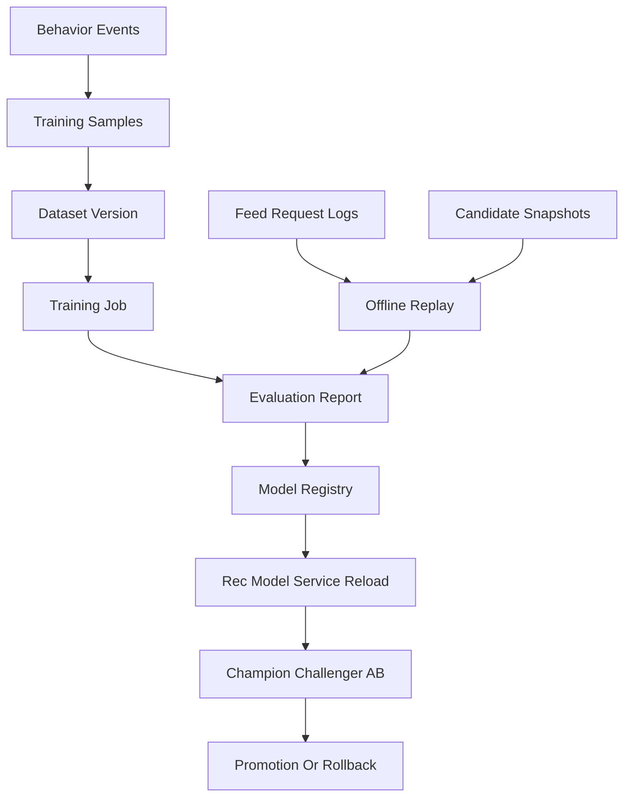

# Design: evaluation-and-flywheel

## 定位

`evaluation-and-flywheel` 是推荐平台的评估与晋升治理层。它不参与线上 feed 请求，也不拥有推荐编排；它负责把离线 replay、在线 AB 和真实流量训练晋升变成可复现、可审计、可回滚的证据链。

## 架构

## 证据链

1. 离线 replay：先证明策略不回归，输出 NDCG、Recall@K、MAP、覆盖率、多样性、校准误差。
2. 在线 AB：再用稳定分桶验证北极星和护栏指标，样本量不足或分桶漂移标记 invalid。
3. 真实训练晋升：最后用真实行为样本训练 challenger，完成评估、注册、reload 和回滚证据。

## 降级与回滚

- replay 无效：策略不得进入 AB。
- AB 无效：策略维持 challenger 或关闭实验。
- reload 失败：保留上一稳定 champion。
- 模型服务不可用：由 runtime CascadeScorer 回退 RuleScorer。

## 真相源

- SLO 与指标：`quwoquan_service/services/content-service/configs/observability/recommendation_slo.yaml`。
- 训练/推理边界：`recommendation-platform/rec-model-training` 与 `recommendation-platform/rec-model-service`。
- 深度排序模型平台轨：长期上限，不进入当前商用成熟度门槛。
