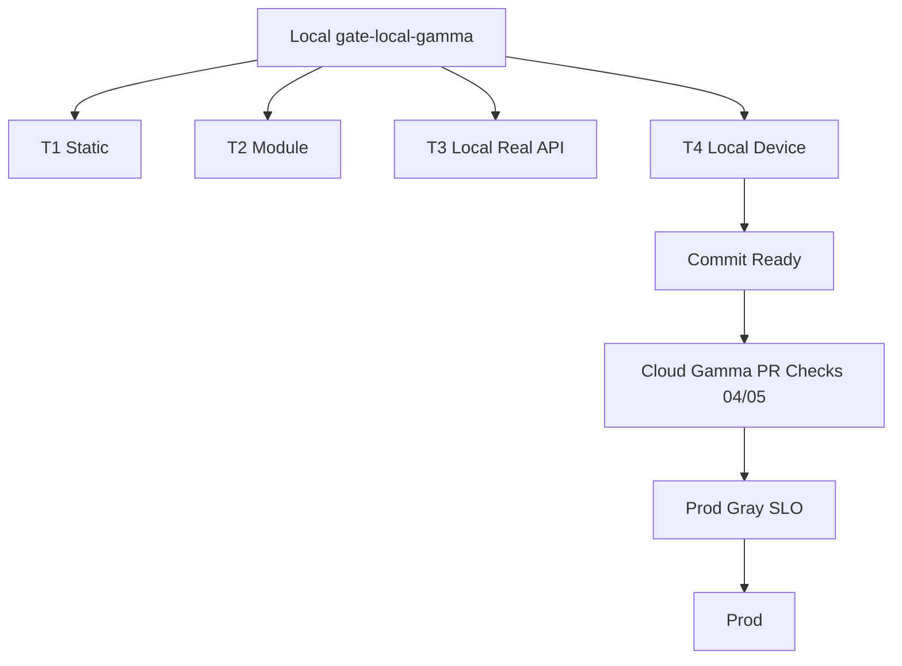

# Design: local-gamma-mirror

## 设计动因

现有流程把大量端云集成与设备旅程留到云侧 gamma 或 pre-release 后才发现问题。`local-gamma-mirror` 的目标是在提交前用本机镜像环境提前发现：

- App `gamma` remote 模式与服务 API/seed 数据不一致。
- `CONFIG_VERSION`、环境包、服务配置、DNS/TLS、媒体基址、Patrol endpoint 漂移。
- 真实存储副作用、错误响应、设备能力路径只在云端或真机阶段才暴露。

## 关键决策

### 1. 不新增第六环境

本地镜像环境是部署位置和 endpoint 差异，不是新的运行环境。

| 层 | 取值 |
|---|---|
| 服务运行时 | `APP_ENV=gamma` |
| App 运行时 | `APP_RUNTIME_ENV=gamma` |
| App 数据源 | `APP_DATA_SOURCE=remote` |
| seed manifest | `app_gamma_seed_manifest.json` |
| 本地差异 | DNS/TLS/反代/compose/本地 config snapshot |

禁止新增 `local-gamma` 配置目录、`APP_ENV` 枚举或第四份 seed manifest。

### 2. 本地 T1-T4 左移，不替代云端

本地 gate 负责提交前质量；云端 `04/05` 负责进入 `main` 前的发布真实性。



云端仍验证 K8s、Ingress/LB、Secret、云观测、真实灰度流量、SLO 与回滚。

### 3. Endpoint 单源注入

App、T3 runner、T4 runner 必须消费同一组 mirror endpoint：

- `CLOUD_GATEWAY_BASE_URL`
- `API_CONTRACT_BASE_URL`
- `API_CONTRACT_PRODUCT_OPS_BASE_URL`
- `MEDIA_AVATAR_CDN_BASE_URL`
- `MEDIA_IMAGE_CDN_BASE_URL`
- `MEDIA_VIDEO_CDN_BASE_URL`
- `MEDIA_UPLOAD_BASE_URL`

`scripts/print_app_env_dart_defines.py` 从 `quwoquan_app/configs/gamma/app_runtime.yaml` 与本地 override 生成 Flutter/Patrol 参数，避免手抄漂移。`deploy/shared/gamma_validation_suites.json` 作为 assistant/avatar 与后续业务对象核心 gamma 旅程的单源，local-gamma 与云侧 gamma 共享其 suite id 与报告口径。

### 4. 配置版本策略

`gamma` 必须有 `CONFIG_VERSION`。本地 mirror 使用 `local-gamma-v1` 作为默认配置版本，并生成符合生产标准的挂载树：

```text
artifacts/local-gamma/config-root/
├── configs/<service>/default/config.yaml
├── configs/<service>/gamma/config.yaml
└── releases/config/<service>/local-gamma-v1.yaml
```

版本快照只补齐本地启动需要的 `config.version` 与依赖 override，不改变 canonical `configs/gamma/config.yaml` 的云侧含义。

### 5. 分阶段镜像范围

第一阶段先跑通最小真实链路：

- `content-service`
- `rec-model-service`
- MongoDB
- Redis
- Postgres
- media static
- TLS reverse proxy

第二阶段补齐 `chat-service`、`user-service`、`circle-service`、`integration-service`、`entity-service`、`rtc-service` 与相关服务间 URL。任何阶段都必须输出实际覆盖范围，未覆盖域在报告中标为 `not_ready` 或 `GATE_BLOCK`。

## T1-T4 门禁设计

| 层 | 本地执行 | 通过判据 |
|---|---|---|
| T1 | `make gate`、`make verify-app-env-package`、`make verify-app-seed-manifest` | 静态、metadata、拓扑、环境包、seed 清单通过 |
| T2 | `gate_repo.sh` 内 Flutter/Go/Ops 模块测试 | Widget/Provider/Journey/模块测试通过 |
| T3 | `quwoquan_app/scripts/gamma/run_local_gamma_t3.py` | health、manifest endpoints、真实存储副作用、错误响应、RemoteRepository smoke 通过 |
| T4 | `quwoquan_app/scripts/gamma/run_local_gamma_t4.sh`（内部复用共享 `run_gamma_patrol_matrix_ci.py`） | 当前可见设备进入共享 gamma 巡检脚本并生成审计证据 |

## 报告模型

`artifacts/local-gamma/report.json` 必须包含：

- `status`: `passed|failed|gate_block`
- `commitSha`
- `configVersion`
- `imageVersion`
- `endpoints`
- `dnsTls`
- `services`
- `tests.T1/T2/T3/T4`
- `devices`
- `skipped`
- `gammaValidationSuiteRegistry`
- `cloudGateReminder`

本地设备、证书、DNS 或服务缺口导致无法验证时，状态必须为 `gate_block`，不得降级为通过。
