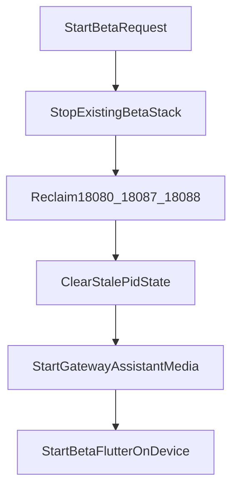

# 设计：multi-environment-instance-isolation

## 设计动因

当前端侧和本地环境脚本对“实例”与“服务栈”的边界定义不清：

- 端侧 `flutter run` 可以在多个终端里启动，但缺少统一的 `device-id`、pid、环境记录，容易留下暂停的 Flutter 进程与全局 startup lock。
- beta 手工联调脚本已有部分生命周期管理，但默认目录、端口和状态文件基本固定，容易在重新启动时遗留半挂起进程。
- gamma 的真实语义是**单套云侧服务**，但本地脚本与 runbook 未充分强调“只能切换、不能并行复制”。

本设计将“端侧多实例”与“云侧单套服务”拆开治理，避免把 App 进程并行误扩展成服务端多套。

## 关键决策

### 1. 不新增环境枚举

保持现有五环境口径不变：

| 层 | 取值 |
|---|---|
| App 运行时 | `APP_RUNTIME_ENV=alpha|beta|gamma|prod-gray|prod` |
| 服务运行时 | `APP_ENV=alpha|beta|gamma|prod-gray|prod` |
| seed manifest | 继续复用 `app_alpha_seed_manifest.json` / `app_beta_seed_manifest.json` / `app_gamma_seed_manifest.json` |

实例化只发生在启动命令、状态记录和诊断层，不引入新配置目录。

### 2. 端侧多实例只定义为“不同模拟器并行”

本次并行目标严格限定为：

- 一台开发机上，`alpha` / `beta` / `gamma` 可以分别启动到不同模拟器。
- 每个 App 实例都有唯一的 `env + device-id + pid` 记录。
- stop/list 能按环境和设备维度回收对应 Flutter 进程。

不把同一模拟器多包安装作为本次目标，因此不要求 Android flavor / iOS bundle suffix。

### 3. beta 为单套重启式切换

beta 采用固定端口和固定业务拓扑，但在启动前必须执行 stop-then-start：



这保证了：

- 任意时刻 beta 只有一套本地服务栈；
- 新启动不会和旧的 gateway / assistant / media 竞争端口；
- Flutter 也进入同一生命周期，不再成为 stop 流程的漏网进程。

### 4. gamma 为单套部署切换

gamma 有两个入口，但语义一致：

- ECS gamma：部署时清理历史实例，再启动新实例。
- local-gamma mirror：本地只保留一套 mirror，切换时先 down 再 up。

因此 gamma 的“并行”只允许是多个端侧实例同时接入同一套 gamma，而不是复制第二套 gamma 服务。

### 5. 统一实例记录模型

新增统一的 App 实例记录目录，例如：

```text
tmp/app-instances/
├── alpha/<device-id>.json
├── beta/<device-id>.json
└── gamma/<device-id>.json
```

记录至少包含：

- `env`
- `deviceId`
- `pid`
- `startedAt`
- `gatewayBaseUrl`
- `serviceMode`（`app-only` / `single-stack`）

beta / gamma 的报告需额外记录：

- `restartedFromPrevious`
- `stoppedPids`
- `reclaimedPorts`

## 入口与职责划分

### 端侧入口

- `scripts/start_app_instance.sh`
- `scripts/stop_app_instance.sh`
- `scripts/list_app_instances.sh`

职责：

- 解析 `--env` 与 `--device-id`
- 生成对应 `dart-define`
- 记录和回收 App 实例

### beta 服务入口

- `scripts/start_app_beta_manual.sh`
- `scripts/stop_app_beta_manual.sh`
- `scripts/lib/beta_manual_lifecycle.sh`

职责：

- 管理单套 beta gateway / assistant / media / flutter 生命周期
- 执行 stop-then-start
- 产出 beta manual report

### gamma 单套入口

- `scripts/start_local_gamma_mirror.sh`
- gamma ECS 部署脚本与 runbook

职责：

- 强化单套 down/up 语义
- 在报告中显式写入单套切换证据

## 测试矩阵

| 层 | 目标 | 代表验证 |
|---|---|---|
| T1 | 文档/脚本/环境包口径一致 | `acceptance.yaml` 解析、环境矩阵检查、实例隔离静态校验 |
| T2 | 启停脚本与实例记录行为稳定 | `--help` / dry-run / list/stop smoke |
| T3 | beta/gamma 单套切换成立 | beta stop/start、local-gamma down/up、端口回收与状态清理 |
| T4 | 端侧多模拟器并行成立 | alpha/beta/gamma 三个实例分别运行在不同模拟器 |

## 风险与缓解

- Flutter SDK startup lock 是全局共享资源：
  - 缓解：强制 `device-id`，避免交互式选择；stop 时显式回收 Flutter child process。
- beta 脚本已有历史残留目录：
  - 缓解：启动前清理 stale pid，报告里标记 `restartedFromPrevious`。
- gamma 可能被实现成“第二套 local-gamma”：
  - 缓解：在 spec、runbook、验证脚本中把 gamma 明确定义为单套切换。
