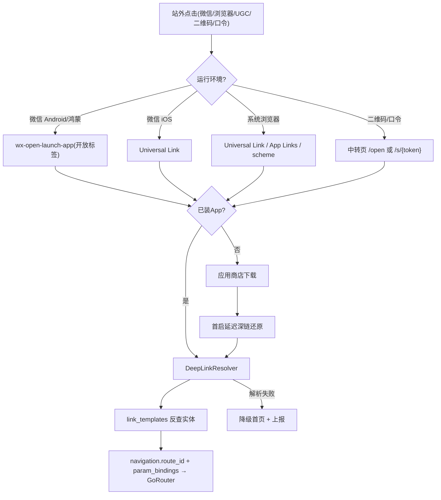

# L3：外链深链回流与微信唤起（external-inbound-deeplink-routing）

## 背景与动机

`entity-link-templates-metadata` 已把「web HTTPS / `quwoquan://` 深链 / GoRouter route」收拢为唯一结构真相源，但端侧**只能生成链接、无法接收**：

- `lib/` 无任何入站深链监听/解析器（无 `app_links`/`uni_links`），iOS `Info.plist` 无 `CFBundleURLTypes`、无 `associated-domains`，Android `AndroidManifest.xml` 只有 `LAUNCHER` intent-filter，无 `VIEW`+`BROWSABLE`、无 App Links `autoVerify`。
- 因此 `quwoquan://content/post/{id}`、`https://<origin>/post/{id}` 这类链接被分享出去后，**系统无法把用户路由回 App**，更没有「微信内打开 App」「未安装下载后还原」的能力。

本 L3 负责把「外链 → App 目标页」这条**入站回流链路**冻结为可实现规格，是 `external-acquisition-and-deeplink` Journey 的回流支柱。

## 目标

| 角色 | 目标 |
|------|------|
| 终端用户 | 在微信/浏览器/UGC 平台点击链接、海报二维码或口令后，已装直达 App 对应页面，未装下载后仍能回到原始目标 |
| 开发者 | 入站解析**只消费 `link_templates.yaml`**，反查实体 → `navigation.route_id` → GoRouter，禁止第二套「外链 path → page」表 |
| 增长/运维 | 唤起成功率、安装找回率可观测；AASA/assetlinks 等运维交付物有明确 path 输入 |

## 范围

负责：

- 冻结 iOS Universal Link、Android App Links、鸿蒙、URL Scheme 的**注册矩阵与 path 约定**（运维落地文件由本规格提供输入）。
- 冻结端侧 `DeepLinkResolver` 契约：入站 HTTPS/scheme/中转页/口令 → 反查实体 → 路由跳转 → 失败降级。
- 冻结微信内唤起策略（Android/鸿蒙 `wx-open-launch-app`、iOS Universal Link、统一兜底）与**拦截检测与可靠跳转**机制。
- 冻结延迟深链（Deferred Deep Linking）方案分层与第三方 SDK 选型决策框架。
- 冻结 `PlatformCapabilities` 新能力位与 `NativeBridge` 接口契约（遵循 rule 14）。

不负责：

- 分享侧面板/卡片/海报/口令生成（→ `outbound-share-distribution`）。
- 公开 HTML/SEO/中转页**渲染**实现（→ `public-content-web-entry`，本 L3 只定义中转页**解析契约**）。
- 链接**结构**定义（→ `entity-link-templates-metadata`，本 L3 是其消费方）。

## 技术链路

## 原生注册矩阵（设计冻结，运维与 /dev 切片落地）

| 平台 | 已安装唤起方式 | 注册项 | path/约定 |
|------|----------------|--------|-----------|
| iOS | Universal Link（首选）+ scheme（兜底） | `associated-domains: applinks:<origin>`、根部署 `apple-app-site-association`、`CFBundleURLTypes` 注册 `quwoquan` | UL paths 必须带通配符 `/*` 且**不带 query**（微信用 UL 拉起会在末尾拼接 path+参数）；建议限定 `/post/* /circle/* /u/* /homepages/* /open /s/*` |
| Android | App Links（首选）+ scheme（兜底） | `intent-filter` `VIEW`+`BROWSABLE`+`DEFAULT`、`android:autoVerify="true"`、部署 `/.well-known/assetlinks.json` | `https://<origin>` + 各实体 path；scheme `quwoquan://` host content/circle/user/homepages/open |
| 鸿蒙 | App Linking + scheme | OHOS Want/Skill 配置、Domain Verification | 与 Android 同 path 约定；能力位降级见下 |
| Web/PC | 不唤起，渲染中转页/落地页 | 无原生注册 | 走 `public-content-web-entry` |

约束：

- 原生注册的 path 集合**必须是 `link_templates.yaml` 中实体 web.path_template + transfer_pages 的并集**，禁止原生侧另写 path。
- UL/App Links 域名来自 `runtime_origin_binding`（部署/Remote Config），**不写入 Git**。

## DeepLinkResolver 契约（端侧）

输入：入站 `Uri`（HTTPS / scheme / 中转页 / 口令解析结果）。

处理：

1. 归一化：识别来源类型（universal_link / app_link / scheme / transfer_page / clipboard_token）。
2. 剥离归因：抽出 `attribution_params`（utm_*/share_id/inviter/referral）交给埋点与延迟深链归因，**不参与 route 匹配**。
3. 反查实体：用 `AppLinkTemplates`/中转页 `target_entity` 反查 `link_templates.yaml` 实体行 → `navigation.route_id` + `param_bindings`。
4. 路由：通过 `appRouterProvider`（GoRouter）跳转目标页，透传 `referralSource`、`feedRequestId`（如有）。
5. 失败降级：未知 path / 实体不存在 / 口令失效 → 降级首页或对应频道，并以 `RuntimeFailure` 上报（遵循 `10-runtime-error-cutover`）。

输出：导航到目标 GoRouter location，或确定性降级态。

约束：

- 禁止在 Resolver/Router 维护第二套「外链 path → page」映射（rule 01 §2.2.1）。
- 入站冷启动（App 未运行）与热启动（App 运行中）都必须处理；冷启动需在路由就绪后重放 pending link。

## 微信内唤起策略（2026 业界对齐）

微信容器对传统唤端方案有强拦截，必须按平台分流：

- **Android / 鸿蒙**：微信强制拦截 URL Scheme 与多数 App Links。唯一稳定方式是**微信开放标签 `wx-open-launch-app`**：
  - 前置条件：已认证服务号 + 绑定「JS 接口安全域名」+ 微信开放平台「网页跳转移动应用」关联 + App 接入微信 OpenSDK。
  - 中转落地页（`public-content-web-entry` 渲染）内嵌 `<wx-open-launch-app appid=... extinfo=...>`，`extinfo` 透传 `target_entity/target_id/归因`，App 侧由微信 OpenSDK 回调解析后交 `DeepLinkResolver`。
- **iOS**：微信内用 **Universal Link** 唤起（UL paths 带 `/*` 不带 query；微信会在 UL 末尾拼 path+参数）。
- **统一兜底**：唤起失败或环境不支持时，落地页显示「点击右上角 ··· 选择在浏览器打开」引导，浏览器内再走 UL/App Links/scheme；仍未装则进下载页。

## 微信拦截检测与可靠跳转（用户重点关切）

目标：**能唤起则进目标页，不能唤起则有确定性兜底，不出现「点了没反应」**。

- **环境探测**：中转页先识别 UA（`MicroMessenger`/iOS/Android/鸿蒙/PC）与微信版本，决定走 `wx-open-launch-app` / UL / scheme / 兜底引导。
- **唤起结果检测**：
  - iOS UL：通过微信 OpenSDK `checkUniversalLinkReady` 自检与 UL 回调判断是否成功；失败回调 → 展示兜底引导。
  - Android `wx-open-launch-app`：监听标签 `error` 事件（未关联/未安装/版本过低）→ 降级下载页或浏览器引导。
  - 通用「可见性 + 超时」探测：触发唤起后启动计时器，若页面在阈值内未进入后台（`visibilitychange`/`pagehide` 未触发）判定唤起失败 → 兜底下载页。
- **降级阶梯（确定性）**：`原生唤起` → `浏览器打开引导` → `下载页 + 延迟深链` → `web 预览（仅 public 内容）`。每一级都有明确 UI 与文案，不存在静默失败。
- **不依赖剪贴板自动读取**：iOS14+/Android12+ 已限制自动读剪贴板，口令还原走用户主动粘贴（见延迟深链）。

## 延迟深链（Deferred Deep Linking）

未安装 → 下载 → 首启还原原始目标。方案分层（按可靠性与合规组合）：

1. **Android**：Google Play Install Referrer + 华为/小米等厂商商店 referrer 回调，系统级安全通道优先。
2. **iOS**：缺官方传递接口，采用点击态设备特征（IP/UA/机型/时间窗）与首启环境指纹的**云端聚类对撞**；隐私受限时用 `UIPasteControl` 引导用户主动粘贴口令兜底。
3. **口令兜底（全平台）**：复制 `share_token` 到剪贴板，首启在用户授权下识别还原（淘口令式），合规读取。

选型决策框架（spec 给出对比，`/dev` 切片定稿，不在本规格强绑某 SDK）：

| 方案 | 找回率 | 合规风险 | 集成成本 | 适用 |
|------|--------|----------|----------|------|
| 纯自研指纹 | 中低 | 中 | 高 | 不推荐独立使用 |
| 纯剪贴板口令 | 低（系统限制） | 高 | 低 | 仅作兜底 |
| 第三方 SDK（openinstall/Branch/AppsFlyer OneLink/Adjust） | 高（95%+） | 低（SDK 处理） | 低 | 推荐作为级联兜底底座 |

约束：第三方 SDK 必须经 `NativeBridge` 防腐接口接入，UI/业务层只读「是否有 deferred 目标」，不直连 SDK；隐私采集需进入隐私清单与同意流程（对齐 `platform-ops-governance/security-privacy-audit`）。

## 跨平台能力位与 NativeBridge（rule 14）

新增能力位（`PlatformCapabilities`，业务/UI 唯一查询入口）：

- `incomingDeepLink`：是否支持接收入站深链（mobile=true，web=false，ohos=按 SDK 就绪降级）。
- `wechatShareAndLaunch`：是否支持微信 OpenSDK 分享与唤起（依赖微信 SDK 接入与平台）。
- `deferredDeepLink`：是否支持安装后还原（依赖延迟深链方案）。

`NativeBridge` 新增接口（缺失平台返回结构化 `PlatformCapabilityUnavailableException.runtimeFailure`，禁止 crash）：

- `IncomingDeepLinkBridge`：监听冷/热启动入站链接与微信 OpenSDK 回调。
- `WeChatLaunchBridge`：微信 OpenSDK 注册、UL 自检、分享与唤起回调。
- `DeferredDeepLinkBridge`：读取安装来源 referrer / 延迟深链目标 / 受控剪贴板口令。

UI 只读能力位决定「展示哪种引导/兜底」，禁止裸 `Platform.is*`/`kIsWeb`、禁止裸 `MethodChannel`（rule 14 R-XP1/R-XP2/R-XP4）。

## 数据生命周期 / 权限

- 入站打开的目标对象仍走 App 既有 visibility/审核状态判断；private 目标在未登录/无权限时进入登录门或权限态，不因深链绕过。
- 归因参数与延迟深链上下文为临时数据，声明 TTL（对齐 rule R11），首启消费后清除。

## 约束

- 入站解析单一真相源：只消费 `link_templates.yaml`，不维护第二套映射。
- URL 域名不硬编码（rule R28）；走 `runtime_origin_binding`。
- 错误结构化（rule R17/R18，`10-runtime-error-cutover`）：微信未安装、UL 未就绪、口令失效、解析失败均为 `MODULE.KIND.REASON` + recovery。
- 埋点全覆盖（rule R20/R21/R23）：`deeplinkOpen`、`deeplinkResolveFail`、`wechatLaunchResult`、`installAttributed` 携带 referralSource/share_id 不丢。

## 迁移与回滚

- 迁移：原生注册与 SDK 接入按平台分批；先 iOS UL + Android App Links，再微信开放标签，再延迟深链 SDK。
- 回滚：能力位可独立关闭（降级到「仅浏览器/下载」），不影响出站分享与公开 Web。

## L1 / L2 / L3

| 层级 | 标识 |
|------|------|
| L1 | `runtime` |
| L2 | `runtime-client-foundation` |
| L3 | `external-inbound-deeplink-routing` |

## 验收摘要

见同目录 `acceptance.yaml`；能力级状态机与跨 Story 协作见 `runtime-client-foundation` 能力设计。
