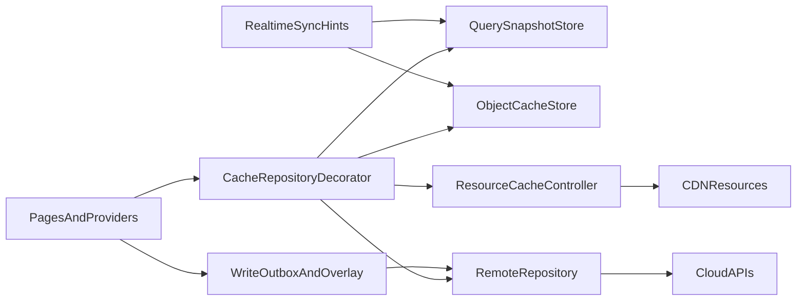

# design：local-cache-architecture

## 上游规格评审

- 本 L3 承接 `runtime-client-foundation`，定位为客户端横切基础设施，不替代内容、聊天、用户等业务域的 metadata 评审。
- 端云对象版本字段仍以 `contracts/metadata/**` 为唯一真相源；客户端只消费 codegen DTO、Repository 与 sync runtime。
- 用户缓存清理只处理可重建缓存，不删除创作草稿、待发送消息、待同步 outbox、账号凭证等不可误删数据。

## 方案对比与选型

| 方案 | 说明 | 结论 |
|---|---|---|
| A. 对象级缓存 + 查询快照 + 资源缓存分层 | 对象决定字段与资源生命周期；query 只保存对象 id/cursor；资源层只管字节复用 | 选用 |
| B. 每个页面自行缓存接口响应 | 开发快，但重复 TTL、无法统一清理、离线行为不一致 | 不采纳 |
| C. 只做图片缓存优化 | 能缓解头像闪烁，但不能降低 post/detail/query 请求，也不能保证离线回显 | 不采纳 |
| D. 首版全量 ETag/304 改造 | 协议更完整，但需要云侧大范围改造；当前可先用版本字段验证收益 | 后续评估 |

## 目标架构

## 可复用能力

| 能力 | 职责 | 业务使用方式 |
|---|---|---|
| `CacheReadResult<T>` | 统一 UI 输出合同 | Provider state 暴露该语义，不暴露底层存储 |
| `ObjectCacheStore<T>` | 内存 LRU + 持久化 + 版本戳 | 按对象类型注册 adapter |
| `QuerySnapshotStore<TId>` | query key、对象 id 列表、cursor、排序、更新时间 | feed/search/profile/circle 列表复用 |
| `ResourceCacheController` | 图片/视频/头像字节、variant、空间淘汰 | `AppCachedNetworkImage` 与媒体下载缓存调用 |
| `CacheRepositoryDecorator` | stale-while-revalidate、请求去重、后台刷新 | 包装 RemoteRepository，UI 不直接分支 |
| `CacheManagementService` | 空间统计、分层清理、保护策略 | 设置页只调用服务，不直接删文件 |
| `CacheDiagnosticsProbe` | 请求数、命中率、刷新耗时、清理数量 | T2/T3/T4 测试与门禁读取 |

## 读路径

1. Provider 请求 query 或对象。
2. `CacheRepositoryDecorator` 先读内存，再读磁盘。
3. 命中 `fresh` 时直接返回。
4. 命中 `stale` 时返回旧值并后台刷新。
5. 未命中或 `expired` 时请求 Remote。
6. Remote 返回后写对象缓存，再更新 query snapshot。
7. 资源字节由统一图片/媒体入口按 `resourceRefs` 预热或懒加载。

## 写路径

1. 用户发起赞、收藏、关注、评论、发送消息等操作。
2. 本地写入 outbox 与 overlay。
3. UI 通过 `pendingWrite` 展示 desired state。
4. Remote 幂等提交。
5. 成功后合并云端对象版本并清除 outbox 项。
6. 失败后根据 `RuntimeRecoveryPolicy` 重试、回滚或提示用户。

## 同步路径

- Realtime 只推对象 id、类型、版本、syncSeq 或 `requiresResync`。
- 客户端对比本地 `objectVersion`，过期则走 `pull diff` 或 `batch get`。
- gap 或版本缺口无法修复时，重建 query snapshot。
- 资源 URL/variant 变化只更新对象引用，旧字节由资源层自然淘汰。

## 用户清理路径

1. 设置页读取 `CacheManagementService.estimateUsage()`。
2. 用户选择清理层级。
3. 服务按引用关系和保护策略生成计划。
4. 二次确认后执行。
5. 输出清理统计并写观测事件。
6. Provider 收到清理事件后刷新可见页面；若只清理字节，不应清空对象文字。

## 迁移顺序

1. 冻结 inventory 与对象策略。
2. 收口高频图片入口到 `AppCachedNetworkImage` / 语义 wrapper。
3. 新增内容域 `PostObjectCacheService` 与 `ContentQuerySnapshotStore`。
4. 接入 discovery feed、article/photo/video detail、profile/circle/search query。
5. 增加 `CacheManagementService` 与设置页入口。
6. 增加 sync/freshness 协议测试与请求数门禁。
7. 评估是否进入 ETag/304 二阶段。

## 观测

- cache hit/miss：按对象类型、query surface、资源 preset 维度统计。
- network suppression：重复打开/滚动/切 tab 的 GET 次数不线性增长。
- refresh latency：stale 后台刷新耗时。
- clear cache result：清理层级、释放空间、保护对象数量。
- offline recovery：离线回显成功率。

## 回滚

- 业务 Provider 可回退到 RemoteRepository，但必须保留统一图片入口与不误删保护。
- 新增缓存表或文件结构需要支持版本号；不兼容时清理可重建缓存并回退 Remote。
- 若清理入口出现误删风险，立即隐藏入口，保留后台资源自然淘汰。
