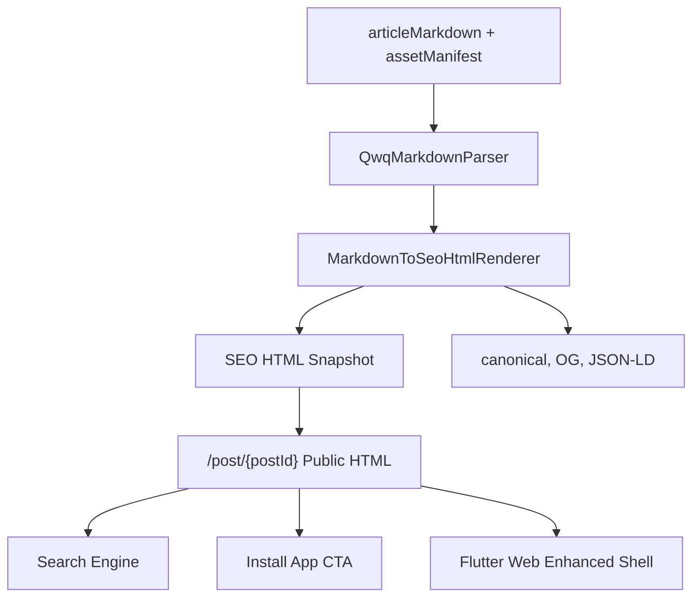

# L3：公开内容 Web 入口闭环（public-content-web-entry）

## L1 / L2 / L3 映射

| 层级 | 标识 |
|---|---|
| L1 capability | `runtime` |
| L2 journey | `runtime-client-foundation` |
| L3 scenario | `public-content-web-entry` |

## 目标

建立“搜索引擎 -> 公开 HTML 内容页 -> PC 精美内容浏览 -> 轻社交/搜索 -> 安装 App 转化”的公开内容 Web 入口闭环。Web PC 是公开内容和搜索引擎引流入口，不是完整 App 复制品。

## 范围

负责：

- 冻结公开 Web URL、App deep link、Flutter route 的同源关系。
- 冻结 Markdown 作为内容真相源、HTML 作为 SEO 派生投影的边界。
- 定义公开 HTML SEO 输出合同：canonical、OG/Twitter card、JSON-LD、robots、sitemap。
- 定义 PC Pinterest 风格内容发现、搜索、详情与安装转化体验。
- 定义首批开发验收：分享 HTTPS 同源、Markdown-to-SEO-HTML renderer 骨架与快照测试。

不负责：

- 完整 PC masonry 首页视觉落地。
- 完整 SSR/静态 public web 服务上线。
- 创作、私信、RTC、复杂登录后社交闭环桌面化。

## 核心原则

- `articleMarkdown` 是长文唯一内容真相源。
- HTML 只能由 `articleMarkdown + articleAssetManifest + articleRenderProfile` 派生，不能成为作者或业务维护的第二正文。
- 站外分享默认 HTTPS 公共链接；App scheme/deep link 只作为打开 App 的目标。
- URL path 结构来自 `quwoquan_service/contracts/metadata/_shared/link_templates.yaml`，禁止 Web 层手写第二套 `/post/...`。
- 公开 HTML 与 App 详情使用同一 visibility / 审核状态判断。
- PC Web 的 route、surface、埋点语义与 App 同源；差异只允许出现在布局密度、导航壳、hover/快捷键增强。

## 当前断点

| 断点 | 现状 | 处理 |
|---|---|---|
| 内容命名 | `ContentSurfaceView.contentHtml` 实际不代表正式 HTML 正文 | 冻结为既有命名，后续重命名或迁移，不作为 SEO 真相源 |
| 分享链接 | 分享 Sheet `copy_link` 复制 `quwoquan://`，沉浸页复制 HTTPS | 分享模板新增 HTTPS landing URL，默认复制/分享 HTTPS |
| SEO 输出 | 无公开 HTML、robots、sitemap、OG/JSON-LD/canonical | 建立 Markdown-to-SEO-HTML renderer 与 public web 服务设计 |
| PC 体验 | 只有顶部安装提示与内容宽度约束 | 后续补 PC header、masonry、详情 right rail、文末 CTA |

## 技术链路

## Markdown -> SEO HTML 合同

输入：

- `articleMarkdown`
- `articleMarkdownDigest`
- `articleAssetManifest`
- `articleRenderProfile`
- post 公共字段：`postId`、`title`、`summary`、`coverUrl`、`author`、`createdAt`、`visibility`

输出：

- `SeoHtmlDocument.html`
- `SeoHtmlDocument.title`
- `SeoHtmlDocument.description`
- `SeoHtmlDocument.canonicalUrl`
- `SeoHtmlDocument.openGraph`
- `SeoHtmlDocument.jsonLd`
- `SeoHtmlDocument.referencedAssetUrls`

允许渲染的 Markdown 块：

- heading / paragraph / orderedItem / bulletItem / quote
- image / figure / gallery
- callout / card
- codeBlock（转义文本，不执行）
- horizontalRule

安全要求：

- Markdown parser 已禁止任意 HTML；renderer 仍必须对全部文本做 HTML escape。
- URL 只允许 `https://`、站内相对路径、解析后的 CDN 资产 URL。
- 不允许注入 `<script>`、inline event handler、未知标签。

## 公开 URL 与链接合同

| 场景 | 链接 |
|---|---|
| 站外复制/系统分享 | `AppPublicContentLinks.postWebUrl(postId)` |
| App 打开目标 | `AppLinkTemplates.postAppDeepLink(postId)` |
| public HTML path | `_shared/link_templates.yaml` 的 `post.web.path_template` |
| canonical | `PUBLIC_WEB_BASE_URL + post/{postId}` |

## PC 体验规格

### 首页 / 频道页

- 顶部 PC header：品牌、全局搜索框、频道导航、下载 App CTA。
- 主体 Pinterest masonry：图片、视频、文章卡按视觉权重混排。
- 右侧 rail：热门话题、推荐圈子、下载 App 小卡。
- hover 操作：分享、收藏、打开 App；默认卡面保持干净。

### 搜索页

- 搜索框常驻顶部。
- 首屏以内容瀑布流为主，圈子、用户、话题作为辅助分组。
- 搜索引擎落地页可静态展示 query 相关内容，进入交互后加载 Flutter Web。

### 内容详情页

- SEO HTML 首屏可读：标题、摘要、封面、作者、正文前几段。
- PC 详情正文宽度 720–820，整体内容容器与右栏不超过 Web 主内容宽。
- 右栏：作者卡、相关内容、下载 App 小卡。
- 安装引导：顶部 slim banner、右栏下载卡、文末 CTA；不使用强遮罩。

## 安装转化

- 手机/Pad Web：直接下载 App + 分享安装页。
- PC Web：选择 iPhone/iPad、Android/鸿蒙安装入口 + 分享安装页到手机/微信。
- 下载 URL 走 `CloudRuntimeConfig` 与 `--dart-define`，不在组件硬编码安装包地址。

## 首批开发验收

- 分享模板同时含 HTTPS landing URL 与 App deep link。
- `copy_link` / `system_share` 默认使用 HTTPS landing URL。
- Markdown-to-SEO-HTML renderer 能输出安全 HTML、canonical、OG、JSON-LD。
- Snapshot 覆盖 heading、paragraph、figure、gallery、callout、HTML escape、权限过滤。
- 规格与 `cross-platform-portability` 保持一致。

## 设计文档

- [公开 HTML 服务 / 静态层设计](./public-html-service-design.md)
- [PC Pinterest 内容壳设计](./pc-pinterest-shell-design.md)
