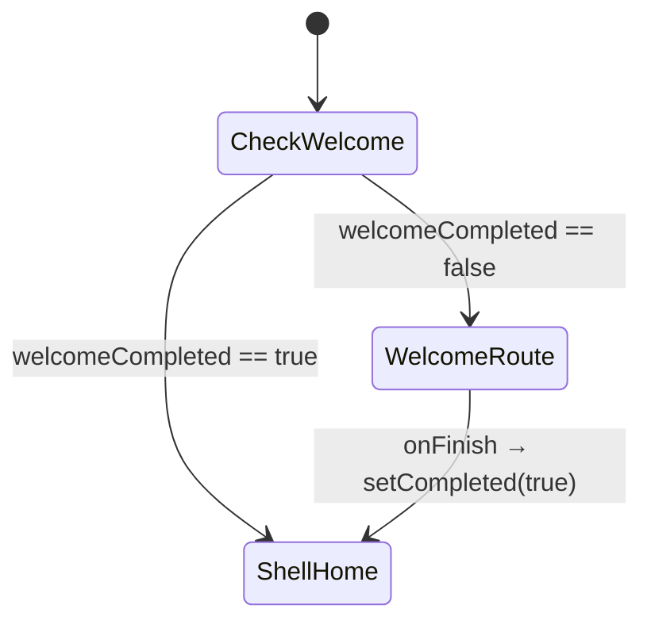

# design：unified-app-page-access

## 方案对比

| 方案 | 说明 | 结论 |
|------|------|------|
| **A. 欢迎并入 GoRouter + redirect** | 全应用单一 `MaterialApp.router`，欢迎为 `/welcome`，Observer 自动 open/return | **选用** |
| B. 保留双 MaterialApp，仅抽 Welcome mixin | 仍绕开根 Observer，需继续手写或第二 Observer | 不采纳 |
| C. 每页手写 pageAccess | 覆盖全但侵入最大 | 不采纳 |

## 路由与状态机（方案 A）

- **`GoRouter.redirect`**（或等价 `refreshListenable`）：  
  - `welcomeCompletedProvider == false` 且 **`matchedLocation` 不是 `/welcome`** → **`return '/welcome'`**（或带 query 的保留策略见实现）。  
  - `true` 且用户落在 `/welcome` → **`return AppRoutePaths.home`**（避免完成后仍停在欢迎）。
- **`initialLocation`**：`false` → **`/welcome`**；`true` → **`/`**（与现「进主壳默认首页」一致）。
- **Observer**：沿用 **`AppPageAccessNavigatorObserver.instance`**；**`routeLocationFromSettings`** 依赖 **`RouteSettings.name`**，须与 **GoRouter** 产出一致（与现全屏页一致）。

## 欢迎页实现要点

- **`WelcomeScreen`**：**仅 UI + `onFinish`**；**不再**持有 **`pageVisitId` / `writeAppPageAccess*`**。
- **`onFinish`**：仍调用 **`welcomeCompletedProvider.notifier.setCompleted(true)`**；由 **redirect** 将栈迁出 `/welcome`。
- **主题 / 外观**：与现 **`wrapWithQuwoquanAppAppearance`** 一致，在 **`MaterialApp.router` 的 `builder`** 中挂载（与 **`QuWoQuanApp`** 对齐）。

## 全表面覆盖（与 `coverage-surfaces.md` 一致）

| 类别 | 机制 | dev 验证 |
|------|------|----------|
| **壳 Tab** | `MainAppShell` open/return | 已有 |
| **GoRouter 顶层页** | Observer + `settings.name` | 已有；补 `/welcome` |
| **子 Navigator 全屏** | 同根栈时 Observer 仍回调；**须 `RouteSettings.name)`** | **逐文件核对** `Navigator.push` / `CupertinoPageRoute` / `MaterialPageRoute` |
| **仅 Overlay / Sheet** | 无独立 route name 的不计「页面 open」；若产品要求计次，另用 **engagement** 事件 | 文档登记 |

### 高风险嵌套 push（须在 /dev 中补 `name` 或改 `context.push`）

包括但不限于（以仓库检索为准，**完整清单见 coverage-surfaces.md**）：

- `assistant_conversation_page.dart` — 多处 `CupertinoPageRoute`
- `create_page.dart` — 多 `MaterialPageRoute` / `CupertinoPageRoute`
- `assistant_chat_settings_page.dart` — `CupertinoPageRoute`
- `circle_shell.dart` — `CupertinoPageRoute`
- `create_media_picker_page.dart` — `MaterialPageRoute`
- `global_surface_actions.dart` — `CupertinoPageRoute`（须与登记 path 一致）

**约定**：优先 **`context.push(AppRoutePaths.xxx)`**；必须自定义 `PageRoute` 时 **`settings: RouteSettings(name: '...')`**，且 `name` **与 `app_routes` 或 `page_access_route_registry.dart`（若新增）一致**。

## `pageName` 映射

- **实现**：在 **`page_access_log_util.dart`**（或 **`page_access_display_names.dart`** 生成文件）维护 **`location` → `pageName`**：  
  - Tab 路径：沿用 **`mainTabFromLocation`**。  
  - 其余：按 **`AppRoutePaths` 静态 path 与 path template 前缀** 映射到稳定 snake_case / 产品名，**禁止**默认落 **`route_unknown`**（未知路径可 **`route_unregistered`** 并打 **warn 日志** 倒逼登记）。
- **带参数 path**：如 `/article/123` → 映射 key 可用 **matched path pattern** `/article/:id` 或 **segment 前缀** `/article`**，保证同一类页 **同名**。

## 后续切片（非本 baseline 阻塞）

- **`currentPageVisitIdProvider`**：供页内 engagement 复用 visit。
- **`verify_page_route_settings_name.py`**：CI 扫描 `CupertinoPageRoute`/`MaterialPageRoute` 无 `settings.name`（allowlist 收紧）。

## 观测与回滚

- **观测**：抽样日志中 **`event: open|return`** 的 **`route` / `pageName`** 分布；欢迎流 **无双 open**。  
- **回滚**：revert `app_router` / `quwoquan_app_shell` / `WelcomeScreen` / util。
