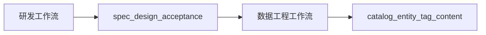

# 应用数据生成工作流（geo-content-trinity）

## 1. 定位

本文档定义**数据工程运行工作流**，用于驱动：

- 地理目录候选层
- 实体层
- 标签层
- 图文下载 / 审核 / 加工 / 发布
- 反馈与回写

它与产品研发主线 `explore → prd → design → dev → verify → commit` 的关系是：

- 研发主线负责**定义与演进**数据工程能力、schema、规则、门禁
- 数据工作流负责**执行并产出数据**

## 2. 阶段总览

| 阶段命令                       | 中文名       | 核心目标                                               |
| -------------------------- | --------- | -------------------------------------------------- |
| `data explore`             | 数据规格探索阶段  | 收敛范围、地域、实体类型、合规边界                                  |
| `data baseline`            | 数据规格基线阶段  | 冻结数据专题文档、schema 与配置骨架                              |
| `data build-entities-tags` | 生成实体和标签阶段 | 构建目录候选层、实体表、标签表                                    |
| `data download`            | 下载与来源发现阶段 | 生成 crawl spec、authority pool、source pool 并 hydrate |
| `data process-content`     | 图文加工阶段    | 审核来源、加工图文、生成前复核                                    |
| `data publish`             | 发布与反馈阶段   | 发布 package、执行门禁、抽取反馈与回写提案                          |

辅助脚本：

- `bash quwoquan_data/scripts/util/reset_quwoquan_data_runtime_full.sh`
- `bash quwoquan_data/scripts/e2e/run_province_e2e.sh`（泛化省级 E2E，默认四川）
- `bash quwoquan_data/scripts/e2e/run_province_full_batch.sh`（泛化省级全量批次，默认四川）
- `python3 quwoquan_data/tools/geo/list_admin_slices_overpass.py`（自 Overpass 枚举 `scope.slices` 供 `geo_catalog_config` 检入）

## 3. 阶段定义

### 3.1 `data explore`

**输入**

- 用户 query / regions / entity_types
- 既有 spec（可选）

**输出**

- `data_exploration_brief.md` 或等价 JSON 摘要
- 范围清单
- 风险与待澄清问题

**准出**

- `DATA_EXPLORE_READY` 或 `GATE_BLOCK`

### 3.2 `data baseline`

**输入**

- 数据专题 `spec.md`
- 数据专题 `design.md`
- 数据专题 `acceptance.yaml`
- `geo_catalog_config.yaml`
- `entity_naming_rules.yaml`
- `geo_band_rules.sichuan.yaml`（或与 catalog 中 `geo_band_rules_path` 一致的文件；与 `--catalog-config` 同传时由 CLI 校验路径一致）

**输出**

- 基线文件存在性确认
- lint / schema 校验结果

**准出**

- 类型、label、目录候选层/实体层边界、工作流关系写清

### 3.3 `data build-entities-tags`

**内部原语**

- `build_geo_poi_catalog`
- `merge_overpass_poi_catalog`
- `crawl tag-catalog-build`
- `crawl entity-catalog-build`

**输出**

- `runtime/seed/*_catalog.ndjson`
- slice 报告
- `runtime/seed/entity_catalog/semantic_cluster_candidates.ndjson`
- `runtime/seed/entity_catalog/semantic_cluster_pending.ndjson`
- `runtime/seed/entity_catalog/*.ndjson`
- `runtime/seed/tag_catalog/*.ndjson`

**一致性要求**

- `catalog` 是**目录候选层**，不是实体表
- 每条 `catalog` 候选都必须落入 `standalone / member / alias / parallel_entity / reject / pending_review`
- `entity_catalog` 中的 `topicId`、`canonicalName` 与 catalog 同源，且只接受 `standalone` 与显式 `parallel_entity`
- `member` / `alias` 行不得继续平铺进顶层实体；`pending_review` / `reject` 不得升格
- **R7 准入**：权威轨与图文证据轨择一或组合须满足 `spec.md` / `design.md`；证据不足不得升格
- `tagRefs` 可解析到 `tag_catalog`
- 目录/脚本层只负责噪声抑制与结构化准备；页面内 `main_entity / members / aliases` 提取统一走编程助手 extraction 主线

**辅助回放**

- 若需把下载/归一化支线收口为 publishable entity 主线，按顺序执行：
  - `data normalize-compile-entities`
  - `data entity-catalog-materialize`
- `entity-catalog-materialize` 产物才是 normalization 主线的 publishable entity 真相源。

**准出**

- 国内 `label_zh` 覆盖率通过
- `entityId` 无重复
- 目录行到实体行映射抽样通过

### 3.4 `data download`

**内部原语**

- `crawl instruction-build`
- `crawl entities-by-tag`
- `crawl spec-build`
- `crawl authority-sync`
- `crawl authority-review`
- `crawl pool-bootstrap`
- `crawl spec-discovery`
- `crawl fetch-source`
- `crawl content-discover`
- `crawl content-hydrate`

**输出**

- `instruction_profile.json`
- `runtime/specs/*.yaml`
- `authority_pool.ndjson`
- `source_pool.ndjson`
- `pages/**/source.md`

**一致性要求**

- `article_topic_catalog_ref` 指向 seed topic catalog，仅服务下载 / hydrate / 发现
- `publishable_topic_catalog_ref` 指向 normalization/materialize 后的最终 topic 切片，仅服务 deep batch `process-content/publish`
- authority / content 标题、URL、snippet 与实体锚点同源
- **post 聚类新点**：仅当满足「≥2 独立文章 + 无实质冲突」时可写入实体层；否则停在候选池或 `evidence_pending`

**准出**

- `validate_crawl_spec`
- hydrate 失败率日志低于阈值

### 3.4A `data build-entities-tags --phase normalize-*`

通过 `--phase` 参数控制归一化的各个阶段：

- `--phase normalize-prepare`：准备编程助手输入 + 生成任务清单
- `--phase normalize-validate`：校验编程助手结果（支持 `--stage extract|review|authority|escalate`）
- `--phase compile`：编译归一化结果
- `--phase materialize`：物化到 entity_catalog

辅助命令（编程助手自检用）：`normalize-build-review-input`、`normalize-build-authority-input`、`normalize-build-escalation-input`、`normalize-validate-output`

**一致性要求**

- CLI 不直接调用模型；只负责校验结果、生成编程助手任务清单，并在结果缺失时 fail-fast
- 结果未落盘时，省级 deep batch 必须 fail-fast，而不是继续 `process-content`
- materialize 后，必须重建 `publishable_topic_catalog_ref`，供 deep batch 消费

### 3.5 `data process-content`

**内部原语**

- `crawl content-review`
- `crawl compose-post`
- `crawl review-generated`

**输出**

- 审核后 source pool
- `compose_summary.json`
- `audit_summary.json`

**一致性要求**

- deep batch 只允许消费 `publishable_topic_catalog_ref` 中的 topics；不得再直接消费 seed topic catalog
- 图文标题、snippet、正文锚点命中实体 canonical / `label_zh`
- 不产生未回写的第二套展示名
- **精品子集**：按 acceptance A17 对约 30% 来源打 `curated` / `contentTier` 或等价标记（可与规则分、人工抽检组合）

**准出**

- content-review schema 正确
- 图文与实体锚点一致

### 3.6 `data publish`

**内部原语**

- `crawl publish-approved`
- `crawl feedback-extract`
- `crawl feedback-verify`
- `quwoquan_data/scripts/verify/verify_quwoquan_data_source_authenticity.py`
- `quwoquan_data/scripts/verify/verify_quwoquan_data_post_packages.py`

**输出**

- `publish/**`
- feedback ndjson
- verification reports

**一致性要求**

- package manifest 中实体、标签、来源 URL 可回链
- feedback 若产生回写，应输出 diff 提案

**准出**

- authenticity / package 通过

## 4. 阶段可调与版本绑定

允许在任一阶段调整：

- 地理范围
- 中文实体类型子集
- `pool-bootstrap` 预算
- discovery / hydrate / publish topic 子集

但每次变更必须：

1. 递增配置版本号或记录配置 hash
2. 明确需要重跑的下游阶段
3. 不能在未重写上游产物时假定下游仍一致

## 5. 阶段门禁优先级

1. **脚本准出**
2. **Schema / lint**
3. **编程助手自检告警**

编程助手自检只作为告警，不替代门禁。