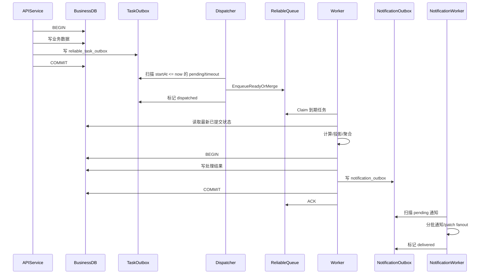
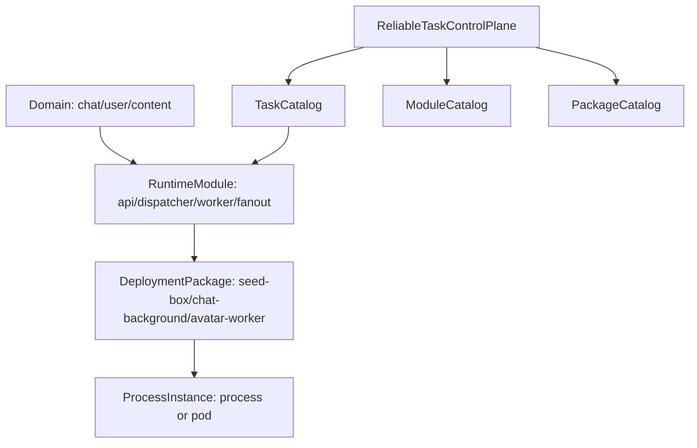

# 可靠异步任务通道设计

## 1. 定位

`reliable-async-task-channel` 是 `runtime-messaging` 下的公共能力，用于承载所有需要最终完成的异步任务：

- 任务不能因为进程崩溃、队列失败、下游超时而静默丢失。
- 任务允许重复投递，但业务处理必须幂等。
- 任务可以延迟执行，并且同一业务对象的高频请求可以合并，避免性能风暴。
- 任务处理成功必须以“结果已事务性落库”为准；结果落库后，下游通知也必须事务性入库并可恢复投递。

本能力不是群头像专用。群头像重算、头像 patch fanout、群成员名册投影、inbox 投影、搜索索引刷新、通知 fanout 等都应复用同一通道。

## 2. 核心不变量

1. **Outbox 是消息事实源，队列只是执行索引。**
  业务事务提交时，必须同时提交业务数据与 `reliable_task_outbox`。即使队列投递失败，任务意图仍在数据库中，可由 dispatcher 恢复投递。
2. **数据库负责持久延迟，Redis/MQ 不负责长时间干等。**
  `startAt` 未到期的任务保留在数据库事实表中。dispatcher 只扫描 `startAt <= now` 的到期任务，并在到期时投递到 ready 执行索引。
3. **业务代码禁止直接投递可靠任务队列，也禁止直接写 Outbox 集合。**
  业务服务只能通过 runtime 提供的受控 writer 在当前 repository transaction 中声明任务。队列写入只允许由 dispatcher 执行。
4. **payload 不能早于数据库事实，也不能携带最终详情。**
  payload 只存轻量版本提示，例如 `rosterRevision`、`maxSeq`、`sourceHashHint`。worker 必须重新读取已提交数据库状态。
5. **结果写库成功后才 ACK 任务。**
  计算成功但写库失败，不允许 ACK，必须 retry。
6. **结果写库与通知 Outbox 必须同事务。**
  不能先发通知再写库，也不能写库后靠内存直接发通知。通知请求必须进入 `notification_outbox`。
7. **通知 fanout 成功后才 ACK 通知任务。**
  部分用户失败时只重试失败用户，不阻塞其它用户。
8. **允许重复，不允许丢失。**
  dispatcher、worker、notification worker 都按至少一次语义工作，下游用 `idempotencyKey`、业务版本和唯一索引保证幂等。

## 3. 中文名词


| 名词         | 说明                                                                    |
| ---------- | --------------------------------------------------------------------- |
| 可靠异步任务     | 一条必须最终被处理的后台任务，例如重算群头像或刷新 inbox 投影。                                   |
| Outbox     | 与业务数据同事务写入的消息事实表。事务成功后，即使队列不可用，也不会丢失任务意图。                             |
| Dispatcher | 从数据库 Outbox 扫描已到期记录，并幂等投递或合并到 ready 执行索引的后台进程。                        |
| 延迟任务       | 带 `startAt` 的任务，未到时间保留在数据库事实表中，不提前进入 Redis/MQ 干等。                     |
| 合并任务       | 同一 `dedupeKey` 的数据库 pending 请求优先合并成一条，顺延 `startAt` 并合并 payload 版本提示。  |
| 幂等键        | `idempotencyKey`，用于重复投递或重复执行时避免重复副作用。                                 |
| 租约         | worker claim 任务后的处理权，包含 `leaseOwner` 与 `leaseUntil`。租约过期未 ACK 可被重新认领。 |
| ACK        | 任务处理成功后的确认删除或标记完成。                                                    |
| Retry      | 处理失败后重新投递，带退避时间，不阻塞其它任务。                                              |
| DLQ        | 死信队列。超过最大重试或遇到不可恢复错误后进入，保留失败上下文。                                      |
| 通知 Outbox  | 结果落库事务中写入的通知事实表，用于后续 sync patch / hint / fanout。                      |


## 4. 总体时序




调度结论：dispatcher 不应把未到期任务提前写入 Redis delayed 结构中等待。可行且推荐的方式是把 `startAt/maxDelayUntil` 留在数据库事实表，由 dispatcher 周期性扫描 `startAt <= now` 的到期记录，再投递到 Redis ready stream 或其它 ready 队列。Redis 只保存可重建的 ready/processing 执行索引；若 Redis 丢失，仍可从数据库状态恢复。

## 5. 数据模型

### 5.1 `reliable_task_outbox`

业务事务内写入。它是“需要发起异步任务”的事实源。业务服务不能直接写集合，只能通过 runtime writer 在当前 repository transaction 中声明任务，由 writer 完成校验、幂等键生成、task catalog 校验和持久化。

```yaml
reliable_task_outbox:
  outboxId: string
  taskType: string
  aggregateType: string
  aggregateId: string
  dedupeKey: string
  idempotencyKey: string
  payload: map<string,string>
  mergePolicy: object
  firstRequestedAt: timestamp
  startAt: timestamp
  maxDelayUntil: timestamp
  status: pending|dispatching|dispatched|failed
  dispatchAttempt: int
  dispatchLeaseOwner: string
  dispatchLeaseUntil: timestamp
  lastError: string
  traceId: string
  createdAt: timestamp
  updatedAt: timestamp
```

索引要求：

- `idx_task_outbox_status_start_at(status, startAt)`
- `idx_task_outbox_dispatch_lease(status, dispatchLeaseUntil)`
- `uniq_task_outbox_idempotency(idempotencyKey)`
- `idx_task_outbox_dedupe(dedupeKey, status)`

### 5.2 `reliable_async_task`

可靠队列的持久任务执行账本。它记录已经到期并被 dispatcher 投递过的任务、处理中租约、重试等待、完成和死信状态。Redis 只缓存 ready/processing 执行索引，不能成为唯一事实源。

```yaml
reliable_async_task:
  taskId: string
  taskType: string
  aggregateType: string
  aggregateId: string
  dedupeKey: string
  idempotencyKey: string
  payload: map<string,string>
  firstRequestedAt: timestamp
  startAt: timestamp
  maxDelayUntil: timestamp
  attempt: int
  maxAttempts: int
  nextAttemptAt: timestamp
  status: ready|processing|retry_wait|done|dead
  leaseOwner: string
  leaseUntil: timestamp
  priority: int
  lastError: string
  traceId: string
  createdAt: timestamp
  updatedAt: timestamp
```

索引要求：

- `idx_task_status_next_attempt(status, nextAttemptAt, priority)`
- `uniq_task_dedupe_active(dedupeKey)`：只约束 ready/processing/retry_wait 语义，可由逻辑或部分索引实现。
- `uniq_task_idempotency(idempotencyKey)`
- `idx_task_lease(status, leaseUntil)`

### 5.3 `notification_outbox`

业务结果事务内写入。它是“结果已变更，需要通知下游”的事实源。

```yaml
notification_outbox:
  notificationId: string
  notificationType: string
  aggregateType: string
  aggregateId: string
  dedupeKey: string
  idempotencyKey: string
  payload: map<string,string>
  recipientsQuery: object
  status: pending|dispatching|dispatched|failed|dead
  attempt: int
  maxAttempts: int
  leaseOwner: string
  leaseUntil: timestamp
  lastError: string
  traceId: string
  createdAt: timestamp
  updatedAt: timestamp
```

### 5.4 `reliable_task_dlq`

```yaml
reliable_task_dlq:
  deadLetterId: string
  sourceTaskId: string
  sourceOutboxId: string
  taskType: string
  aggregateType: string
  aggregateId: string
  payload: object
  failure: RuntimeFailure
  attempts: int
  traceId: string
  createdAt: timestamp
```

## 6. 状态机与执行索引

### 6.1 Outbox 状态机

```text
pending(startAt > now) -> pending(startAt <= now)
pending(due) -> dispatching -> dispatched
pending -> failed -> pending
dispatching(timeout) -> pending
dispatching -> failed -> pending
```

约束：

- `dispatched` 只表示已成功写入或合并到执行队列，不表示业务任务已完成。
- `pending` 未到期时只能留在数据库中等待，不进入 Redis/MQ。
- `failed` 是 dispatcher 临时失败状态，不是死信；dispatcher 必须按 backoff 重新扫描。
- 重复进入 `dispatching` 必须依赖 `outboxId` 和 `idempotencyKey` 幂等。

### 6.2 任务状态机

```text
ready -> processing -> done
ready -> processing -> retry_wait -> ready
processing(timeout) -> ready
processing -> dead
ready -> dead
```

约束：

- `ready` 只来自到期 dispatcher 投递，不承载长延迟等待。
- `retry_wait` 保存在数据库执行账本中，`nextAttemptAt <= now` 后再被投递到 ready 执行索引。
- `processing` 超时不能直接判定失败，只能回到 `ready` 等待重新认领。
- `done` 只能由 ACK 产生；ACK 前业务结果必须已事务性落库。
- `dead` 必须写入 `reliable_task_dlq`，保留可人工恢复的上下文。

### 6.3 Notification Outbox 状态机

```text
pending -> dispatching -> dispatched
pending -> dispatching -> failed -> pending
dispatching(timeout) -> pending
failed(maxAttempts) -> dead
```

约束：

- `dispatched` 表示通知 fanout 已完成，或失败用户已拆成独立 retry 子任务。
- 通知状态不回滚业务结果。
- notification worker 必须支持按 recipient 分片幂等。

### 6.4 Redis 执行索引

Redis 只作为 ready/processing 执行索引，不作为唯一事实源，也不承载长时间 delayed waiting。

```text
rt:{channel}:ready              STREAM ready task id stream
rt:{channel}:group              consumer group
rt:{channel}:task:{taskId}      HASH   task snapshot / lease / attempt
rt:{channel}:dedupe:{dedupeKey} STRING active taskId, ttl short and reconstructible
rt:{channel}:lease:{taskId}     STRING leaseOwner, ttl=visibilityTimeout
```

原子性要求：

- `EnqueueReadyOrMerge` 只接收已到期任务，必须用单个事务或 Lua 脚本完成 dedupe 查找、payload 合并和 ready 索引更新。
- `Claim` 必须同时写 `leaseOwner`、`leaseUntil` 并从 ready 可见集合中取得任务。
- `Ack` 必须校验 lease token，防止旧 worker ACK 新租约。
- `Retry` 必须校验 lease token，并把任务写回数据库 `retry_wait(nextAttemptAt)`；到期后再由 dispatcher 投递到 ready，不得阻塞 ready stream 其它任务。
- `ReclaimExpired` 必须以 `leaseUntil` 为准重新投递，不依赖消费者本地状态。

## 7. Runtime 接口规划

### 7.1 Outbox 写入接口

业务服务只依赖 Outbox writer，并且必须把 writer 注入 repository transaction。writer 是 runtime 门面，不是裸集合 DAO；它负责 task catalog 校验、payload 白名单校验、幂等键生成/校验和事务内持久化。

```go
type TaskOutboxWriter interface {
  AddTask(ctx context.Context, tx Tx, req TaskOutboxRequest) error
}
```

约束：

- `tx` 必须与业务写入同事务。
- `AddTask` 不能直接写 Redis 或 MQ。
- 业务服务不能直接 import outbox collection/store，只能依赖该接口。
- `idempotencyKey` 必填。
- payload 必须通过字段白名单校验。

### 7.1.1 Outbox 边界收敛

Outbox 不作为“每个业务服务自由写入的一张公共表”开放。它对业务层只暴露任务声明能力，对基础设施层才暴露持久化能力。

分层边界：

```text
application service
  -> ReliableTaskOutboxWriter.AddTask(ctx, tx, req)
  -> runtime/reliabletask task catalog validation
  -> infrastructure reliabletask store
  -> reliable_task_outbox collection
```

禁止：

- 业务 application 直接 import `runtime/reliabletask/internal/store` 或 Mongo collection。
- 业务 application 直接拼 outbox row。
- 业务 application 直接调用 Redis/MQ enqueue。
- 服务私有实现绕过 task catalog 新增 taskType。

允许：

- 业务 application 在业务 transaction 中调用 `AddTask` 声明任务。
- 业务 repository transaction 暴露 runtime 可识别的 `Tx` 句柄。
- infrastructure adapter 实现 outbox store，并由 runtime writer 调用。

每个 `taskType` 必须先登记：

```yaml
taskType: chat.group_avatar.recompute
aggregateType: conversation
payloadAllowlist:
  - rosterRevision
  - triggers
mergePolicy:
  delayFromNow: 1m
  maxDelay: 10m
idempotencyKey: "{taskType}:{aggregateId}:{rosterRevision}"
maxAttempts: 8
failurePolicy: retry_then_dlq
notificationPolicy: writes_notification_outbox
```

### 7.2 Dispatcher 接口

```go
type TaskOutboxDispatcher interface {
  DispatchBatch(ctx context.Context, workerID string, limit int) DispatchResult
}
```

处理规则：

1. 只选取 `status in (pending, failed) and startAt <= now` 或 `dispatching` 超时记录。
2. 事务内加锁并标记为 `dispatching`。
3. 事务外执行 `EnqueueReadyOrMerge`，只把到期任务写入 ready 执行索引。
4. 成功后事务性标记 `dispatched`。
5. 失败保留 `pending/failed`，稍后重试。

### 7.3 Reliable Queue 接口

```go
type ReliableTaskQueue interface {
  EnqueueReadyOrMerge(ctx context.Context, task ReliableTask, policy MergePolicy) error
  Claim(ctx context.Context, consumerID string, limit int) ([]TaskLease, error)
  Ack(ctx context.Context, lease TaskLease) error
  Retry(ctx context.Context, lease TaskLease, retry RetryPolicy) error
  DeadLetter(ctx context.Context, lease TaskLease, failure RuntimeFailure) error
  ReclaimExpired(ctx context.Context, consumerID string, limit int) (int, error)
}
```

### 7.4 Worker Handler 接口

```go
type ReliableTaskHandler interface {
  TaskType() string
  Handle(ctx context.Context, task ReliableTask) TaskResult
}
```

`Handle` 返回成功，只表示“业务结果和必要通知 Outbox 已落库”。如果只是计算完成但写库失败，必须返回带 `recovery.action=retry` 的 `RuntimeFailure`。

### 7.5 Notification Outbox 接口

```go
type NotificationOutboxWriter interface {
  AddNotification(ctx context.Context, tx Tx, req NotificationOutboxRequest) error
}
```

约束：

- 只能在结果写入事务里调用。
- 通知 payload 必须只包含客户端可消费字段。
- 通知 fanout 失败不能回滚已提交结果，只能 retry 通知。

## 8. 合并策略

```yaml
MergePolicy:
  dedupeKey: "{taskType}:{aggregateId}"
  delayFromNow: 1m
  maxDelay: 10m
  mergePayload:
    triggers: union
    rosterRevision: max
    maxSeq: max
    fromSeq: min
    toSeq: max
    actorIds: union
```

合并规则：

- 优先合并数据库中的 `pending` Outbox 请求；未到期请求不会进入 Redis。
- 已到期但尚未 claim 的 `ready` 执行任务可以通过 `EnqueueReadyOrMerge` 做短窗口幂等合并，但 Redis 中的合并结果必须可由数据库重建。
- `processing` 任务不抢占；如果新 outbox 到来，生成下一轮 pending 任务。
- `firstRequestedAt` 保持首次请求时间。
- `startAt = min(now + delayFromNow, firstRequestedAt + maxDelay)`。
- payload 合并后仍只是版本提示，worker 必须重读 DB。

## 9. 各阶段事务范围与失败处理

### 9.1 业务变更阶段

以群成员加入为例：

```text
BEGIN
  insert conversation_member
  update conversation.membersRosterRevision = 43
  insert reliable_task_outbox(status=pending, taskType=chat.group_avatar.recompute)
COMMIT
```

失败处理：

- 事务失败：成员未加入，Outbox 未写入，不会有异步任务。
- 事务成功后进程崩溃：Outbox 已持久化，dispatcher 可恢复投递。

### 9.2 Outbox Dispatch 阶段

```text
BEGIN
  select pending/failed outbox
    where startAt <= now
    or dispatching timeout
    for update skip locked
  mark status=dispatching, leaseUntil=now+30s
COMMIT

EnqueueReadyOrMerge(task)

BEGIN
  mark status=dispatched
COMMIT
```

失败处理：

- 标记 `dispatching` 后崩溃：`leaseUntil` 超时后重新扫描。
- `startAt > now`：dispatcher 不投递，记录继续留在数据库，不进入 Redis/MQ。
- Enqueue 失败：保留 outbox，重试。
- Enqueue 成功但标记 `dispatched` 前崩溃：下次重复 Enqueue，由 `idempotencyKey` / `dedupeKey` 合并，不丢但可能重复。

### 9.3 Worker Claim 阶段

```text
claim task:
  status ready -> processing
  leaseOwner = workerID
  leaseUntil = now + visibilityTimeout
```

失败处理：

- worker 崩溃未 ACK：`leaseUntil` 超时后 `ReclaimExpired`。
- 长任务需要 heartbeat 延长 lease；否则可能重复处理，因此 handler 必须幂等。

### 9.4 任务处理与结果提交阶段

以群头像重算为例：

```text
read latest conversation
read latest members
compute sourceHash
render avatar

BEGIN
  update conversation.avatarUrl, groupAvatarVersion, groupAvatarSourceHash
  insert notification_outbox(notificationType=conversation.avatar.updated)
COMMIT

ACK task
```

失败处理：

- 读取 DB 失败：Retry。
- 计算失败：Retry，保留旧业务状态。
- 渲染文件成功但 DB 写失败：Retry；下次用 idempotencyKey/sourceHash 跳过重复副作用或复用 objectKey。
- DB 成功但 ACK 失败：任务可能重放；worker 重新读 DB 发现 sourceHash 已完成，安全 ACK。
- DB 成功但通知 dispatcher 崩溃：notification_outbox 已持久化，后续恢复。

### 9.5 通知 Fanout 阶段

```text
BEGIN
  lock notification_outbox
  mark dispatching
COMMIT

fanout patch in batches

BEGIN
  mark delivered or write retry child notification
COMMIT
```

失败处理：

- 部分用户失败：记录失败用户子任务，只 retry 失败集合。
- 全局失败：notification_outbox 保持 pending/failed，按 backoff 重试。
- 超过上限：进入 DLQ，但不回滚业务结果。

## 10. 场景案例

### 10.1 群头像重算

触发：

- 建群后成员数可能快速变化。
- 加人、退群。
- 前 9 成员头像变化。

任务：

```yaml
taskType: chat.group_avatar.recompute
aggregateType: conversation
aggregateId: conv_123
dedupeKey: chat.group_avatar.recompute:conv_123
idempotencyKey: chat.group_avatar.recompute:conv_123:roster_43
startAt: now + 1m
maxDelayUntil: firstRequestedAt + 10m
payload:
  rosterRevision: "43"
  triggers: "members.added,user.avatar.updated"
```

要求：

- 创建群第一帧 `avatarUrl` 使用创建者个人头像。
- worker 读取最新成员，少于 2 人直接 ACK。
- 2-9 人生成组合图。
- 成功写回 `conversation.avatarUrl` 后，同事务写 `notification_outbox`。
- 不允许使用或填充旧群头像 URL 字段。

### 10.2 群头像 Patch Fanout

任务：

```yaml
taskType: sync.patch.fanout
aggregateType: conversation
aggregateId: conv_123
dedupeKey: sync.patch.fanout:conversation.avatar.updated:conv_123:v7
payload:
  patchType: conversation.avatar.updated
  conversationId: conv_123
  avatarUrl: https://avatar-cdn/.../v7.png
  groupAvatarVersion: "7"
```

要求：

- recipients 不能永久写死在 payload；fanout 时重新查询当前成员，或使用事务内冻结的 recipientsQuery。
- 部分失败只 retry 失败用户。
- patch 写入成功后再发布 realtime hint。

### 10.3 群成员名册投影

任务：

```yaml
taskType: chat.roster_projection.rebuild
aggregateType: conversation
aggregateId: conv_123
dedupeKey: chat.roster_projection.rebuild:conv_123
startAt: now + 10s
maxDelayUntil: firstRequestedAt + 2m
payload:
  rosterRevision: "43"
```

要求：

- worker 读取最新 `membersRosterRevision`。
- projection 已达到最新版本则 ACK。
- 重建成功后写 notification outbox 或 sync patch outbox。

### 10.4 Inbox 投影更新

消息发送主链路不走延迟通道，但派生任务必须走 Outbox。

```text
BEGIN
  insert message seq=1088
  update conversation.maxSeq=1088
  insert reliable_task_outbox(taskType=chat.inbox_projection.update)
COMMIT
```

任务：

```yaml
taskType: chat.inbox_projection.update
aggregateType: conversation
aggregateId: conv_123
dedupeKey: chat.inbox_projection.update:conv_123
payload:
  maxSeq: "1088"
```

要求：

- worker 读取最新消息，更新 preview/unread。
- 结果与通知 Outbox 同事务。

### 10.5 搜索索引刷新

任务：

```yaml
taskType: search.chat_index.refresh
aggregateType: conversation
aggregateId: conv_123
dedupeKey: search.chat_index.refresh:conv_123
startAt: now + 5s
maxDelayUntil: firstRequestedAt + 1m
payload:
  fromSeq: "1080"
  toSeq: "1088"
```

合并：

- `fromSeq=min`
- `toSeq=max`

### 10.6 用户头像传播

任务：

```yaml
taskType: user.avatar.propagate
aggregateType: user
aggregateId: user_001
dedupeKey: user.avatar.propagate:user_001
payload:
  avatarVersion: "12"
```

处理：

- 更新 conversation_member 头像快照。
- 找出该用户在前 9 成员内的群。
- 为这些群写 `chat.group_avatar.recompute` Outbox。
- 为联系人/会话写必要通知 Outbox。

### 10.7 通知 Fanout

任务：

```yaml
taskType: notification.app_message.fanout
aggregateType: notification
aggregateId: notice_123
dedupeKey: notification.app_message.fanout:notice_123
payload:
  targetSegment: beta_users
  templateId: tpl_001
```

要求：

- 分批送达。
- 成功用户记录 delivered。
- 失败用户生成 retry 子任务。

## 11. 模块化部署与治理

### 11.1 模型

可靠任务通道采用 `Module-first, Package-composed, Process-runs-package`。




定义：

- `RuntimeModule`：可独立启动或组合启动的运行能力，例如 `chat.task_outbox_dispatcher`、`chat.group_avatar_worker`。
- `ModuleCapability`：模块声明的能力，例如 `api`、`outbox_dispatch`、`task_worker`、`notification_fanout`。
- `DeploymentPackage`：一组模块的组合，例如 `seed-box`、`chat-background-package`、`chat-avatar-worker-package`。
- `ProcessInstance`：运行某个 deployment package 的进程或 Pod。
- `ReliableTaskControlPlane`：只管理 catalog、routing、lease、DLQ、观测与人工恢复；不扫描业务库，不参与业务事务。

约束：

- onebox 可运行多个 domain 的多个 module，但不能改变 domain ownership。
- 业务事务仍归属各 domain，本地 Outbox 不跨领域事务。
- dispatcher module 只能扫描自己 domain 的 Outbox。
- worker module 只能处理 task catalog 路由给它的 taskType。
- onebox 内 module 共享进程但不共享权限边界；store、queue、client 仍按 `domain/module` 作用域创建。
- `rec-model-service` 保持 Python 独立进程，不并入 Go `seed-box`。

### 11.2 环境实施

alpha：

- 默认独立领域服务进程，可选择单服务 all-in-one package。
- 每个 Go 服务默认可关闭 background modules；本地验证时开启对应 module。
- alpha 允许 `seed-box-local`，但不能改变 domain 唯一归属。

beta：

- 延续 `seed-box` onebox 聚合包。
- `seed-box` 至少声明 `chat`、`user`、`content`、`notification` 的模块组合，用于端云集成验证。
- beta 是模块化 onebox 主验证环境，必须覆盖任务投递、合并、worker ACK、notification fanout。

gamma / prod-gray / prod：

- 默认与 beta 拓扑一致，继续支持 `seed-box` 组合包。
- gamma 用于容量演练和拆分包演练。
- prod-gray 允许灰度启用独立 worker package。
- prod 默认先 onebox，达到容量阈值后拆分热点模块。
- 拆分只改变 package composition，不改变 domain API、Outbox 事实源和 task routing 语义。

拆分触发阈值必须进入配置或 catalog：

- ready backlog 持续超过阈值。
- outbox pending 最大滞留超过阈值。
- worker CPU/Memory 长期超过阈值。
- fanout P95 超过 SLO。
- DLQ rate 或 retry rate 异常。

### 11.3 领域服务模块矩阵


| Domain                    | 必须声明的模块                                                                                                                                                                  | 本轮接入要求                                               |
| ------------------------- | ------------------------------------------------------------------------------------------------------------------------------------------------------------------------ | ---------------------------------------------------- |
| `chat`                    | `chat.api`、`chat.task_outbox_dispatcher`、`chat.group_avatar_worker`、`chat.roster_projection_worker`、`chat.inbox_projection_worker`、`chat.notification_outbox_dispatcher` | 首批完整接入，迁移私有 group avatar scheduler/timer/local queue |
| `user`                    | `user.api`、`user.task_outbox_dispatcher`、`user.avatar_propagation_worker`、`user.notification_outbox_dispatcher`                                                          | 第二阶段接入头像传播                                           |
| `content`                 | `content.api`、`content.task_outbox_dispatcher`、`content.search_index_worker`、`content.feed_projection_worker`                                                            | 第二阶段接入非头像投影，证明公共能力                                   |
| `circle`                  | `circle.api`、`circle.task_outbox_dispatcher`、`circle.member_projection_worker`                                                                                           | catalog/config 声明，业务 worker 可延期                      |
| `assistant`               | `assistant.api`、`assistant.task_outbox_dispatcher`、`assistant.run_projection_worker`                                                                                     | catalog/config 声明，避免影响 stream/replay                 |
| `notification`            | `notification.notification_outbox_dispatcher`、`notification.fanout_worker`、`notification.delivery_retry_worker`                                                          | 明确工程归属与 recipient 账本                                 |
| `integration`             | `integration.api`、`integration.task_outbox_dispatcher`、`integration.external_retry_worker`                                                                               | catalog/config 声明，适配外部 API 重试                        |
| `entity`                  | `entity.api`、`entity.task_outbox_dispatcher`、`entity.readmodel_projection_worker`                                                                                        | catalog/config 声明                                    |
| `ops`                     | `ops.api`、`ops.task_outbox_dispatcher`、`ops.audit_projection_worker`                                                                                                     | catalog/config 声明                                    |
| `rtc/realtime/media/turn` | infra modules                                                                                                                                                            | 默认不接业务 Outbox                                        |
| `recommendation`          | `recommendation.api`                                                                                                                                                     | Python 独立进程，catalog 引用但不并入 Go onebox                 |


### 11.4 Catalog 与路由

task catalog 必须登记：

```yaml
taskType: chat.group_avatar.recompute
ownerDomain: chat
dispatcherModule: chat.task_outbox_dispatcher
workerModule: chat.group_avatar_worker
queue: reliabletask.chat.avatar
partitionKey: conversationId
payloadAllowlist: [rosterRevision, triggers]
mergePolicyRef: chat.group_avatar.recompute.merge.v1
retryPolicyRef: reliabletask.retry.standard.v1
retentionPolicyRef: reliabletask.retention.standard.v1
rateLimitPolicyRef: reliabletask.rate.chat_avatar.v1
compatibleRuntimeVersion: ">=1.0.0"
schemaVersion: 1
```

module catalog 必须登记：

- module 名称、domain、capabilities。
- required stores、queues、Redis scene、planes。
- 是否允许在 onebox 中运行。
- 是否允许独立 package 拆分。

package catalog 必须登记：

- package 名称。
- 环境。
- process/domain 归属。
- enabled modules 与 disabled modules。
- catalog version 与 runtime version。

启动规则：

- deployment package 启动时必须校验 task/module/package catalog 与 runtime 版本兼容。
- 不兼容必须 fail-fast，并输出结构化 `RuntimeFailure`。
- package 中 module 的 domain 必须属于当前 process-domain mapping。
- beta/gamma/prod-gray/prod 的 package/module mapping 必须一致，除非显式声明 prod-gray 灰度 override。

### 11.5 租约与弹性

dispatcher shard lease：

```text
leaseScope = env + domain + module + shardId
```

规则：

- API 实例不默认持有 dispatcher shard，除非 package manifest 显式启用 dispatcher module。
- dispatcher shard lease 与 worker task lease 分离。
- onebox 与拆分 worker package 可同时运行并安全竞争。
- 实例扩容时可抢空闲或过期 shard。
- 实例缩容时主动释放 lease；异常退出时由 lease timeout 接管。
- worker task lease 必须带 token，旧 lease token 不能 ACK 新租约。

### 11.6 顺序语义、背压与保留

顺序语义：

- 同一 `aggregateId` 可通过 `partitionKey = aggregateId` 获得局部顺序。
- 跨 aggregate 不承诺全局顺序，只承诺幂等最终一致。
- 对最终结果型任务，worker 必须以业务版本或 source hash 判定是否已经完成。

背压与限流：

- 按 `domain/taskType/module/priority` 限制 dispatch、claim、fanout、retry 速率。
- 低优先级 fanout 不得阻塞高优先级头像、roster、inbox 投影。
- retry storm 必须降级为延迟 retry 或 DLQ，不得挤占 ready 队列。

数据保留：

- `reliable_task_outbox`：`dispatched` 达到保留期后归档或压缩。
- `reliable_async_task`：`done` 达到保留期后归档；`dead` 保留到人工处理完成。
- `notification_outbox`：`dispatched` 达到保留期后归档；失败记录保留重放上下文。
- `reliable_task_dlq`：按 taskType 保留策略保存 `RuntimeFailure`、traceId、aggregateId、payload 摘要和恢复动作。

### 11.7 Notification Recipient Ledger

notification fanout 必须具备 recipient 级账本：

```yaml
notification_delivery_ledger:
  notificationId: string
  recipientId: string
  recipientShard: int
  status: pending|delivered|failed|dead
  attempt: int
  lastError: string
  deliveredAt: timestamp
  updatedAt: timestamp
```

规则：

- 已 delivered recipient 不重复写 patch。
- 部分失败只生成失败 recipient retry 子任务。
- notification outbox 状态为 dispatched 只表示全部 delivered，或失败 recipient 已拆分为独立 retry 子任务。
- fanout 失败不得回滚业务结果。

### 11.8 权限边界

- onebox 内多 domain module 共进程时，不能共享裸 DB client、queue client 或 store。
- 每个 module 通过 scoped provider 获取对应 domain 的 store/queue。
- package manifest 必须声明 module 权限；未声明权限访问 store/queue 必须 fail-fast。
- payload 字段继续执行 task catalog 白名单与脱敏策略。

### 11.9 Chat 私有链路迁移

`chat-service` 当前私有 group avatar recompute scheduler、timer、local queue 必须迁移到 reliable-task：

1. 保留现有行为验收：群创建默认头像、成员变化顺延、用户头像变化触发、patch fanout。
2. 新增 reliable-task taskType：`chat.group_avatar.recompute`。
3. 将现有 scheduler enqueue 改为事务性 Outbox writer。
4. worker 重读最新 conversation/member 状态并写结果 + notification outbox。
5. 移除或关闭私有 timer/local queue。
6. 门禁阻断私有 scheduler 与 reliable-task 双链路长期共存。

## 12. 实现切片规划

### S1：契约与模型

- 新增 `quwoquan_service/runtime/reliabletask` 包的接口、状态枚举、错误类型。
- 冻结 Outbox、Task、NotificationOutbox、DLQ 的 Go struct。
- 定义 payload 字段白名单与大小限制。
- 定义 task/module/package catalog 结构与版本兼容策略。

### S2：事务性 Outbox Writer

- 定义服务 repository transaction 接口。
- 实现 `TaskOutboxWriter.AddTask(ctx, tx, req)`。
- 禁止业务服务直接调用 queue enqueue。
- writer 必须校验 task catalog、payload 白名单、retention policy 与 rate limit policy。

### S3：Dispatcher

- 实现 `startAt <= now` 的 pending/timeout 扫描、dispatching lease、幂等 `EnqueueReadyOrMerge`、成功后标记 dispatched。
- 增加重复 dispatch 测试，确保不丢但可去重。
- dispatcher module 必须使用 `env + domain + module + shardId` 租约。

### S4：可靠任务队列

- 实现数据库到期任务 -> ready 执行索引搬运；未到期任务不进入 Redis/MQ。
- 实现 claim、lease、heartbeat、ack、retry、deadletter、reclaim。
- Redis 实现优先使用 ZSET + STREAM + consumer group；测试可提供内存适配。
- Redis/MQ 索引丢失后必须可由 DB 账本恢复。

### S5：Worker Runtime

- 注册 taskType -> handler。
- 统一处理 RuntimeFailure、retry backoff、DLQ。
- 提供可观测指标与结构化日志。

### S6：Notification Outbox 与 Fanout

- 实现结果事务内写通知 Outbox。
- 实现通知 dispatcher 和 fanout worker。
- sync patch fanout 接入可靠任务。
- 实现 recipient 级 delivery ledger，支持部分失败只重试失败目标。

### S7：非头像场景接入

- 先接一个非头像场景，例如 `chat.inbox_projection.update` 或 `chat.roster_projection.rebuild`，证明通道公共性。

### S8：头像场景接入

- 移除 chat-service 私有 timer / 本地队列。
- 群头像重算、patch fanout 全部走可靠异步通道。

### S9：模块化部署与门禁

- 新增 `deploy/shared/module_package_mapping.yaml`。
- 新增 `deploy/shared/reliable_task_module_catalog.yaml`。
- 新增 `deploy/shared/reliable_task_retention_policy.yaml`。
- 新增 module/package/catalog/retention/permission/migration 校验脚本。
- 接入 `make verify`、`make gate`、`gate_repo.sh --scope service`。

### 切片依赖顺序

```text
S1 契约与模型
  -> S2 事务性 Outbox Writer
  -> S3 Dispatcher
  -> S4 可靠任务队列
  -> S5 Worker Runtime
  -> S6 Notification Outbox 与 Fanout
  -> S7 非头像场景接入
  -> S8 头像场景接入
```

准入规则：

- S2 前必须完成 S1 的 schema、状态枚举和 payload 白名单。
- S3 前必须能在事务内写 `reliable_task_outbox`。
- S4 前必须有可重复执行的 queue contract test。
- S5 前必须具备 ACK 失败重放测试。
- S6 前必须具备结果写库与通知 Outbox 同事务测试。
- S7 前必须完成公共 runtime 的 T1/T2。
- S8 前必须完成至少一个非头像场景的 T3。

准出规则：

- 每个切片必须新增或更新对应 T1/T2/T3 测试，不允许只交付接口。
- 任何切片引入的状态变更必须出现在状态机文档和测试中。
- 任何新的 taskType 必须登记 payload 字段白名单、幂等键规则、合并策略和失败策略。
- 任何通知类切片必须覆盖部分 fanout 失败与恢复。

门禁规划：

- `make -C quwoquan_service test` 覆盖 runtime/reliabletask 单元与集成测试。
- 新增 `make -C quwoquan_service test-reliabletask` 作为快速本地入口。
- 新增架构检查：业务层禁止 import Redis queue adapter，业务服务只能依赖 Outbox writer。
- 新增 schema 检查：`reliable_task_outbox`、`reliable_async_task`、`notification_outbox`、`reliable_task_dlq` 必须与文档字段一致。
- 新增故障注入测试入口：dispatcher crash、worker crash、ACK failure、notification fanout partial failure。

## 13. 验证矩阵


| 层级  | 验证项                                                                 |
| --- | ------------------------------------------------------------------- |
| T1  | 合并策略、startAt/maxDelayUntil、幂等 key、retry backoff、DLQ 判定、payload 白名单。 |
| T1  | 状态机合法流转：pending -> ready -> processing -> done/dead。                |
| T2  | Outbox/Task/NotificationOutbox/DLQ schema 契约与 RuntimeFailure 字段。    |
| T2  | 禁止业务 handler 直接调用 queue enqueue 的架构测试。                              |
| T3  | 业务事务成功但 dispatcher 失败，重启后恢复投递。                                      |
| T3  | Enqueue 成功但 outbox 标记失败，重复 dispatch 不生成重复副作用。                       |
| T3  | worker 结果写库成功但 ACK 失败，重试后幂等 ACK。                                    |
| T3  | 结果写库成功但通知投递失败，notification_outbox 恢复 fanout。                        |
| T3  | 消费者崩溃未 ACK，lease 到期后 reclaim。                                       |
| T3  | 部分用户 patch fanout 失败，只 retry 失败用户。                                  |
| T4  | 连续加人风暴：10 次变更只执行合并后的最新状态。                                           |
| T4  | Redis/Mongo 短暂不可用后最终完成或进入 DLQ。                                      |
| T4  | DLQ 人工恢复演练：重新投递后不重复污染业务状态。                                          |


### 故障注入用例清单

不丢消息：

- 业务事务提交后 API 进程崩溃，重启后 dispatcher 扫描 pending outbox 并完成任务。
- dispatcher 写队列失败，outbox 仍为可重试状态。
- Redis ready stream 丢失可见索引时，Mongo `reliable_async_task` 可恢复重建索引。

幂等：

- 同一 `outboxId` 被 dispatcher 投递两次，只生成或合并到同一 task。
- 同一 task 被 worker 处理两次，业务版本已完成时第二次直接 ACK。
- notification fanout 重放时，已 delivered recipient 不重复写 patch。

合并：

- 同一 `dedupeKey` 在 1 分钟窗口内连续写入 10 条 outbox，最终数据库只有一个合并后的 pending 请求或 ready task。
- 合并持续发生时，`startAt` 不能超过 `firstRequestedAt + maxDelay`。
- `processing` 中的任务不被原地合并，新变更生成下一轮 pending 任务。

重试：

- worker 返回带 `recovery.action=retry` 的 `RuntimeFailure` 后，任务进入数据库 `retry_wait(nextAttemptAt)`，不阻塞 ready 队列其它任务。
- 达到 `maxAttempts` 后写 DLQ，保留 `RuntimeFailure.recovery.action` 与 `disruptionLevel`。
- notification 部分用户失败时，只生成失败 recipient retry 子任务。

崩溃恢复：

- worker claim 后崩溃，lease 到期后被其它 worker reclaim。
- 结果事务提交后 ACK 前崩溃，重放时读取业务版本并安全 ACK。
- notification dispatching 后崩溃，lease timeout 后恢复 fanout。

通知一致性：

- 结果写库成功必须能查询到对应 `notification_outbox`。
- 通知 fanout 失败不能回滚业务结果。
- realtime hint 只能在 patch 写入或通知事实持久化后发布。

准出判定：

- 所有不丢消息故障注入用例最终状态为 `done` 或 `dead`，不能停留在不可恢复中间态。
- 所有幂等用例的业务结果只能出现一次有效副作用。
- 所有合并用例必须证明 worker 读取的是最新数据库状态，而不是旧 payload。
- 所有通知一致性用例必须证明“结果已提交但通知可恢复”。

## 14. 观测与告警

必须暴露：

- pending outbox 数量与最大滞留时长。
- dispatching timeout 数量。
- due pending / ready / processing / retry_wait / dead 任务数量。
- taskType 维度成功率、重试率、DLQ 率。
- lease reclaim 次数。
- notification outbox 滞留时长。
- fanout 部分失败用户数。

告警建议：

- outbox pending 最大滞留 > 5 分钟。
- ready 队列持续增长。
- DLQ rate > 0.1%。
- notification outbox pending > 5 分钟。
- 单 taskType retry rate 突增。

## 15. 回滚策略

- 通道 feature flag：`runtime.reliable_task_channel_enabled`。
- 场景接入 feature flag：例如 `chat.group_avatar_reliable_task_enabled`。
- 回滚时保留 Outbox，不删除 pending 记录；关闭消费者只暂停处理，不丢任务。
- 若恢复旧链路，必须确保同一场景不会双写通知或重复 fanout。

## 16. 准出标准

- 至少一个非头像场景接入并通过 T3。
- 群头像任务接入前，公共通道必须通过 Outbox 丢失恢复、重复投递幂等、worker ACK 失败重放、notification outbox 恢复四类测试。
- 全部任务必须具备 traceId、causationId、aggregateId、taskType 日志。
- 任何“DB 成功但任务丢失”的故障注入测试必须失败后可恢复。

