# Design: runtime-recommendation

## 定位

`runtime-recommendation` 是推荐运行时基础能力，不直接拥有首页 feed 业务 IA。业务编排归属 `discovery-content/feed-orchestration-recommendation`；本能力提供可复用的 HotPath、Engine、Scorer、Rerank、缓存、降级和可观测组件。

## 架构

```mermaid
flowchart LR
  Behavior["BehaviorSignal"] --> HotPath["HotPath Redis State"]
  HotPath --> SessionCache["SessionCache L1"]
  SessionCache --> Engine["Engine GetFeed"]
  Engine --> Recall["CandidateSource Fanout"]
  Recall --> PreRank["QualityPreRanker"]
  PreRank --> Filter["Filter Exposed Negative Dedup"]
  Filter --> Features["FeatureProvider"]
  Features --> Scorer["Rule Remote Cascade Scorer"]
  Scorer --> Rerank["MMR UCB Diversity Rerank"]
  Rerank --> Response["FeedResponse"]
```

### 状态与接口

- `SessionReader`：读 session state，允许 HotPath 与 SessionCache 替换。
- `SignalProcessor`：写行为信号，允许 HotPath 与 BufferedHotPath 替换。
- `CandidateSource`：召回源接口，Engine 并行 fanout 且每源 deadline。
- `FeatureProvider`：离线特征读取接口，读路径禁止同步打分或跨服务重计算。
- `ModelScorer`：RuleScorer、RemoteModelScorer、CascadeScorer 统一打分接口。
- `ExposureMemory`：曝光记忆读写边界（served/impressed/negative/freq/near_dup），按 `user+day` 分桶，封装 TTL、cardinality budget 与近似结构选择；Engine 不直接持有曝光集合的 Redis 客户端。
- `ExposureFilter`：候选过滤边界，对召回候选做 membership 点查（`SISMEMBER` 批量）或短 Bloom，禁止长窗口全量 `SMembers` 回读后转 map。
- `FeedbackIngestor`：行为入口抗冲击边界，封装批量上限、`clientEventId` 幂等、按 user/IP 分级限流、`InflightLimiter` 背压、低价值降采样、drop 可观测与同步写异步化。

### 7 阶段管线

1. Session 加载：读 `exposed`、`negative`、tag weights、实时兴趣。
2. 多路召回：每个 `CandidateSource` 独立超时，慢源不阻塞。
3. 预排：时效过滤、互动密度粗排、候选截断。
4. 过滤：经 `ExposureFilter` 做曝光去重、负反馈、候选全局去重；只对召回候选点查 served/impressed/negative，禁止把长窗口集合全量 `SMembers` 拉回内存转 map。
5. 特征组装：用户画像、兴趣、交集、搜索意图、分群等进入 `ScoringFeatures`。
6. 打分：RuleScorer 或 RemoteModelScorer，经 CascadeScorer 超时 fallback。
7. 重排：作者频控、标签多样性、MMR、多样性信号、UCB1 探索与冷启动保底。

## 降级与可靠性

- 模型不可用：CascadeScorer 在超时或错误时回退 RuleScorer。
- 召回源超时：仅丢弃慢源，其他源继续出结果。
- HotPath 写入：BufferedHotPath 异步刷写，避免行为上报阻塞用户路径。
- 行为入口：`FeedbackIngestor` 对行为批量设上限、`clientEventId` 幂等去重、分级限流与背压；HotPath buffer 丢弃必须暴露 `rec_hotpath_dropped_total`，不静默丢；同步写（Mongo/metrics/authorImpact/feedback）异步化或合并批写。
- 曝光记忆容量：`ExposureMemory` 按 `user+day` 分桶 + cardinality budget，海量阶段切 rolling bloom/CMS/分桶 ZSET，过滤开销不随会话曝光量线性放大。
- Session 缓存：SessionCache + singleflight 降低 Redis 读放大。

## 策略真相源

- 字段、API、错误码、policy、Redis key 先进入 metadata，再 codegen/实现。
- runtime 不维护页面 route、surface、UI 文案或业务 IA。
- intersection 信号只能作为 feature/fusion 输入，不允许建立第二套 intersection-only ranker。

## 初期一流边界

当前阶段以规则排序、LightGBM/RemoteModelScorer、HotPath 实时反馈、MMR/UCB1 探索作为生产安全底座。深度排序模型平台轨（MMoE/PLE/双塔 ANN/IPS）是长期上限，不进入本能力本轮实现。
