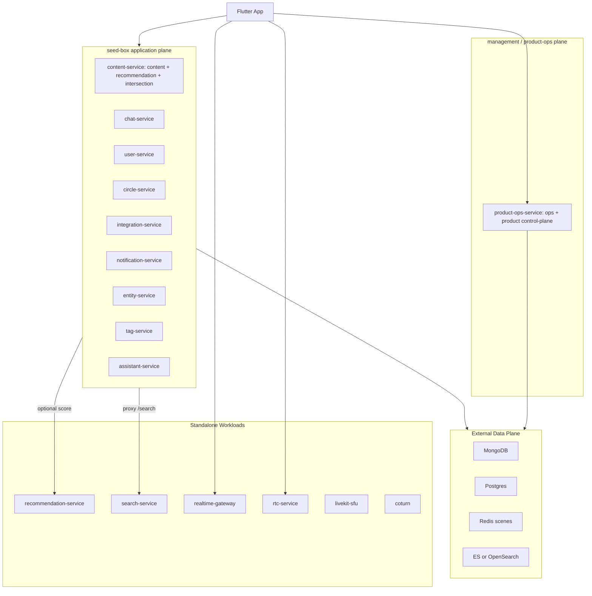

# Design：system-architecture-and-engineering-guide

## 设计原则

1. **导引不是第二真相源**：所有拓扑、路由、module、平面、workload 数据仍由 `quwoquan_ops/environments` 与 `quwoquan_service/contracts/metadata` 文件提供；本节点只给解释、索引与验收规则。
2. **源码服务、部署进程、runtime module 三层分离**：服务目录说明代码在哪里，部署进程说明怎么运行，module mapping 说明包里启动什么能力。
3. **Monolith First，Control Plane Independent**：冷启动使用 `seed-box` 降低业务面部署成本；管理/运营/运维面 `product-ops-service` 独立发布，不作为 seed-box child process。
4. **edge-media 不并盒**：长连接、UDP、SFU、TURN 的容量模型与 application plane 不同，从第一天独立。
5. **推荐双身份显式化**：规则推荐与交集在 `content-service` 进程内；Python `rec-model-service` 以 `recommendation-service` 独立部署，冷启动可关闭。
6. **对象优先，不以存储建模**：command 经过聚合 owner，query 读取 Slice owner；Mongo/PG/Redis/ES/remote 只是 adapter role。
7. **公开 URL 与进程拓扑解耦**：App 只访问 Gateway generated operation，Strangler 切换不改变公共 URL。
8. **零兼容原子切换**：错误接口和旧实现直接替换，同对象不保留双轨。

## D0/F1/G1 设计

### D0 设计冻结

D0 以 [应用根设计](../../design.md) 为全局合同，并要求 metadata 对每个对象声明：

- object kind、owner、aggregate ID/version/invariants。
- member kind、cardinality bound、write owner、typed load profile。
- command/query、Facade facet/method、aggregate owner 或 Slice/Reader。
- authoritative/projection/cache/external/memory store role。
- event ordering/outbox/inbox/checkpoint/DLQ/replay/rebuild。
- RuntimeFailure/RecoveryPolicy、authz、privacy、SLO 与三层测试期望。
- query 只暴露业务目的明确的 named Reader，不生成 GenericSliceReader。
- authoritative adapter 必须在单事务内提交 aggregate change 与同库 outbox。

任何未决边界必须先形成 decision id；generator 和业务代码不得自行裁决。

#### DDD/CQRS 批量迁移前决策

- `DDD-OBJ-001`：ContractGraph 对象分类只保留
  `aggregate_root / owned_entity / value_object / append_only_fact / projection /
  external_reference / runtime_session`。metadata、loader、Graph、codegen 和业务代码均不得
  接受或观察 `separate_aggregate` 等等价别名，错误对象类型直接阻断编译。
- `DDD-BEHAVIOR-002`：aggregate 是手写行为模型，私有状态只能经命名工厂和业务方法
  迁移。domain 禁止 JSON/BSON/DB tag、动态 Map、HTTP/UI 字段；application 禁止直接
  修改 aggregate 状态。wire DTO、projection Slice 与 persistence record 分离生成或映射。
- `CQRS-COMMAND-003`：每个 command 只绑定一个 canonical aggregate owner。Command
  Facet 接收 typed command 与可信 invocation context，调用 aggregate 行为后只执行一次
  对象专属 `Commit(internalExpectedVersion, receipt, events)`；`internalExpectedVersion`
  来自服务端本次 Load，仅用于 Store CAS，不等于公开 API 必须接收 `expectedVersion`。
  成功结果只返回 ID、committed version、status 或必要 ack。
- `CQRS-QUERY-004`：每个 query 只绑定一个按用例命名的 Reader 与 typed Slice，不加载
  aggregate、不调用 command service。只有授权、跨 Reader 组合或业务策略存在时才增加
  query coordinator；简单查询允许 Reader adapter 直接实现 Query Facet。
- `PORT-STORE-005`：每个 aggregate 只有一个对象专属 AggregateStore，最小能力为
  `Load` 与 `Commit`。Commit 在同一权威存储事务中提交 state/version、幂等 receipt 与
  同库 outbox。owned entity 无独立 Store；fact 只有 typed append/dedupe；projection 只有
  writer/checkpoint/rebuild；cache 仅装饰 Reader。
- `CONSISTENCY-006`：单 aggregate 内强一致；跨 aggregate/domain 默认使用
  outbox/inbox 与幂等 consumer 最终一致。只有出现已验证的补偿流程时才允许专用 process
  manager，不建设通用 Saga、事件溯源框架、分布式事务或独立读库。
- `CTX-OWNERSHIP-007`：actor、surface、route、referral、deadline、trace 和 idempotency
  属于 `OperationInvocationContext`，由 auth/application/DI 注入；业务 Facet 参数只包含
  业务数据，UI 不传 actor 或 metadata 标识。
- `SLICE-OWNER-008`：需要跨页面复用、统一排序/权限/分页或独立 SLO 的跨域视图归服务端
  projection owner；单页面对少量独立 capability 的非原子并发组合归 App application
  coordinator。Repository 之间不得互调，页面不得 N+1 或自行拼业务 Bundle。
- `LEASE-009`：业务对象会话写 metadata/domain/application，App Cloud 会话只消费已签收
  Graph bundle，环境会话写 topology。未含 source/compiler/output digest、breaking
  report 与 commercial profile 结果的 object packet 不得进入客户端迁移。

### 按真实写入场景裁剪并发与幂等

- 默认不向调用方暴露 `expectedVersion`。服务端 aggregate command 使用内部 CAS，并在
  纯技术冲突时重载最新 aggregate、重放同一领域意图；最终返回业务结果，不把版本冲突当
  作用户失败。
- 只有“多写者对同一快照做覆盖式编辑，且无法以命名行为、set/append、唯一约束、状态机
  或服务端自动合并安全解决”时，operation 才显式声明
  `concurrency.version_precondition: if_match` 并要求 `If-Match`。该条件不得用于一次创建、
  一次发布、关系 set/unset、追加事实、投影、外部查询或 runtime session。
- 单次提交（如 Post 发布）使用稳定 intent + 永久 receipt + aggregate/receipt/outbox
  原子事务。相同 intent 重放返回首个结果；用户不会因超时再次创建业务对象。
- owned entity 继承 root 的内部 CAS；value object 无版本；append-only fact 使用唯一
  dedupe key；projection 使用每个 source 的单调 version/sequence；external reference
  query 不持有并发状态；runtime session 使用逐连接 lease + fencing token。
- aggregate root 的公开写入再按意图分三类：一次创建/发布使用稳定 intent、唯一约束和
  receipt；审批、离开、删除、归档、角色设定等命名状态迁移/set 操作由服务端加载当前
  version 并对纯 CAS 竞态做有限重放；只有多人基于旧快照覆盖多个可编辑字段时才使用
  `If-Match`。当前全仓校准后仅 `UpdateCircleGroup`、`UpdateCircleFile`、
  `UpdateExperimentRollout` 与 `UpdateServiceConfig` 属于第三类，
  `operation_concurrency_calibration__contract__local_contract_test.go` 固定该显式清单。
- 命名状态迁移/set 的目标状态若已满足，首次到达的 `Idempotency-Key` 仍须持久化 no-op
  receipt，但不得递增 aggregate version 或产生“状态已变更”的伪 outbox 事件；后续状态
  即使继续演进，相同 key 也只重放该次 no-op 的原始结果。
- 跨 aggregate 工作流不得用“先写 A、再写 B”伪装原子提交。只有确有跨 aggregate
  写入时才增加对象专属的最小持久化阶段，不引入通用 Saga 框架。例如
  `ProfileUpdateProposal.Apply` 先以内部 CAS 从 `confirmed` 进入 `applying`，阻断并发
  `Reject`，再按 `proposalId` 幂等写 Persona，最后进入 `applied`；崩溃可从
  `applying` 续作，目标 Persona 快照已失效则进入 `expired`。
- `Idempotency-Key` 是业务重放身份，`X-Request-Id` 只用于观测关联，二者不得互相回退。
  unsafe method 只有声明 `idempotency: required|optional` 且实际携带稳定 key 时才可自动
  重试。
- `RUNTIME-SESSION-010`：建立或推进短生命周期连接的操作使用
  `application.kind=session`，只绑定同 packet 的 `runtime_session` owner，不伪装为
  aggregate command，也不声明 AggregateStore/outbox 或 query Reader/Slice。外部 ingress
  必须先归一化为对象专属 append-only receipt/fact，再由事件投递到 session；禁止把
  Webhook 直接声明成 Connection command。协议升级须在 OpenAPI 明确返回 101。
- `OBJECT-REGISTRY-011`：每个 ContractGraph domain 必须有且只有一个
  `business_object_map.yaml`，登记 bounded context、object kind、aggregate owner、
  access policy、typed relationship 与字段角色；domain/object/relationship target 未登记均失败。
  context policy 固定为 command 经 aggregate facade、query 经 named Reader/Slice、child
  经 aggregate root、cross-context 经 public contract。
- `CHILD-ACCESS-012`：aggregate `members` 只允许 `owned_entity/value_object`；owned
  entity 不得有 Store、Repository、公开 Facade 或跨上下文关系。跨上下文写入只调用目标
  Command Facade，读取只调用 named Reader，事实只经 append sink，投影只经 Reader，
  external reference 只经 external port，runtime session 只经 session facade。
- `READINESS-013`：对象目录可声明 `readiness.yaml` 的 exact-path 实现、三层测试与环境
  evidence，但禁止声明阶段或 `implemented/ready`。compiler 对每个 evidence 文件派生
  SHA256，并按 canonical operation contract 单调计算 `modeled → contract-ready →
  implemented → commercial-ready`；缺 user_acceptance 或 alpha/beta/gamma/prod 任一环境
  artifact 时只能停在 implemented。现有 `commercial.status` 在完成迁移前仍是运行时
  fail-closed assertion，不能替代派生 readiness，最终必须由派生结果生成。

#### Content Post + Report object map

下列裁决是样板开发的边界输入，不把多个对象重新装进 `Post`：

- `Post`（aggregate root，Mongo）：只拥有内容正文、内容类型、作者快照、可见性、发布/
  删除状态、内容摘要与有界排版值。`mediaAssetIds`、homepage/circle/group/source 等只保存
  ID 引用；互动计数、viewer capability、Feed/Search/Footprint/Intersection/Impact、
  moderation state、embedding 与 URL 衍生字段均为 projection。
- `Comment`（aggregate root，Mongo）：拥有单条评论正文、作者快照、回复引用、附件 ID、
  状态与版本。回复列表、计数、预览、viewer reaction、`canDelete/canReply/canReport/
  canPin` 与 post summary 是 query projection。
- `ContentReaction`（aggregate root，Mongo）：由 target + actor dimension + reaction type
  唯一确定，拥有幂等 active/removed 状态；Post/Comment 只消费投影计数。
- `OutboundShareFact`（append-only fact，Mongo）：只记录一次真实站外分享结果；已发生的
  外部分享不可伪造 revoked 生命周期。引用发布创建新 Post，圈内转发创建 Circle 所有的
  `CirclePostPlacement`。
- `MediaUploadSession`（aggregate root，Mongo）：拥有 owner、TTL、object key/digest、
  pending/completed/aborted 与版本；完成后以事件/引用产生 `MediaAsset`，不得与 Post 同事务。
- `MediaAsset`（aggregate root，Mongo）：拥有 owner、CAS digest、媒体元数据、处理/审核/
  访问/封面策略和有界 derivative manifest；Post/Comment 只保存有序 asset ID。
- `CirclePostPlacement`（Circle aggregate root，Mongo）：拥有 Post 到 Circle/Group 的放置、
  置顶、精选与移除生命周期。Content Post 只保存自身状态，不保存 circle/group/node ID；
  Feed/Search 等消费其公开事件投影。
- `PostModerationCase`（aggregate root，Mongo）：由 postId + postVersion + contentDigest
  标识审核生命周期；审批只对绑定版本有效，Post 只消费当前 Case 的授权结果。
- `DeletedPostTombstone`（append-only fact，Mongo TTL）：只允许 append/dedupe，供删除传播
  与重建使用，不提供 update/delete 或 aggregate load。
- `ProfileInteractionActivityView`、`PostSearchItemView`、Feed/Detail/Counter/Footprint/
  Intersection/Impact 均为可重建 projection，由 named Reader 返回 typed Slice。
- `Report`（aggregate root，PostgreSQL）：拥有 reporter、target reference、reason、
  description、pending/reviewing/resolved/dismissed 状态、reviewer/resolution、version 与时间。
  `Create/BeginReview/Resolve/Dismiss` 必须调用 Report 行为；`ReportDetail/ReportQueue`
  由 Reader/Slice 返回，禁止把 persistence record 或可变 aggregate 交给 transport。

字段级分类由
各 domain 的 `quwoquan_service/contracts/metadata/**/business_object_map.yaml` 与
`content/{post,report}/fields.yaml` 的 set-equality 门禁共同维护；operation 级 owner 则由
各对象 `service.yaml.application` 唯一声明。未分类字段、command 跨 canonical object、
query 缺 Reader/Slice、projection command、fact update/delete 均为 commercial profile
阻断项。

#### 限界上下文与工程目录归位

逻辑限界上下文不等于部署进程。一个 service 可承载多个上下文，但代码必须先按 context、
再按 aggregate 高内聚，禁止把 model/repository/service 平铺成全域公共层：

```text
contracts/metadata/{deployment-domain}/
  business_object_map.yaml
  {object}/...

services/{service}/internal/
  domain/{bounded-context}/{aggregate}/
    model/                 # root + owned entity/value object；child 不单列端口
    ports/                 # aggregate-specific Store
  application/{bounded-context}/{aggregate}/
    command/               # typed Command Facade
    query/                 # named Reader + typed Slice
  infrastructure/{bounded-context}/{aggregate}/
    persistence|projection|external/
  adapters/http|mq/        # generated descriptor 只转发到公开 Facade

quwoquan_app/
  packages/quwoquan_cloud_contracts/lib/src/{bounded-context}/{object}/
  packages/quwoquan_cloud_mock/lib/{bounded-context}/{object}/
  lib/application/{bounded-context}/{object}/
  lib/cloud/remote/{bounded-context}/{object}/
  lib/infrastructure/local/{bounded-context}/{object}/
  lib/core/di/
```

owned entity/value object 与 root 同目录，不建立独立 repository/store/facade/provider。
跨 context 代码不得 import 对方 `internal/domain` 或 `infrastructure`，不得读取对方
table/collection/cache/index；只能依赖 pure public contract、target Facade、named Reader
或 event。部署合并不授予进程内直调内部对象的权限。

### F1 ContractGraph 与公共底座

唯一 compiler 路径：

```text
contracts/metadata/_schemas
  -> internal/metadata/ast
  -> internal/metadata/load
  -> internal/metadata/validate
  -> internal/metadata/graph
  -> internal/metadata/codegen
  -> tools/qwq_contract
```

`qwq-contract validate/generate/check/coverage` 是唯一命令面；Go、Dart、OpenAPI 和 coverage 都消费同一个 ContractGraph。

Runtime 只保留跨域机制：

- OperationContext、RuntimeFailure/RecoveryPolicy/ErrorResponse。
- typed config、HTTP client/server、observability、messaging、governance、health、clock/id。
- Page、Version、IdempotencyKey 等值类型。

数据库、缓存、对象存储和 MQ 连接底座进入 `quwoquan_service/internal/platform/**`；具体 AggregateStore/Reader 留在服务 infrastructure。Go 统一使用根 `quwoquan_service/go.mod`，独立部署由 build target 和 process mapping 表达。

### App Cloud 合同交接与单写权

业务对象会话唯一写入 metadata、ContractGraph schema/AST、aggregate、Facade、
Reader/Slice、error/actor 和服务端 Data Port。本节点的 App Cloud 实现只消费其不可变
bundle，不从 URL、DTO、HTTP method 或旧 Repository 推断业务边界。

交接 bundle 至少包含：

- canonical graph JSON、graph SHA256、全部 source digest 与 compiler hash；禁止版本信封。
- App-exposed operation 集、breaking change report 与 commercial profile 结果。
- 每个 operation 的 canonical ID、wire local ID、command/query、Facade binding、
  aggregate owner 或 Reader/Slice、actor/auth、request/response/error、idempotency、
  retry/deadline/pagination、surface attribution。
- 每个对象的 typed readiness evidence、compiler-derived artifact SHA256、派生阶段与
  missing evidence 集；不得由 App handoff 或人工文档重新解释阶段。

App-only emitter 为自身输出生成 manifest，逐文件记录 graph hash、唯一 generator、
owner、path 与 SHA256；清理只能删除该 manifest 拥有的产物。Graph hash 未固定或 binding
缺失时返回上游缺口，不生成猜测合同。

共享路径执行单写租约：业务 metadata/Graph 归对象会话，App emitter/runtime/adapter
归客户端接入会话，Ops topology YAML 归环境治理；禁止多会话并发覆盖。

### App Cloud 目标分层

```text
packages/quwoquan_cloud_contracts/   pure Dart contract/descriptor/value
packages/quwoquan_cloud_mock/        alpha/test fixture + mock adapter
runners/alpha/                       唯一可依赖 mock package 的设备 runner
lib/cloud/runtime/                   executor/context/transport/error/config/observability
lib/cloud/remote/                    generated client + domain adapter/mapper
lib/application/                     跨 capability coordinator 与 application port
lib/infrastructure/local/            cache/store/outbox
lib/core/platform/                   原生 SDK 与平台防腐
lib/core/di/                         production/domain composition root
lib/ui/                              typed state/presentation
```

- contracts 包零 Flutter/App/HTTP/platform/fixture 依赖；App 允许依赖 contracts，反向依赖禁止。
- production composition 只引用 Remote；Mock/fixture/Noop 不得进入 prod
  dependency graph、kernel/AOT 可达图或 SBOM。
- Cloud Runtime 不依赖 UI、Router、Provider、Hive、SharedPreferences、LiveKit、CallKit
  或 `dart:io`；本地状态和平台能力分别下沉到 local/platform。
- Remote adapter 只做 generated client 到 Facet 的薄映射；跨域编排进入 application。
- 同一对象迁移时新旧 Repository/DTO/decoder/alias/测试同批替换，禁止 dual-read、
  dual-write、shim 和运行时 fallback。

### G1 硬门禁

- metadata 未知/旧字段、重复 ID、缺 owner/slice/auth/error/event/store contract 直接 FAIL。
- domain/application 越层、runtime driver、动态业务 Map/Filter、同对象多 Repository/Facade 直接 FAIL。
- route/surface/page 不闭合、页面不可达、UI 多 presentation model、平台分支越层直接 FAIL。
- 路径型 UAT、Mock Journey、Memory 假集成、动态 skip、`os.Exit(0)`、WARN/`|| true` 直接 FAIL。
- beta/gamma/prod 装配 Memory/Noop/Mock/seed/default secret 或缺依赖不 fail-fast 直接 FAIL。
- coverage 正向链或反向孤儿扫描有悬空节点直接 FAIL。
- contracts 包循环、手写/孤儿 generated、Cloud→UI/platform/local-store 反向依赖、
  prod Mock/fixture 可达、Remote 空实现或 Mock fallback 直接 FAIL。
- App `api_integration` 必须构造 generated client/Remote adapter 连接已预制环境；
  裸 HTTP、测试内自 seed 和仅检查证据文件存在不能替代三层证据。

### 服务目录资产 profile

`services/**` 的目录 gate 必须按 profile 校验，而不是把所有目录当作 DDD 领域服务：

- `go-domain-source`、`go-control-plane-source`、`python-domain-source`
- `deployment-package`、`external-workload`、`static-artifact`

第一方 Go source 使用 `cmd / internal/{domain,application,adapters,infrastructure} /
tests / configs / deploy` canonical tree。单一根 Go module；服务根 binary/build output、
retired `configs/config.yaml`、未知 `internal/*` 第五层、跨服务 internal import、
cmd 内业务实现与 production Memory/Mock/Noop 全部阻断。

process、module、plane、workload、source/build 必须双向闭包；`seed-box` 的 domains、
modules、Docker build 与 supervisor spec 四向相等。外部 workload 固定 image digest、
SBOM/provenance；static artifact 不执行 DDD source gate。

### 首个样板

样板固定为 `content-service`：

- Post、PostModerationCase、MediaUploadSession、MediaAsset、Comment、ContentReaction 使用 Mongo authoritative store；站外分享使用 Mongo `OutboundShareFact` append sink，圈内放置只由 Circle 的 `CirclePostPlacement` 聚合持久化。
- Report 使用 PostgreSQL authoritative store，作为第二存储语义反证。
- 两类 store 都必须实现 version/idempotency/aggregate+outbox transaction。
- UGC 与签名 Data/PGC BulkImportFacade 汇入同一发布事件，驱动 Feed/Search/Recommendation/Homepage/Circle。
- App 使用 canonical Post slices 和 generated client，覆盖全部消费/创作页面。
- gamma 真实发布与设备 UAT、prod 实时 SLO gray/rollback 完成后，才允许提炼 scaffold。

## 目标运行拓扑



## seed-box 子进程契约

`quwoquan_service/services/seed-box/deploy/seed_box_entrypoint.py` 必须显式声明每个子进程：

- `ServiceSpec.name` 与实际二进制名称一一对应。
- `service_for_path()` 必须覆盖该 domain 的 metadata 路由前缀。
- 子进程 env 只能注入该服务自身配置、端口和数据面连接，不能把多个 domain 合并成一个进程内分支。

新增/移除 seed-box domain 时，必须同批更新：

- `process_domain_mapping.yaml`
- `process_domain_plane_mapping.yaml`
- `workload_topology_inventory.yaml`
- `module_package_mapping.yaml`
- `reliable_task_module_catalog.yaml`
- `seed_box_entrypoint.py`
- `quwoquan_service/services/seed-box/deploy/Dockerfile`
- 控制面 `_control_plane/domains/*.yaml`

`product-ops-service` 是管理/运营/运维面独立 workload；`seed_box_entrypoint.py` 与 `seed-box` 镜像不得再包含 `product-ops-service` 子进程或 `/ops` 分发。`/ops*` 与 `/control-plane/product*` 由 product-ops 独立 Service、prod-hosted Caddy/网关和 stackctl package 承载。

## 路由不变量

Strangler 拆分不再假设 `route_prefix == /<domain>/`。真实路由前缀来自 `quwoquan_service/contracts/metadata/**/service.yaml`：

- `entity` 的对外前缀是 `/homepages/`。
- `circle` 的主要前缀是 `/circles/`。
- `notification` 的前缀包含 `/notifications/` 与 `/app-messages/`，split candidate 采用主通知前缀 `/notifications/`，entrypoint 必须同时代理两组路径。
- `ops` 已从 split candidate 提升为 `product-ops-service` 独立 workload；对外 `/ops/` 与 product control-plane 路径保持不变。

## 拆分路径

某域达到独立扩缩容、独立发布或故障隔离阈值时：

1. 保留 metadata API path、端侧 runtime 注入、数据面变量名。
2. 将该域从 `seed-box.domains` 移到独立 `*-service` workload。
3. 将 `module_package_mapping` 中的 `<domain>.*` module 迁到独立包。
4. 将 `workload_topology_inventory` 的 split candidate 升级为 wired standalone workload。
5. 新增/恢复独立 K8s overlay 并接入 prod root。
6. 跑 `verify_strangler_contract_invariants.py`、`verify_workload_topology_inventory.py` 与 `make gate`。

回滚时按反向步骤把 domain 退回 `seed-box`，对外路由保持不变。

## 文档收编

服务层旧文档保留历史价值，但不再作为架构真相源：

- `quwoquan_service/AGENTS.md`：保留为局部执行入口。
- `quwoquan_service/README.md`：改为服务层历史目录说明，并链接本节点。
- `quwoquan_service/design.md`、`architecture_review.md`、`端云协同落地方案.md`：标记为历史参考，权威口径回到本节点与 `quwoquan_ops/environments`/`quwoquan_service/contracts/metadata`。

## 风险控制

- 新增门禁必须检查 `seed-box.domains` 中每个 domain 都被 entrypoint 真实承载，避免 `gateway/orchestrator` 类幽灵域回归。
- `recommendation` 与 `ops` 必须继续独立，不能被误并入 `seed-box`。
- alpha 继续保持 split-topology，满足 `verify_topology_contract_regression.sh`；one-box 最大化主要落在 beta/gamma/prod/prod-hosted。
