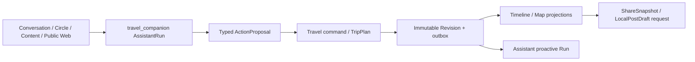

# L1 Design：共同旅行旅程 (`travel-journey`)

> 对应规格：[L1 spec](./spec.md)

## 1. 背景与设计目标

- 当前上下文：聊天文本、Gathering 与内容可以表达局部协作，但没有可修订、可投影、可分享的共同旅行真相源。
- 设计要解决的问题：以 Travel 聚合承接计划、变化、Moment、放置和分享，让 Assistant、Chat、Circle、Content 与地图只消费公开事实。
- 非设计目标：预订支付、导游交易、连续位置跟踪、复制内容或构建第二套地点知识库。

## 2. 领域模型与所有权

- 聚合根：`TripPlan`、`TripPlanTemplate`。
- 独立生命周期对象：`TripPlanRevision`、`TripMoment`、`TripShareSnapshot`、`TripGuideAssignment`。
- 独立并发聚合：`TripMembership`、`TripPlanPlacement`；两者以自身 CAS、幂等回执和 outbox 管理高频协作，不进入 `TripPlan` 大文档。
- owned entity / value object：`TripPlanItem`、Trip/Object link、Revision diff。
- projection：`TripTimelineView`、`TripMapView`。
- authoritative write owner：travel-service 对上述事实的对象 Facade。
- 不属于本领域的对象：Conversation/Circle/Gathering、Post/MediaAsset/LocalPostDraft、Persona/Follow、Skill/Run/Connector。

## 3. 上下文边界与协作

- 同步边界：读取公开领域 Reader；写入只由 Travel command 或目标领域 command 完成。
- 异步边界：Revision、Moment、Placement 与 lifecycle event 进入 durable outbox，由 Assistant trigger、Chat/Circle card、Content draft 和观测消费者幂等处理。
- 一致性边界：Trip 当前 Revision、Item、成员角色与 outbox 原子提交；跨域投影最终一致并携带 source version。
- 权限边界：组织者/管理员可确认结构变化，成员可按策略提议或追加 Moment；导游任务与资质声明分离，公开分享先做服务端隐私裁剪。

## 4. 架构与数据流

Assistant 只能形成提案、解释与 Presentation；Travel 聚合决定计划事实。Timeline/Map 只投影 canonical reference，媒体、内容和地点详情按需从 owner Reader 读取。

## 5. 关键决策

### DEC-001 TripPlan 以不可变 Revision 和 typed link 表达共同经历
- 决策：当前计划由 `TripPlan.currentRevisionRef` 指向不可变 Revision；Moment、Post、Place、Gathering、Conversation 与 Circle 只通过 typed link/placement 关联。
- 理由：多人并发、主动提醒、回看、分享和游记需要稳定的变更边界与来源血缘，复制正文或覆盖式 JSON 无法诚实恢复。
- 被否决方案：单份可变行程 JSON、Chat Message 作为当前计划、Assistant 保存 Trip 副本、跨域数据库 join/直写。
- 约束与影响：所有更新要求 expected revision 和幂等键，事件包含 source revision 且不包含隐私正文，投影可重建。
- 关联要求：`REQ-001`、`REQ-002`
- 关联能力：[`collaborative-trip-lifecycle`](./collaborative-trip-lifecycle/spec.md)

## 6. 质量与运行约束

- 指标至少覆盖 Trip 创建完成时间、revision 冲突/采纳、提醒去重、Moment 归档、投影延迟、分享隐私拒绝、游记生成/发布和旅行后关系延续。
- Trip/Member/Place 等 ID 只作为 metric 受控属性或 trace link，不进入高基数 label；公开快照与日志不得含敏感住宿或精确实时位置。
- 变更事件、投影和跨域 command 采用 outbox/inbox、source version、幂等键和可重放 receipt。

## 7. 失败与恢复

- 失败类型：revision 冲突、权限拒绝、引用失效、跨域依赖超时、隐私裁剪失败或投影延迟。
- 用户或调用方可见结果：当前 Revision 保持不变，并返回冲突 diff、刷新、重新确认或稍后重试动作。
- 恢复动作：从 canonical Trip/Revision/event 重放投影或续接 AssistantRun，不从 App cache/聊天摘要回写。
- 不允许的 fallback：覆盖 current Revision、复制 Post/Media、手工 seed 投影、把未执行提案标为已完成。
